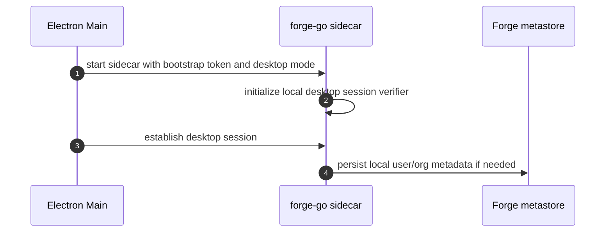
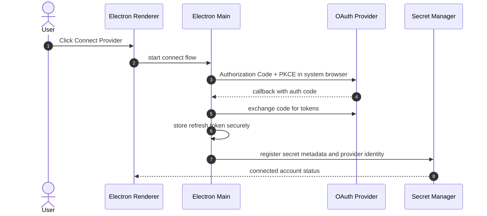
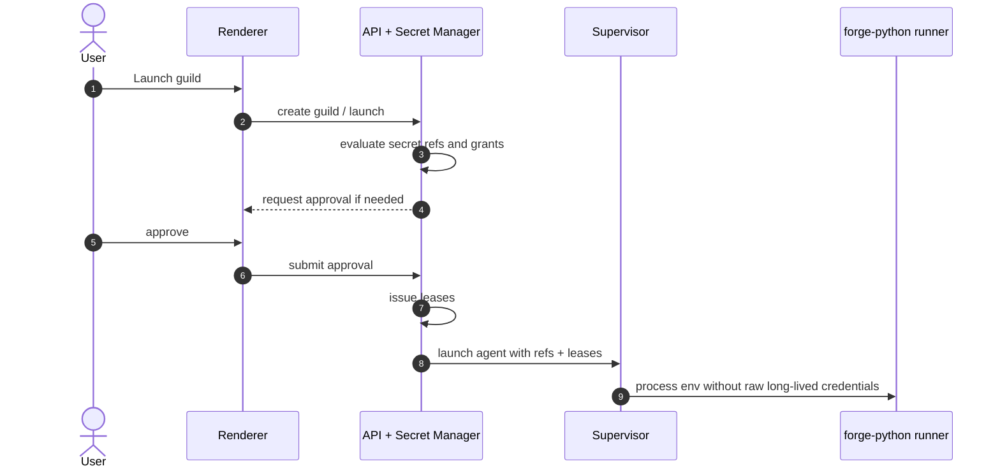
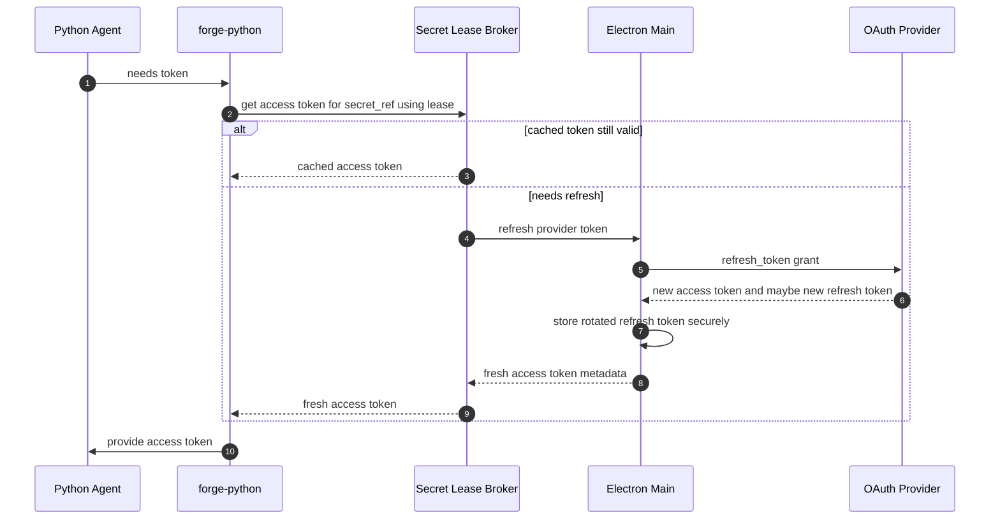

# Desktop Secrets and OAuth Design

Status: Proposed  
Audience: Forge, Rustic UI, and platform reviewers  
Last updated: 2026-03-20  
Primary scope: `rustic-go` implementation, with read-only touchpoints in `rustic-ui` and canonical behavior references in `rustic-ai`

## 1. Executive Summary

This document proposes a complete desktop-first design for:

- secrets management for agents
- OAuth account connection and delegated access while running as a desktop app
- short-lived access token refresh without exposing refresh tokens to agents
- clear user workflows for connecting, approving, revoking, and troubleshooting credentials

The core recommendation is:

- treat the Electron renderer as an untrusted UI surface
- treat the Electron main process as the desktop trust anchor for OAuth and OS-keystore integration
- treat Forge as the runtime policy and lease issuer
- treat Python agents as semi-trusted workloads that should receive least-privilege, short-lived credentials only

This design avoids the two failure modes that the current stack would create if extended naively:

- storing raw secrets or refresh tokens in guild specs, SQLite, or the renderer
- injecting long-lived credentials directly into child process environment variables

## 2. Goals

- Support static secrets such as API keys on desktop.
- Support OAuth-based delegated access such as Google Drive, GitHub, Slack, Notion, or similar providers.
- Allow agents to obtain valid access tokens when needed without holding refresh tokens.
- Support token refresh during long-running agent processes.
- Provide a desktop UX that is understandable to non-developers.
- Preserve Forge as the runtime control plane and keep agent orchestration in Python.
- Keep the implementation compatible with the existing Forge launch and supervisor flows.
- Keep canonical guild and agent behavior aligned with `rustic-ai`.

## 3. Non-Goals

- This document does not define a cloud-hosted team secret vault.
- This document does not replace all current public API auth semantics.
- This document does not attempt to make arbitrary third-party agent code fully trusted.
- This document does not redesign Rustic marketplace/catalog authorization in full.
- This document does not define every provider-specific OAuth adapter in detail.

## 4. Current State

### 4.1 What Forge does today

Forge currently has a simple secret resolution chain:

- env vars
- `.env`
- file-based secret directory

Relevant code:

- `forge-go/secrets/provider.go`
- `forge-go/secrets/chain.go`
- `forge-go/secrets/env.go`
- `forge-go/secrets/file.go`

At launch, Forge gathers required secret names from:

- `agentSpec.Resources.Secrets`
- `registry.AgentRegistryEntry.Secrets`

and resolves them in:

- `forge-go/helper/envvars/envvars.go`

Today the resolved values are injected into the child process environment using the secret key names directly.

### 4.2 What desktop auth does today

The current desktop app shape is:

- Electron main starts a bundled Forge sidecar
- preload exposes runtime config pointing the renderer to local Forge endpoints
- the renderer may run with local dummy identity or with Logto/OIDC in-browser behavior

Relevant code:

- `../rustic-ui/src/electron-main.ts`
- `../rustic-ui/src/preload.ts`
- `../rustic-ui/src/sessionContext.tsx`
- `../rustic-ui/src/utils/functions.ts`
- `../rustic-ui/src/utils/constants.ts`

### 4.3 What internal manager auth does today

Forge manager API auth is currently a single shared token:

- `FORGE_MANAGER_API_TOKEN`
- accepted as `X-Forge-Manager-Token`
- or accepted as `Authorization: Bearer ...`

Relevant code:

- `forge-go/api/manager.go`
- `forge-python/src/rustic_ai/forge/metastore/manager_client.py`

### 4.4 Why current behavior is insufficient

The current secret model works for static local development, but is not sufficient for production-grade desktop OAuth because:

- raw env injection leaks secrets into process trees, crash dumps, and inherited children
- secret names are not scoped to user, org, or guild ownership
- there is no credential versioning or revocation model
- there is no distinction between access tokens and refresh tokens
- the renderer currently owns browser-side login tokens in a way that is too permissive for a packaged desktop trust model

## 5. Design Principles

- Never store raw refresh tokens in the renderer.
- Never persist raw secrets inside guild specs, registry YAML, or metastore rows.
- Prefer secret references and leases over raw secret values.
- Keep refresh tokens inside OS-backed secure storage.
- Give agents access tokens only, not refresh tokens.
- Make every credential use attributable to a user, org, guild, agent, and provider scope set.
- Require explicit user consent for delegated account use.
- Separate control-plane login from external provider delegation.
- Fail closed when trust cannot be established.

## 6. Trust Boundaries

The proposed trust model is:

| Component | Trust Level | Responsibilities |
| --- | --- | --- |
| Electron renderer | Untrusted UI surface | Presents screens, collects user intent, never stores refresh tokens |
| Electron preload | Narrow bridge | Exposes safe runtime APIs only |
| Electron main | Trusted desktop broker | Runs OAuth, talks to OS keychain, issues local desktop sessions |
| Forge sidecar | Trusted runtime policy engine | Grants leases, launches agents, enforces scope and ownership |
| Python agents | Semi-trusted workloads | Consume access tokens, never hold refresh tokens |
| OS keychain / DPAPI / libsecret | Root of desktop secret protection | Wraps or stores long-lived credentials |
| Third-party IdP / OAuth provider | External trust boundary | Issues tokens and provider identity |

## 7. User Personas

### 7.1 Local desktop user

- launches Rustic Studio on a laptop
- connects personal accounts such as GitHub or Google Drive
- runs guilds and approves agent access

### 7.2 Organization desktop user

- logs into Rustic Studio under an org
- may use org-shared credentials
- may need role-based restrictions for secret sharing

### 7.3 Agent developer

- declares required secret references for an agent
- expects a stable runtime contract in Forge and `forge-python`

### 7.4 Platform reviewer

- needs auditable flows
- needs least-privilege guarantees
- needs understandable failure and revocation handling

## 8. User Workflow

### 8.1 First run

1. User opens Rustic Studio.
2. App starts Forge sidecar as it does today.
3. App establishes a desktop session between Electron main and Forge.
4. User is either:
   - signed into the app identity provider
   - or placed in local single-user mode
5. Settings shows `Connected Accounts` and `Secrets`.

### 8.2 Add a static secret

1. User opens `Settings > Secrets`.
2. User clicks `Add Secret`.
3. User selects type such as:
   - OpenAI API key
   - Anthropic API key
   - Generic bearer token
4. User enters the value once.
5. User chooses ownership scope:
   - only me
   - my organization
6. App stores the secret in OS-backed secure storage.
7. Forge stores metadata only.
8. UI shows status `Ready`.

### 8.3 Connect an OAuth account

1. User opens `Settings > Connected Accounts`.
2. User clicks `Connect GitHub`, `Connect Google Drive`, or another provider.
3. Electron main starts an Authorization Code + PKCE flow using the system browser.
4. User consents in the browser.
5. Electron main receives the loopback callback.
6. Main stores refresh token and provider identity securely.
7. Forge stores account metadata and grants no agent access yet by default.
8. UI shows:
   - provider account identity
   - granted scopes
   - ownership
   - last refreshed
   - current status

### 8.4 Launch a guild that needs credentials

1. User clicks `Launch`.
2. Forge evaluates required secret refs for the guild and participating agents.
3. Launch dialog shows:
   - credentials already available
   - missing credentials
   - agents that will use each credential
4. If approval is required, user chooses:
   - allow once
   - always allow for this guild
   - always allow for this agent type
   - deny
5. If all requirements are met, launch proceeds.

### 8.5 Runtime credential use

1. Agent starts with secret refs and a lease token, not raw long-lived credentials.
2. Agent requests an access token via Forge local broker.
3. Forge validates policy and either:
   - returns a cached valid token
   - or asks Electron main to refresh the provider token
4. Agent uses the access token.

### 8.6 Expired or revoked credentials

1. Agent sees a local token nearing expiry or receives provider `401`.
2. Agent asks Forge broker for a fresh access token.
3. If refresh succeeds, work continues without user interruption.
4. If refresh fails because the account is disconnected or consent was revoked:
   - broker marks the credential `reauth_required`
   - affected agent reports a typed runtime error
   - UI shows `Reconnect`

### 8.7 Revoke access

1. User opens `Connected Accounts` or `Secrets`.
2. User chooses `Disconnect` or `Revoke access`.
3. Main deletes the stored credential material.
4. Forge revokes outstanding leases.
5. Existing running agents lose access on next fetch or refresh attempt.

## 9. Proposed High-Level Architecture

### 9.1 Components

The proposal introduces the following major components:

- `Desktop Session Broker` in Electron main
- `Secret Manager` in Forge Go
- `OAuth Provider Adapters` in Electron main and Forge metadata
- `Secret Lease Broker` in Forge Go
- `Agent Credential Client` in `forge-python`

### 9.2 Storage split

| Data | Stored In |
| --- | --- |
| Secret metadata | Forge metastore |
| Provider account metadata | Forge metastore |
| Access token cache | Forge memory cache, optionally encrypted disk cache |
| Refresh tokens | OS keychain or encrypted local store wrapped by OS keychain |
| Static secret raw values | OS keychain or encrypted local store wrapped by OS keychain |
| Guild references to credentials | Guild spec or policy metadata as references only |

### 9.3 Desktop-local IPC

Forge and Electron main need a private local channel.

Recommended transport:

- Unix domain socket on macOS/Linux
- named pipe on Windows

Authentication:

- startup-generated bootstrap token
- not exposed to renderer
- rotated on app start

Rationale:

- avoids open localhost management ports for highly sensitive operations
- keeps refresh-token operations outside the renderer
- narrows secret attack surface

## 10. Domain Model

### 10.1 Secret reference

Secret references replace plain env-var names as the durable model.

Examples:

- `secret://user/<user_id>/openai/default`
- `secret://org/<org_id>/anthropic/default`
- `oauth://user/<user_id>/github/default`
- `oauth://user/<user_id>/google-drive/default`

### 10.2 Secret metadata

Proposed metadata fields:

- `secret_ref`
- `kind`: `static` or `oauth`
- `provider`
- `owner_type`: `user` or `org`
- `owner_id`
- `display_name`
- `scopes`
- `version`
- `status`
- `created_at`
- `updated_at`
- `last_used_at`
- `expires_at`
- `revoked_at`

### 10.3 Secret grants

Grants represent user intent and policy.

Fields:

- `grant_id`
- `secret_ref`
- `subject_type`: guild, agent-type, or agent
- `subject_id`
- `mode`: once, guild, or agent-type
- `granted_by`
- `granted_at`
- `expires_at`

### 10.4 Secret lease

Leases are short-lived runtime capabilities issued to an agent.

Fields:

- `lease_id`
- `secret_ref`
- `guild_id`
- `agent_id`
- `issued_at`
- `expires_at`
- `allowed_operations`
- `allowed_env_bindings`

## 11. Runtime Secret Delivery Model

### 11.1 Recommendation

The runtime contract should move from:

- raw secret resolution at launch time
- raw env var injection into child process

to:

- launch with secret refs and short-lived leases
- agent fetches access credentials from a local broker
- optional in-process env mapping only for legacy libraries

### 11.2 Compatibility strategy

We should not break agents that currently expect:

- `OPENAI_API_KEY`
- `GITHUB_TOKEN`
- similar env vars

Recommended compatibility path:

1. agent process starts with lease and broker endpoint
2. Python runner fetches the access credential before importing or initializing the agent
3. if the agent requires env vars, Python runner sets them inside the agent process only
4. parent supervisor does not inject raw credential values into the launch env by default

## 12. Token Refresh Model

### 12.1 Core rule

Agents never receive refresh tokens.

### 12.2 Refresh flow

1. Agent has `access_token` and `expires_at`.
2. Agent refreshes proactively before expiry or reactively after `401`.
3. Agent calls Forge broker with its lease.
4. Forge validates:
   - lease not expired
   - secret ref allowed for this agent
   - grant still valid
5. Forge either returns cached token or requests refresh from Electron main.
6. Electron main uses securely stored refresh token to obtain a new access token.
7. Forge returns the new access token and expiry to the agent.

### 12.3 Concurrency rules

For each `secret_ref`:

- only one refresh should run at a time
- concurrent requests should wait for the same refresh result
- refresh should occur with expiry skew
- updated access token and refresh token rotation must be stored atomically

### 12.4 Failure handling

On refresh failure:

- network/transient errors return retryable failures
- revoked/invalid refresh token returns `reauth_required`
- broker updates metadata state accordingly
- UI surfaces reconnect action

## 13. Identity Model

### 13.1 Separate identities

The system must keep these identities separate:

- desktop app identity
- provider account identity
- guild or organization ownership
- running agent identity

### 13.2 Desktop session

Forge should introduce a dedicated desktop identity mode:

- `FORGE_IDENTITY_MODE=desktop`

This mode represents a locally trusted desktop session between Electron main and Forge.

It should not be implemented as renderer-held admin tokens.

### 13.3 Internal manager auth

The current manager token model remains useful for Python-to-Forge manager calls, but should be tightened for desktop:

- generate a per-start local manager token
- scope it to local sidecar use
- do not rely on long-lived static shared secrets for packaged desktop mode

## 14. Detailed Control Flows

### 14.1 Desktop bootstrap



### 14.2 Connect OAuth account



### 14.3 Launch guild with required secrets



### 14.4 Agent token fetch and refresh



## 15. Code Touchpoints

This section identifies the expected implementation touchpoints. Files outside `rustic-go` are read-only references for parity and coordination.

### 15.1 Forge Go touchpoints

Existing files that will likely change:

- `forge-go/secrets/provider.go`
- `forge-go/secrets/chain.go`
- `forge-go/secrets/env.go`
- `forge-go/secrets/file.go`
- `forge-go/helper/envvars/envvars.go`
- `forge-go/protocol/spec.go`
- `forge-go/registry/registry.go`
- `forge-go/agent/server.go`
- `forge-go/control/handler.go`
- `forge-go/api/server.go`
- `forge-go/api/manager.go`
- `forge-go/api/local_ui_api.go`

New Go packages likely needed:

- `forge-go/secrets/broker`
- `forge-go/secrets/model`
- `forge-go/secrets/policy`
- `forge-go/secrets/keychain`
- `forge-go/secrets/cache`
- `forge-go/identity/desktop`

### 15.2 Forge Python touchpoints

Existing files that will likely change:

- `forge-python/src/rustic_ai/forge/agent_runner.py`
- `forge-python/src/rustic_ai/forge/agent_wrapper.py`
- `forge-python/src/rustic_ai/forge/execution_engine.py`
- `forge-python/src/rustic_ai/forge/metastore/manager_client.py`

New Python components likely needed:

- local secret broker client
- token-aware agent bootstrap helper
- compatibility shim for env-based libraries

### 15.3 Rustic UI touchpoints

Read-only coordination touchpoints in the current workspace:

- `../rustic-ui/src/electron-main.ts`
- `../rustic-ui/src/preload.ts`
- `../rustic-ui/src/sessionContext.tsx`
- `../rustic-ui/src/utils/functions.ts`
- `../rustic-ui/src/utils/constants.ts`

Likely UI additions:

- Connected Accounts screen
- Secrets screen
- launch-time credential requirements panel
- approval modal for delegated provider use
- reconnect / revoked status banners

### 15.4 Rustic AI touchpoints

Read-only canonical behavior references:

- `../rustic-ai/core/src/rustic_ai/core/guild/execution/execution_engine.py`
- `../rustic-ai/core/src/rustic_ai/core/agents/system/guild_manager_agent.py`
- `../rustic-ai/api/src/rustic_ai/api_server/guilds/router.py`
- `../rustic-ai/api/src/rustic_ai/api_server/guilds/socket.py`

The core parity rule remains:

- Forge replaces infrastructure mechanics
- Python continues to own agent-level orchestration semantics

## 16. API and Contract Changes

### 16.1 Agent spec evolution

Current:

- `resources.secrets` is effectively a list of secret names

Proposed:

- allow secret refs in `resources.secrets`
- add optional metadata for env bindings and provider intent

Example:

```json
{
  "resources": {
    "secrets": [
      "secret://user/u-1/openai/default",
      "oauth://user/u-1/github/default"
    ]
  }
}
```

### 16.2 Desktop-local broker API

Recommended internal operations:

- `CreateDesktopSession`
- `RegisterStaticSecret`
- `ListSecrets`
- `ConnectOAuthProvider`
- `CompleteOAuthProviderCallback`
- `GrantSecretUse`
- `IssueSecretLease`
- `GetAccessCredential`
- `RevokeSecret`
- `DisconnectProviderAccount`

These operations should not be exposed as unauthenticated public HTTP routes.

### 16.3 Manager auth changes

Keep `FORGE_MANAGER_API_TOKEN` support for compatibility, but in desktop mode:

- auto-generate a local manager token at startup
- inject it only into local trusted processes
- rotate on restart

## 17. Security Considerations

### 17.1 Must-have protections

- no refresh tokens in renderer memory
- no secret values in guild specs
- no secret values in metastore rows
- no secret values in logs
- no public localhost admin API for secret material
- no long-lived shared token for privileged local operations

### 17.2 Least privilege

- grant by user or org ownership
- lease by guild and agent
- access token only
- scope-limited provider consent
- deny by default if no grant exists

### 17.3 Process isolation

Even though Forge supervises agents, agents remain semi-trusted. This means:

- raw credentials should not be broad process-level env vars by default
- agents should use in-memory credentials retrieved from broker
- legacy env mapping should happen as narrowly as possible

## 18. Failure Modes and UX

### 18.1 Provider temporarily unavailable

Behavior:

- broker returns retryable error
- agent backs off
- UI may show transient provider warning

### 18.2 Refresh token revoked

Behavior:

- broker marks credential `reauth_required`
- running work that depends on it fails with a typed reason
- UI shows reconnect action

### 18.3 Main process unavailable

Behavior:

- Forge fails secret resolution for new or refreshed OAuth credentials
- cached still-valid access tokens may continue briefly
- UI should report degraded desktop broker state

### 18.4 User revokes org-shared secret

Behavior:

- metadata version increments or secret becomes revoked
- future leases denied
- existing leases invalidated
- running agents receive denial on next broker call

## 19. Rollout Plan

### Phase 1: Static secrets hardening

- add metadata-backed secret refs
- add OS-backed static secret storage
- keep env/file providers for dev fallback
- preserve current `resources.secrets` behavior for compatibility

Exit criteria:

- static API keys stored securely
- agents can consume them through leases

### Phase 2: Desktop OAuth foundation

- add desktop session mode
- add provider connection UI and main-process OAuth flow
- add secure refresh-token storage
- add broker-mediated access token retrieval

Exit criteria:

- user can connect one provider
- agent can use refreshed access tokens without seeing refresh token

### Phase 3: Grants and approvals

- add per-guild and per-agent-type grants
- add launch-time approval UX
- add reconnect and revoke UX

Exit criteria:

- user intent is explicit and reviewable
- audit metadata exists

### Phase 4: Production hardening

- add rotation, audit, metrics, and structured errors
- add provider adapters
- add integration tests and e2e desktop flows

Exit criteria:

- reviewable security posture
- stable refresh behavior under load and revocation

## 20. Testing Strategy

### 20.1 Unit tests

- secret ref parsing
- lease issuance and validation
- provider metadata transitions
- refresh single-flight behavior
- env compatibility shim

### 20.2 Integration tests

- static secret registration and agent consumption
- OAuth token refresh through broker
- revoked refresh token path
- desktop session bootstrap

### 20.3 End-to-end tests

- desktop account connect flow
- guild launch with required credentials
- background token refresh during long-running agent
- reconnect after revoked consent

## 21. Open Questions

- Should Forge access the OS keychain directly, or should Electron main remain the only keychain owner?
- Do we want org-shared credentials on desktop in the first release, or only user-owned credentials?
- Do we want `resources.secrets` to remain a plain list of strings, or evolve to a richer structured object?
- Should desktop broker transport use UDS/named pipe only, or allow localhost loopback in development?
- How much UI approval granularity is needed in v1: once, guild, agent-type, or all three?

## 22. Recommended Decisions

The recommended choices for first implementation are:

- Electron main owns interactive OAuth and secure refresh-token storage.
- Forge owns metadata, grants, leases, and runtime policy.
- Use UDS or named pipe for the desktop-local broker channel.
- Keep `resources.secrets` as string refs in v1 for minimal contract churn.
- Preserve env-based compatibility in Python runner only, not in the parent launcher.
- Start with user-owned credentials first, then add org-shared credentials.

## 23. Review Checklist

Before approval, reviewers should explicitly confirm:

- trust boundaries are acceptable
- refresh tokens never reach agents
- renderer has no durable secret access
- org/user ownership semantics are correct
- local IPC authentication is sufficient
- rollout phases are acceptable for incremental delivery

## 24. Summary

The proposed architecture keeps the desktop experience simple for users while raising the security bar materially:

- connect accounts once
- approve guild or agent access clearly
- let agents fetch short-lived credentials through Forge
- refresh transparently in the background
- surface reconnect only when required

This design fits the current Forge split:

- `forge-go` remains the runtime control plane
- `forge-python` remains the Python execution bridge
- Electron main becomes the desktop trust anchor
- agents remain least-privilege consumers of runtime-issued credentials
