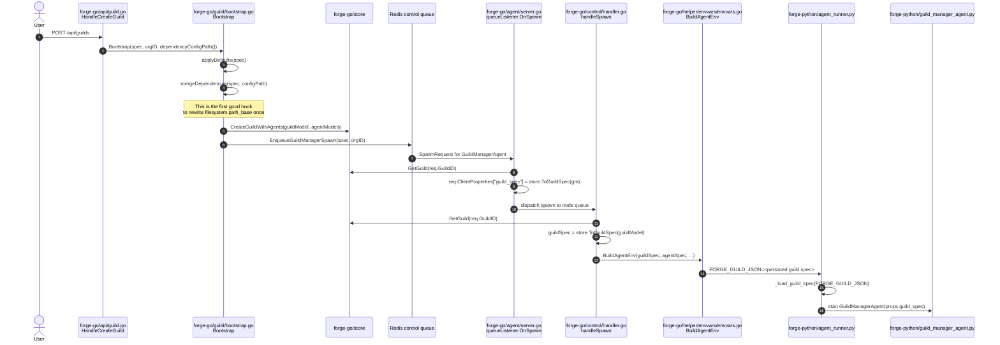
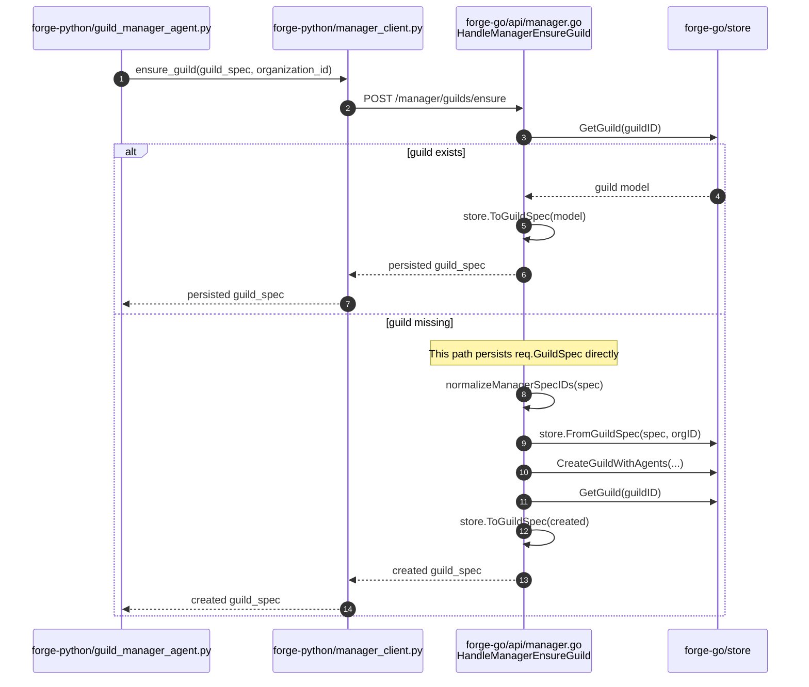
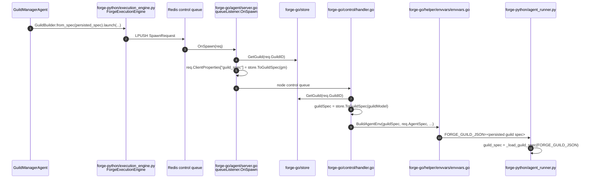

# File API Guild Spec Flow

This note captures how the guild spec moves through Forge today, and where a Forge-specific `filesystem.path_base` rewrite would need to happen if it should be persisted once and then travel unchanged across the system.

## 1. Public Guild Launch Flow

Relevant call sites:

- `forge-go/api/guild.go#HandleCreateGuild`
- `forge-go/guild/bootstrap.go#Bootstrap`
- `forge-go/guild/bootstrap.go#EnqueueGuildManagerSpawn`
- `forge-go/agent/server.go#queueListener.OnSpawn`
- `forge-go/control/handler.go#handleSpawn`
- `forge-go/helper/envvars/envvars.go#BuildAgentEnv`
- `forge-python/src/rustic_ai/forge/agent_runner.py#main`

## 2. GuildManagerAgent Manager Round-Trip

Relevant call sites:

- `forge-python/src/rustic_ai/forge/agents/system/guild_manager_agent.py#GuildManagerAgent.__init__`
- `forge-python/src/rustic_ai/forge/metastore/manager_client.py#ensure_guild`
- `forge-go/api/manager.go#HandleManagerEnsureGuild`

Important detail:

- In the normal launch flow, `HandleManagerEnsureGuild` usually hits the `guild exists` branch and reads the persisted spec.
- But the handler also has a `guild missing` branch that can persist a guild spec directly.

## 3. Child Agent Spawn Flow

Relevant call sites:

- `forge-python/src/rustic_ai/forge/execution_engine.py#run_agent`
- `forge-go/agent/server.go#queueListener.OnSpawn`
- `forge-go/control/handler.go#handleSpawn`
- `forge-go/helper/envvars/envvars.go#BuildAgentEnv`

## Conclusion

If the goal is:

- resolve `dependency_map.filesystem.properties.path_base` once,
- save the resolved value into the guild spec,
- and let that exact resolved spec flow everywhere after that,

then the main insertion point is:

- `forge-go/guild/bootstrap.go#Bootstrap`

Specifically:

- after dependency defaults are merged,
- before the spec is persisted,
- before the spec is embedded into the initial spawn payload.

If the codebase should be fully consistent even when the manager ensure path is the first writer, the same normalization must also exist in:

- `forge-go/api/manager.go#HandleManagerEnsureGuild`

because that handler can also create and persist a guild when it does not already exist.
