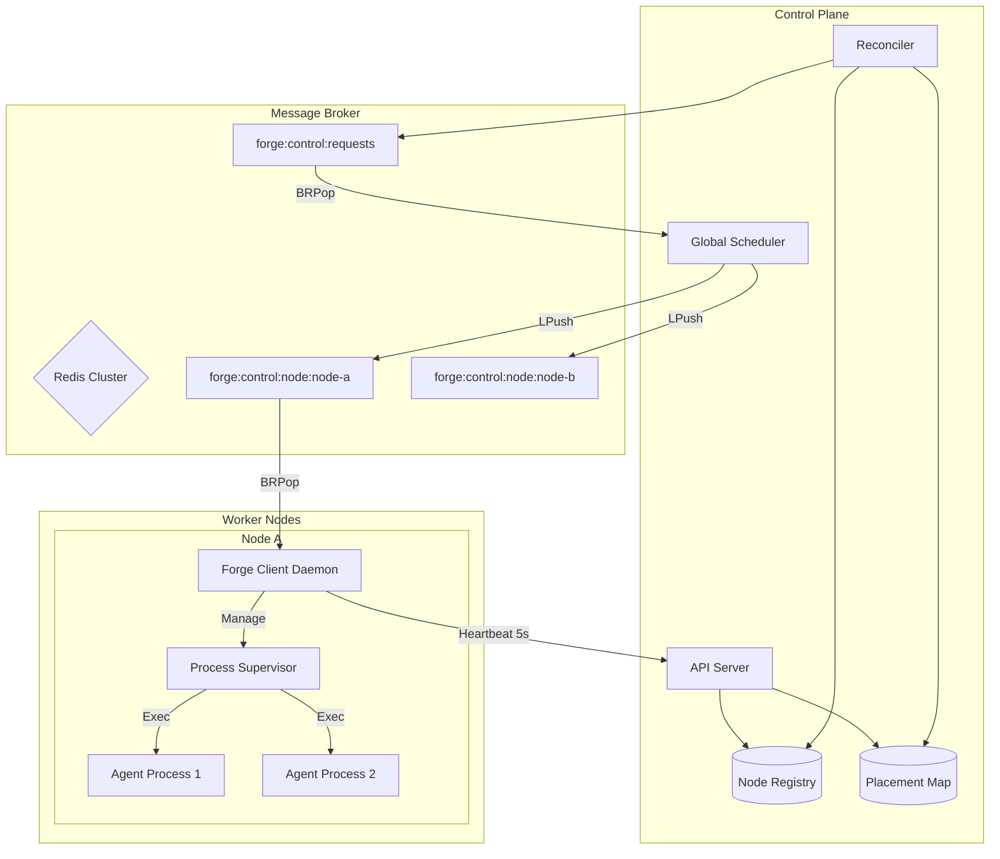
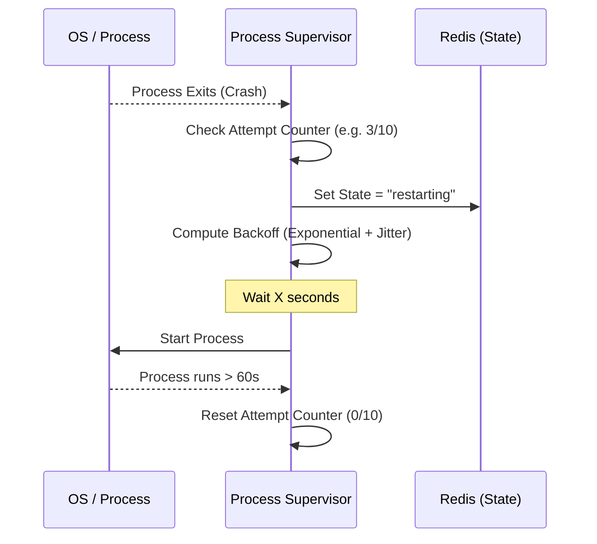
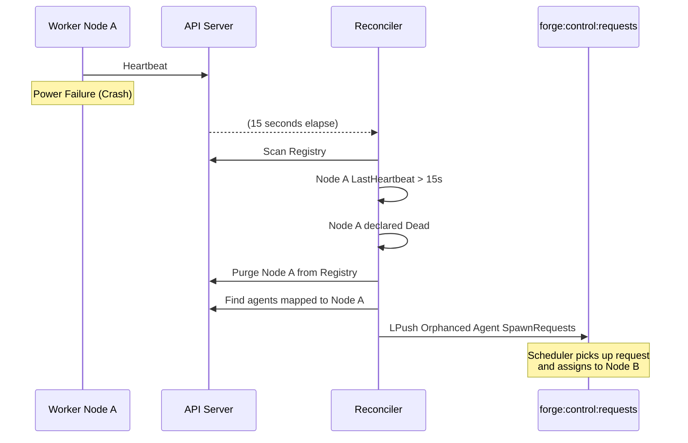

# Forge Distributed Architecture & SRE Guide

Welcome to the Forge Distributed Architecture and Site Reliability Engineering (SRE) Guide. This document details the internal design of the distributed system, outlining the happy paths as well as the various failure handling and recovery mechanisms. It is designed to quickly onboard new engineers and provide operational clarity during incidents.

## Table of Contents
1. [Architecture Overview](#architecture-overview)
2. [Component Roles](#component-roles)
3. [Communication model](#communication-model)
4. [Happy Paths](#happy-paths)
5. [Failure and Recovery Scenarios](#failure-and-recovery-scenarios)
6. [Observability & Troubleshooting](#observability--troubleshooting)

---

## Architecture Overview

Forge is a distributed agent orchestration system designed to place, monitor, and recover stateful or stateless workloads ("Agents") across a fleet of worker nodes. 



## Component Roles

### Central Control Plane
- **API Server**: Exposes REST interfaces for node registration (`POST /nodes/register`), heartbeating (`POST /nodes/{node_id}/heartbeat`), and general system status.
- **Global Scheduler**: Uses the `NodeRegistry` to calculate optimal agent placement based on resource requirements (CPUs, Memory, GPUs).
- **Node Registry**: Maintains health, capabilities, and capacity data for all active workers.
- **Placement Map**: A highly available mapping of which agent is currently hosted on which specific node ID.
- **Reconciler**: A background worker that runs every `15s` to verify node health and evict dead nodes.

### Worker Nodes (Clients)
- **Forge Client Daemon**: The main worker process. On startup, it detects local hardware capacity and registers to the API server.
- **Process Supervisor**: A component running within the Forge Client Daemon that handles OS-level agent process lifecycle, including starting via `exec.CommandContext`, stopping via POSIX signals, and applying Cgroups/limits.

## Communication Model

The system utilizes an asynchronous, persistent queueing model centered around Redis Lists:
1. **Global Control Queue (`forge:control:requests`)**: The single ingest point for cluster-level commands (e.g., spawn an agent, relocate an agent). The Control Listener pops items from here to be scheduled.
2. **Node-Specific Queues (`forge:control:node:<node_id>`)**: Each registered node has its own Redis List. Once the scheduler decides on a placement, the payload is pushed to that node's specific queue.

The payload structure pushed to queues is wrapped in a `ControlMessageWrapper`:
```json
{
  "command": "spawn",
  "payload": { ... underlying SpawnRequest/StopRequest ... }
}
```

---

## Happy Paths

### 1. Node Registration and Warmup
When a worker node boots, it goes through the following initialization flow:
1. **Capacity Detection**: The client detects its CPU, Memory, and GPU count. (e.g., defaults to 8192 MB Memory if unconfigurable).
2. **Registration**: The client calls `POST <server_url>/nodes/register` containing its `node_id` and capabilities.
3. **Queue Polling**: The client immediately begins a `BRPop` on its dedicated Redis queue (`forge:control:node:<node_id>`).
4. **Heartbeating**: Background goroutine starts sending heartbeats to `POST <server_url>/nodes/<node_id>/heartbeat` every `5 seconds`.

### 2. Spawning an Agent
1. **Request Ingest**: An API request or internal component pushes a `SpawnRequest` to `forge:control:requests`.
2. **Scheduling**: The ControlQueueListener on the master picks up the request. It invokes `Scheduler.Schedule()`. 
3. **Placement**: The scheduler checks the `NodeRegistry`, finds a suitable node with enough capacity, records the allocation in the `PlacementMap`, and pushes the request to the target node's dedicated queue.
4. **Local Launch**: The target worker node wakes up from its `BRPop`, parses the `spawn` command, and invokes the `ProcessSupervisor`.
5. **Execution**: The Supervisor looks up the Agent's runtime binary mapping via the `Registry`, creates an OS process group, executes the binary, and records its `PID`.

---

## Failure and Recovery Scenarios

The system is resilient to both localized agent application crashes and complete physical node outages.

### Scenario A: Local Agent Process Crash (Supervisor Recovery)

If the agent application ungracefully exits (e.g., panic, segfault), the centralized cluster is generally undisturbed, and recovery is handled purely locally by the worker's `ProcessSupervisor`.

1. **Crash Detection**: The `cmd.Wait()` call returns an error inside the supervisor's `monitorProcess` goroutine.
2. **Validation**: The supervisor confirms this wasn't an intentional shutdown (`StopRequested == false`). The Agent's state transitions to `StateRestarting`.
3. **Exponential Backoff**: A delay calculation (`ComputeBackoff`) determines how long to wait before the next restart attempt:
   - **Base Delay**: `1 second`
   - **Max Delay**: `30 seconds`
   - **Jitter**: Introduces a `±25%` randomization to avoid thundering herds.
   - **Limit**: At maximum `10 retries`.
4. **Restart Execution**: After returning from the delay, `startProcess` is invoked again.
5. **Stability Reset**: If an agent manages to run cleanly for `StableTime` (60 seconds continuously), its internal attempt counter is reset to `0`.
6. **Hard Failure**: If the agent crashes `10 times` without stabilizing, the supervisor gives up and updates the agent's Redis status state to `failed`. Manual intervention is required to fix the underlying app issue.



### Scenario B: Worker Node Outage (Global Recovery)

If a physical worker server dies, loses network access, or its kernel panics, it stops polling queues and stops sending heartbeats. The Central Control Plane detects this and actively re-distributes its workloads.

1. **Heartbeat Missing**: The node stops sending its 5-second `POST` heartbeats.
2. **Reconciliation Loop**: The master `Reconciler` wakes up (runs every `15s`) and scans the `NodeRegistry`.
3. **Dead Node Identification**: If `time.Now() - LastHeartbeat > 15 seconds`, the node is declared dead.
4. **Orphan Discovery**: The Reconciler queries the global `PlacementMap` for all agents currently bound to the dead `node_id`.
5. **Deregistration**: The node is purged from the healthy `NodeRegistry` to prevent any further allocations.
6. **Task Resubmission**: For each orphaned agent, the Reconciler:
   - Purges the `PlacementMap` association.
   - Retrieves the cached, original byte-for-byte `SpawnRequest` payload that originally started the agent.
   - Pushes it directly back into the root `forge:control:requests` global queue as a new `spawn` command.
7. **Redistribution**: The system treats this exactly like a brand-new spawn request. The ControlQueueListener will pull the item, and the Scheduler will dispatch it to a new, healthy, capable node.



### Scenario C: Agent Stop / Node Drain (Graceful Shutdown)
When an intentional agent stop or system-wide drain occurs:
1. The API triggers a `stop` via the node's control queue.
2. The local `ProcessSupervisor` enters a graceful shutdown trace:
   - Sets the internal `stopCh` to prevent restart loops.
   - Dispatches a `SIGTERM` to the agent's process group `(-PGID)`.
   - Polls `kill(0)` validation for up to `50 iterations (5 seconds)`.
   - If the agent refuses to exit, dispatches a `SIGKILL` to forcefully terminate the group.
3. The keys corresponding to the agent's state in Redis are deleted.

---

## Observability & Troubleshooting

For SRE operations, observe the following components when debugging cluster anomalies:

1. **Redis Inspector**:
   - Run `LLEN forge:control:requests` to ensure the global orchestrator is not backed up.
   - Run `LLEN forge:control:node:<node_id>` to ensure workers are promptly pulling and acknowledging their assignments.
2. **Server Logs**:
   - `Detected dead node, reconciling orphaned agents`: Emitted when the Reconciler pulls the trigger to tear down an unhealthy host.
   - `Failed to send heartbeat to server`: If seen on the worker, implies network partition upstream. Ensure L3/L4 connectivity to the control API Server.
3. **Ghost Agents**:
   - Due to the nature of SIGKILL fail-safes (which kill process group IDs), "zombie" child processes are rare but possible if an agent disassociates from its parent PGID before crashing.

*Prepared by: Antigravity AI Engineering*
