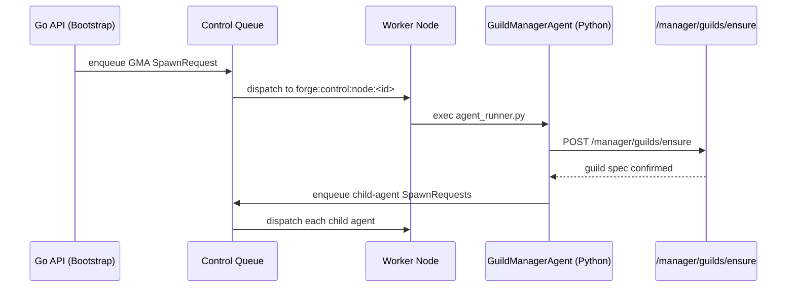

# Agent Model

An agent in Forge is a declarative spec until the moment it becomes a supervised process. This page traces that journey: how an `AgentSpec` is defaulted and validated, how the system's own `GuildManagerAgent` orchestrates every other agent's launch, how the registry decides what actually gets executed, and how the resulting process reports its health back into the control plane.

## AgentSpec: the unit of declaration

Every agent in a guild is described by a `protocol.AgentSpec`. It is guild-scoped — it has no meaning outside the `GuildSpec.Agents` list it belongs to — and it is the only input the rest of the system needs to place, launch, and supervise a Python process.

```go
type AgentSpec struct {
    ID                     string
    Name                   string
    Description            string
    ClassName              string // Python dotted path, required
    AdditionalTopics       []string
    Properties             map[string]any
    ListenToDefaultTopic   *bool // default true
    ActOnlyWhenTagged      *bool // default false
    Predicates             []Predicate
    DependencyMap          map[string]DependencySpec
    AdditionalDependencies []string
    Resources              ResourceSpec // NumCPUs, NumGPUs, CustomResources
    QOS                    QOSSpec
}
```

**Field semantics that matter operationally:**

- **`ClassName`** is a Python dotted path (e.g. `rustic_ai.agents.EchoAgent`) — it is required and is what the agent registry looks up at launch time.
- **`ListenToDefaultTopic` defaults to `true`.** Most agents want to hear the guild's default topic without any explicit subscription. The `GuildManagerAgent` is the notable exception — it flips this to `false` because it only cares about its own system topics.
- **`ActOnlyWhenTagged` defaults to `false`.** When `true`, the agent only reacts to messages that explicitly tag it, rather than everything on its subscribed topics.
- **`DependencyMap` / `AdditionalDependencies`** let an individual agent override or extend the guild-level dependency resolvers (see [Dependency Injection](../features/agents/)).
- **`Resources`** (`NumCPUs`, `NumGPUs`, `CustomResources["memory"]`) is what the [scheduler](placement-reconciliation/) reads to place the agent on a node with sufficient capacity.

Agents are authored either directly in YAML/JSON under a `GuildSpec`, or via the fluent `guild.NewAgentBuilder()` in Go, which validates name, description, `class_name`, and resource values before producing the spec. See [Guild Model](guild-model/) for the full authoring pipeline.

!!! note "IDs are normalized, not chosen"
    An agent's submitted ID is rewritten during bootstrap. Empty or default `a-N` IDs become `guildID#a-N`, so the ID you see in the store and in spawn payloads is guild-qualified — never assume the ID you authored survives unchanged.

## GuildManagerAgent: the system agent

Every guild gets one agent for free: the `GuildManagerAgent` (GMA). It is the system agent that drives everything else in the guild's lifecycle — it is not optional, and it is not something a guild author declares in their `agents` list. Forge injects it during `guild.Bootstrap`.

```go
const GuildManagerClassName = "rustic_ai.forge.agents.system.guild_manager_agent.GuildManagerAgent"
```

Its spec looks like this:

```go
spawnReq := protocol.SpawnRequest{
    RequestID: "bootstrap-" + spec.ID,
    GuildID:   spec.ID,
    AgentSpec: protocol.AgentSpec{
        ID:        spec.ID + "#manager_agent",
        Name:      spec.Name + " Manager",
        ClassName: GuildManagerClassName,
        AdditionalTopics: []string{
            "system_topic", "heartbeat_topic", "guild_status_topic",
        },
        ListenToDefaultTopic: boolPtr(false),
    },
    ClientType: "forge",
}
```

Notice what is deliberately different from a regular agent: `ListenToDefaultTopic` is `false` — the GMA has no business hearing ordinary guild traffic — and it subscribes to three system topics instead: `system_topic`, `heartbeat_topic`, and `guild_status_topic`. Its `Properties` also carry `guild_spec`, `manager_api_base_url`, `organization_id`, and `manager_api_token`, which is what lets it act as a control-plane client from inside the Python runtime.

**The manager round-trip.** The GMA is where the Go control plane and the Python execution runtime meet in a loop rather than a one-way handoff:

1. `guild.Bootstrap` persists the guild and enqueues the GMA spawn.
2. The control plane places and launches the GMA process exactly like any other agent (see [Scheduler](placement-reconciliation/)).
3. The Python `GuildManagerAgent`, using `ForgeExecutionEngine`, calls back into Go over `POST /manager/guilds/ensure` (`api/manager.go HandleManagerEnsureGuild`) to confirm or reconcile the guild record.
4. From there, the GMA drives spawning of the guild's actual agents through the same `OnSpawn -> handleSpawn -> BuildAgentEnv` path used for the GMA itself.



!!! tip "Relaunch reuses the same mechanism"
    `POST /api/guilds/{id}/relaunch` only re-enqueues the GMA spawn if the manager agent isn't currently running (checked against the status store). It refuses outright if the guild is `stopped` or `stopping`.

## Building the agent environment

By the time an agent process actually execs, its entire configuration has been flattened into environment variables. This is the Go-to-Python bridge: no shared memory, no RPC handshake at startup — just an env block and a `python -m rustic_ai.forge.agent_runner` invocation.

The canonical guild spec — reconstructed from the store via `store.ToGuildSpec`, never the one originally submitted — is serialized whole into one variable:

- **`FORGE_GUILD_JSON`** — the full `GuildSpec` as JSON. This is what lets a worker node configure itself without a database connection: messaging backend, dependency map, routes, and the target agent's own spec are all embedded in the guild spec at spawn time.

Alongside it, `helper/envvars.BuildAgentEnv` injects a family of `FORGE_*` and `RUSTIC_AI_*` variables that carry per-process, per-guild runtime configuration:

| Variable | Purpose |
|---|---|
| `RUSTIC_AI_EXECUTION_ENGINE` | Execution engine class for this guild |
| `RUSTIC_AI_MESSAGING_MODULE` / `_CLASS` / `_BACKEND_CONFIG` | Messaging backend wiring (defaults to Redis) |
| `RUSTIC_AI_STATE_MANAGER` | State manager class |
| `REDIS_HOST` / `REDIS_PORT` | Redis connection, when the messaging backend or dependencies need it |
| `FORGE_FILESYSTEM_GLOBAL_ROOT` | Root used to rewrite filesystem dependency `path_base` |
| `FORGE_STATIC_GUILD_ID` | Forces a fixed guild ID instead of a generated one |
| `FORGE_MANAGER_API_BASE_URL` | Base URL the GMA calls back into (default `http://127.0.0.1:9090`) |
| `FORGE_MANAGER_API_TOKEN` | Auth token for the manager round-trip |

**Auto-injected dependency clients.** `BuildAgentEnv` doesn't just pass through what the spec declares — for common infrastructure dependencies it auto-injects working clients so agents don't have to wire up connection details by hand. A `redis_client` or `nats_client` dependency, if referenced by the agent's dependency map, gets its concrete connection config auto-populated from the guild's own messaging/backend configuration rather than requiring the guild author to duplicate host/port settings per agent.

```bash
# What a spawned agent process effectively sees
FORGE_GUILD_JSON='{"id":"my-guild-01","name":"My Guild","agents":[...],"properties":{...}}'
RUSTIC_AI_EXECUTION_ENGINE=rustic_ai.forge.execution_engine.ForgeExecutionEngine
RUSTIC_AI_MESSAGING_MODULE=rustic_ai.redis.messaging.backend
RUSTIC_AI_MESSAGING_CLASS=RedisMessagingBackend
REDIS_HOST=127.0.0.1
REDIS_PORT=6379
FORGE_MANAGER_API_BASE_URL=http://127.0.0.1:9090
```

This env block, plus the resolved command from the agent registry, is exactly what a `supervisor.ProcessSupervisor` execs on the worker node.

## Agent registry: what actually runs

An `AgentSpec.ClassName` is just a dotted path — it says nothing about how to invoke the process. That resolution is the job of the **agent registry** (`registry/registry.go`), a catalog of runnable agent *templates* loaded from YAML (`FORGE_AGENT_REGISTRY` env var, defaulting to `conf/forge-agent-registry.yaml`).

Each `AgentRegistryEntry` is keyed on `ClassName` and declares:

- **`RuntimeType`** — one of `uvx`, `docker`, or `binary`. This picks the execution strategy: `uvx` runs the agent through a bundled `uv`-managed Python environment, `docker` runs it in a container, `binary` execs a compiled executable directly.
- **`WithDependencies`** — package/image/executable coordinates plus any extra dependencies the runtime needs installed alongside the base package.
- **`Secrets`** — required secret names the agent needs injected at launch.
- **`OAuth`** — required OAuth grants/scopes.
- **`Network`** — an egress allowlist for the process.
- **`Filesystem`** — bind mounts the process needs access to.

`Lookup(className)` resolves an entry, and `ResolveCommand(entry)` turns it into the actual OS exec argv. For `uvx` entries this looks like:

```bash
uvx --with <FORGE_PYTHON_PKG> ... python -m rustic_ai.forge.agent_runner
```

The `uvx` binary itself is resolved through a fallback chain: bundled next to the `forge` binary, then `PATH`, then `~/.forge/bin`, then `FORGE_UVX_PATH`, and if none of those exist it is downloaded from `astral-sh/uv`.

!!! note "Secrets, OAuth, network, and filesystem are declared, not enforced by the spec"
    The `AgentSpec` an author writes only says *which class* to run. Whether that class needs a secret, an OAuth token, network egress, or a filesystem mount is a property of the **registry entry** for that class, resolved at launch time — keeping the guild-authoring surface free of infrastructure/credential detail.

## Lifecycle statuses

An agent moves through a small, well-defined status machine, tracked both in the guild store (`AgentModel.Status`) and, at runtime, in the distributed `AgentStatusStore`:

| Status | Meaning |
|---|---|
| `not_launched` | Persisted in the store (via Bootstrap) but no spawn has been dispatched yet |
| `starting` | Worker has accepted the launch and written a distributed ACK |
| `running` | Process is confirmed up |
| `stopped` | Process was intentionally stopped |
| `error` | Process failed |
| `deleted` | Agent removed from the guild |

Bootstrap sets every newly created agent to `not_launched` up front — the guild itself starts at `requested`. From there, statuses are surfaced two ways:

- **Heartbeats.** The worker-side `ControlQueueHandler.handleSpawn` writes `state: "starting"` (with `node_id`) into the `AgentStatusStore` under key `forge:agent:status:<guildID>:<agentID>` with a 120s TTL, as a distributed acknowledgment that launch began. This is the same status the [reconciler](placement-reconciliation/) reads to decide whether a "stale dispatch" actually succeeded (`starting` → promote to acknowledged, `running` → promote to running, neither → retry or fail).
- **Status store queries.** `ProcessHeartbeatStatus` in the guild store interface, plus `AgentStatusStore.GetStatus`/`WriteStatus`/`RefreshStatus`/`DeleteStatus`, give both the API layer and the reconciler a consistent view of "is this agent actually alive right now," independent of the guild's own persisted `AgentModel.Status` column.

Because these two views (persisted `AgentModel.Status` vs. the TTL'd distributed status entry) are written by different actors on different cadences, treat the distributed status store as the real-time signal and the store's column as the durable record.

## Spawn payload: the spec, twice

When an agent spawn request is enqueued, the `AgentSpec` is deliberately carried in two places in the same payload:

- **`Properties["guild_spec"]`** — the `GuildSpec` as a native Go struct, for in-process Go consumers.
- **`ClientProperties["guild_spec"]`** — the identical spec serialized as a JSON string, for the Python side of the bridge.

Both accompany `manager_api_base_url` and `organization_id` on every spawn request, not just the GMA's. This duplication exists because the two runtimes read the payload differently: Go code deserializes the struct directly off the wire, while the Python `agent_runner` consumes `FORGE_GUILD_JSON`-shaped data and expects the guild spec pre-stringified in `ClientProperties` rather than performing its own Go-struct-aware decoding.

```go
// Enriched spawn payload as it crosses the control queue
type SpawnRequest struct {
    RequestID        string
    GuildID          string
    AgentSpec        protocol.AgentSpec
    ClientType       string
    ClientProperties map[string]any // guild_spec here is a JSON string
    ResponseMode     string
}
```

!!! warning "Don't hand-roll one side"
    If you're constructing spawn requests outside the normal `Bootstrap` / GMA path, populate both `Properties.guild_spec` and `ClientProperties.guild_spec` — omitting either breaks one runtime's view of the guild without any immediately visible error, since each runtime only ever reads its own copy.

## Example: a GuildManagerAgent spawn request

Putting it together, this is what `guild.Bootstrap` constructs and pushes onto the control queue immediately after persisting a new guild:

```go
spawnReq := protocol.SpawnRequest{
    RequestID: "bootstrap-my-guild-01",
    GuildID:   "my-guild-01",
    AgentSpec: protocol.AgentSpec{
        ID:        "my-guild-01#manager_agent",
        Name:      "My Guild Manager",
        ClassName: "rustic_ai.forge.agents.system.guild_manager_agent.GuildManagerAgent",
        AdditionalTopics: []string{
            "system_topic", "heartbeat_topic", "guild_status_topic",
        },
        ListenToDefaultTopic: boolPtr(false),
    },
    ClientType: "forge",
}
```

From here the flow is identical to any other agent: the server's `ControlQueueListener.OnSpawn` accepts it, the [scheduler](placement-reconciliation/) places it on a healthy node, `BuildAgentEnv` produces its `FORGE_GUILD_JSON` and `RUSTIC_AI_*` environment, the registry resolves its `uvx`/`docker`/`binary` command, and a `ProcessSupervisor` execs it — after which its status flows back through heartbeats into the `AgentStatusStore`.

## Related

- [Guild Model](guild-model/) — how a `GuildSpec` is authored, bootstrapped, and persisted
- [Scheduler](placement-reconciliation/) — placement, reconciliation, and the control-queue transport that dispatches agent spawns
- [Dependency Injection](../features/agents/) — how `DependencyMap` entries resolve to concrete clients
