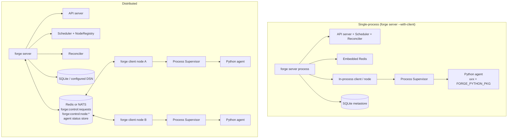

# Architecture

Forge splits a single binary into two roles — a control plane that decides *where* agents run, and worker nodes that actually run them — connected by a message broker instead of direct RPC. This page is the whole-system mental model: how the CLI, control plane, broker, workers, and the Python bridge fit together.

## Entry point: one CLI, two roles

Everything starts in `forge-go/main.go`, a single Cobra CLI (module `github.com/rustic-ai/forge/forge-go`) with three subcommands: `server`, `client`, and `version`. There is no separate binary per role — `forge server` and `forge client` are the same executable dispatching into different startup paths.

`command/server.go` (`ServerCmd`) parses flags into an `agent.ServerConfig` and calls `agent.StartServer(ctx, cfg)`. `command/client.go` (`ClientCmd`) parses flags into an `agent.ClientConfig` and calls `agent.StartClient(ctx, cfg)`. Both wrap `context.Background()` in `signal.NotifyContext` for `SIGINT`/`SIGTERM` so shutdown is graceful; a startup error logs and exits with `os.Exit(1)`.

```go
cfg := &agent.ServerConfig{
    DatabaseURL:   db,            // default: sqlite://<forge-home>/data/forge.db
    RedisURL:      serverRedis,   // default: embedded miniredis
    Backend:       serverBackend, // "redis" or "nats"
    ListenAddress: serverListen,  // default :9090
    WithClient:    serverWithClient,
    // ...telemetry, client, oauth fields
}
ctx, cancel := signal.NotifyContext(context.Background(), syscall.SIGINT, syscall.SIGTERM)
defer cancel()
if err := agent.StartServer(ctx, cfg); err != nil { os.Exit(1) }
```

Persistent flags apply to all three subcommands: `--log-level` (default `info`), `--log-format` (default `text`), and `--forge-home` (base data directory; falls back to `FORGE_HOME` env, then `~/.forge`). `forgepath.Resolve(sub)` derives every other path — the SQLite DSN, the data directory, config file locations — from this one root.

!!! tip
    `forge version` prints Forge Version, Git Commit, Build Date, Go Version, and OS/Arch. The Makefile injects real values via `-ldflags -X`; the in-source defaults (`Version="0.4.2"`, `GitCommit="none"`) only show up in a dev build that skipped `make build`.

## Control plane components

`agent.StartServer` wires up five collaborating pieces that make up the control plane:

| Component | Responsibility |
|---|---|
| **API server** | HTTP surface for node lifecycle: `POST /nodes/register`, `POST /nodes/{node_id}/heartbeat`, `DELETE /nodes/{node_id}`, `GET /nodes`, `GET /healthz`, plus `/rustic/*` and `/manager/*` application routes. |
| **Scheduler** (`scheduler.GlobalScheduler`) | Best-fit placement. `Schedule(agentSpec)` reads requested CPUs/GPUs/memory from `protocol.ResourceSpec`, filters healthy nodes with enough remaining capacity, and picks the node with the highest `remMem + remCPUs*1024` score — a most-free / spread bias, not tight bin-packing. |
| **Node registry** (`scheduler.GlobalNodeRegistry`) | In-memory `map[string]*NodeState` tracking `TotalCapacity`/`UsedCapacity` and `LastHeartbeat`. A node is healthy while `time.Since(LastHeartbeat) < 10s`. |
| **Placement map** (`scheduler.GlobalPlacementMap`) | Agent → node bindings keyed `guildID:agentID`, each with a `SpawnState` (`accepted → dispatched → acknowledged → running`, or terminal `failed`), attempt count, and the original spawn payload for replay. |
| **Reconciler** | Leader-gated background loop, ticking every 15s, that repairs the cluster (see below). |

Spawn requests are accepted in two phases, not placed synchronously. The server's `ControlQueueListener.OnSpawn` idempotency-gates on `IsActivelyTracked`, marks the placement `accepted`, and immediately acks the caller — placement itself happens in a goroutine (`dispatchAcceptedSpawn`) that calls `Scheduler.Schedule`, marks the placement `dispatched`, and pushes the command to the target node's queue. If scheduling or the push fails, the placement reverts to `accepted` so the reconciler retries later.

The reconciler runs five phases in strict order, and only when it holds cluster leadership (`leader.LeaderElector.IsLeader()` — Redis lock, Raft, or single-node in embedded mode):

```go
case <-ticker.C:
    if r.elector != nil && !r.elector.IsLeader() {
        continue
    }
    r.reconcile(ctx)
// reconcile:
r.reconcileDeadNodes(ctx)        // evict nodes silent > 15s, re-enqueue their agents
r.reconcileAccepted(ctx)         // retry placements that never got dispatched
r.reconcileStaleDispatches(ctx)  // dispatched but no ack after 30s
r.reconcileStaleAcks(ctx)        // acked but never reached "running" after 120s
r.cleanupFailedPlacements()      // drop failed placements older than 5m
```

On a dead node, the reconciler gathers `AgentsOnNode`, deregisters the node, removes each orphaned placement, and re-pushes the original byte-for-byte spawn payload back onto the global queue — recovery is indistinguishable from a fresh spawn. Stale-dispatch and stale-ack recovery cross-check the distributed agent status store before giving up, so a slow-but-alive worker isn't punished for a merely slow acknowledgment.

!!! note
    Two health thresholds differ on purpose: the registry stops listing a node as healthy at 10s of heartbeat silence (so the scheduler won't place new work on it), while the reconciler waits until 15s to declare it dead and evict it. Between those two marks, a node is invisible to new placements but not yet reclaimed.

## The broker carries placement, not RPC

The control plane never calls a worker directly. Every spawn, stop, and status update travels as a message on a shared broker — Redis (default, using an embedded miniredis if `--redis` isn't set) or NATS (`--backend nats`, using embedded JetStream NATS if `--nats` isn't set). Messages are wrapped uniformly:

```json
{
  "command": "spawn",
  "payload": { "...": "underlying SpawnRequest/StopRequest" }
}
```

There are two queue shapes:

- **Global control queue** `forge:control:requests` — every spawn/stop request lands here first; the scheduler consumes it with `BRPOP` (Redis) or a JetStream work-queue consumer (NATS).
- **Per-node queue** `forge:control:node:<node_id>` — once the scheduler has picked a node, it `LPUSH`es the wrapped command here; that node's `ControlQueueHandler` is the sole consumer.

```go
func (t *RedisControlTransport) Push(ctx context.Context, queueKey string, payload []byte) error {
    return t.rdb.LPush(ctx, queueKey, payload).Err()
}
func (t *RedisControlTransport) Pop(ctx context.Context, queueKey string, timeout time.Duration) ([]byte, error) {
    res, err := t.rdb.BRPop(ctx, timeout, queueKey).Result()
    if errors.Is(err, redis.Nil) { return nil, nil } // timeout
    // ... res[1] is the payload
}
```

The same transport handle is reused for three otherwise-separate subsystems, which is why `--backend`/`--redis`/`--nats` is a single decision rather than three:

1. **Messaging** (`messaging.Backend`) — the data-plane message bus that carries `protocol.Message` traffic between agents, using Redis ZSETs/PubSub or NATS JetStream streams/KV/core pub-sub.
2. **Control plane** (`control.ControlTransport`) — the spawn/stop queues described above.
3. **Agent status store** (`supervisor.AgentStatusStore`) — a TTL'd key per agent (`forge:agent:status:<guild_id>:<agent_id>`) holding `{state, node_id, pid, timestamp}`, written by the worker as a distributed ACK (`state="starting"`, 120s TTL) and consulted by the reconciler to disambiguate "message delivered but node crashed" from "still launching."

`natsURL != ""` is the actual switch in `agent/server.go` that moves messaging, control, and status all onto NATS together — there's no split-backend mode.

## Worker nodes: the process supervisor and the Python bridge

`forge client` registers with the server, reports its `--cpus`/`--memory`/`--gpus` capacity, sends a heartbeat every 5s, and listens on its own `forge:control:node:<node_id>` queue. A heartbeat that gets `404` (the registry evicted it after 10s of silence) triggers automatic re-registration.

`ControlQueueHandler.handleSpawn` on the worker: applies a cross-node idempotency gate against the status store (skip if the agent is already `running`/`starting` on a *different* node), writes its own `starting` status as a distributed ack, looks up the agent class in the agent registry, resolves the guild spec, builds environment variables, and hands off to a **Process Supervisor** (`docker` or `bwrap`, chosen via `--default-supervisor` / `--client-default-supervisor`) that actually launches the OS process via `exec.CommandContext`.

That launched process is where the **Go↔Python bridge** lives. Agent templates in the agent registry (`FORGE_AGENT_REGISTRY`, default `conf/forge-agent-registry.yaml`) declare a `RuntimeType` of `uvx`, `docker`, or `binary`; for `uvx` entries, `registry.ResolveCommand` builds an argv like `uvx --with <FORGE_PYTHON_PKG> ... python -m rustic_ai.forge.agent_runner`, adding a `--with` for each package the registry entry, the guild-wide `FORGE_EXTRA_DEPS`, or the agent's own `forge_extra_deps` asks for. `FORGE_PYTHON_PKG` points at the `forge-python` checkout, and `uv`/`uvx` must be on `PATH` (Forge bootstraps `uvx` itself if it's missing — bundled binary, then `PATH`, then `~/.forge/bin`, then download). The spawned Python process runs `forge-python`'s execution bridge and system agents (notably `GuildManagerAgent`), and talks back to the Go side over a ZeroMQ PAIR socket (`AgentMessagingBridge`, IPC by default, TCP via `--zmq-bridge-mode tcp`) rather than connecting to Redis/NATS directly — so distributed Python agents never need broker credentials of their own.

Supervisor-side crash recovery uses exponential backoff (base 1s, max 30s, ±25% jitter, 10 retries, `StableTime` 60s to reset the counter). Graceful stop sends `SIGTERM` to the process group, polls for exit up to ~5s, then `SIGKILL`.

## Single-process vs. distributed topology

Forge runs the same binary either as one process or as a real cluster.

**Single-process** — `forge server --with-client` starts the control plane and an in-process worker node together, with embedded Redis and a SQLite metastore, all in one OS process:

```bash
FORGE_PYTHON_PKG="$FORGE_REPO_DIR/forge-python" \
"$FORGE_REPO_DIR/forge-go/bin/forge" server \
  --listen :3001 \
  --db sqlite:////tmp/forge-local.db \
  --with-client \
  --client-node-id local-single-node \
  --client-metrics-addr 127.0.0.1:19091

curl -sS http://127.0.0.1:3001/healthz
```

`--client-attach-process-tree` ties spawned agent processes to the server's process tree so everything exits together — a convenience only meaningful in this mode.

**Distributed** — a central `forge server` and one or more separate `forge client` processes, sharing the same Redis (or NATS):

```bash
# Control plane
"$FORGE_REPO_DIR/forge-go/bin/forge" server --listen :3001 --db sqlite:////tmp/forge-server.db

# Separate worker node
FORGE_PYTHON_PKG="$FORGE_REPO_DIR/forge-python" \
"$FORGE_REPO_DIR/forge-go/bin/forge" client --server http://127.0.0.1:3001 --redis 127.0.0.1:6379
```



Every additional `forge client` needs the same `--redis`/`--nats` value as the server — the broker is what makes the cluster one cluster, not a shared filesystem or direct network calls between server and client.

## Data plane vs. control plane, and where things attach

Forge keeps two planes distinct even though they can share a transport:

- **Control plane**: node registration/heartbeat (HTTP), spawn/stop dispatch (`forge:control:*` queues), placement state (in-memory `PlacementMap`, not persisted — a control-plane restart loses in-flight accepted/dispatched tracking and leans on the TTL'd agent status store to recover), and leader election (`forge:control:leader`).
- **Data plane**: agent-to-agent `protocol.Message` traffic carried by `messaging.Backend` (Redis ZSETs/PubSub or NATS JetStream/KV/pub-sub), namespaced per guild, plus the ZMQ bridge that exposes it to Python agent subprocesses.

Attachment points across both planes:

- **Telemetry** is OpenTelemetry-first, configured on the server (`--otel-enabled`, `--otel-mode desktop_sqlite|external_otlp`, `--otel-endpoint`, `--otel-service-name`, `--otel-sqlite-*`). Spans cover queue publish/consume, scheduler placement duration, and placement errors; trace context propagates through `SpawnRequest.TraceContext`.
- **Storage** is the metastore (`--db`, default `sqlite://<forge-home>/data/forge.db`, any DSN) plus a data directory (`--data-dir`) for file storage, with an optional `--state-store diskcache` in front of the default in-memory state.
- **Secrets** attach at the agent-registry level: each `AgentRegistryEntry` declares required `Secrets`/`OAuth` scopes, and the server exposes `--oauth-token-store memory|keychain` for where OAuth tokens live.

For the reasoning behind best-fit scoring, reconciliation timeouts, and idempotency guarantees, see [Scheduler & Placement](placement-reconciliation/). For how agent processes are launched and supervised on a node, see [Process Supervisors](../features/supervision-recovery/). To get a cluster running locally, start with the [Quickstart](../getting-started/quickstart/).
