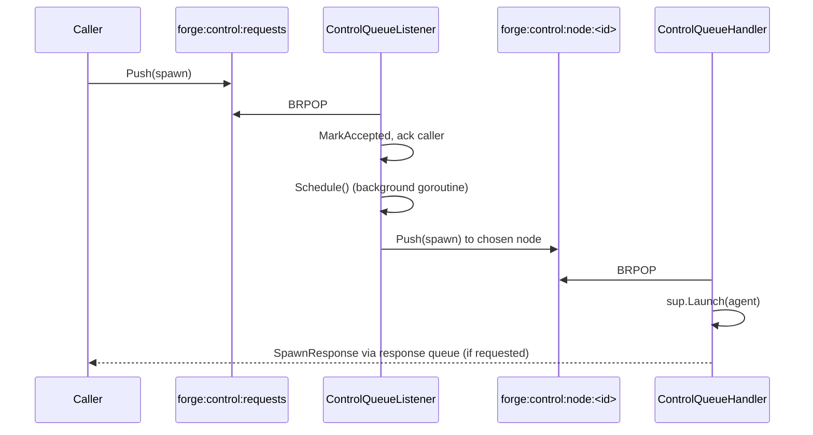

# Distributed Control Plane

Forge places, tracks, and recovers agent workloads across a fleet of worker nodes without a shared database. Every mutation the cluster agrees on flows through a small set of queues, a single elected writer, and two pieces of durable state — everything else is disposable, in-memory bookkeeping that regenerates itself after a crash.

This page explains how those pieces fit together: the queues that carry control traffic, the leader election that keeps only one process reconciling at a time, and the split between what lives in memory versus what lives in Redis or NATS.

## The queue topology

Control traffic moves through three kinds of queues, all addressed by well-known keys:

| Queue | Key | Direction |
|---|---|---|
| Global control queue | `forge:control:requests` | Single ingest point for all spawn/stop requests |
| Per-node dispatch queue | `forge:control:node:<node_id>` | Server → one specific worker node |
| Response queue/subject | `forge:control:response:<request_id>` (Redis) / `ctrl.response.<request_id>` on `CTRL_RESPONSES` (NATS) | Worker → original caller |

Every request funnels through the **same** global queue regardless of which node eventually runs it. The server's `ControlQueueListener` is the only consumer of `forge:control:requests`; it decides placement and re-publishes the (wrapped) request onto the winning node's dispatch queue. Workers never read the global queue directly, and they never write to another node's dispatch queue — each `ControlQueueHandler` owns exactly one key, `forge:control:node:<node_id>`.

Messages on every queue share one envelope, the `ControlMessageWrapper`:

```json
{
  "command": "spawn",
  "payload": { "...": "SpawnRequest or StopRequest" }
}
```

Because re-enqueueing a failed or orphaned agent means pushing the same wrapper back onto `forge:control:requests`, recovery is indistinguishable from a brand-new spawn — the scheduler doesn't need a special "reschedule" code path.



!!! note "Two-phase accept, then dispatch"
    `OnSpawn` does not place synchronously. It idempotency-gates on `PlacementMap.IsActivelyTracked`, enriches the request, forces `ResponseMode=none` (the caller was already acked at accept time), calls `MarkAccepted`, and returns immediately. A background goroutine then runs `Scheduler.Schedule`, `MarkDispatched`, and pushes to the node queue. If either step fails, the placement reverts to `Accepted` — bumping `Attempts` — and the [Reconciler](#single-writer-reconciliation)'s `reconcileAccepted` phase retries it later.

## Transport-agnostic by design

The control plane doesn't care whether the queues above are backed by Redis or NATS — both implementations sit behind the same interfaces (`control.ControlTransport`, `ResponseTransport`, `ControlPlane`, `protocol.ControlPusher`), and the server picks one at startup via `--backend redis|nats` (default `redis`).

**Redis** uses plain lists:

```go
func (t *RedisControlTransport) Push(ctx context.Context, queueKey string, payload []byte) error {
    return t.rdb.LPush(ctx, queueKey, payload).Err()
}

func (t *RedisControlTransport) Pop(ctx context.Context, queueKey string, timeout time.Duration) ([]byte, error) {
    res, err := t.rdb.BRPop(ctx, timeout, queueKey).Result()
    if errors.Is(err, redis.Nil) {
        return nil, nil // timeout, not an error
    }
    // res[1] is the payload
}
```

**NATS** uses JetStream work-queue streams instead of lists: each control queue key becomes a stream `CTRL_<sanitized-key>` with `WorkQueuePolicy`, 5-minute `MaxAge`, and `AckSync` per message, so a message is redelivered if a consumer dies mid-processing. Responses share a single `CTRL_RESPONSES` stream (60s `MaxAge`). `QueueDepth` reports stream pending-message counts under NATS versus `LLEN` under Redis — same semantic, different accounting.

Because messaging, the control plane, and the [agent status store](#the-agentstatusstore-durable-ttld-cross-node-truth) all reuse the *same* connection handle chosen at server startup, switching `--backend` moves the entire distributed-state story at once — there's no partial-Redis, partial-NATS deployment.

!!! tip "Single-process mode still uses the queues"
    `forge server --with-client` runs the scheduler and a worker node in one process, backed by embedded Redis (miniredis). The control queues are still real — the in-process node still `BRPOP`s its own dispatch queue — which is why single-process and distributed mode behave identically from the scheduler's point of view.

## Single-writer reconciliation

Multiple `forge server` replicas can run for HTTP availability, but only one of them may mutate placement and node state at a time. That's enforced by leader election, not by locking individual operations:

```go
case <-ticker.C:
    if r.elector != nil && !r.elector.IsLeader() {
        continue
    }
    r.reconcile(ctx)
```

The `Reconciler` ticks every `ReconcileInterval` (15s) and simply skips its entire body if it isn't the leader. This is what prevents split-brain double-scheduling: a non-leader replica still serves HTTP and still accepts spawns onto the global queue, but it never evicts nodes, re-enqueues orphans, or retries stalled dispatches.

Three `leader.LeaderElector` implementations are available, selected by the server at startup:

| Mode | Mechanism | Selected when |
|---|---|---|
| `RedisElector` | `SET NX` + TTL lock on `forge:control:leader` (5s TTL), Lua compare-and-extend renewal at `ttl/3`, re-acquire retry at `ttl/2` | A Redis client exists and raft isn't requested |
| `RaftElector` | HashiCorp Raft for consensus, memberlist gossip for discovery; dummy FSM (only leadership matters), self-bootstraps as seed if no join peers | `--leader-election-mode raft` (`--raft-bind`, `--gossip-bind`, `--gossip-join`) |
| `SingleNodeElector` | Immediately leader | Embedded/single-process mode, no distributed backend |

!!! warning "Losing leadership is silent and expected"
    If a Redis leader's renewal fails (network partition, Redis hiccup), `setLeader(false)` fires and the next reconcile tick simply no-ops. There's no alarm — the replica that reacquires the lock picks reconciliation back up where the last leader left off, because reconciliation state derives from the registry, the placement map, and the status store, not from the leader itself.

### The reconciler's five phases

Each leader-gated tick runs, in order:

```go
r.reconcileDeadNodes(ctx)
r.reconcileAccepted(ctx)
r.reconcileStaleDispatches(ctx)
r.reconcileStaleAcks(ctx)
r.cleanupFailedPlacements()
```

- **`reconcileDeadNodes`** — evicts nodes whose heartbeat has gone silent past `DeadNodeTimeout` and re-enqueues their orphaned agents (see below).
- **`reconcileAccepted`** — retries placements stuck in `Accepted` (the two-phase dispatch above failed and reverted).
- **`reconcileStaleDispatches`** — placements `Dispatched` longer than `AckTimeout` (30s) get cross-checked against the status store.
- **`reconcileStaleAcks`** — placements `Acknowledged` longer than `LaunchTimeout` (120s) without reaching `Running`.
- **`cleanupFailedPlacements`** — removes `Failed` placements older than `FailedCleanupAge` (5m), giving operators/telemetry a window to observe failures before they vanish.

```go
ReconcilerConfig{
    ReconcileInterval: 15 * time.Second,
    AckTimeout:        30 * time.Second,
    LaunchTimeout:     120 * time.Second,
    MaxAttempts:       5,
    DeadNodeTimeout:   15 * time.Second,
    FailedCleanupAge:  5 * time.Minute,
}
```

## Where cluster state actually lives

The scheduler's fast path — `NodeRegistry` and `PlacementMap` — is deliberately **in-memory only**: a `map[string]*NodeState` and a `map["guildID:agentID"]AgentPlacement`, each guarded by a mutex, living inside whichever process is currently leader. Nothing durable backs them.

That's a trade, not an oversight. In-memory state is cheap to mutate at scheduling speed, and it's disposable precisely because the facts that matter across a restart or a leader handoff live elsewhere:

| State | Location | Durable? |
|---|---|---|
| Node capacity/health (`NodeRegistry`) | In-memory, per-leader | No — rebuilt as nodes heartbeat/re-register |
| Agent→node bindings (`PlacementMap`) | In-memory, per-leader | No — rebuilt via re-enqueue + idempotency gates |
| Control transport (queues) | Redis lists / NATS JetStream | Yes |
| Agent status (`AgentStatusStore`) | Redis/NATS KV, TTL'd | Yes, until TTL expiry |
| Leader lock | Redis key / Raft log | Yes, for the lock's lifetime |

If the leader process restarts, `GlobalPlacementMap` and `GlobalNodeRegistry` are simply gone. Recovery isn't "replay the map" — it's:

1. Worker nodes re-register (`POST /nodes/register`) and resume heartbeating, rebuilding the registry.
2. The reconciler's `reconcileDeadNodes` phase eventually reclaims genuinely dead nodes, and any agents that were mid-flight get re-derived from the **`AgentStatusStore`** — the one piece of cross-node truth that survived the restart — via the idempotency gates described below, not from a snapshot of the old placement map.

### The AgentStatusStore: durable, TTL'd, cross-node truth

`supervisor.AgentStatusStore` (Redis key `forge:agent:status:<guild_id>:<agent_id>`, or a NATS KV equivalent) is what lets the reconciler tell the difference between "message never arrived" and "message arrived, worker just hasn't acked yet":

```go
stale := r.placementMap.GetStaleDispatches(r.config.AckTimeout) // 30s
for _, p := range stale {
    status, err := r.statusStore.GetStatus(ctx, p.GuildID, p.AgentID)
    if err == nil && status != nil {
        if status.State == "starting" { r.placementMap.MarkAcknowledged(p.GuildID, p.AgentID); continue }
        if status.State == "running"  { r.placementMap.MarkRunning(p.GuildID, p.AgentID); continue }
    }
    if p.Attempts >= r.config.MaxAttempts { r.placementMap.MarkFailed(p.GuildID, p.AgentID); continue }
    r.placementMap.Remove(p.GuildID, p.AgentID)
    r.reenqueue(ctx, p)
}
```

The worker writes to this store the moment it accepts a spawn — `state: "starting"`, TTL 120s — as a distributed ACK, and updates it again once the process is actually `running`. That write also doubles as a cross-node idempotency gate: if a worker sees an agent already `starting`/`running` on a *different* node, it refuses to launch a duplicate.

```go
existing, err := h.statusStore.GetStatus(ctx, req.GuildID, req.AgentSpec.ID)
if err == nil && existing != nil &&
    (existing.State == "running" || existing.State == "starting") &&
    existing.NodeID != "" && existing.NodeID != h.nodeID {
    // agent already active elsewhere — skip launch
    return
}
_ = h.statusStore.WriteStatus(ctx, req.GuildID, req.AgentSpec.ID,
    &supervisor.AgentStatusJSON{State: "starting", NodeID: h.nodeID, Timestamp: time.Now()},
    120*time.Second)
```

So the durability story is inverted from what you might expect: the *fast* structures (registry, placement map) are volatile, and the *slow* path (a TTL'd key-value store, written on the hot path anyway) is what makes recovery correct.

## Node registration, heartbeat, and the two health thresholds

Worker nodes announce themselves and stay visible through three HTTP routes on the control-plane server:

- `POST /nodes/register` — body `NodeRegistrationRequest{node_id, capacity{cpus, memory, gpus}}` → `201 Created`. An empty/missing `node_id` is a `422`.
- `POST /nodes/{node_id}/heartbeat` — refreshes `LastHeartbeat`; an unknown node gets `404`.
- `DELETE /nodes/{node_id}` — deregisters, `204 No Content`.

The reference node client heartbeats every 5 seconds and treats a `404` as "the registry evicted me" — it re-registers rather than erroring out:

```go
hbURL := fmt.Sprintf("%s/nodes/%s/heartbeat", config.ServerURL, config.NodeID)
if r, err := client.Do(req); err == nil {
    if r.StatusCode == http.StatusNotFound {
        // registry evicted us; re-register the node
        _ = registerNode(ctx, config.ServerURL, body)
    }
}
```

Two independent, deliberately different thresholds govern what happens to a quiet node:

| Threshold | Value | Effect |
|---|---|---|
| Registry unhealthy | `time.Since(LastHeartbeat) >= 10s` | Node drops out of `ListHealthy()` — the scheduler stops placing new agents on it — but it's still registered |
| Reconciler dead | `time.Since(LastHeartbeat) > 15s` | `reconcileDeadNodes` deregisters the node outright and re-enqueues everything it was running |

Between 10s and 15s a node is invisible to placement but not yet reclaimed — new spawns skip it, but its existing agents (and its `UsedCapacity`) are still on the books. Only past 15s does the reconciler act:

```go
for nodeID, state := range r.registry.nodes {
    if now.Sub(state.LastHeartbeat) > r.config.DeadNodeTimeout { // 15s
        deadNodes = append(deadNodes, nodeID)
    }
}
// ...
orphans := r.placementMap.AgentsOnNode(nodeID)
r.registry.Deregister(nodeID)
for _, o := range orphans {
    r.placementMap.Remove(o.GuildID, o.AgentID)
    r.reenqueue(ctx, o) // Push {command:spawn,payload} back onto forge:control:requests
}
```

`Deregister` removes the node's `UsedCapacity` from the registry entirely, so by the time the orphaned agents land back on `forge:control:requests`, the scheduler naturally reconsiders the full remaining fleet — it never tries to re-place onto the node that just died.

## Putting it together

A spawn's journey through the control plane looks like this end to end:

1. A caller pushes a `spawn` command onto `forge:control:requests`.
2. The leader's `ControlQueueListener` pops it, idempotency-checks the `PlacementMap`, marks it `Accepted`, and acks the caller immediately.
3. A background goroutine calls `Scheduler.Schedule`, marks the placement `Dispatched`, and pushes onto `forge:control:node:<chosen_node>`.
4. The target `ControlQueueHandler` pops it, checks the `AgentStatusStore` idempotency gate, writes `state: "starting"` (120s TTL), and calls `sup.Launch`.
5. If the node dies before or during any of this, the reconciler — running only on whichever process holds the leader lock — detects it via heartbeat age, the status store, or ack age, and re-enqueues the agent onto the same global queue, indistinguishable from step 1.

None of this requires a shared database. The queues, the leader lock, and the status store — all backed by Redis or NATS behind uniform interfaces — are the only things the cluster has to agree on. Everything else is a cache that regenerates from those three sources of truth.

See also: [Scheduling and Placement](placement-reconciliation/) for how `Scheduler.Schedule` picks a node, and [Getting Started: Distributed Mode](../getting-started/quickstart/) for running a server and worker client side by side.
