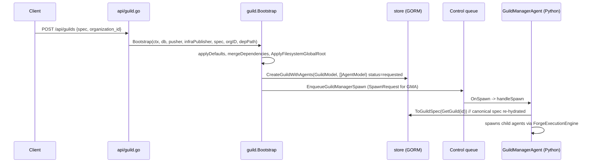

# Guild Model

A guild is Forge's unit of deployment: a named set of agents, routing rules, dependencies, and shared configuration that gets persisted once and then launched as a running multi-agent system. Understanding how the authored spec, the stored rows, and the runtime spec relate is the key to reasoning about anything else in Forge.

## Spec vs. store models

Everything starts as a `protocol.GuildSpec` (`protocol/spec.go:816`) — the thing you author in YAML, JSON, or via the Go builders:

| Field | Purpose |
|---|---|
| `ID`, `Name`, `Description` | Identity. Name is 1-64 chars, description non-empty (`GuildSpec.Validate`). |
| `Properties` | Holds `execution_engine`, `messaging`, `state_manager`, `state_manager_config`. |
| `Configuration` | A mustache templating context, resolved only at build time. |
| `Agents` | `[]AgentSpec`. |
| `DependencyMap` | `[]DependencySpec` resolvers, merged from three layers (see below). |
| `Routes` | A `RoutingSlip`. |
| `Gateway` | Optional `GatewayConfig`. |

An `AgentSpec` (`protocol/spec.go:670`) carries `ID`, `Name`, `Description`, a required `ClassName` (Python dotted path), `AdditionalTopics`, `Properties`, `ListenToDefaultTopic` (default `true`), `ActOnlyWhenTagged` (default `false`), `Predicates`, `DependencyMap`, `AdditionalDependencies`, `Resources` (`NumCPUs`/`NumGPUs`/`CustomResources`), and `QOS`.

`guild.Bootstrap` persists this spec as two GORM-backed tables (`guild/store/models.go`):

- **`GuildModel`** (table `guilds`) — `ID`, `Name`, `Description`, `ExecutionEngine`, `BackendModule`, `BackendClass`, `BackendConfig`, `OrganizationID`, `DependencyMap`, `Status`, `Routes`, `Agents`.
- **`AgentModel`** (table `agents`) — `ID`, `GuildID`, `Name`, `ClassName`, `Properties`, `AdditionalTopics`, `ListenToDefaultTopic`, `ActOnlyWhenTagged`, `DependencyMap`, `AdditionalDependencies`, `Predicates`, `Status`.

Routes live in their own `guild_routes` table, and relaunch bookkeeping lives in `guilds_relaunch`.

### The canonical-spec invariant

Forge never re-uses the spec that was submitted over HTTP. `guild/store/mapper.go` defines the round-trip:

- `FromGuildSpec(spec, orgID) *GuildModel` — flattens a spec into columns for storage.
- `ToGuildSpec(model) *protocol.GuildSpec` — rebuilds a full spec from a `GuildModel`, reconstructing `Properties.execution_engine` and `Properties.messaging` from the stored columns.

Every downstream spawn re-hydrates the spec by calling `store.ToGuildSpec(GetGuild(id))` — never by holding onto the spec that arrived in the original request. That means **the persisted spec, not the submitted one, is canonical**. Any normalization (dependency merges, filesystem-root rewriting, ID assignment, state-manager-config derivation) must happen *before* `CreateGuildWithAgents` in `Bootstrap`, because after that point the store row is the only thing anyone reads from again.

This is why `FILE_API_GUILD_SPEC_FLOW.md` names `guild/bootstrap.go`'s `Bootstrap` as the single canonical write hook for spec normalization, with `api/manager.go`'s `HandleManagerEnsureGuild` as a secondary writer only on the guild-missing branch of the manager round-trip.



!!! note "Why the round-trip matters"
    Because `ToGuildSpec` is the only path that reconstructs a spec for a running guild, a bug in the mapper (or a manual DB edit) is visible to every agent spawn, forever — not just the first one. Treat the mapper as the schema boundary between "what a user wrote" and "what the system runs."

## Routing: RoutingSlip and RoutingRule

Message flow between agents is declarative. `spec.Routes` is a `RoutingSlip` whose `Steps` are `RoutingRule` values (`spec.go:586`):

| Field | Meaning |
|---|---|
| `Agent` / `AgentType` | Which agent (by ID) or agent class the rule applies to. |
| `MethodName` | The handler method the rule is scoped to. |
| `OriginFilter` | Restrict matching to messages from a given origin. |
| `MessageFormat` | Expected/produced message schema. |
| `Destination` | Target topics and/or explicit recipient list. |
| `MarkForwarded` | Whether to flag the message as forwarded. |
| `RouteTimes` | How many times the rule may fire (default `1`). |
| `Transformer` | Optional payload transform applied before forwarding. |
| `AgentStateUpdate` / `GuildStateUpdate` | State mutations to apply alongside routing. |
| `ProcessStatus`, `Reason` | Bookkeeping for why/how the route matched. |

Routes are what let one agent's output become another agent's input without either agent knowing about the other directly — the guild, not the agent, owns the wiring.

### Building a route with RouteBuilder

```go
import "github.com/rustic-ai/forge/forge-go/guild"

route, err := guild.NewRouteBuilder().
    SetAgent(coderAgentSpec). // or SetAgentType("rustic_ai.agents.CoderAgent")
    SetMethodName("on_message").
    SetDestination(protocol.Destination{
        Topics: []string{"code_review_topic"},
    }).
    SetRouteTimes(1).
    BuildSpec()
```

`RouteBuilder` accepts either an `AgentTag`/`AgentSpec` source or a string agent type, and produces a single `RoutingRule` ready to append to `spec.Routes.Steps`.

## Gateway: GatewayConfig and automatic agent injection

A guild can expose itself through a gateway for external I/O. `GatewayConfig` (`spec.go:762`) has `Enabled`, `InputFormats`, `OutputFormats`, and `ReturnedFormats`.

When `Gateway.Enabled` is `true`, `GuildBuilder.applyDefaults` automatically appends a `GatewayAgent` (class `rustic_ai.core.guild.g2g.gateway_agent.GatewayAgent`) to `spec.Agents` **if one is not already present**. You don't have to author the gateway agent yourself — declaring the gateway config is enough:

```yaml
id: my-guild-01
name: My Guild
description: demo
gateway:
  enabled: true
  input_formats: ["application/json"]
  output_formats: ["application/json"]
agents:
  - name: Echo
    description: echoes
    class_name: rustic_ai.agents.EchoAgent
```

!!! tip
    Because injection is idempotent-by-presence, you can hand-author a customized `GatewayAgent` entry (different topics, properties) and `applyDefaults` will leave it alone.

## Dependency merge: layered and non-overwriting

`DependencySpec` (`spec.go:36`) is `ClassName`, `ProvidedType`, `Properties` — a resolver definition (for example, a filesystem or object-store dependency). Dependencies merge across three layers with strict precedence, and the merge only **adds missing keys** — it never overwrites an entry that already exists at a higher-precedence layer:

1. **Spec-level** `DependencyMap` — wins over everything.
2. **forge-home** `agent-dependencies.yaml` (resolved via `forgepath.DependencyConfigFile`).
3. **conf path** `agent-dependencies.yaml` (resolved via `forgepath.DependencyConfigPath`, passed to `Bootstrap` as `dependencyConfigPath`).

```go
func Bootstrap(ctx, db, pusher, infraPublisher, spec *protocol.GuildSpec, orgID, dependencyConfigPath string) (*store.GuildModel, error) {
    applyDefaults(spec)
    mergeDependencies(spec, forgepath.Resolve(forgepath.DependencyConfigFile)) // forge-home
    mergeDependencies(spec, dependencyConfigPath)                              // conf
    ApplyFilesystemGlobalRoot(spec, os.Getenv("FORGE_FILESYSTEM_GLOBAL_ROOT"))
    guildModel, agentModels := buildModels(spec, orgID)
    normalizeRuntimeSpecIDs(spec, guildModel.ID)
    applyStateManagerConfig(spec, orgID, guildModel.ID)
    db.CreateGuildWithAgents(guildModel, agentModels) // status=requested
    EnqueueGuildManagerSpawn(ctx, pusher, infraPublisher, spec, orgID)
    return guildModel, nil
}
```

### Three distinct default sets — do not confuse them

Forge has three separate places that set defaults for execution engine and messaging, and they disagree with each other by design (author-time vs. runtime vs. storage fallback):

| Layer | Where | Execution engine default | Messaging default |
|---|---|---|---|
| **Runtime** | `guild/bootstrap.go` `applyDefaults` | `rustic_ai.forge.execution_engine.ForgeExecutionEngine` | Redis (`rustic_ai.redis.messaging.backend` / `RedisMessagingBackend`) |
| **Author** | `guild/builder.go` `applyDefaults` (used by `GuildBuilder.BuildSpec`) | `rustic_ai.forge.ForgeExecutionEngine` | `rustic_ai.forge.messaging.redis_backend`, `url: redis://localhost:6379` |
| **Store** | `GuildModel` gorm tags / `FromGuildSpec` | `SyncExecutionEngine` | `InMemoryMessagingBackend` |

!!! warning
    These are three genuinely different default sets, not typos of each other. If a spec never sets `execution_engine`/`messaging` and skips both the builder and `Bootstrap`, it will land on the *store's* fallback (`SyncExecutionEngine` / `InMemoryMessagingBackend`) — which is almost never what you want for a real deployment. Always go through `GuildBuilder` or `Bootstrap` rather than constructing a `GuildModel` by hand.

## Filesystem global root, state-manager config, and static guild IDs

Three environment-driven behaviors happen inside `Bootstrap`, in this order:

**1. Filesystem global-root rewriting.** `ApplyFilesystemGlobalRoot(spec, os.Getenv("FORGE_FILESYSTEM_GLOBAL_ROOT"))` rewrites the `path_base` (and protocol) of every filesystem dependency — both guild-level and per-agent — so that relative paths resolve under a single root. It supports `file`, `s3`, and `gs`/`gcs` roots, enforces path-traversal protection, checks bucket/scheme matching for object stores, and requires the resolved path stay contained within the root.

**2. State-manager config derivation.** `applyStateManagerConfig` only kicks in when `state_manager` names `DiskCacheStateManager` and `state_manager_config` is unset. In that case it derives `cache_dir` as `ForgeHome/state_stores/<organization_id>/<guildID>` automatically — no manual path bookkeeping required.

**3. Static guild ID override.** If `FORGE_STATIC_GUILD_ID` is set, `buildModels` forces that value as the guild ID regardless of `spec.ID`. Otherwise it uses `spec.ID` if present, or generates a short UUID. This exists for environments (tests, single-tenant deployments) that need a deterministic guild ID rather than an authored or generated one.

Agent IDs are normalized the same pass: empty or placeholder `a-N` agent IDs are rewritten to `guildID#a-N`, and the system manager agent always gets `guildID#manager_agent`.

## Validation is split across two layers

Forge deliberately keeps two separate validators with different scope:

- **`protocol.GuildSpec.Validate`** — cheap, structural: name is 1-64 characters, description is non-empty. This runs as part of spec normalization and is safe to call before a guild has any agents.
- **`guild.Validate(*protocol.GuildSpec)`** — semantic: requires at least one agent, unique agent names, non-negative resource values, and a well-formed messaging object. This is the check that actually determines whether a guild is launchable, and it's what `GuildBuilder.BuildSpec()` runs at the end of its pipeline.

`GuildBuilder`, `AgentBuilder`, and `RouteBuilder` all track the first error encountered across chained setter calls and surface it from `BuildSpec()`, so you can chain freely and check the error once at the end.

## Bootstrapping a guild end to end

```go
import "github.com/rustic-ai/forge/forge-go/guild"

spec, err := guild.NewGuildBuilder().
    SetName("My Guild").
    SetDescription("demo").
    SetExecutionEngine("rustic_ai.forge.execution_engine.ForgeExecutionEngine").
    AddAgentSpec(protocol.AgentSpec{
        Name: "Echo", Description: "echoes",
        ClassName: "rustic_ai.agents.EchoAgent",
    }).
    BuildSpec()
if err != nil {
    // handle validation error from guild.Validate
}

guildModel, err := guild.Bootstrap(ctx, db, pusher, infraPublisher, spec, "acme", dependencyConfigPath)
```

Over HTTP, the same pipeline is reached via:

```bash
curl -X POST http://localhost:PORT/api/guilds \
  -H 'Content-Type: application/json' \
  -d '{
    "organization_id": "acme",
    "spec": {
      "id": "my-guild-01",
      "name": "My Guild",
      "description": "demo",
      "agents": [
        {"name": "Echo", "description": "echoes",
         "class_name": "rustic_ai.agents.EchoAgent"}
      ]
    }
  }'
```

`Bootstrap` applies defaults, merges dependencies, rewrites filesystem roots, persists `GuildModel`/`AgentModel` rows with status `requested` (agents start as `not_launched`), and enqueues a `SpawnRequest` for the `GuildManagerAgent` (class constant `guild.GuildManagerClassName`) with `AdditionalTopics` `system_topic`, `heartbeat_topic`, `guild_status_topic`, and `ListenToDefaultTopic: false`. From there the control plane's `handleSpawn` re-hydrates the canonical spec via `ToGuildSpec` and hands it to the Python runtime.

## Spec-Model mapping notes

Keep these mapper behaviors in mind when debugging a guild that "looks different" after a restart:

- `ToGuildSpec` **rebuilds** `Properties.execution_engine` and `Properties.messaging` from the `GuildModel` columns — it does not simply deserialize a blob. If you inspect the DB row directly, the individual `ExecutionEngine`/`BackendModule`/`BackendClass`/`BackendConfig` columns are the source of truth, not any JSON copy of the original request.
- `FromGuildSpec(spec, orgID)` is also used outside `Bootstrap` — specifically by `HandleManagerEnsureGuild` on the guild-missing branch — so any change to the mapping affects both the primary creation path and the manager-recovery path identically.
- The spawn payload sent to Python carries the spec **twice**: once as a struct in `AgentSpec.Properties["guild_spec"]`, and once as a JSON string in `ClientProperties["guild_spec"]`, alongside `manager_api_base_url` and `organization_id`. Both must stay in sync with whatever `ToGuildSpec` produces.

## Related

- [Quickstart](../getting-started/quickstart/) for a minimal end-to-end guild launch.
- [Bootstrap Pipeline](guild-model/) for the full launch sequence beyond guild creation.
- [Agents](agent-model/) for the agent lifecycle once a guild is running.
