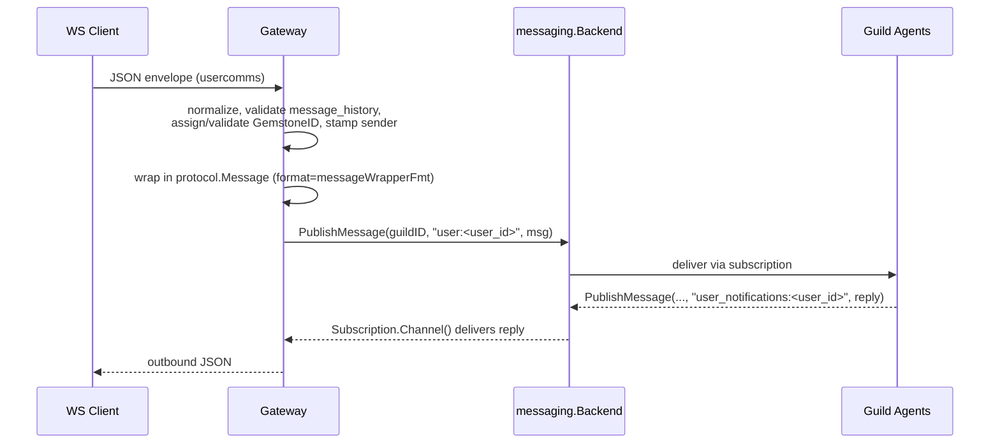

# Messaging & Protocol

Every agent, gateway socket, and CLI client in Forge speaks one wire format: `protocol.Message`. This page defines the envelope, the GemstoneID that gives it identity and order, the topic namespace that scopes it to a guild, and how the gateway and the messaging bus keep it consistent across Go and Python.

## The Message envelope

`protocol.Message` is the canonical unit of data-plane traffic. It is what gets published to the [messaging bus](architecture/), what the [gateway](architecture/) wraps client JSON into, and what agents exchange through the guild. Clients and agents route on a small, stable set of fields:

| Field | Purpose |
|---|---|
| `format` | Fully-qualified type name of the payload (e.g. `rustic_ai.core.messaging.core.message.Message`, `rustic_ai.forge.runtime.InfraEvent`). Consumers dispatch on this before touching `payload`. |
| `payload` | The actual content, typed by `format`. Carried as raw JSON so the bus never needs to understand it. |
| `sender` | An `AgentTag` (`{id, name}`) identifying who produced the message. The gateway always overwrites this server-side — clients cannot spoof it. |
| `topics` / `topic_published_to` | The logical topic(s) the message targets, and the bare (un-namespaced) topic it was actually stored under. |
| `thread` | Lineage of message IDs for a conversation thread. Defaults to `[message.ID]` when empty. |
| `message_history` | An ordered list of `ProcessEntry` records (agent tag, origin, result, processor, optional `from_topic`/`to_topics`/`reason`) describing how the message was processed as it moved through agents. |
| `id` | The message's `GemstoneID`, described below — both an identifier and a sort key. |
| `traceparent` | W3C trace-context string for stitching OpenTelemetry spans across the WebSocket boundary into guild execution. Falls back to the literal string `"no_tracing"` when no span is active — treat that sentinel (and empty string) as "no trace". |

!!! note "format + payload, not a tagged union"
    Forge deliberately keeps `payload` as opaque JSON keyed by a `format` string rather than a typed union. This is what lets the same envelope round-trip between Go and Python without either side needing the other's type definitions.

## GemstoneID: identity and ordering

Message IDs are 64-bit Gemstone IDs — a Snowflake-style scheme packing four fields into one integer:

- **Priority** — routing/QoS priority band
- **Timestamp** — milliseconds since the Rustic epoch
- **MachineID** — 0–255, the producing node
- **SequenceNumber** — 0–4095, a per-millisecond counter for uniqueness under burst

Because the timestamp is embedded in the high bits, Gemstone IDs sort chronologically as plain integers. Both messaging backends rely on this: the Redis backend scores its per-topic ZSET by the embedded timestamp, and the NATS backend uses it as a JetStream `StartTime` hint for `GetMessagesSince`. Wherever two messages need to be ordered — merging history, deduplicating a stream, resolving `sinceID` queries — the code compares parsed Gemstone IDs with `protocol.Compare`, never wall-clock time or arrival order.

At the edge, ID minting follows one rule everywhere a client can supply its own ID: **accept it only if it's parseable and not more than 1000ms in the future**, otherwise mint a fresh server-side ID.

```go
id, ok := parseIncomingGemstoneID(userMsg["id"])
if !ok || id.Timestamp-(time.Now().UnixMilli()) > 1000 {
	id, _ = gemGen.Generate(priority)
}
```

This keeps clock-skewed or malicious clients from injecting IDs that would sort ahead of real traffic, while still letting well-behaved clients pre-assign an ID (useful for optimistic UI).

## Topics and guild-scoped namespacing

Topics are plain strings, but they are never stored bare — every topic is namespaced by guild:

```
namespace + ":" + topic       // namespace == guild_id
```

This mirrors the Python `MessagingInterface`, which internally prepends `{guild_id}:` to every topic name. `PublishMessage(ctx, namespace, topic, msg)` takes the *bare* topic and does the prefixing internally, but sets `msg.TopicPublishedTo` to the bare topic — so a message's own record of "where it landed" is guild-agnostic and portable.

### Well-known topics

| Topic | Traffic |
|---|---|
| `system_topic` | Guild-lifecycle control messages (e.g. `UserAgentCreationRequest`) |
| `guild_status_topic` | Guild manager health (`HealthCheckRequest` / `AgentsHealthReport`) |
| `infra_events_topic` | `InfraEvent` stream — guild/agent process lifecycle from the supervisor |
| `user_message_broadcast` | Broadcast conversational traffic, long-retention (60 days on NATS) |
| `default_topic` | Fallback topic for unaddressed traffic |

### Per-user topic families

Each connected user gets four topics, all keyed by `user_id`:

```go
func userTopic(u string) string                    { return fmt.Sprintf("user:%s", u) }
func userNotificationsTopic(u string) string        { return fmt.Sprintf("user_notifications:%s", u) }
func userSystemRequestsTopic(u string) string       { return fmt.Sprintf("user_system:%s", u) }
func userSystemNotificationsTopic(u string) string  { return fmt.Sprintf("user_system_notification:%s", u) }
```

`user:<id>` and `user_system:<id>` are **inbound** (client → guild); `user_notifications:<id>` and `user_system_notification:<id>` are **outbound** (guild → client). `user_notifications:` and `user_message_broadcast` also get special treatment on the NATS backend: any namespaced topic containing either substring gets a 60-day JetStream `MaxAge` instead of the default TTL, because notification history needs to survive long past a normal conversational message.

!!! tip "Guild scoping is structural, not a filter"
    Because the namespace prefix is applied at the storage layer, a socket subscribed to guild `g1` physically cannot see traffic published under guild `g2` — there's no shared topic space to leak across, even by topic-name collision.

## Normalize and initMessageDefaults: Python pydantic parity

Go's `encoding/json` and Python's pydantic disagree on some defaults — most importantly, a Go `nil` slice marshals as `null`, while pydantic models expect `[]`. Every message that Forge constructs (rather than merely relaying) is passed through `initMessageDefaults`, which:

1. Calls `Message.Normalize()` — derives `priority` and `timestamp` from the embedded Gemstone ID, and coerces list-typed fields (`topics`, `message_history`, etc.) from `nil` to `[]` so pydantic on the Python side never sees a `null` where it expects a list.
2. Defaults `Thread` to `[message.ID]` when the incoming thread is empty, so every message belongs to at least its own thread.

```go
wrapped := &protocol.Message{
	ID:      id.ToInt(),
	Topics:  protocol.TopicsFromString(userTopic(userID)),
	Sender:  protocol.AgentTag{ID: &senderID, Name: &userName},
	Format:  messageWrapperFmt,
	Payload: json.RawMessage(pBytes),
}
initMessageDefaults(wrapped)
```

Skipping this step is a common source of cross-language bugs: a message that looks fine in Go tooling can fail Python-side schema validation the moment a list field serializes as `null` instead of `[]`.

## The gateway: wrapping client JSON into canonical Messages

The [gateway](architecture/) is the only place raw, untrusted client JSON becomes a `protocol.Message`. It exposes two socket kinds per guild, and they wrap inbound traffic differently.



**usercomms** (conversational traffic) wraps the client's inner payload into a *nested* envelope: the outer `protocol.Message` has `format = rustic_ai.core.messaging.core.message.Message`, and the client's normalized JSON becomes its `payload`. It strictly validates `message_history` into `[]protocol.ProcessEntry` — any malformed entry drops the **whole** inbound message (not just the bad entry), matching Python pydantic's all-or-nothing validation. Thread handling also differs from syscomms: usercomms appends the new message ID onto the incoming thread rather than resetting it.

**syscomms** (system/health/infra traffic) publishes the client's `format` and `payload` directly — no wrapper envelope. It's stricter about admission: a message missing either `format` or a non-nil `payload` is silently dropped. It also resets `thread` to exactly `[current_message_id]` on every inbound message, rather than accumulating history.

Both socket kinds overwrite `sender` unconditionally — `user_socket:<user_id>` for usercomms, `sys_comms_socket:<user_id>` for syscomms — so no client can impersonate another identity on the bus.

Outbound subscriptions are asymmetric too: a usercomms socket subscribes to exactly one topic (`user_notifications:<user_id>`), while a syscomms socket subscribes to three at once (`user_system_notification:<user_id>`, `guild_status_topic`, `infra_events_topic`), so syscomms clients must demux by `format` and sometimes `topic_published_to`.

```go
// syscomms subscribes to three outbound families and kicks a health check on connect
sub, err := msgClient.Subscribe(ctx, guildID,
	userSystemNotificationsTopic(userID), guildStatusTopic, infraEventsTopic)

healthCheck := &protocol.Message{
	ID:      healthCheckGemID.ToInt(),
	Topics:  protocol.TopicsFromSlice([]string{guildStatusTopic}),
	Sender:  protocol.AgentTag{ID: &socketSenderID},
	Format:  healthCheckFmt, // rustic_ai...HealthCheckRequest
	Payload: json.RawMessage(payloadBytes),
}
_ = msgClient.PublishMessage(ctx, guildID, guildStatusTopic, healthCheck)
```

Route registration ties both kinds to a guild ID and user ID in the path:

```go
router.GET("/ws/guilds/:id/usercomms/:user_id/:user_name",
	wrapHTTPWithPathValues(gateway.UserCommsHandler(s.msgClient, s.store, gemGen), "id", "user_id", "user_name"))
router.GET("/ws/guilds/:id/syscomms/:user_id",
	wrapHTTPWithPathValues(gateway.SysCommsHandler(s.msgClient, s.store, gemGen), "id", "user_id"))
```

There is also a proxy-compatible wire shape (`WireShapeProxyCompat`) for the legacy local Rustic UI, served under `/rustic/ws/...`. It reshapes the same canonical envelope for a UI-friendly JSON structure (`payload`→`data`, `thread`→`threads`, etc.) but carries the identical underlying `protocol.Message` semantics described above — see the gateway's proxy shaping layer for the full field mapping.

## The ZMQ bridge: exposing the Go bus to Python agents

Agents in Forge run as Python subprocesses, but the messaging bus lives in the Go supervisor. Rather than giving Python direct Redis/NATS credentials, the supervisor's `AgentMessagingBridge` (`supervisor/messaging_bridge.go`) exposes the `messaging.Backend` interface over a ZeroMQ **PAIR** socket — IPC (Unix socket) by default, or TCP.

The bridge speaks a small JSON envelope protocol. Each request names an `op`; the bridge translates it into the corresponding `Backend` call and, for subscriptions, streams live events back as `event`/`deliver` envelopes:

| Op | Backend call |
|---|---|
| `ping` | liveness check |
| `publish` | `PublishMessage` |
| `subscribe` | `Subscribe` (opens a live stream of `deliver` events) |
| `unsubscribe` | closes the subscription |
| `get_messages` | `GetMessagesForTopic` |
| `get_since` | `GetMessagesSince` |
| `get_next` | next message after a cursor |
| `get_by_id` | `GetMessagesByID` |
| `cleanup` | tears down bridge-held resources for the process |

On the Python side, this bridge is what `SupervisorZmqMessagingBackend` talks to — distributed Python agents never open a Redis or NATS connection themselves. The IPC socket path is a SHA-1 digest of `workDir | guildID | agentID` (to stay under Unix socket path-length limits), rooted at `/tmp/forge-zmq` by default and overridable via `FORGE_ZMQ_DIR`.

!!! note "Backward compatibility built into the bridge"
    `get_by_id` accepts either the current `msg_ids` field or the legacy `message_ids` field, and `publish` payloads may arrive as either a JSON object or a JSON-string-encoded object — the bridge normalizes both, so older Python client versions keep working against a newer Go supervisor.

## How it all fits together

- **Identity and order** come from `protocol.GemstoneID` and `protocol.Compare` — shared by the gateway, both messaging backends, and the bridge.
- **Scope** comes from guild-ID namespacing — applied once, at `PublishMessage`, and inherited by every subscriber.
- **Cross-language consistency** comes from `Normalize`/`initMessageDefaults` on the Go side matching pydantic's expectations on the Python side.
- **Transport** is backend-agnostic: the same `protocol.Message` flows over Redis pub/sub + ZSETs or NATS core pub/sub + JetStream, selected once at server startup (see [Messaging Bus](architecture/)).
- **Process boundary** is bridged by ZMQ, so Python agents get the same envelope and topic semantics as native Go consumers without ever touching the underlying bus credentials.

For how these envelopes are actually stored and replayed, see the messaging bus internals; for how sockets are upgraded and routed, see the gateway page.
