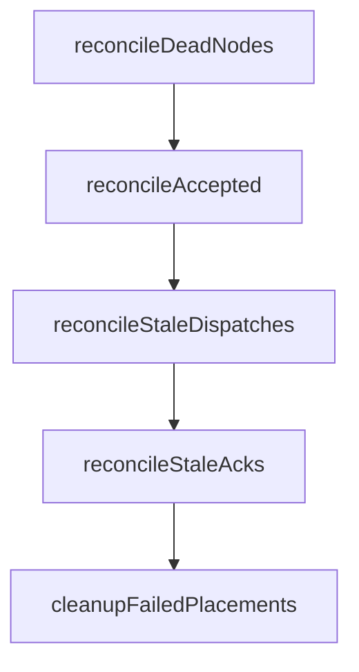

# Placement & Reconciliation

Every agent spawn in Forge is a two-phase commit: accept fast, place in the background, and heal continuously. The `PlacementMap` records what should be running where, and the `Reconciler` is the leader-gated loop that keeps reality converging on that record even when nodes die, messages go missing, or launches stall.

## The AgentPlacement record

`scheduler.GlobalPlacementMap` is an in-memory map keyed on `"guildID:agentID"`, guarded by an RWMutex. Each entry is an `AgentPlacement`:

- `GuildID`, `AgentID`, `NodeID` — identity and current binding.
- `SpawnState` — where the spawn is in its lifecycle (below).
- `AcceptedAt`, `DispatchedAt`, `AckedAt`, `PlacedAt` — timestamps stamped at each transition, used by the reconciler to detect staleness.
- `Attempts` — incremented on every dispatch, compared against `MaxAttempts`.
- `Payload []byte` — the original, byte-for-byte `SpawnRequest`, kept so the placement can be replayed exactly as a fresh spawn if it needs to be re-enqueued.

!!! note "In-memory, not durable"
    The PlacementMap lives only in process memory. A control-plane/leader restart loses accepted/dispatched tracking. Recovery then leans on the `AgentStatusStore` (Redis/NATS, TTL'd) and the idempotency gates described below, rather than on replaying the PlacementMap.

### The SpawnState machine

```
accepted → dispatched → acknowledged → running
                                   ↘
                                    failed  (terminal, after MaxAttempts)
```

Transitions are exposed as methods on the placement map, each stamping the relevant timestamp:

| Method | Effect |
|---|---|
| `MarkAccepted` | Queued for background placement (sets/refreshes `AcceptedAt`) |
| `MarkDispatched` | Increments `Attempts`; resets to `1` if the placement was previously `failed` |
| `MarkAcknowledged` | Worker confirmed receipt (`AckedAt`) |
| `MarkRunning` | Agent process confirmed up (`PlacedAt`) |
| `MarkFailed` | Terminal — exhausted retries |

Query helpers feed the reconciler directly: `GetAccepted`, `GetStaleDispatches(timeout)`, `GetStaleAcks(timeout)`, `GetFailedOlderThan(age)`, `AgentsOnNode(nodeID)`, `IsActivelyTracked` (true for `accepted|dispatched|acknowledged|running`), plus `Find`, `Put`, `Remove`.

`IsActivelyTracked` is also the server's idempotency gate: `ControlQueueListener.OnSpawn` refuses to re-accept a spawn for an agent that's already accepted, dispatched, acknowledged, or running.

## Two-phase spawn: accept fast, place in the background

The server never places synchronously on the request path. `OnSpawn`:

1. Checks `IsActivelyTracked` — skip if already in flight.
2. Enriches the request (attaches guild messaging config and the full `GuildSpec` into `ClientProperties`, so DB-less workers can self-configure).
3. Sets `ResponseMode=none` and calls `MarkAccepted` with the serialized payload.
4. Acks the caller immediately ("spawn request accepted").
5. In a goroutine, calls `dispatchAcceptedSpawn`, which runs `Scheduler.Schedule`, calls `MarkDispatched`, and pushes the wrapped command to `forge:control:node:<nodeID>`.

If scheduling or the push fails, `dispatchAcceptedSpawn` reverts the placement to `MarkAccepted` — bumping `Attempts` — rather than failing the request outright. This defers the retry to the reconciler's `reconcileAccepted` phase instead of surfacing an error to the caller.

`ResponseMode=none` matters here: the synchronous caller was already acked at accept-time, so the eventual worker `SpawnResponse` is suppressed to avoid a duplicate reply.

## The Reconciler

`NewReconciler(registry, placementMap, transport, elector, statusStore, config)` builds a background loop that ticks every `ReconcileInterval`. On each tick:

```go
case <-ticker.C:
    if r.elector != nil && !r.elector.IsLeader() {
        continue
    }
    r.reconcile(ctx)
```

Reconciliation only runs on the elected leader — this is what prevents split-brain double-scheduling across multiple server replicas. See [Leader Election](../internals/leader-election/) for how leadership is acquired via Redis, Raft, or single-node mode.

### The five ordered phases

`reconcile` always runs these in the same order, every tick:

```go
r.reconcileDeadNodes(ctx)
r.reconcileAccepted(ctx)
r.reconcileStaleDispatches(ctx)
r.reconcileStaleAcks(ctx)
r.cleanupFailedPlacements()
```

The order is deliberate: dead nodes are evicted first so their orphans don't get double-counted by later phases; accepted placements that failed to dispatch are retried next; then the two staleness phases resolve delivery ambiguity; cleanup runs last and only touches terminal state.



### Timeouts and thresholds

All five phases are driven by one `ReconcilerConfig`:

```go
ReconcilerConfig{
    ReconcileInterval: 15 * time.Second,
    AckTimeout:        30 * time.Second,
    LaunchTimeout:     120 * time.Second,
    MaxAttempts:       5,
    DeadNodeTimeout:   15 * time.Second,
    FailedCleanupAge:  5 * time.Minute,
}
```

| Setting | Default | Governs |
|---|---|---|
| `ReconcileInterval` | 15s | How often the leader runs a full reconcile pass |
| `AckTimeout` | 30s | Dispatched placements older than this are "stale dispatches" |
| `LaunchTimeout` | 120s | Acknowledged placements older than this without reaching `running` are "stale acks" |
| `MaxAttempts` | 5 | Attempts allowed before a placement is marked `failed` |
| `DeadNodeTimeout` | 15s | Heartbeat silence before a node is declared dead and evicted |
| `FailedCleanupAge` | 5m | How long a `failed` placement lingers before cleanup removes it |

!!! warning "Two different heartbeat thresholds"
    The `NodeRegistry` treats a node unhealthy — invisible to the scheduler — after just **10s** of heartbeat silence (`IsHealthy`/`ListHealthy`). The reconciler doesn't declare it **dead** and evict it until **15s** (`DeadNodeTimeout`). Between 10s and 15s a node can't receive new placements but hasn't been reclaimed yet — this is expected, not a bug.

### Phase 1: dead nodes

`reconcileDeadNodes` scans the registry for nodes where `time.Since(LastHeartbeat) > DeadNodeTimeout`. For each one it logs `Detected dead node, reconciling orphaned agents`, then:

```go
orphans := r.placementMap.AgentsOnNode(nodeID)
r.registry.Deregister(nodeID)
for _, o := range orphans {
    r.placementMap.Remove(o.GuildID, o.AgentID)
    r.reenqueue(ctx, o)
}
```

`Deregister` happens before re-enqueuing so no new allocations land on the dead node while orphans are being redistributed.

### Phase 2: accepted

`reconcileAccepted` retries placements still sitting in `accepted` — the ones that reverted there after a failed `dispatchAcceptedSpawn` attempt (or that never got a first attempt scheduled). It re-runs the same schedule/dispatch path the initial spawn used.

### Phase 3: stale dispatches — cross-checking the AgentStatusStore

A placement can sit in `dispatched` past `AckTimeout` for two very different reasons: the queue message never arrived, or it arrived and the worker is just slow to acknowledge over the control plane. `reconcileStaleDispatches` disambiguates by consulting the distributed `AgentStatusStore` before assuming the worst:

```go
stale := r.placementMap.GetStaleDispatches(r.config.AckTimeout) // 30s
for _, p := range stale {
    status, err := r.statusStore.GetStatus(ctx, p.GuildID, p.AgentID)
    if err == nil && status != nil {
        if status.State == "starting" { r.placementMap.MarkAcknowledged(p.GuildID, p.AgentID); continue }
        if status.State == "running"  { r.placementMap.MarkRunning(p.GuildID, p.AgentID); continue }
    }
    if p.Attempts >= r.config.MaxAttempts { r.placementMap.MarkFailed(p.GuildID, p.AgentID); continue }
    r.placementMap.Remove(p.GuildID, p.AgentID)
    r.reenqueue(ctx, p)
}
```

The worker writes `state="starting"` to the StatusStore (with a 120s TTL) the instant it accepts the launch — before the control-plane ack even lands back. So if the store says `"starting"`, the reconciler promotes the placement to `Acknowledged` in place; if it says `"running"`, it jumps straight to `Running`. Either way, **no message is re-sent** — this is exactly what prevents a double-launch when the ack itself was merely delayed or lost in transit, not the underlying spawn.

Only when the StatusStore has no record (or an error) does the reconciler treat the dispatch as truly lost, falling through to the attempt-count check.

### Phase 4: stale acks

`reconcileStaleAcks` mirrors phase 3 for placements stuck in `acknowledged` past `LaunchTimeout` (120s) — the worker confirmed receipt (wrote `"starting"`) but never followed up with `"running"`, e.g. because it crashed mid-launch. Same StatusStore cross-check, same fall-through to attempt-count and re-enqueue logic.

### Phase 5: cleanup failed

`cleanupFailedPlacements` removes placements that have been `failed` for longer than `FailedCleanupAge` (5m). Failed placements aren't deleted immediately on becoming terminal — they linger so operators and telemetry have a window to observe them before they disappear.

## Revert-to-accepted retry and the terminal failed state

Every retryable failure path in the system funnels through the same pattern: **revert to `accepted` (or re-enqueue), bump `Attempts`, and let the reconciler's next tick pick it up** — rather than failing the caller's request synchronously. This applies to:

- `dispatchAcceptedSpawn` reverting to `MarkAccepted` when `Schedule` or the push to the node queue fails.
- `reconcileStaleDispatches` and `reconcileStaleAcks` removing and re-enqueuing when the StatusStore shows no progress.

`MarkDispatched` itself resets `Attempts` to `1` if the placement had previously been `failed`, so a placement that somehow gets revived after failing starts its retry budget fresh. But under normal staleness handling, `Attempts` only ever climbs — once it reaches `MaxAttempts` (5), the placement is marked `failed` and stops being retried. It then sits, visible, until `cleanupFailedPlacements` reaps it after `FailedCleanupAge` (5m).

## Why re-enqueue goes through the global queue

`reenqueue` doesn't push directly to a specific node's queue. It unmarshals the placement's stored `Payload`, re-wraps it as `{"command":"spawn","payload":...}`, and pushes it back onto the **global** queue, `forge:control:requests` — the exact same queue a brand-new spawn request arrives on.

This is deliberate, not incidental:

- **Capacity is re-accounted naturally.** The re-enqueued spawn re-runs `Scheduler.Schedule` from scratch, which calls `ListHealthy()` and `AllocateCapacity` against current node state. A dead node's `UsedCapacity` has already vanished via `Deregister`, so the scheduler simply sees more room elsewhere — no special-case bookkeeping needed.
- **Recovery is indistinguishable from an initial spawn.** Because the byte-for-byte original `Payload` is replayed, the second attempt goes through the identical accept → schedule → dispatch path as the first, including the same idempotency gates (`IsActivelyTracked` on the server, the cross-node StatusStore gate on the worker).
- **It naturally spreads load.** The scheduler's scoring — `remMem + remCPUs*1024`, favoring the node with the most free capacity — means a re-enqueued agent is likely to land on a different, healthier node without any dedicated anti-affinity logic.

```go
func (s *Scheduler) score(n *NodeState, reqCPUs, reqMem, reqGPUs float64) float64 {
    remCPUs := n.TotalCapacity.CPUs - n.UsedCapacity.CPUs
    remMem := n.TotalCapacity.Memory - n.UsedCapacity.Memory
    remGPUs := n.TotalCapacity.GPUs - n.UsedCapacity.GPUs
    if remCPUs >= reqCPUs && remMem >= reqMem && remGPUs >= reqGPUs {
        return remMem + (remCPUs * 1024)
    }
    return -1
}
```

## Worked example: a reconciler tick

Say a node crashes mid-tick with three agents on it, one of which was also stuck `dispatched` past `AckTimeout`:

```
tick @ t=15s (leader):
  reconcileDeadNodes:
    node-7 last heartbeat 16s ago > DeadNodeTimeout(15s) → dead
    orphans = AgentsOnNode(node-7) = [g1:a1, g1:a2, g2:a5]
    Deregister(node-7)
    for each orphan: Remove + reenqueue(payload) -> forge:control:requests

  reconcileAccepted:
    (any placements stuck in accepted from a prior failed dispatch get retried)

  reconcileStaleDispatches:
    g3:a9 dispatched 31s ago > AckTimeout(30s)
      GetStatus(g3, a9) -> {state: "starting", node_id: "node-3"}
      -> MarkAcknowledged(g3, a9)   # no re-send

  reconcileStaleAcks:
    (none this tick)

  cleanupFailedPlacements:
    g0:a0 failed 5m12s ago > FailedCleanupAge(5m) -> removed
```

Note that `g1:a1`, `g1:a2`, and `g2:a5` — orphaned by the dead node — are handled entirely in phase 1 and never touch phases 3 or 4, because they were already `Remove`d before those phases run.

## Related pages

- [Leader Election](../internals/leader-election/) for how the reconciler's single-writer guarantee is enforced.
- [Control Plane & Transports](distributed-control-plane/) for the Redis/NATS queue mechanics behind `Push`/`Pop`.
- [Quickstart](../getting-started/quickstart/) for standing up a cluster with node registration and heartbeats.
