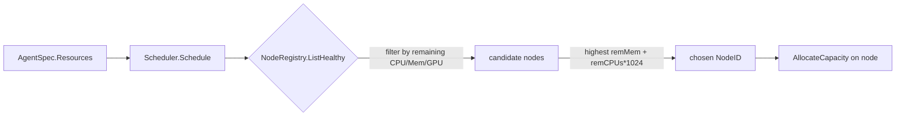

# Agents

An agent is the unit of work inside a guild: a Python class, a topic subscription, a resource budget, and — once scheduled — a running process. This page covers how an `AgentSpec` is declared, how it's normalized and scheduled, and how it turns into a live worker process running `agent_runner` under `uvx`.

## AgentSpec

Every agent in a [guild](guilds/) is declared as a `protocol.AgentSpec` (`protocol/spec.go:670`). The spec travels unchanged from the authored YAML/JSON through the store and into the Python runtime — it is never rebuilt or re-derived along the way.

| Field | Type | Notes |
|---|---|---|
| `ID` | string | Optional at authoring time; normalized during bootstrap (see below). |
| `Name` | string | Required, unique within the guild. |
| `Description` | string | Required. |
| `ClassName` | string | **Required.** Python dotted path to the agent implementation, e.g. `rustic_ai.agents.EchoAgent`. |
| `AdditionalTopics` | []string | Extra topics the agent subscribes to beyond the guild default topic. |
| `Properties` | map | Arbitrary agent configuration passed through to the Python class. |
| `ListenToDefaultTopic` | bool | Defaults to `true`. Set `false` for agents (like the GuildManagerAgent) that only care about specific topics. |
| `ActOnlyWhenTagged` | bool | Defaults to `false`. When `true`, the agent only reacts to messages that explicitly tag it. |
| `Predicates` | — | Filters that gate whether the agent acts on a given message. |
| `DependencyMap` | map[string]`DependencySpec` | Per-agent dependency resolvers (ClassName, ProvidedType, Properties), merged with guild-level and forge-home defaults during bootstrap. |
| `AdditionalDependencies` | []string | Extra dependency keys required beyond `DependencyMap`. |
| `Resources` | `ResourceSpec` | `NumCPUs`, `NumGPUs` (both `*float64`), `CustomResources` (e.g. `memory`). Drives scheduler placement. |
| `QOS` | — | Quality-of-service hint for the agent. |

```yaml
agents:
  - name: Summarizer
    description: Summarizes incoming documents
    class_name: rustic_ai.agents.SummarizerAgent
    additional_topics:
      - documents_topic
    listen_to_default_topic: false
    act_only_when_tagged: true
    resources:
      num_cpus: 1.5
      num_gpus: 0
      custom_resources:
        memory: 2048
    properties:
      model: gpt-oss
      max_tokens: 4096
```

!!! note "Resources are opt-in"
    An `AgentSpec` with no `Resources` block still schedules — the scheduler treats unset CPU/GPU/memory requests as zero and places the agent on any healthy node. Set `Resources` explicitly for agents that need a real capacity reservation.

Agents are authored either directly in guild YAML/JSON or via the fluent `AgentBuilder` (`guild/agent_builder.go`), which auto-generates a short-UUID `ID` and validates name, description, class name, and resources in `BuildSpec()`.

## Agent ID normalization

Agent IDs are not guaranteed unique across guilds at authoring time, so Forge normalizes them during [guild bootstrap](guilds/). Empty or default `a-N` agent IDs are rewritten to:

```
<guildID>#a-N
```

One agent is special-cased: the system `GuildManagerAgent` (GMA) always gets the id:

```
<guildID>#manager_agent
```

The GMA is spawned by `EnqueueGuildManagerSpawn` with `ClassName` set to the constant `guild.GuildManagerClassName` (`rustic_ai.forge.agents.system.guild_manager_agent.GuildManagerAgent`), `AdditionalTopics` of `system_topic`, `heartbeat_topic`, and `guild_status_topic`, and `ListenToDefaultTopic: false` — it orchestrates the guild rather than reacting to normal traffic.

```go
spawnReq := protocol.SpawnRequest{
    RequestID: "bootstrap-" + spec.ID,
    GuildID:   spec.ID,
    AgentSpec: protocol.AgentSpec{
        ID:        spec.ID + "#manager_agent",
        Name:      spec.Name + " Manager",
        ClassName: GuildManagerClassName,
        AdditionalTopics: []string{"system_topic", "heartbeat_topic", "guild_status_topic"},
        ListenToDefaultTopic: boolPtr(false),
    },
    ClientType: "forge",
}
```

## Resources drive scheduling

`AgentSpec.Resources` is the only input the [scheduler](distributed-scheduling/) uses to place an agent. `Scheduler.Schedule(agentSpec protocol.AgentSpec)` reads:

- `Resources.NumCPUs` and `Resources.NumGPUs` (both `*float64`)
- `Resources.CustomResources["memory"]` (float64)

against every healthy node's `TotalCapacity` minus `UsedCapacity`. It filters to nodes with enough remaining CPU, memory, and GPU, then picks the node with the **highest** `remMem + remCPUs*1024` score — a most-free / spread-load bias, not tight bin-packing. On success it immediately calls `AllocateCapacity` on the winning node.

If no node has enough headroom, scheduling fails with `no node with sufficient capacity [...]`; if the cluster has no healthy nodes at all, it fails with `no healthy nodes available in the cluster`.



!!! tip "Under-provisioning shows up as placement errors, not silent queuing"
    If every node lacks capacity for a requested `NumCPUs`/`NumGPUs`/memory combination, the spawn is retried by the [reconciler](distributed-scheduling/) rather than hanging — but it will keep failing until capacity frees up or a new node registers.

## From spec to process

Once an agent is scheduled, it becomes a real OS process through a fixed pipeline:

```
OnSpawn -> handleSpawn -> BuildAgentEnv -> supervisor.Launch (agent_runner via uvx)
```

1. **`OnSpawn`** — The control-plane's `ControlQueueListener.OnSpawn` (`agent/server.go`) receives the spawn request off `forge:control:requests`, idempotency-gates on `IsActivelyTracked`, enriches it with the guild's messaging config and full `guild_spec`, marks it `Accepted`, and acks the caller immediately. A background goroutine then calls `Scheduler.Schedule`, marks the placement `Dispatched`, and pushes the wrapped command onto `forge:control:node:<nodeID>`.
2. **`handleSpawn`** — On the chosen worker, `ControlQueueHandler.handleSpawn` (`control/handler.go`) applies a cross-node idempotency gate against the `AgentStatusStore`, writes `state: "starting"` with a 120s TTL as a distributed ack, looks up the agent's class in the agent registry, resolves the guild spec and organization, and picks a per-org supervisor via a `SupervisorFactory`.
3. **`BuildAgentEnv`** — The resolved `GuildSpec` and `AgentSpec` are serialized into environment variables (including `FORGE_GUILD_JSON`) so the Python process can self-configure without needing direct DB access.
4. **`supervisor.Launch`** — The `ProcessSupervisor` execs the resolved command — for a `uvx`-runtime agent, this is `uvx --with <FORGE_PYTHON_PKG> ... python -m rustic_ai.forge.agent_runner`. On success it polls up to 5×100ms for a real PID and returns `SpawnResponse{NodeID, PID}`.

## The agent registry

The agent **registry** (`registry/registry.go`) is distinct from the scheduler's `NodeRegistry` — it's the catalog of runnable agent *templates*, keyed by `ClassName` and loaded from YAML (`FORGE_AGENT_REGISTRY` env var, defaulting to `conf/forge-agent-registry.yaml`).

Each `AgentRegistryEntry` declares how to actually run that class:

- **`RuntimeType`** — one of `uvx`, `docker`, or `binary`.
- Package/image/executable reference, plus `WithDependencies` (extra Python packages for `uvx`).
- **`Secrets`** and **`OAuth`** the agent needs injected at launch.
- **`Network`** — an egress allowlist.
- **`Filesystem`** — bind mounts the agent requires.

```yaml
# conf/forge-agent-registry.yaml
- class_name: rustic_ai.agents.SummarizerAgent
  runtime_type: uvx
  with_dependencies:
    - rustic-ai-agents-summarizer
  secrets:
    - OPENAI_API_KEY
  network:
    allow:
      - api.openai.com
  filesystem:
    - mount: /data/documents
      read_only: true
```

`Lookup(className)` resolves an entry, and `ResolveCommand(entry)` builds the OS exec argv. For `uvx` this expands to something like:

```bash
uvx --with rustic-ai-agents-summarizer --with $FORGE_PYTHON_PKG \
  python -m rustic_ai.forge.agent_runner
```

`uv.go` handles locating or bootstrapping the `uvx` binary itself: bundled next to the `forge` executable, then `PATH`, then `~/.forge/bin`, then `FORGE_UVX_PATH`, falling back to downloading `astral-sh/uv` if none is found.

## Agent statuses

Agents move through a small status machine, tracked both locally (guild store) and across the cluster (`AgentStatusStore`):

**Store-level `AgentStatus`** (per `AgentModel` row): `not_launched`, `starting`, `running`, `stopped`, `error`, `deleted`. Bootstrap sets every agent to `not_launched` before the GMA spawn is enqueued.

**Cluster-level `AgentStatusStore`** (`supervisor/`) is the distributed source of truth the [reconciler](distributed-scheduling/) consults to disambiguate "message delivered" from "process actually running." It's keyed on `forge:agent:status:<guildID>:<agentID>` (Redis, or a NATS KV-backed implementation) and stores an `AgentStatusJSON{State, NodeID, PID, Timestamp}`:

- `handleSpawn` writes `state: "starting"` with a 120s TTL as soon as it accepts the launch — this doubles as the cross-node idempotency gate that stops the same agent being launched twice on different nodes.
- Once the Python process reports in, state advances to `"running"`.
- The reconciler's `reconcileStaleDispatches`/`reconcileStaleAcks` phases read this store: a placement stuck as `Dispatched` gets promoted to `Acknowledged` if the store shows `"starting"`, or to `Running` if it shows `"running"` — otherwise it's re-enqueued (or failed after `MaxAttempts`).

This split matters operationally: the guild store's `AgentStatus` reflects what the control plane *believes* happened at bootstrap/relaunch time, while the `AgentStatusStore` reflects live, TTL'd, cross-node truth that survives control-plane restarts better than the in-memory `PlacementMap` does.

!!! warning "Placement state is in-memory only"
    The scheduler's `PlacementMap` (accepted/dispatched/acknowledged/running) lives in process memory and is lost on a control-plane restart. Recovery leans on the TTL'd `AgentStatusStore` and the idempotency gates, not on replaying `PlacementMap` state — don't rely on placement history surviving a restart.

## Related pages

- [Guilds](guilds/) — how an `AgentSpec` fits into a full `GuildSpec` and the bootstrap pipeline.
- [Scheduler](distributed-scheduling/) — placement, reconciliation, and leader election in depth.
- [Quickstart](../getting-started/quickstart/) — spin up your first guild and agent.
