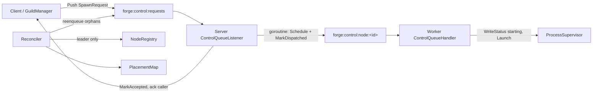
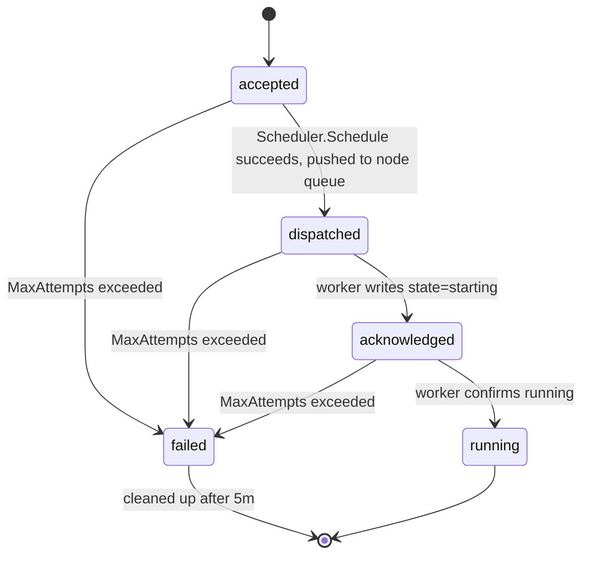

# Distributed Scheduling & Placement

Forge spreads guild agents across a fleet of worker nodes, tracking every spawn from acceptance to a running process — and repairing the cluster when a node dies mid-flight. This page covers how nodes are registered, how placement decisions are made, and how the spawn lifecycle is tracked and recovered.

## The pieces

Four collaborating components make up the scheduling subsystem, all in `forge-go`:

- **`NodeRegistry`** — tracks health and capacity of every worker node.
- **`Scheduler`** — picks the best node for a new agent.
- **`PlacementMap`** — the in-memory record of agent→node bindings and spawn state.
- **`Reconciler`** — a leader-gated background loop that evicts dead nodes and retries stuck spawns.

Control commands (spawn, stop) flow between these components over pluggable queue transports — Redis lists (`BRPOP`/`LPUSH`) or NATS JetStream work-queue streams — sitting behind a common `control.ControlTransport` interface.



## NodeRegistry: health and capacity

`scheduler.GlobalNodeRegistry` is an in-memory `map[string]*NodeState` guarded by a `RWMutex`. Each `NodeState` tracks:

- `NodeID`
- `TotalCapacity` / `UsedCapacity` — both `ResourceCapacity{CPUs, Memory, GPUs int}`
- `LastHeartbeat time.Time`

A node is registered by calling the API once at startup, then keeps itself alive with periodic heartbeats:

```bash
# node client registers capacity, then heartbeats every few seconds
curl -X POST $SERVER/nodes/register \
  -d '{"node_id":"worker-3","capacity":{"cpus":8,"memory":16384,"gpus":0}}'

curl -X POST $SERVER/nodes/worker-3/heartbeat
```

Health is purely time-based: `IsHealthy` / `ListHealthy` consider a node healthy only while `time.Since(LastHeartbeat) < 10s`. If the node client's heartbeat comes back `404` (the registry has forgotten it), the client re-registers rather than erroring out:

```go
hbURL := fmt.Sprintf("%s/nodes/%s/heartbeat", config.ServerURL, config.NodeID)
if r, err := client.Do(req); err == nil {
    if r.StatusCode == http.StatusNotFound {
        // registry evicted us; re-register the node
        _ = registerNode(ctx, config.ServerURL, body)
    }
}
```

!!! warning "Two different timeouts, on purpose"
    The registry marks a node unhealthy (invisible to the scheduler) after **10s** of heartbeat silence. The reconciler doesn't declare it *dead* and reclaim its agents until **15s** (`DeadNodeTimeout`). In that 5-second window the node is skipped for new placements but its orphans haven't been re-enqueued yet.

## Scheduler: most-free placement

`scheduler.GlobalScheduler.Schedule(agentSpec protocol.AgentSpec) (string, error)` reads the request from `agentSpec.Resources` — a `protocol.ResourceSpec{NumCPUs *float64, NumGPUs *float64, CustomResources["memory"] float64}` — filters to healthy nodes with enough remaining capacity, and picks a winner.

This is often described as "best-fit," but it's actually the opposite: a **worst-fit / most-free spread**. Among nodes that satisfy the request, the scheduler scores each by how much slack it has left and picks the highest score — biasing load toward the emptiest healthy node in the cluster.

```go
for _, n := range nodes {
    remCPUs := n.TotalCapacity.CPUs - n.UsedCapacity.CPUs
    remMem := n.TotalCapacity.Memory - n.UsedCapacity.Memory
    remGPUs := n.TotalCapacity.GPUs - n.UsedCapacity.GPUs
    if remCPUs >= reqCPUs && remMem >= reqMem && remGPUs >= reqGPUs {
        score := remMem + (remCPUs * 1024)
        if bestNode == "" || score > bestFitScore {
            bestFitScore = score
            bestNode = n.NodeID
        }
    }
}
```

The formula `remMem + remCPUs*1024` mixes raw memory (MB) with CPU count scaled by 1024, so CPU headroom dominates the score unless memory differences are large. On success, the scheduler immediately calls `AllocateCapacity` on the winning node — so a burst of spawns fans out correctly instead of racing onto the same node before any heartbeat/usage update lands.

Failure modes are explicit and distinguishable:

| Condition | Error |
|---|---|
| No node is currently healthy | `no healthy nodes available in the cluster` |
| Healthy nodes exist but none have room | `no node with sufficient capacity [...]` |

Placement is wrapped in a telemetry timer (placement-duration) and an error counter, so scheduling latency and failure rate are both observable out of the box.

## PlacementMap: the spawn state machine

`scheduler.GlobalPlacementMap` keys agents as `"guildID:agentID"` and stores an `AgentPlacement` for each: `GuildID`, `AgentID`, `NodeID`, a `SpawnState`, timestamps (`AcceptedAt`/`DispatchedAt`/`AckedAt`/`PlacedAt`), an `Attempts` counter, and the original `Payload []byte` — the exact bytes of the `SpawnRequest`, kept so the agent can be rescheduled byte-for-byte identically later.

The state machine:



Transition methods: `MarkAccepted`, `MarkDispatched` (increments `Attempts`, resets to 1 if the placement was previously failed), `MarkAcknowledged`, `MarkRunning`, `MarkFailed`. Query helpers — `GetAccepted`, `GetStaleDispatches(timeout)`, `GetStaleAcks(timeout)`, `GetFailedOlderThan(age)`, `AgentsOnNode(nodeID)`, `IsActivelyTracked`, `Find`, `Put`, `Remove` — feed directly into the reconciler's five phases.

!!! note "This is in-memory, not durable"
    `GlobalPlacementMap` lives in process memory. A control-plane/leader restart loses all accepted/dispatched tracking. Recovery leans on the TTL'd `AgentStatusStore` in Redis/NATS and the idempotency gates described below — not on replaying the placement map.

## Two-phase spawn: accepted, then dispatched

A spawn is never placed synchronously on the request path. The server's `ControlQueueListener.OnSpawn` handler:

1. Checks `IsActivelyTracked` — if the guild/agent pair is already accepted, dispatched, acknowledged, or running, the duplicate request is dropped.
2. Enriches the request: attaches the guild's messaging config and the full `guild_spec` into `ClientProperties`, so DB-less workers can self-configure without a round trip.
3. Forces `ResponseMode = "none"` — because the caller is about to get an immediate ack, the eventual worker `SpawnResponse` would be a duplicate reply.
4. Calls `MarkAccepted` with the serialized payload and **acks the caller immediately** ("spawn request accepted").
5. In a goroutine, runs `dispatchAcceptedSpawn`: calls `Scheduler.Schedule`, then `MarkDispatched`, then pushes the wrapped command onto `forge:control:node:<nodeID>`.

If scheduling or the push fails, the placement reverts to `MarkAccepted` (bumping `Attempts`) instead of failing the request — the reconciler's `reconcileAccepted` phase will retry it on the next tick.

The message on the wire is a small envelope, `ControlMessageWrapper`:

```json
{
  "command": "spawn",
  "payload": {
    "guild_id": "guild-042",
    "agent_id": "summarizer-7",
    "agent_spec": {
      "resources": {
        "num_cpus": 1.0,
        "num_gpus": 0.0,
        "custom_resources": { "memory": 512.0 }
      }
    },
    "response_mode": "none"
  }
}
```

This exact envelope shape is what gets pushed both for a fresh spawn (onto the global queue) and for a reconciler re-enqueue after node death — recovery is indistinguishable from a brand-new request.

## Control queues

Two queue keys carry every control command:

| Queue | Scope | Who reads it |
|---|---|---|
| `forge:control:requests` | Global | Server's `ControlQueueListener` |
| `forge:control:node:<node_id>` | Per-node | That node's `ControlQueueHandler` |

Both are backed by the same transport-agnostic `control.ControlTransport`: Redis lists via `BRPOP`/`LPUSH`, or NATS JetStream work-queue streams (`CTRL_<sanitized-key>`, 5m `MaxAge`, `AckSync` per message). Responses, when used, go to `forge:control:response:<request_id>` (Redis) or the shared `CTRL_RESPONSES` stream (NATS, 60s `MaxAge`).

```go
func (t *RedisControlTransport) Push(ctx context.Context, queueKey string, payload []byte) error {
    return t.rdb.LPush(ctx, queueKey, payload).Err()
}

func (t *RedisControlTransport) Pop(ctx context.Context, queueKey string, timeout time.Duration) ([]byte, error) {
    res, err := t.rdb.BRPop(ctx, timeout, queueKey).Result()
    if errors.Is(err, redis.Nil) {
        return nil, nil // timeout, not an error
    }
    // res[1] is the payload
}
```

On the worker side, `control.ControlQueueHandler.handleSpawn` pops from its own node queue, emits an infra event, resolves the agent class from the `registry.Registry`, builds the environment, picks a per-org supervisor via `SupervisorFactory`, and calls `sup.Launch`. For `ProcessSupervisor` it polls up to 5×100ms for a real PID before replying with `SpawnResponse{NodeID, PID}`. `handleStop` follows the same org-resolution path into `sup.Stop`.

## Idempotency: three layers deep

Redelivery is expected — queue pops can be retried, reconciler re-enqueues reuse the same payload, and clients may resend on timeout. Forge guards against duplicate launches at three independent layers:

1. **Server: `IsActivelyTracked`.** `OnSpawn` refuses to re-accept a guild/agent pair that's already `accepted | dispatched | acknowledged | running`.
2. **Worker: cross-node `StatusStore` gate.** Before launching, `handleSpawn` checks the distributed `AgentStatusStore` for an existing `running`/`starting` status on a *different* node, and skips the launch if found:

    ```go
    existing, err := h.statusStore.GetStatus(ctx, req.GuildID, req.AgentSpec.ID)
    if err == nil && existing != nil &&
        (existing.State == "running" || existing.State == "starting") &&
        existing.NodeID != "" && existing.NodeID != h.nodeID {
        // agent already active on another node -> skip launch
        return
    }
    _ = h.statusStore.WriteStatus(ctx, req.GuildID, req.AgentSpec.ID,
        &supervisor.AgentStatusJSON{State: "starting", NodeID: h.nodeID, Timestamp: time.Now()},
        120*time.Second)
    ```

3. **`MarkDispatched` attempt counting.** Every dispatch attempt increments `Attempts` on the placement; once `Attempts >= MaxAttempts` (5), the reconciler marks the placement `failed` instead of retrying indefinitely.

Together these mean a redelivered spawn message is inert almost everywhere it can land: dropped at accept-time if already tracked, skipped at launch-time if already running elsewhere, and capped in retry count if genuinely stuck.

## Reconciliation and recovery

The `Reconciler` (`NewReconciler(registry, placementMap, transport, elector, statusStore, config)`) ticks every `ReconcileInterval` (15s default) and, on each tick, **skips entirely unless it holds cluster leadership** — reconciliation is strictly single-writer:

```go
case <-ticker.C:
    if r.elector != nil && !r.elector.IsLeader() {
        continue
    }
    r.reconcile(ctx)
```

Each tick runs five phases, in order:

```go
r.reconcileDeadNodes(ctx)
r.reconcileAccepted(ctx)
r.reconcileStaleDispatches(ctx)
r.reconcileStaleAcks(ctx)
r.cleanupFailedPlacements()
```

**Dead-node eviction and orphan re-enqueue.** A node is dead once `time.Since(LastHeartbeat) > DeadNodeTimeout` (15s). For each dead node, the reconciler gathers its agents via `AgentsOnNode`, `Deregister`s the node (so it stops absorbing new placements), then removes and re-enqueues every orphan:

```go
for nodeID, state := range r.registry.nodes {
    if now.Sub(state.LastHeartbeat) > r.config.DeadNodeTimeout {
        deadNodes = append(deadNodes, nodeID)
    }
}
// ...
orphans := r.placementMap.AgentsOnNode(nodeID)
r.registry.Deregister(nodeID)
for _, o := range orphans {
    r.placementMap.Remove(o.GuildID, o.AgentID)
    r.reenqueue(ctx, o) // Push {command:spawn, payload} to forge:control:requests
}
```

Because the dead node is deregistered first, its `UsedCapacity` disappears from the registry, and the re-enqueued spawn runs through `Schedule`/`AllocateCapacity` exactly like a first-time request — landing on a fresh healthy node with correctly accounted capacity.

**Stale dispatch/ack recovery.** A message being delivered and an agent actually launching are different facts, and only the distributed `AgentStatusStore` can tell them apart after a node hiccup:

```go
stale := r.placementMap.GetStaleDispatches(r.config.AckTimeout) // 30s
for _, p := range stale {
    status, err := r.statusStore.GetStatus(ctx, p.GuildID, p.AgentID)
    if err == nil && status != nil {
        if status.State == "starting" { r.placementMap.MarkAcknowledged(p.GuildID, p.AgentID); continue }
        if status.State == "running"  { r.placementMap.MarkRunning(p.GuildID, p.AgentID); continue }
    }
    if p.Attempts >= r.config.MaxAttempts { r.placementMap.MarkFailed(p.GuildID, p.AgentID); continue }
    r.placementMap.Remove(p.GuildID, p.AgentID)
    r.reenqueue(ctx, p)
}
```

`reconcileStaleAcks` mirrors this for placements stuck `acknowledged` past `LaunchTimeout` (120s) — the worker said "starting" but never confirmed "running." `cleanupFailedPlacements` finally purges `failed` placements older than `FailedCleanupAge` (5m), leaving a short observation window before they vanish.

### Reconciler defaults

```go
ReconcilerConfig{
    ReconcileInterval: 15 * time.Second,
    AckTimeout:        30 * time.Second,
    LaunchTimeout:     120 * time.Second,
    MaxAttempts:       5,
    DeadNodeTimeout:   15 * time.Second,
    FailedCleanupAge:  5 * time.Minute,
}
```

## Leader election

Only the elected leader runs reconciliation, which is what makes multi-replica servers safe. Forge ships three `leader.LeaderElector` implementations, chosen by the server at startup: Raft if `LeaderElectionMode == "raft"`, else Redis if a Redis client is configured, else single-node.

| Implementation | Mechanism |
|---|---|
| `RedisElector` | `SET NX` with a 5s TTL lock on `forge:control:leader`; renews via a compare-and-extend Lua script at `ttl/3`; retries acquisition at `ttl/2` |
| `RaftElector` | HashiCorp Raft for consensus plus memberlist gossip for discovery; dummy FSM (leadership only, no replicated state); auto-adds/removes voters as gossip peers join/leave; self-bootstraps as seed if no join peers |
| `SingleNodeElector` | Immediately leader — for embedded/single-process mode |

```bash
forge --raft-bind :7946 --gossip-bind :7947 --gossip-join node1:7947,node2:7947
```

!!! tip "Raft has no durable state"
    `RaftElector` uses an in-memory log/stable store — it exists purely to elect a leader, not to replicate cluster facts. A full restart loses Raft history, which is fine: durable state (node capacity, agent status) lives in Redis/NATS, not in Raft.

## Reference

| Concept | Where |
|---|---|
| `NodeRegistry`, `GlobalNodeRegistry` | `scheduler/registry.go` |
| `Scheduler`, `GlobalScheduler` | `scheduler/scheduler.go` |
| `PlacementMap`, `GlobalPlacementMap`, `AgentPlacement`, `SpawnState` | `scheduler/placement.go` |
| `Reconciler`, `ReconcilerConfig` | `scheduler/reconciler.go` |
| `LeaderElector`, `RedisElector`, `RaftElector`, `SingleNodeElector` | `scheduler/leader/` |
| `ControlQueueHandler` | `control/handler.go` |
| `AgentStatusStore` | `supervisor/` |

| Route | Purpose |
|---|---|
| `GET /nodes` | List healthy nodes |
| `POST /nodes/register` | Register a node's capacity (`201`; empty `node_id` → `422`) |
| `POST /nodes/{node_id}/heartbeat` | Refresh a node's `LastHeartbeat` (`404` if unknown) |
| `DELETE /nodes/{node_id}` | Deregister a node (`204`) |

See also: [Quickstart](../getting-started/quickstart/) for standing up a cluster, and the agent runner details in the registry/supervisor pages for how a scheduled spawn turns into a running process.
