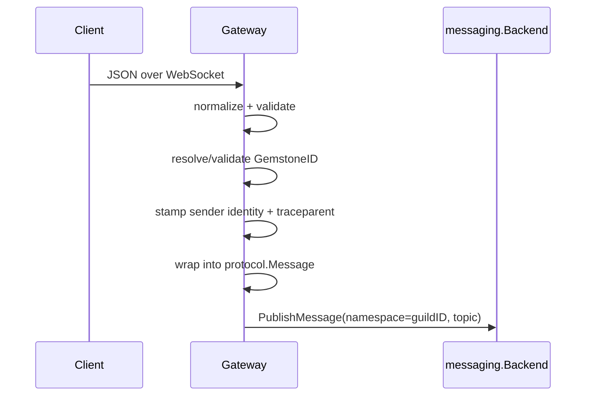

# Gateway & WebSockets

Forge's `gateway` package is the real-time edge between a browser or CLI client and a running guild. It upgrades HTTP connections to WebSockets, subscribes each socket to the right guild topics, and turns inbound client JSON into canonical `protocol.Message` envelopes on the backend pub/sub bus.

## Two sockets per guild

Every client that wants a full picture of a guild opens **two** WebSockets, not one:

| Socket | Purpose | Handler | Inbound topic | Outbound topic(s) |
|---|---|---|---|---|
| `usercomms` | Conversational/business traffic between the user and the guild | `gateway.UserCommsHandler` | `user:<user_id>` | `user_notifications:<user_id>` |
| `syscomms` | System notifications, guild health/status, infrastructure lifecycle events | `gateway.SysCommsHandler` | `user_system:<user_id>` | `user_system_notification:<user_id>`, `guild_status_topic`, `infra_events_topic` |

This split is deliberate: conversation and operational/failure signal are different concerns, and clients that only care about chat don't need to filter progress or health noise out of the same stream (or vice versa).

Each socket carries its own server-stamped sender identity — clients cannot spoof it:

- `usercomms` → `user_socket:<user_id>` (display name comes from the path's `user_name`)
- `syscomms` → `sys_comms_socket:<user_id>`

!!! note "Reconnection is not durable replay"
    Sockets are live subscriptions, not a persisted stream. `gateway.RetrieveHistory` exists to backfill missed messages (merging `user_notifications` and `user_message_broadcast` since a given ID, deduped and sorted by `GemstoneID`) but is not wired into any HTTP route today — build backfill into your client using it directly against the messaging backend if you need it.

## Guild-scoped namespace

Every socket is bound to exactly one guild ID, which doubles as the messaging namespace. All `Subscribe` / `PublishMessage` calls the gateway makes are of the form `(namespace=guildID, topic)`. A socket opened against guild `g1` only ever sees traffic published within `g1` — there's no cross-guild leakage possible at this layer.

Guild existence is checked up front via `store.Store.GetGuild` before the HTTP connection is upgraded; an unknown guild ID gets a 404, not a WebSocket handshake.

## Canonical vs proxy-compat wire shape

The same handler logic serves two different wire shapes, selected by `WireShapeMode`:

```go
type WireShapeMode int

const (
    WireShapeCanonical    WireShapeMode = iota // raw protocol.Message JSON
    WireShapeProxyCompat                       // UI-oriented shape (proxy_shaping.go)
)
```

- **Canonical** (`/ws/...`) — clients send and receive raw `protocol.Message` JSON: `format`, `payload`, `sender`, `topics`, `thread`, `message_history`, `id`, `traceparent`.
- **Proxy-compat** (`/rustic/ws/...`) — used by the legacy local Rustic UI. The outbound envelope is reshaped: `payload`→`data`, `topics`→`topic`, `thread`→`threads` (stringified), `message_history`→`messageHistory`, `in_response_to`→`inReplyTo`, plus a synthetic `conversationId: "default"`, a human-readable priority name, and a JS-style timestamp string. It also rewrites media/file URLs to `/rustic/api/guilds/{guild}/files/...` and applies per-format transforms (e.g. `ChatCompletionResponse`→`MarkdownFormat`, `AgentsHealthReport`→`healthReport`, `StopGuildResponse`→`stoppingChat`).

Both shapes are backed by the exact same handler constructors — `WireShapeCanonical` and `WireShapeProxyCompat` are just a parameter into `userCommsHandler` / `sysCommsHandler`.

### Canonical WS route registration

```go
router.GET("/ws/guilds/:id/usercomms/:user_id/:user_name",
    wrapHTTPWithPathValues(gateway.UserCommsHandler(s.msgClient, s.store, gemGen),
        "id", "user_id", "user_name"))

router.GET("/ws/guilds/:id/syscomms/:user_id",
    wrapHTTPWithPathValues(gateway.SysCommsHandler(s.msgClient, s.store, gemGen),
        "id", "user_id"))
```

The proxy-compat routes (`api/local_ui_api.go`) sit behind a short-lived bootstrap session instead of raw guild/user path segments:

```text
GET /rustic/guilds/:guild_id/ws?user=<name>   -> {"wsId": "..."}   (30-minute session)
GET /rustic/ws/:ws_id/usercomms
GET /rustic/ws/:ws_id/syscomms
```

The bootstrap call resolves `ws_id` to a `(guildID, userID, user)` triple server-side, so the proxy-compat WS URLs never expose the guild or user ID directly.

## Inbound normalization pipeline

Every inbound client message goes through the same pipeline before it reaches the backend:

1. Unmarshal client JSON into a generic map.
2. Normalize the shape (fill in defaults expected downstream).
3. Resolve a `GemstoneID` for the message — see below.
4. Stamp a server-side sender identity (the client's `sender` field is discarded).
5. Wrap into a canonical `protocol.Message` and call `PublishMessage`.



### GemstoneID validation

IDs are 64-bit snowflake-style `protocol.GemstoneID` values with an embedded timestamp and priority. A client-supplied ID is honored only if it parses **and** its timestamp is not more than 1000ms in the future; otherwise the gateway mints a fresh one:

```go
id, ok := parseIncomingGemstoneID(userMsg["id"])
if !ok || id.Timestamp-(time.Now().UnixMilli()) > 1000 {
    id, _ = gemGen.Generate(priority)
}
```

`initMessageDefaults` then calls `Message.Normalize()` (derives priority/timestamp from the ID, forces list fields to `[]` rather than `null` for Python pydantic compatibility) and defaults `Thread` to `[message.ID]` if empty.

The two socket kinds diverge slightly here:

- **usercomms** wraps the client's envelope into a nested `Message`-format envelope (`format = rustic_ai.core.messaging.core.message.Message`) and *appends* the new ID onto the incoming thread. It strictly validates `message_history` into `[]protocol.ProcessEntry` — any malformed entry drops the **entire** inbound message, not just that entry.
- **syscomms** publishes the client's `format`/`payload` directly (no wrapper envelope), *resets* `thread` to exactly `[current_message_id]`, and silently drops any message missing either `format` or a non-nil `payload`.

```go
wrapped := &protocol.Message{
    ID:             id.ToInt(),
    Topics:         protocol.TopicsFromString(userTopic(userID)),
    Sender:         protocol.AgentTag{ID: &senderID, Name: &userName}, // user_socket:<user_id>
    Format:         messageWrapperFmt, // rustic_ai.core.messaging.core.message.Message
    Payload:        json.RawMessage(pBytes),
    Thread:         thread,
    Traceparent:    &traceparent,
    MessageHistory: history,
}
initMessageDefaults(wrapped)
_ = msgClient.PublishMessage(ctx, guildID, userTopic(userID), wrapped)
```

## What happens on connect

**usercomms** immediately publishes a `UserAgentCreationRequest` to `system_topic`, registering the user's proxy agent in the guild:

```json
{
  "format": "rustic_ai.core.agents.system.models.UserAgentCreationRequest",
  "payload": { "user_id": "u-123", "user_name": "ada" }
}
```

**syscomms** immediately publishes a `HealthCheckRequest` to `guild_status_topic`, prompting the guild manager to report back its status:

```go
sub, err := msgClient.Subscribe(ctx, guildID,
    userSystemNotificationsTopic(userID), guildStatusTopic, infraEventsTopic)

healthCheck := &protocol.Message{
    ID:      healthCheckGemID.ToInt(),
    Topics:  protocol.TopicsFromSlice([]string{guildStatusTopic}),
    Sender:  protocol.AgentTag{ID: &socketSenderID}, // sys_comms_socket:<user_id>
    Format:  healthCheckFmt, // rustic_ai.core.guild.agent_ext.mixins.health.HealthCheckRequest
    Payload: json.RawMessage(payloadBytes), // {"checktime": naive-datetime}
}
_ = msgClient.PublishMessage(ctx, guildID, guildStatusTopic, healthCheck)
```

The `checktime` payload uses a naive (timezone-less) datetime string, matching the Python guild manager's expected format.

!!! tip "Guild launch progress lives on syscomms, not the HTTP response"
    Creating or relaunching a guild returns HTTP 201 as soon as the request is *accepted* — it says nothing about whether the guild actually came up. Launch progress and failure surface asynchronously as `InfraEvent`s on `infra_events_topic`, and guild-manager health arrives as `HealthCheckRequest`/`AgentsHealthReport` on `guild_status_topic`. A client that only watches the HTTP status code will miss launch failures entirely — it must be listening on syscomms.

## syscomms: three outbound families on one socket

Unlike `usercomms` (which subscribes to exactly one outbound topic), a single `syscomms` connection subscribes to **three** topic families at once:

| Topic | Carries |
|---|---|
| `user_system_notification:<user_id>` | Per-user system notifications (responses to the client's own syscomms requests) |
| `guild_status_topic` | Guild health/status: `HealthCheckRequest` echoes, `AgentsHealthReport` |
| `infra_events_topic` | Infrastructure lifecycle events (`InfraEvent`) from the supervisor/runtime |

Because all three land on the same socket, **clients must demux by `format`, and in some cases by `topic_published_to`**, to tell them apart — there is no separate channel per topic on the wire.

### Example: InfraEvent payload on infra_events_topic

```json
{
  "schema_version": 1,
  "event_id": "abc123",
  "kind": "agent.process.failed",
  "severity": "error",
  "timestamp": "2026-03-25T23:31:55.000Z",
  "guild_id": "test-guild",
  "agent_id": "echo-agent",
  "attempt": 1,
  "message": "agent process failed after retry exhaustion",
  "detail": { "error": "Read-only file system" }
}
```

`InfraEvent`'s format string is `rustic_ai.forge.runtime.InfraEvent` (`infraevents.Format`), produced by the `infraevents.Publisher` in the forge-go supervisor/runtime (source component e.g. `forge-go.supervisor.process`) and delivered to clients purely through syscomms — usercomms never sees it.

### syscomms subscribe + health-check kick

```go
guildTopics := []string{
    userSystemNotificationsTopic(userID), // user_system_notification:<user_id>
    guildStatusTopic,
    infraEventsTopic,
}
sub, err := msgClient.Subscribe(ctx, guildID, guildTopics...)
if err != nil {
    return err
}

// Kick the guild manager for a fresh status report as soon as we're listening.
_ = msgClient.PublishMessage(ctx, guildID, guildStatusTopic, healthCheck)

for m := range sub.Channel() {
    // demux by m.Format and, where ambiguous, by m.TopicPublishedTo
}
```

The outbound delivery loop ranges over `sub.Channel()`: a failed `conn.WriteMessage` stops delivery entirely for that socket, while a marshal error on a single message only skips that message and continues.

## Tracing across the WebSocket boundary

The gateway propagates OpenTelemetry spans across the WS edge using `otel.Tracer("rustic_ai")`:

- **Outbound** — extracts `traceparent` from the message, starts a `websocket:send_message` (usercomms) or `websocket:send_sys_message` (syscomms) span before writing to the socket.
- **Inbound** — starts a `websocket:receive_message` / `websocket:receive_sys_message` span, then injects a fresh `traceparent` into the wrapped message before publishing.

If no span context is available, the `traceparent` field falls back to the literal string `"no_tracing"` rather than being empty — readers should treat that sentinel (and the empty string) as "no trace available", not as a malformed value.

## Auth and origin belong upstream

The `gorilla/websocket` upgrader used by the gateway is configured with 1024-byte read/write buffers and a `CheckOrigin` that **always returns true**:

```go
var upgrader = websocket.Upgrader{
    ReadBufferSize:  1024,
    WriteBufferSize: 1024,
    CheckOrigin:     func(r *http.Request) bool { return true },
}
```

!!! warning "No origin or CSRF check at this layer"
    The gateway performs no origin restriction on the upgrade handshake. Guild-existence checks happen (404 on an unknown guild), but authentication and origin/CSRF control are **not** enforced here — they must live in front of the gateway (reverse proxy, auth middleware, or the proxy-compat bootstrap session for the local Rustic UI, which at least requires a valid `ws_id` minted via `/rustic/guilds/:guild_id/ws`).

## Backend topics reference

All topic names are guild-namespaced by the messaging backend's `(namespace, topic)` addressing:

| Topic | Direction | Used by |
|---|---|---|
| `user:<user_id>` | inbound | usercomms |
| `user_notifications:<user_id>` | outbound | usercomms |
| `user_system:<user_id>` | inbound | syscomms |
| `user_system_notification:<user_id>` | outbound | syscomms |
| `guild_status_topic` | both | syscomms (health checks + reports) |
| `system_topic` | outbound (on connect) | usercomms (`UserAgentCreationRequest`) |
| `infra_events_topic` | outbound | syscomms (`InfraEvent`) |
| `user_message_broadcast` | outbound (history only) | `gateway.RetrieveHistory` |

The gateway is backend-agnostic: both `RedisBackend` (PubSub + ZSET history) and `NATSBackend` (core NATS subscribe + JetStream/KV for durable publish and history) implement the same `messaging.Backend` interface, so routing and topic semantics above hold regardless of which is deployed.

## Related pages

- [Quickstart](../getting-started/quickstart/)
- [Messaging Backends](messaging/)
- [Observability & Tracing](telemetry/)
