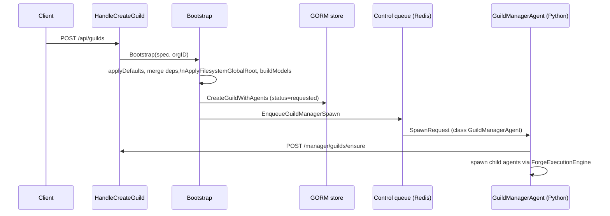

# Guilds

A Guild is the unit Forge deploys: a named, persisted collection of agent specs plus the shared configuration — execution engine, messaging backend, dependency resolvers, routing rules, gateway — that turns those specs into a running multi-agent system.

Everything else in Forge exists to author a `GuildSpec`, persist it, and launch it. This page covers the spec shape, the ways you can author one, and what happens between `POST /api/guilds` and a running set of agent processes.

## GuildSpec

`GuildSpec` (`protocol/spec.go:816`) is the canonical, serializable definition of a guild. It serializes to snake_case JSON/YAML and carries every field Forge needs to persist and launch a guild:

| Field | Purpose |
|---|---|
| `ID` | Unique guild identifier. Generated if omitted. |
| `Name` | 1-64 characters, required. |
| `Description` | Required, non-empty. |
| `Properties` | Holds `execution_engine`, `messaging`, `state_manager`, `state_manager_config`. |
| `Configuration` | A top-level map used for mustache templating at build time. |
| `Agents` | The `AgentSpec` list that makes up the guild. |
| `DependencyMap` | Guild-level dependency resolvers, merged with forge-home and conf-level maps. |
| `Routes` | A `RoutingSlip` of `RoutingRule` steps. |
| `Gateway` | Optional `GatewayConfig` for external message ingress/egress. |

`GuildSpec` exposes `Normalize()` and `Validate()`. Validation at this level is intentionally shallow — name length and non-empty description — because the heavier, guild-shaped checks (at least one agent, unique agent names, non-negative resources, messaging object shape) live in `guild.Validate(*protocol.GuildSpec)`, run by the builder and by Bootstrap.

### AgentSpec

Each entry in `Agents` is an `AgentSpec` (`protocol/spec.go:670`):

- `ID`, `Name`, `Description`
- `ClassName` — the Python dotted path to the agent implementation, required
- `AdditionalTopics` — extra topics beyond the default
- `Properties` — arbitrary agent configuration
- `ListenToDefaultTopic` — defaults to `true`
- `ActOnlyWhenTagged` — defaults to `false`
- `Predicates`, `DependencyMap`, `AdditionalDependencies`
- `Resources` — `NumCPUs` / `NumGPUs` / `CustomResources`
- `QOS`

### DependencySpec, routes, and gateway

`DependencySpec` (`protocol/spec.go:36`) entries are `ClassName`, `ProvidedType`, `Properties`. They're merged with layered precedence — spec-level wins, then forge-home's `agent-dependencies.yaml`, then the conf path — and the merge only fills in missing keys, never overwrites. Filesystem-backed dependencies have their `path_base` rewritten by `ApplyFilesystemGlobalRoot` when `FORGE_FILESYSTEM_GLOBAL_ROOT` is set.

`Routes` is a `RoutingSlip` of `RoutingRule` steps (`spec.go:586`): each rule matches on `Agent`/`AgentType`, `MethodName`, `OriginFilter`, `MessageFormat`, and defines a `Destination` (topics plus recipients), `MarkForwarded`, `RouteTimes` (default `1`), `Transformer`, `AgentStateUpdate`/`GuildStateUpdate`, `ProcessStatus`, and `Reason`.

`Gateway` (`spec.go:762`) is optional: `Enabled`, `InputFormats`, `OutputFormats`, `ReturnedFormats`. When enabled and no gateway agent is present, `GuildBuilder.applyDefaults` auto-appends one with class `rustic_ai.core.guild.g2g.gateway_agent.GatewayAgent`.

!!! note "Two sets of defaults, not one"
    `bootstrap.go`'s `applyDefaults` (runtime) defaults `execution_engine` to `rustic_ai.forge.execution_engine.ForgeExecutionEngine` and messaging to Redis (`rustic_ai.redis.messaging.backend` / `RedisMessagingBackend`). `builder.go`'s `applyDefaults` (author time) uses `rustic_ai.forge.ForgeExecutionEngine` and `rustic_ai.forge.messaging.redis_backend` with `redis://localhost:6379`. The store's own fallbacks (`GuildModel` gorm tags, `FromGuildSpec`) are `SyncExecutionEngine` and `InMemoryMessagingBackend`. These are not the same values — know which layer you're looking at before assuming a default.

## Authoring a guild

Forge supports two authoring paths that both produce a `GuildSpec`: declarative YAML/JSON, and fluent Go builders.

### YAML/JSON with `include` and `code` tags

`guild.ParseFile` resolves two custom tags before decoding:

- `!include` splices another YAML file's tree in place (`.yaml`/`.yml` only, circular includes detected via a visited set)
- `!code` inlines a file's raw text as a string — handy for prompts or scripts kept out of the guild file

```yaml
id: my-guild-01
name: My Guild
description: demo
agents:
  - !include agents/echo_agent.yaml
  - name: Coder
    description: writes code
    class_name: rustic_ai.agents.CoderAgent
    properties:
      system_prompt: !code prompts/system.txt
```

JSON guild files pass through `ParseFile` without tag resolution. `ParseFile` returns both the parsed `GuildSpec` and the raw JSON bytes.

### Fluent Go builders

`GuildBuilder` (`guild/builder.go`) accumulates the first error across calls, so you can chain freely and check the error once at `BuildSpec()`:

```go
spec, err := guild.NewGuildBuilder().
    SetName("My Guild").
    SetDescription("demo").
    SetExecutionEngine("rustic_ai.forge.execution_engine.ForgeExecutionEngine").
    AddAgentSpec(protocol.AgentSpec{
        Name: "Echo", Description: "echoes",
        ClassName: "rustic_ai.agents.EchoAgent",
    }).
    BuildSpec()
```

`BuildSpec()` runs a pipeline: `applyDefaults`, `mergeDependencyMap` (forge-home then conf), `resolveTemplates` (mustache over `Configuration`, only when non-empty), then `Validate`.

Construct a builder from an existing spec or file with `GuildBuilderFromSpec`, `GuildBuilderFromYAML(File)`, or `GuildBuilderFromJSON(File)`.

`AgentBuilder` (`agent_builder.go`) builds an `AgentSpec` with an auto-generated short-UUID `ID`; its `BuildSpec` validates name, description, class name, and resources. `RouteBuilder` (`route_builder.go`) builds a `RoutingRule` from either an `AgentTag`/`AgentSpec` source or a string agent type.

!!! tip "Composing routes"
    Use `guild.NewRouteBuilder()` alongside `AddAgentSpec` when a guild needs custom message routing beyond default-topic delivery — for example, forwarding a specific agent's output to another agent's method rather than broadcasting it.

## Creating a guild over HTTP

`POST /api/guilds` is handled by `Server.HandleCreateGuild`, which takes a `CreateGuildRequest` wrapping the spec and an organization ID, and returns `201` with the persisted guild ID:

```bash
curl -X POST http://localhost:PORT/api/guilds \
  -H 'Content-Type: application/json' \
  -d '{
    "organization_id": "acme",
    "spec": {
      "id": "my-guild-01",
      "name": "My Guild",
      "description": "demo",
      "agents": [
        {"name": "Echo", "description": "echoes",
         "class_name": "rustic_ai.agents.EchoAgent"}
      ]
    }
  }'
```

Related endpoints: `GET /api/guilds/{id}` fetches a guild, `POST /api/guilds/{id}/relaunch` re-enqueues the manager agent, and the file routes under `/api/guilds/{id}/files/...` and `/api/guilds/{id}/agents/{agent_id}/files/...` manage guild- and agent-scoped files.

## Bootstrap: from spec to running guild

`guild.Bootstrap(ctx, db, pusher, infraPublisher, spec, orgID, dependencyConfigPath)` is the single write path that turns a spec into a persisted, launching guild:

```go
func Bootstrap(ctx, db, pusher, infraPublisher, spec *protocol.GuildSpec, orgID, dependencyConfigPath string) (*store.GuildModel, error) {
    applyDefaults(spec)
    mergeDependencies(spec, forgepath.Resolve(forgepath.DependencyConfigFile)) // forge-home
    mergeDependencies(spec, dependencyConfigPath)                              // conf
    ApplyFilesystemGlobalRoot(spec, os.Getenv("FORGE_FILESYSTEM_GLOBAL_ROOT"))
    guildModel, agentModels := buildModels(spec, orgID)
    normalizeRuntimeSpecIDs(spec, guildModel.ID)
    applyStateManagerConfig(spec, orgID, guildModel.ID)
    db.CreateGuildWithAgents(guildModel, agentModels) // status=requested
    EnqueueGuildManagerSpawn(ctx, pusher, infraPublisher, spec, orgID)
    return guildModel, nil
}
```

Step by step:

1. **`applyDefaults`** — fills in execution engine and messaging if unset.
2. **Merge dependencies** — forge-home's `agent-dependencies.yaml`, then the conf path, added only where the spec doesn't already define a key.
3. **`ApplyFilesystemGlobalRoot`** — rewrites filesystem dependency `path_base`/protocol at both guild and agent level when `FORGE_FILESYSTEM_GLOBAL_ROOT` is set. It enforces path-traversal protection and bucket/scheme matching for `file`, `s3`, and `gs`/`gcs` roots, and confirms containment within the root.
4. **`buildModels`** — converts the spec into a `GuildModel` plus `AgentModel` rows. If `FORGE_STATIC_GUILD_ID` is set, that value is used as the guild ID; otherwise `spec.ID` or a generated short UUID. Empty or default `a-N` agent IDs are rewritten to `guildID#a-N`.
5. **`applyStateManagerConfig`** — auto-derives `state_manager_config` only when `state_manager` names `DiskCacheStateManager` and no config is already set, pointing `cache_dir` at `ForgeHome/state_stores/orgID/guildID`.
6. **`db.CreateGuildWithAgents`** — persists `GuildModel` and `AgentModel` rows with guild status `requested` and every agent status `not_launched`.
7. **`EnqueueGuildManagerSpawn`** — pushes a `SpawnRequest` for the `GuildManagerAgent` onto the control queue.



### The GuildManagerAgent spawn

Bootstrap builds and enqueues a `SpawnRequest` for the system `GuildManagerAgent`:

```go
spawnReq := protocol.SpawnRequest{
    RequestID: "bootstrap-" + spec.ID,
    GuildID:   spec.ID,
    AgentSpec: protocol.AgentSpec{
        ID:        spec.ID + "#manager_agent",
        Name:      spec.Name + " Manager",
        ClassName: GuildManagerClassName,
        AdditionalTopics: []string{"system_topic", "heartbeat_topic", "guild_status_topic"},
        ListenToDefaultTopic: boolPtr(false),
    },
    ClientType: "forge",
}
```

`GuildManagerClassName` is `rustic_ai.forge.agents.system.guild_manager_agent.GuildManagerAgent`. The GMA's `Properties` carry `guild_spec`, `manager_api_base_url` (`FORGE_MANAGER_API_BASE_URL`, default `http://127.0.0.1:9090`), `organization_id`, and `manager_api_token`. It listens on `system_topic`, `heartbeat_topic`, and `guild_status_topic` rather than the default topic, and drives the rest of the launch — including the round trip back into Go via `POST /manager/guilds/ensure` (`HandleManagerEnsureGuild`) and spawning child agents through `ForgeExecutionEngine`.

## The persisted spec is canonical

Bootstrap normalizes and validates the spec exactly once, before `CreateGuildWithAgents`. From that point on, nothing downstream trusts the originally submitted spec — every spawn re-hydrates the guild by reading the store and calling `store.ToGuildSpec(GetGuild(id))`.

`guild/store/mapper.go` provides the round trip: `FromGuildSpec(spec, orgID)` writes a `GuildModel`/`AgentModel` set, and `ToGuildSpec(model)` rebuilds a `GuildSpec` from it — including reconstructing `Properties.execution_engine` and `Properties.messaging` from their own columns. `ToAgentSpec`/`FromAgentSpec` and `ToRoutingRule`/`FromRoutingRule` do the same for agents and routes.

This is why Bootstrap is the single canonical write hook: `control/handler.go`'s `handleSpawn`, reached via `queueListener.OnSpawn`, reads the guild back from the store and rebuilds the spec through `ToGuildSpec` before handing it to `helper/envvars.BuildAgentEnv`, which serializes it into `FORGE_GUILD_JSON` for the Python `agent_runner.py`. Any normalization that happens after persistence — or any writer that bypasses Bootstrap — would be invisible to every subsequent spawn. The only other writer is `api/manager.go`'s `HandleManagerEnsureGuild`, on the guild-missing branch, which calls `normalizeManagerSpecIDs` and `store.FromGuildSpec` directly.

Store tables: `guilds`, `agents`, `guild_routes`, `guilds_relaunch`.

## Lifecycle statuses

| Guild status | Meaning |
|---|---|
| `requested` | Persisted by Bootstrap, not yet launched |
| `starting` | GMA is spawning agents |
| `running` | Guild is live |
| `stopped` | Guild has been shut down |
| `stopping` | Shutdown in progress |
| `backlogged` | Behind on processing |
| `warning` | Degraded but running |
| `error` | Failed |
| `unknown` | Status indeterminate |
| `not_launched` | Never started |

`AgentStatus` follows a similar shape: `not_launched`, `starting`, `running`, `stopped`, `error`, `deleted`. `RouteStatus` is simpler: `active`, `deleted`.

### Relaunch

`POST /api/guilds/{id}/relaunch` (`HandleRelaunchGuild`) re-enqueues the GuildManagerAgent only if the manager agent isn't already running, checked against the status store. Each relaunch records a row in `guilds_relaunch`. Relaunch is refused outright when guild status is `stopped` or `stopping` — you can't relaunch a guild that's mid-shutdown or already torn down.

!!! warning "Relaunch does not re-run Bootstrap"
    Relaunch re-enqueues the GMA spawn against the already-persisted spec; it does not re-validate, re-merge dependencies, or re-apply the filesystem global root. If you need to change the spec itself, that goes through a fresh `Bootstrap` call, not relaunch.

## See also

- [Quickstart](../getting-started/quickstart/)
- [Agents](agents/)
- [Execution Engine](agents/)
