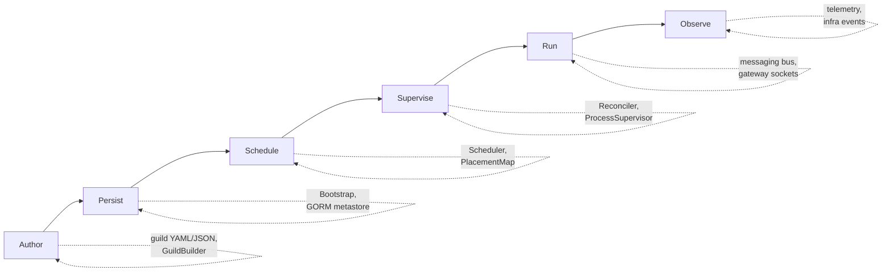

# Features Overview

Forge is a control plane and runtime for running guilds — persisted, multi-agent systems that get scheduled onto worker nodes, supervised for their whole lifecycle, and observed end to end. This page maps every capability to the page that treats it in depth, so you can jump straight to what you need instead of reading linearly.

## The capability map

**Guilds** are the unit of deployment. A guild is a named, persisted `protocol.GuildSpec` — agent specs, dependency map, routing rules, gateway config — authored in YAML/JSON or via the fluent `guild.NewGuildBuilder()` Go API, then bootstrapped through `guild.Bootstrap` into `GuildModel`/`AgentModel` rows and a spawn request for the system `GuildManagerAgent`. The persisted spec, not the one you submitted, is canonical: every downstream spawn re-hydrates it via `store.ToGuildSpec`.

**Agents** are the individual processes inside a guild, declared as `protocol.AgentSpec` (class name, resources, dependencies, Python packages, topics, predicates). They're what the scheduler places and the supervisor runs — a Python class launched through the `forge-python` execution bridge, typically via `uvx` and `rustic_ai.forge.agent_runner`.

**Scheduling and placement** is best-fit (actually most-free) resource matching: the `Scheduler` reads each agent's `ResourceSpec` (CPUs, GPUs, memory), filters healthy nodes from the `NodeRegistry`, and picks the node with the highest `remMem + remCPUs*1024` score. Placement state lives in the in-memory `PlacementMap`, walking agents through `accepted → dispatched → acknowledged → running`.

**Supervision and recovery** is the safety net: a leader-gated `Reconciler` ticks every 15s, evicting dead nodes (no heartbeat for 15s), re-enqueueing orphaned agents onto the global queue, and retrying stalled dispatches/acks against the distributed `AgentStatusStore`. On the worker, a `ProcessSupervisor` (docker or bwrap) execs the agent, applies cgroup limits, and retries local crashes with exponential backoff (base 1s, max 30s, 10 retries).

**Messaging** is the data plane — a single `messaging.Backend` interface satisfied by `RedisBackend` and `NATSBackend`, giving durable per-topic history, O(1) by-ID lookup, and live pub/sub. Topics are namespaced by guild ID, and the same choice of transport backs the control queues and the agent status store.

**Gateway** is the WebSocket edge: `usercomms` and `syscomms` handlers bridge browser/CLI clients to guild topics, wrapping inbound JSON into canonical `protocol.Message` envelopes and subscribing sockets to `user_notifications:<id>` or to `user_system_notification:<id>` / `guild_status_topic` / `infra_events_topic`. A proxy-compatible wire shape (`WireShapeProxyCompat`) serves the legacy local Rustic UI over the same handlers.

**Model-fit** answers "which local LLM can this machine actually run": it profiles hardware (RAM, CPU, GPUs), probes the local `llama-server` binary for real runtime-usable accelerators, and scores curated catalog models by memory fit and quality, exposed over `GET /rustic/modelfit/local-models` and `GET /rustic/modelfit/capabilities`.

**Secrets and OAuth** resolve agent credentials through a chained `secrets.SecretProvider` (env, dotenv, file, optionally OS keychain) and a PKCE-based `oauth.Manager` that runs Authorization Code flows and refreshes tokens, all reachable centrally from `helper/envvars.BuildAgentEnv` and injected into the agent process environment by label.

**Telemetry** is OpenTelemetry-first: a global `MeterProvider` backs ~25 `forge_*` metrics scraped as Prometheus text at `/metrics`, and traces/metrics can additionally export to a bundled desktop sqlite-otel sidecar or an external OTLP/HTTP endpoint via `--otel-mode`.

**Storage** spans the Forge-home path convention (`forgepath`), the GORM-backed metastore in `guild/store` (SQLite by default, Postgres for shared deployments), and the `filesystem` blob store (local disk, S3, or GCS via `gocloud.dev/blob`) that holds guild- and agent-scoped uploaded files.

**The HTTP API** is the surface everything above is reachable through: guild CRUD and file routes under `/api/guilds/...`, node registration/heartbeat under `/nodes/...`, OAuth flows under `/oauth/organizations/...`, model-fit under `/rustic/modelfit/...`, and Rustic-compatible routes under `/rustic/*`.

## How the capabilities compose: the launch pipeline

A guild's life runs through six stages, each owned by a different subsystem:

1. **Author** — a guild spec is written as YAML/JSON (with `include`/`code` tags) or built fluently with `guild.NewGuildBuilder()`, declaring agents, dependencies, routes, and an optional gateway.
2. **Persist** — `guild.Bootstrap` normalizes defaults, merges the dependency map, and calls `db.CreateGuildWithAgents`, writing `GuildModel`/`AgentModel` rows to the metastore with status `requested`.
3. **Schedule** — Bootstrap enqueues a spawn request for the `GuildManagerAgent` onto `forge:control:requests`; the server's `ControlQueueListener` accepts it, and `Scheduler.Schedule` places each agent on the best-fit healthy node from the `NodeRegistry`.
4. **Supervise** — the winning node's `ControlQueueHandler` writes a distributed "starting" ACK to the `AgentStatusStore` and hands off to a `ProcessSupervisor`, which execs the agent process and applies crash-recovery backoff; the `Reconciler` watches for dead nodes and stalled dispatches in the background.
5. **Run** — the running agent talks to the rest of the guild over the `messaging.Backend` (Redis or NATS), and end users reach it through gateway WebSocket sessions (`usercomms`/`syscomms`) subscribed to the guild's namespaced topics.
6. **Observe** — every stage emits OTel spans and `forge_*` metrics, plus `InfraEvent`s (`guild.launch.*`, `agent.process.*`) that the gateway surfaces live to `syscomms` clients on `infra_events_topic`.

The guild spec is the one artifact that survives the whole pipeline unchanged: it's normalized once in Bootstrap, persisted as the canonical record, and re-read via `store.ToGuildSpec` at every subsequent spawn — by the control plane, by the `GuildManagerAgent`'s `/manager/guilds/ensure` round-trip, and by every child-agent spawn that follows.

## Control-plane vs worker-node concerns

Forge splits cleanly along the `server`/`client` boundary (both of which can run together via `forge server --with-client` in single-process mode):

| Capability | Control plane (`server`) | Worker node (`client`) |
|---|---|---|
| Guilds | Authoring, persistence, bootstrap, HTTP CRUD | — (consumes the persisted spec only) |
| Scheduling/placement | `NodeRegistry`, `Scheduler`, `PlacementMap`, `Reconciler` | Registers capacity, sends heartbeats, receives dispatch on its own queue |
| Supervision/recovery | Detects dead nodes, re-enqueues orphans | Runs `ProcessSupervisor` (docker/bwrap), local crash backoff |
| Messaging | Hosts/points at the broker (embedded or external) | Publishes/subscribes through the same broker |
| Gateway | WebSocket upgrade, topic subscription, HTTP routes | — |
| Model-fit | Serves `/rustic/modelfit/*` | Runs the actual `llama-server` probe locally |
| Secrets/OAuth | OAuth flows, token store, provider config | Receives resolved secrets as env vars at agent launch |
| Telemetry | `/metrics`, trace/metric export config | Its own `--client-metrics-addr` `/metrics`, `/healthz`, `/readyz` |
| Storage | Metastore (GORM), central file storage | — (reads files via the control plane's API) |
| HTTP API | Owns all routes | Calls back into `/nodes/*` and `/manager/*` |

!!! note "Single-process mode blurs the line on purpose"
    `forge server --with-client` starts an in-process client alongside the server, using embedded Redis and SQLite, so the whole pipeline runs in one binary for local development. `--client-attach-process-tree` ties the in-process agents to the server so they exit together.

## Where to go deeper

- [Guilds](../concepts/guild-model/) and [Agents](../concepts/agent-model/) — the domain model: `GuildSpec`, `AgentSpec`, dependency resolution, routing.
- [Scheduling & Placement](../internals/scheduler-placement/) — `NodeRegistry`, best-fit scoring, the `Reconciler`'s five reconciliation phases.
- [Supervision & Recovery](../internals/supervisors/) — process supervisors, crash backoff, the `AgentStatusStore` idempotency gate.
- [Messaging](../internals/messaging-backends/) — the `Backend` interface, Redis vs NATS semantics, the ZMQ bridge to Python agents.
- [Gateway](gateway-websockets/) — WebSocket routes, canonical vs proxy-compat wire shapes, topic subscriptions.
- [Model Fit](model-fit/) — hardware detection, runtime capability probing, the local model catalog.
- [Secrets & OAuth](secrets-oauth/) — the secret provider chain, PKCE flows, keychain-backed token storage.
- [Telemetry](telemetry/) — OTel metrics/traces, Prometheus scraping, the desktop sqlite-otel sidecar.
- [Storage](storage/) — Forge-home path resolution, the GORM metastore, the blob-backed file store.
- [HTTP API Reference](../reference/http-api/) — every route, request/response shape, and status code.
- [Quickstart](../getting-started/quickstart/) — get a single-process Forge server running end to end.
