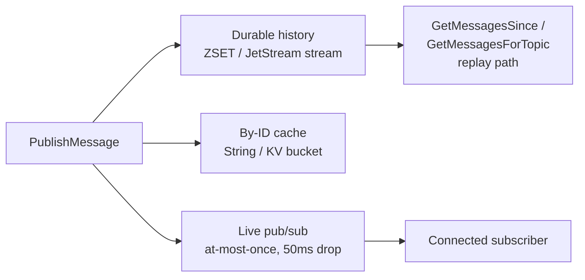

# Messaging Bus

Forge routes every guild's traffic — gateway events, control-plane signals, agent chatter — through a single data-plane abstraction: the `Backend` interface. One codebase, two interchangeable transports (Redis and NATS JetStream), zero API surface leaked to callers.

## The Backend interface

Everything in Forge that publishes or reads messages talks to `messaging.Backend`, defined in `messaging/backend.go`:

```go
type Backend interface {
	PublishMessage(ctx context.Context, namespace, topic string, msg *protocol.Message) error
	GetMessagesForTopic(ctx context.Context, namespace, topic string) ([]protocol.Message, error)
	GetMessagesSince(ctx context.Context, namespace, topic string, sinceID uint64) ([]protocol.Message, error)
	GetMessagesByID(ctx context.Context, namespace string, msgIDs []uint64) ([]protocol.Message, error)
	Subscribe(ctx context.Context, namespace string, topics ...string) (Subscription, error)
	Close() error
}

type Subscription interface {
	Channel() <-chan SubMessage
	ErrChannel() <-chan error
	Close() error
}
```

`RedisBackend` and `NATSBackend` both satisfy this interface, enforced at compile time with `var _ Backend` checks. Nothing above the bus — the gateway, the control plane, the supervisors — cares which one is live. The choice is made once, at server startup, via the `--backend` flag (`redis` or `nats`, default `redis`) or the `Backend` config field.

`Subscribe` returns a `Subscription` exposing `Channel()` for `SubMessage{Topic, Message}` values and `ErrChannel()` for transport errors. `redisSubscription` wraps a `redis.PubSub`; `natsSubscription` fans one core `nats.Subscription` per topic into a single channel. Both use a buffered channel of capacity 100.

!!! note "Same handle, three subsystems"
    The transport connection selected here isn't messaging-only. The same Redis or NATS handle backs the control plane (`control.NewRedisControlTransport` / `NewNATSControlTransport`) and the agent status store (`supervisor.NewRedisAgentStatusStore` / `NewNATSAgentStatusStore`). Pick a backend once; everything rides on it.

## Guild-scoped namespacing

Every topic is namespaced before it touches storage: `namespace + ":" + topic`, where `namespace` is the guild ID. This is intentional wire compatibility — it mirrors the Python `MessagingInterface`, which internally prepends `{guild_id}:` to every topic. A Go supervisor and a Python agent process in the same guild read and write the exact same namespaced keys and subjects.

`PublishMessage` stores the message under the namespaced topic but sets `msg.TopicPublishedTo` to the **bare** topic — namespacing is a storage/transport concern, not something callers or downstream consumers of the message body need to know about.

## Redis vs. NATS publish tiers

Both backends implement the same three-tier shape — durable history, O(1) by-id lookup, live fan-out — using different primitives.

```go
// Redis: pipelined SET + ZADD, then PubSub (messaging/query.go)
cacheKey := fmt.Sprintf("msg:%s:%d", namespace, msg.ID)
pipe := r.rdb.Pipeline()
pipe.Set(ctx, cacheKey, strJSON, r.config.MessageTTL)                                  // direct lookup
pipe.ZAdd(ctx, nsTopic, redis.Z{Score: float64(gemstone.Timestamp), Member: strJSON})  // history
_, _ = pipe.Exec(ctx)
r.rdb.Publish(ctx, nsTopic, strJSON)                                                    // live subscribers
```

```go
// NATS: JetStream + KV + core pub/sub (messaging/nats_backend.go)
// 1. JetStream for ordered, durable topic storage.
if _, err := b.js.Publish(jsSubject(nsTopic), msgBytes); err != nil { /* ... */ }
// 2. KV for O(1) ID lookup.
if _, err := kv.Put(strconv.FormatUint(msg.ID, 10), msgBytes); err != nil { /* ... */ }
// 3. Core NATS pub/sub for live listeners (tier-1, matching Python).
if err := b.nc.Publish(nsTopic, msgBytes); err != nil { /* ... */ }
```

| Concern | RedisBackend | NATSBackend |
|---|---|---|
| Durable history | Per-topic ZSET, keyed by namespaced topic, scored by Gemstone timestamp | JetStream stream, one per topic (`MSGS_<sanitized>`) |
| By-ID lookup | String cache key `msg:{namespace}:{id}` with TTL | JetStream KV bucket per namespace (`msg-cache-<sanitized-ns>`) |
| Live delivery | Redis PubSub on the namespaced topic | Core NATS pub/sub on the namespaced topic |
| Connection lifecycle | Externally managed; `Close()` is a no-op | Owned by the backend; `Close()` drains the connection |
| Resilience on restart | N/A (Redis is the durability layer) | `AddStream`/`CreateKeyValue` failures fall back to `StreamInfo`/bind-existing-bucket lookups; the in-memory `streams`/`kvBuckets` caches rebuild lazily |

Both backends read messages back through `parseAndSortMessages` (`query.go`), which is shared code that orders results using `protocol.Compare` on Gemstone IDs.

!!! note "History read semantics differ slightly by path"
    Corrupted JSON in Redis's topic history is a hard failure (fail-loud) in `parseAndSortMessages`. The by-id and since-query paths, on both backends, silently skip entries that fail to unmarshal (fail-soft). This asymmetry is intentional: a corrupt history read is a data-integrity signal worth surfacing, a single bad cached record isn't worth failing an otherwise-good batch over.

NATS history reads use ephemeral pull consumers. `GetMessagesForTopic` creates one with `DeliverAll`, fetches exactly `info.State.Msgs` messages (10s `MaxWait`), acks each, and returns early if the stream is empty; an `InactiveThreshold` of 5s cleans the ephemeral consumer up automatically. `GetMessagesSince` uses the `sinceID`'s embedded Gemstone timestamp as a `nats.StartTime` hint — a coarse optimization only — then fetches in 256-message batches (200ms `MaxWait`) and filters `msg.ID > sinceID` in memory for exactness.

## NATS naming conventions

Subject, stream, and bucket names are derived deterministically from the namespaced topic, matching the Python NATS backend byte-for-byte (`messaging/naming.go`):

```go
func sanitize(name string) string {
	r := strings.NewReplacer(":", "_", ".", "_", "$", "_")
	return r.Replace(name)
}
func jsSubject(topic string) string  { return "persist." + sanitize(topic) } // JetStream subject
func streamName(topic string) string { return "MSGS_" + sanitize(topic) }    // JetStream stream
func kvBucketName(ns string) string  { return "msg-cache-" + sanitize(ns) }  // KV bucket per namespace
```

`sanitize` replaces `:`, `.`, and `$` with `_` — the characters that are meaningful to NATS subject syntax but appear routinely in namespaced topics (`guild123:user_notifications:42`). Streams and KV buckets are lazily created on first use and cached in-memory, guarded by a mutex.

## Ordering, TTL, and retention

Message IDs are 64-bit GemstoneIDs packing priority, millisecond timestamp, machine ID, and a sequence number. Both backends rely on the embedded timestamp for ordering:

- The Redis ZSET score is the Gemstone timestamp.
- The NATS `StartTime` query hint uses the same timestamp.
- `GetMessagesSince` filters strictly on `ID > sinceID` after fetching, regardless of backend.

**Default message TTL is 3600 seconds (1 hour)**, configurable per backend via environment variable:

| Backend | Env var |
|---|---|
| Redis | `RUSTIC_AI_REDIS_MSG_TTL` (integer seconds) |
| NATS | `RUSTIC_AI_NATS_MSG_TTL` (integer seconds) |

NATS additionally overrides the TTL to a **60-day long-retention window** for topics that need to survive well past the default window:

```go
const longRetentionTTL = 60 * 24 * time.Hour // 60 days
var longRetentionTopics = []string{"user_notifications:", "user_message_broadcast"}

func (b *NATSBackend) ttlForTopic(nsTopic string) time.Duration {
	for _, pattern := range longRetentionTopics {
		if strings.Contains(nsTopic, pattern) {
			return longRetentionTTL
		}
	}
	return b.config.MessageTTL // default 3600s
}
```

Any namespaced topic containing `user_notifications:` or `user_message_broadcast` gets the 60-day `MaxAge` applied to its JetStream stream instead of the default.

## Delivery semantics: live is lossy, history is truth

!!! warning "Live pub/sub can drop messages"
    Both `redisSubscription` and `natsSubscription` write into a buffered channel (capacity 100). If a consumer doesn't drain fast enough and a send blocks for **50ms**, the message is dropped and a warning is logged. Live delivery is **at-most-once** on both backends — this matches the Python runtime's behavior, not a Go-specific shortcut.

Because live delivery is best-effort, it is never the system of record. Durable history — the Redis ZSET or the NATS JetStream stream — is the replay source of truth. Any consumer that needs guaranteed delivery (a reconnecting client, a crashed agent catching up) should use `GetMessagesSince` or `GetMessagesForTopic` against history rather than relying solely on the live subscription.



## Embedded servers: zero-infra single binary

Forge doesn't require you to stand up Redis or NATS separately. The `embed` package boots either one in-process:

- **`embed.StartEmbeddedRedis` / `StartEmbeddedRedisAt(addr)`** wraps `github.com/alicebob/miniredis/v2`, returning an `*EmbeddedRedis` with `Host`/`Port`/`Addr`/`Client` accessors.
- **`embed.StartEmbeddedNATS` / `StartEmbeddedNATSAt(addr)`** runs an in-process `nats-server` with JetStream enabled, an isolated store directory under `forgepath.Resolve("nats")`, and waits up to 15s for `ReadyForConnections`.

```go
// embed/nats.go
opts := &natsserver.Options{JetStream: true, StoreDir: storeDir, Port: -1}
s, _ := natsserver.NewServer(opts)
go s.Start()
if !s.ReadyForConnections(15 * time.Second) {
	s.Shutdown() // fail
}
```

Server startup wires this in automatically based on the chosen backend and whether an external address was supplied:

```go
// agent/server.go
backend := strings.ToLower(strings.TrimSpace(cfg.Backend)) // "redis" (default) or "nats"
switch backend {
case "redis":
	if redisAddr == "" {
		mredis, _ := embed.StartEmbeddedRedisAt(embeddedAddr)
		redisAddr = mredis.Addr()
	}
case "nats":
	if natsURL == "" {
		n, _ := embed.StartEmbeddedNATSAt(cfg.EmbeddedNATSAddr)
		natsURL = n.ClientURL()
	}
}

if natsURL != "" {
	nc, _ := nats.Connect(natsURL)
	msgBackend, _ = messaging.NewNATSBackend(nc)
} else {
	msgBackend = messaging.NewRedisBackend(redisClient)
}
```

The relevant CLI flags: `--backend` (`redis`|`nats`), `--redis` / `--nats` for external endpoints, `--embedded-redis-addr` (default `127.0.0.1:6379`), and `--embedded-nats-addr` (default: ephemeral port). Note that `natsURL != ""` is the actual switch in `agent/server.go` — it selects NATS for messaging, control plane, *and* status store together, so you can still pass `--redis` alongside `--backend nats` (used for leader election) without it affecting message routing.

!!! tip "Embedded NATS store isolation"
    Each embedded NATS instance gets its own `MkdirTemp` store directory under `forgepath.Resolve("nats")`, with a writability probe and a fallback to `os.MkdirTemp("")` if that root isn't writable. `Close` removes the store directory — embedded runs leave no persistent state behind.

## How Python agents reach the bus

Distributed Python agent subprocesses never talk to Redis or NATS directly. `supervisor/messaging_bridge.go` (`AgentMessagingBridge`) exposes the Go `Backend` over a ZeroMQ PAIR socket — IPC by default, TCP optionally — translating JSON envelopes (`ping`, `publish`, `subscribe`, `unsubscribe`, `get_messages`, `get_since`, `get_next`, `get_by_id`, `cleanup`) into `Backend` calls, and streaming live subscription events back as `event`/`deliver` envelopes. The Python-side counterpart is `SupervisorZmqMessagingBackend`.

Guild spawn requests carry `protocol.MessagingConfig{BackendModule, BackendClass, BackendConfig}` so the Python runtime constructs a matching backend, and the server exports `RUSTIC_AI_MESSAGING_MODULE` / `RUSTIC_AI_MESSAGING_CLASS` (set to `rustic_ai.nats.messaging.backend` / `NATSMessagingBackend` for the NATS case) to keep both sides aligned. The bridge's IPC socket path is a SHA-1 digest of `workDir|guildID|agentID` to stay under Unix socket path limits, defaulting under `/tmp/forge-zmq` (override with `FORGE_ZMQ_DIR`).

## Related pages

- [Getting Started: Quickstart](../getting-started/quickstart/)
