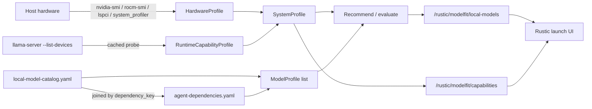

# Model Fit

Forge ships a curated catalog of local LLMs, but not every model in that catalog will actually run well on the machine in front of you. Model Fit profiles the host, probes the local llama.cpp runtime, and scores each curated model so Forge can tell you — and the Rustic launch UI — which ones are runnable and which one to pick first.

## What it answers

Given this machine, Forge's curated local model catalog, and the local llama.cpp server, which local LLMs are runnable, and which should be recommended?

That's the entire scope. Model Fit is a Forge-native Go implementation, package `github.com/rustic-ai/forge/forge-go/modelfit`, deliberately kept as a small subset of the external `llmfit` project: no downloads, no cloud-provider fit scoring, no Ollama/LM Studio/vLLM support in v1.

!!! note "Package location"
    All fit-scoring logic lives in `forge-go/modelfit/`. The sibling `forge-go/model/` directory exists but is currently empty.

## Hardware profiling and runtime probing

Model Fit works in two layers that are easy to conflate but must stay separate: what hardware exists, and what the runtime can actually use.

**`HardwareProfile`** is static detection — total/available RAM, CPU cores and name, and a list of `GPUDevice` entries (vendor, name, backend candidates, VRAM, integrated/discrete/unified flags). Detection is per-OS: `nvidia-smi` + `rocm-smi` + `lspci` on Linux, `system_profiler` on macOS (Apple Silicon is marked unified memory), and `Get-CimInstance Win32_VideoController` on Windows. All of these shell out to external tools, and every call is mockable via package-level function vars (`nvidiaSMIFunc`, `macGPUProfileFunc`, `rocmGPUDevicesFunc`, etc.) for testing.

**`RuntimeCapabilityProfile`** is the runtime probe: it shells out to the local `llama-server` binary with `--list-devices` and parses the result into `UsableAccelerator` entries. This is the core differentiator of the subsystem — it separates "a GPU is physically present" from "the runtime can offload to it."

```go
binaryPath := strings.TrimSpace(os.Getenv(modelFitLlamaBinaryEnv)) // FORGE_MODELFIT_LLAMA_BINARY
if binaryPath == "" {
	if found, err := lookPathFn("llama-server"); err == nil { binaryPath = found }
}
// ... cache keyed on GOOS/GOARCH/path/size/mtime; else:
cmd := exec.CommandContext(probeCtx, binaryPath, "--list-devices") // 3s timeout
```

The probe result is cached to disk (`modelfit-runtime-probe.json`, override with `FORGE_MODELFIT_RUNTIME_CACHE`), keyed on `GOOS`, `GOARCH`, binary path, binary size, and mtime — the cache invalidates automatically the moment the binary changes.

The two layers merge into a single **`SystemProfile`**: total/available RAM, CPU cores/name, `HasGPU`, `GPUCount`, `TotalVRAMBytes`, selected `Backend`, `UnifiedMemory`, `SelectedAcceleratorID`, `RuntimeUsableAcceleration`, `Confidence`, and `ReasonCodes`, plus the embedded `HardwareProfile` and `RuntimeCapabilityProfile`.

### Graceful degradation

Nothing about GPU or runtime detection is allowed to fail the whole profile. A missing binary, a failed probe, or a probe that reports no devices all fall back to CPU-only with an explanatory reason code rather than an error. `DetectSystemProfile()` only returns an error if base memory detection itself fails.

### Stable reason codes

Every detection outcome — good or bad — is recorded as a `DiagnosticReason` code, not a free-text message:

| Reason code | Meaning |
|---|---|
| `runtime_binary_missing` | `llama-server` could not be found on `PATH` or the configured override |
| `runtime_probe_failed` | The probe ran but did not return usable output |
| `no_runtime_devices` | The runtime reported no accelerator devices |
| `nvidia_present_but_runtime_cpu_only` | An NVIDIA GPU exists, but the runtime build can't use it |
| `amd_detected_but_rocm_unavailable` | An AMD GPU exists, but ROCm isn't usable |
| `intel_integrated_shared_memory_only` | Intel integrated graphics, shared memory only |
| `hybrid_gpu_present_offload_not_usable` | A hybrid laptop GPU (e.g. discrete NVIDIA + Intel integrated) whose offload path isn't usable |
| `runtime_device_detected` | The runtime confirmed a usable accelerator |

`reasonExplanations()` maps each code to a human sentence appended to `FitResult.Explanations`, so the UI always has both a stable code to key on and a readable sentence to display.

Detection confidence is itself an ordered enum — `unknown < heuristic < strong < probe` — via `maxConfidence`. `probe` means the runtime was actually queried; `heuristic` means Model Fit fell back to CPU assumptions.

## The curated catalog, joined by `dependency_key`

Fit metadata and resolver wiring live in two different config files, joined at load time:

- **`conf/local-model-catalog.yaml`** (override with `FORGE_LOCAL_MODEL_CATALOG`) — the canonical fit catalog, a top-level `models:` list.
- **`conf/agent-dependencies.yaml`** (override with `FORGE_DEPENDENCY_CONFIG`) — the canonical resolver wiring, a map of `DependencySpec` (`class_name` / `provided_type` / `properties`).

```yaml
models:
  - id: qwen3_5_0_8b_starter
    display_name: Qwen 3.5 0.8B Starter
    dependency_key: llm_local_qwen3_5_0_8b
    model_name: openai/rustic/qwen3.5-0.8b-starter
    parameter_count_b: 0.8
    quantization: q4_k_m
    context_length: 32768
    min_ram_bytes: 2147483648
    preferred_vram_bytes: 1610612736
    estimated_memory_bytes: 1288490189
    embedding_only: false
    use_case_tags: [chat, coding]
    quality_rank: 5
    token_speed_hint: 70
    preferred_discrete_gpu: true
```

```yaml
llm_local_qwen3_5_0_8b:
  class_name: rustic_ai.litellm.agent_ext.llm.LiteLLMResolver
  provided_type: rustic_ai.core.llm.LLM
  properties:
    model: openai/rustic/qwen3.5-0.8b-starter
    base_url: http://localhost:55262/v1
```

`modelfit.LoadProfiles(catalogPath, dependencyConfigPath)` loads both files, validates every catalog entry has a matching `dependency_key`, checks that `properties.model` on the dependency side equals the catalog's `model_name` — a mismatch is a hard load error — and copies `ClassName` → `ResolverClassName`, `ProvidedType`, and `properties.base_url` into the resulting `ModelProfile`. Loading is strict: missing `dependency_key`, duplicate keys, missing identity fields, missing fit metadata, an unknown dependency key, a missing `class_name`, or a catalog/dependency model-name mismatch all fail the load rather than silently skipping the entry.

All curated local models currently point at the same OpenAI-compatible llama.cpp server (`rustic_ai.litellm.agent_ext.llm.LiteLLMResolver`, provided type `rustic_ai.core.llm.LLM`, `base_url http://localhost:55262/v1`). The v1 catalog itself is Qwen 3.5 (0.8B / 2B / 4B), Qwen 3 4B text, Gemma 3 4B instruct, and Nomic Embed (`embedding_only: true`) — all `q4_k_m` except the `q8_0` embedder, 32768 context (8192 for the embedder).

!!! warning "Cloud keys are excluded from scoring"
    `agent-dependencies.yaml` also carries cloud dependency keys — `llm_openai`, `llm_anthropic_sonnet` / `llm_anthropic_opus`, `llm_gemini`, `llm_vertexai`, `llm_bedrock`, `llm_azure`, `llm_cohere`, `llm_groq` — but these are intentionally absent from the catalog and never appear in fit scoring. Only curated local models are scored.

## Scoring: FitLevel and ranking

Each curated model is evaluated against the detected `SystemProfile` to produce a `FitResult`: `model_id`, `dependency_key`, `display_name`, `model_name`, `use_case_tags`, `fit_level`, `runnable`, `estimated_memory_bytes`, `available_memory_bytes`, `utilization_pct`, an optional `estimated_tokens_per_second`, `score`, `selected_backend`, `selected_accelerator_id`, `runtime_usable_acceleration`, `confidence`, `reason_codes`, and ordered `explanations`.

### Memory-pool selection

Which memory pool a model is compared against depends on what the runtime can actually use:

- A runtime-usable **unified/integrated** accelerator compares required memory against system available RAM.
- A runtime-usable **discrete** accelerator compares required memory against that accelerator's `TotalMemoryBytes`.
- A model marked `preferred_discrete_gpu` on a machine with a GPU present but **no usable runtime offload** falls back to comparing against system RAM, and picks up an explanation noting that acceleration isn't usable.

Required memory is `max(applicable min/preferred field, estimated_memory_bytes)` — the catalog's `estimated_memory_bytes` is authoritative and validated non-zero at load time.

### FitLevel thresholds

`classify()` is a fixed v1 heuristic based on memory utilization percentage:

```go
func classify(utilization float64, available bool) FitLevel {
	if !available {
		return FitTooTight
	}
	switch {
	case utilization <= 70:
		return FitPerfect
	case utilization <= 85:
		return FitGood
	case utilization <= 100:
		return FitMarginal
	default:
		return FitTooTight
	}
}
```

| FitLevel | Utilization | `runnable` |
|---|---|---|
| `perfect` | ≤ 70% | true |
| `good` | ≤ 85% | true |
| `marginal` | ≤ 100% | true |
| `too_tight` | > 100%, or no available memory | false |

`runnable` is simply `fit_level != too_tight`.

### Deterministic ranking

`compareResults` orders `FitResult`s with a full tie-breaker chain so output is stable across identical inputs:

1. Runnable results before non-runnable ones.
2. Higher `FitLevel` weight (`perfect=4`, `good=3`, `marginal=2`, `too_tight=1`).
3. Higher `score`.
4. Smaller `estimated_memory_bytes`.
5. `dependency_key` alphabetically, as the final stability tiebreaker.

```text
score() = fitBase(perfect=400 / good=300 / marginal=200 / too_tight=100)
        + quality(100 - quality_rank*10)
        + min(token_speed_estimate, 100)
        - min(utilization_pct, 150)
```

Token-per-second estimates are intentionally coarse and only nudge the score: if `token_speed_hint` is set on the catalog entry, it's scaled by backend class (discrete-accelerator ×1.0, unified-accelerator ×0.7, CPU ×0.2); otherwise a base rate (120 / 75 / 18 depending on backend) is divided by `max(parameter_count_b, 0.5)`. The field is optional (`*float64`, `omitempty`).

Determinism runs end to end: the catalog is sorted by `dependency_key`, reason codes and `use_case_tags` are deduped and sorted, and the tie-breaker chain guarantees the same inputs always produce the same ordering.

## HTTP surface

Two routes feed the Rustic launch UI, registered on the control-plane Gin router:

```go
router.GET("/rustic/modelfit/local-models", wrapHTTP(s.handleListLocalModelFits()))
router.GET("/rustic/modelfit/capabilities", wrapHTTP(s.handleGetModelFitCapabilities()))
```

**`GET /rustic/modelfit/local-models`** returns a ranked JSON array of `FitResult`. Query parameters:

| Param | Type | Behavior |
|---|---|---|
| `use_case` | string | Filters to models whose `use_case_tags` contain this tag |
| `limit` | int | Caps the result count; a non-numeric value returns `400 invalid limit` |
| `runnable_only` | bool-ish | Accepts `1`, `true`, `yes`, `y`, `on`; excludes `too_tight` results |

```bash
curl 'http://localhost:PORT/rustic/modelfit/local-models?use_case=coding&runnable_only=true&limit=3'
# -> JSON array of FitResult: {dependency_key, display_name, model_name, fit_level,
#    runnable, score, utilization_pct, available_memory_bytes, estimated_tokens_per_second,
#    use_case_tags, explanations, ...}
```

**`GET /rustic/modelfit/capabilities`** returns the full `SystemProfile` — hardware plus runtime capability detection — as JSON:

```bash
curl 'http://localhost:PORT/rustic/modelfit/capabilities'
```

## Wiring it up

```go
srv := server.New(/* ... */).WithModelFit(catalogPath, dependencyConfigPath, profiler)
```

`WithModelFit` takes the catalog path, the dependency config path, and a `modelfit.Profiler` (the interface `DefaultProfiler{}` implements via `Profile(ctx)`). A `nil` profiler defaults to `DefaultProfiler`; blank paths default via `forgepath` to `conf/local-model-catalog.yaml` and `conf/agent-dependencies.yaml`.

| Env var | Purpose | Default |
|---|---|---|
| `FORGE_MODELFIT_LLAMA_BINARY` | Override path to `llama-server` | `exec.LookPath("llama-server")` |
| `FORGE_MODELFIT_RUNTIME_CACHE` | Override runtime probe cache path | `forgepath.Resolve("cache/modelfit-runtime-probe.json")` |
| `FORGE_LOCAL_MODEL_CATALOG` | Override catalog path | `conf/local-model-catalog.yaml` |
| `FORGE_DEPENDENCY_CONFIG` | Override dependency map path | `conf/agent-dependencies.yaml` |

## How the launch UI uses it



When a blueprint declares an `llm` dependency, the Rustic launch modal calls `/rustic/modelfit/local-models` to get ranked local candidates and can preselect the best runnable one — for example binding `llm_local_qwen3_5_0_8b` instead of the generic `llm` placeholder.

!!! note "Informs, never modifies"
    Model Fit is read-only with respect to agent configuration. It informs the launch UI's choice of dependency binding but never writes to or modifies an `AgentSpec` directly.

## Related pages

- [Dependency resolution](../concepts/agent-model/)
- [Quickstart](../getting-started/quickstart/)
