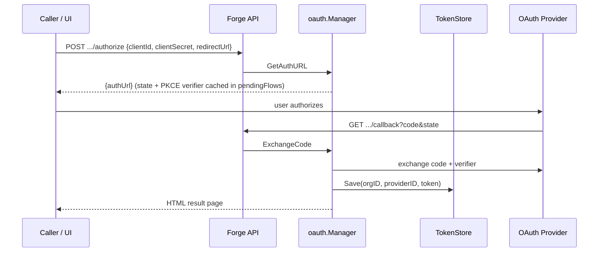

# Secrets & OAuth

Forge resolves every credential an agent needs — API keys and delegated OAuth access tokens alike — through one chained resolution path, then injects the results into the agent process as plain environment variables. No agent code ever talks to a secret store, a keychain, or an OAuth provider directly.

## The resolution chain

Static secrets (API keys, tokens pasted by a user, service credentials) are resolved by a `secrets.SecretProvider`:

```go
type SecretProvider interface {
    Resolve(ctx context.Context, key string) (string, error)
}
```

Forge never relies on a single backend. `secrets.DefaultProvider()` builds a `ChainSecretProvider` that tries each configured backend in order and returns the first success, falling through to `secrets.ErrSecretNotFound` only if every backend misses.

The chain's order comes from `FORGE_SECRET_PROVIDERS`, a comma-separated list, defaulting to:

```bash
FORGE_SECRET_PROVIDERS=env,dotenv,file
```

| Provider | Backend | Notes |
|---|---|---|
| `env` | `os.LookupEnv` | Reads the key directly from the server's own environment. |
| `dotenv` | `~/.forge/secrets/.env` | Supports `export`, quoted values, `#` comments. |
| `file` | `~/.forge/secrets/<key>` | One file per key, trimmed of whitespace. Uses `filepath.Base` on the key to block path traversal. |
| `keychain` | OS keychain | Not built in — requires a side-effect import of the `keychain` package, which registers itself via `secrets.RegisterProvider("keychain", ...)`. |

!!! note "keychain is opt-in twice over"
    Adding `keychain` to `FORGE_SECRET_PROVIDERS` is not enough on its own — the binary must also import the `keychain` package so its `init()` can call `secrets.RegisterProvider`. If the name isn't registered, the chain logs it to stderr and skips it rather than failing.

`~/.forge/secrets/` and the dotenv path both resolve through `forgepath.Resolve`, so setting `FORGE_HOME` relocates them along with the rest of Forge's on-disk state.

## OAuth Manager

Delegated tokens (GitHub, Google, Slack, Microsoft, Notion, or any custom provider) are handled by `oauth.Manager`, which runs a standard **Authorization Code + PKCE** flow:



Key behaviors:

- **PKCE by default.** `use_pkce` defaults to `true` in provider config; `GetAuthURL` attaches an S256 challenge and `ExchangeCode` supplies the matching verifier. Set `use_pkce: false` to opt a provider out.
- **State and flow expiry.** State is 32 random bytes, base64-url encoded. Pending flows expire after 10 minutes; `cleanExpiredFlows` runs on every `GetAuthURL` call.
- **Refresh within 60 seconds of expiry.** `GetAccessToken` returns the cached token if it's still valid, and transparently refreshes — persisting the new token back to the store — if the token is invalid or expires within 60 seconds. There is no single-flight guard around concurrent refreshes today.
- **Explicit activation required.** A provider merely listed in `oauth-providers.yaml` isn't usable. `GetAuthURL`, `ExchangeCode`, status, and disconnect all reject providers absent from `activeProviders`, which is only populated when `CheckAndUpdateProvider` runs — triggered by registry validation when an agent declares an `OAuthNeed` against that provider.
- **Credentials are supplied per request, not stored in config.** `clientId`/`clientSecret` come from the `/authorize` call body. `ExchangeCode` persists them into the token entry so later refreshes can reuse them; with the keychain store, they end up in the OS keychain as part of the serialized entry.

!!! tip "Local dev / tests"
    `Manager.SeedToken` stores a 24-hour, non-expiring access token that bypasses the OAuth dance entirely. It exists for tests and local development — never use it in a real deployment.

### HTTP routes

```
GET    {prefix}/oauth/organizations/:org_id/providers
POST   {prefix}/oauth/organizations/:org_id/providers/:provider_id/authorize
GET    {prefix}/oauth/organizations/:org_id/providers/:provider_id/callback
GET    {prefix}/oauth/organizations/:org_id/providers/:provider_id/status
DELETE {prefix}/oauth/organizations/:org_id/providers/:provider_id
```

`org_id` is validated before it ever reaches a store key: empty values, `|`, and control characters are rejected, since `|` is the delimiter used inside the token store key.

## Provider configuration

Providers are declared in `conf/oauth-providers.yaml` (override the path with `FORGE_OAUTH_PROVIDERS_CONFIG`):

```yaml
providers:
  github:
    display_name: GitHub
    description: Connect your GitHub account
    # auth_url/token_url optional if the provider is a known endpoint
    auth_url: ${GITHUB_AUTH_URL}   # ${ENV} interpolated
    token_url: https://github.com/login/oauth/access_token
    scopes: [repo, read:user]
    redirect_url: ""
    use_pkce: true   # default true; set false to disable PKCE
```

`${ENV}` interpolation applies to `auth_url`, `token_url`, and `redirect_url`. If a config omits `auth_url`/`token_url`, `known_endpoints.go` supplies hardcoded defaults for `github`, `google`, `google-drive`, `slack`, `microsoft`, and `notion` — `resolveEndpoint` prefers config values, falls back to the known endpoint, and errors only if neither is set.

If `oauth-providers.yaml` is missing entirely, `LoadProvidersConfig` returns an empty config with no error, and `WithOAuth` becomes a no-op when there are zero providers.

## Token storage

`oauth.NewTokenStore(kind)` selects the backend, controlled by `FORGE_OAUTH_TOKEN_STORE`:

| Kind | Type | Persistence |
|---|---|---|
| `memory` (default) | `InMemoryTokenStore` | Lost on process restart. |
| `keychain` | `KeychainTokenStore` | Serializes a `storedEntry` (access token, refresh token, expiry, client ID/secret, auth/token URLs, auth style, scopes) as JSON into the OS keychain, under the service name from `forgepath.KeychainService()` (`FORGE_KEYCHAIN_SERVICE`, default `"forge"`), via `github.com/zalando/go-keyring`. |

If an unknown kind is passed, `WithOAuth` logs a warning and falls back to `memory` rather than failing startup.

## The `oauth:orgID|providerID` convention

One key format ties the token store, the keychain secret provider, and env-var resolution together:

```go
const prefix = "oauth:"

func StoreKey(orgID, providerID string) string {
    return prefix + orgID + "|" + providerID
}
```

When the `keychain` provider is in the resolution chain and sees a key of this shape, it doesn't read the keychain entry raw — it delegates to the registered OAuth Manager so the caller gets a **live, refreshed** access token:

```go
if orgID, providerID, ok := oauth.ParseOAuthKey(key); ok {
    if mgr := oauthMgr.Load(); mgr != nil {
        token, err := mgr.GetAccessToken(ctx, orgID, providerID) // handles refresh
        if errors.Is(err, oauth.ErrNotConnected) {
            return "", secrets.ErrSecretNotFound
        }
        return token, err
    }
    return p.oauthTokenFromKeychain(key) // fallback: read raw access_token field
}
```

Wiring it up is one call on the API server:

```go
func (s *Server) WithOAuth(kind string) *Server {
    if kind == "" { kind = os.Getenv("FORGE_OAUTH_TOKEN_STORE") }
    cfg, _ := oauth.LoadProvidersConfig(forgepath.OAuthProvidersConfigPath())
    if len(cfg.Providers) == 0 { return s }
    store, err := oauth.NewTokenStore(kind) // "memory" | "keychain"
    if err != nil { store, _ = oauth.NewTokenStore("memory") }
    s.oauthManager = oauth.NewManagerWithStore(cfg, store)
    keychain.SetOAuthManager(s.oauthManager)
    return s
}
```

## Injection into agent processes

Everything converges in `helper/envvars.BuildAgentEnv`, which resolves each agent's declared needs and writes the results directly into the child process environment:

```go
for _, o := range regEntry.OAuth {
    secretKey := oauth.StoreKey(orgID, o.Provider)
    val, err := secretProvider.Resolve(ctx, secretKey)
    if err != nil {
        if err == secrets.ErrSecretNotFound && (o.Optional == nil || *o.Optional) {
            continue
        }
        return fmt.Errorf("failed to resolve OAuth token for provider '%s'...: %w", o.Provider, err)
    }
    envMap[o.Label] = val // injected into agent process env
}
```

Static secrets (`agentSpec.Resources.Secrets`, a `[]string` of keys) and registry-declared `SecretNeed`s (`key`/`label`/`optional`) go through the same `secretProvider.Resolve` call, just without the `StoreKey` wrapping. In every case:

- The **key** used to resolve is either a plain secret name or an `oauth:orgID|providerID` string.
- The **label** — not the key — becomes the environment variable name in the spawned agent process.
- A miss on an optional need (`ErrSecretNotFound`) is silently skipped; a miss on a non-optional need aborts env construction with an error.

!!! warning "Full tokens reach the agent process"
    The current implementation injects the full resolved secret value — and, via the keychain bridge, a live OAuth access token — directly into the agent's environment. This is the direct env-injection model, not the lease/broker architecture described in `DESKTOP_SECRETS_OAUTH_DESIGN.md`; that document is a proposal, largely unimplemented, and should not be treated as describing current behavior.

## Reference

**Environment variables**

| Variable | Purpose | Default |
|---|---|---|
| `FORGE_SECRET_PROVIDERS` | Secret resolution chain order | `env,dotenv,file` |
| `FORGE_OAUTH_TOKEN_STORE` | Token store backend | `memory` |
| `FORGE_KEYCHAIN_SERVICE` | OS keychain service name | `forge` |
| `FORGE_OAUTH_PROVIDERS_CONFIG` | Path to `oauth-providers.yaml` | `conf/oauth-providers.yaml` |
| `FORGE_MANAGER_API_BASE_URL` | Externally reachable base URL for OAuth callback construction | — |

**Spec types**

```go
protocol.SecretNeed{Key, Label, Optional}
protocol.OAuthNeed{Provider, Label, Scopes, Optional}
```

See also [Agent Registry](../concepts/distributed-control-plane/) for how `Secrets` and `OAuth` needs are declared per agent, and [Quickstart](../getting-started/quickstart/) for a minimal setup that doesn't require any of this.
