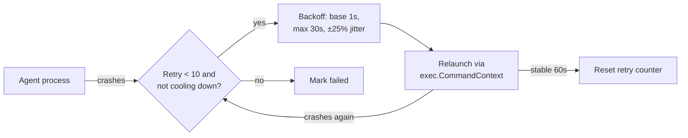
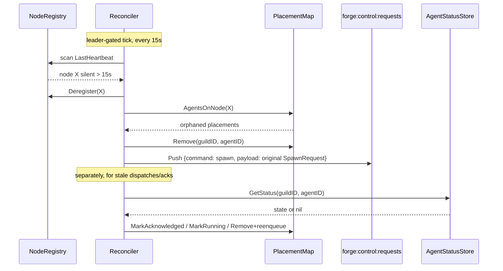

# Supervision & Recovery

Agents crash, processes get killed, and worker nodes go dark. Forge assumes all three will happen and recovers from each without operator intervention — locally through a process supervisor, and cluster-wide through a leader-gated reconciler.

Recovery in Forge happens at two layers, and it's important to keep them distinct:

- **Process Supervisor** — owns the OS-level lifecycle of a single agent process on the node it runs on: launch, signal, restart, kill.
- **Reconciler** — owns cluster-level truth: is the node this agent lives on still alive, did a dispatched command ever get acknowledged, did a spawn ever reach `running`.

Together they mean a dead process gets restarted in place, and a dead *node* gets its agents evicted and redistributed elsewhere — automatically.

## Process Supervisor: OS-level lifecycle

Every worker node runs agent processes under a supervisor. The supervisor is what actually launches the OS process, watches it, and tears it down:

- **Launch** via `exec.CommandContext`, with the child placed in its own process group (`Setpgid`) so it can be torn down as a unit. By default the group is detached, so agents survive a client restart; passing `--client-attach-process-tree` instead binds them to the server's own process tree so they exit with it.
- **Stop** via POSIX signals sent to the process group, not just the child PID — this ensures any subprocesses the agent itself spawns are also terminated.
- **Resource limits** applied through cgroups v2 where the runtime supports it (Linux) — a default 512 MB `memory.max`, a 100-`pids.max` cap, and `cpu.max` derived from the spec's CPU request — so a runaway agent can't starve its node.

Forge ships more than one supervisor implementation, selected node-wide (with a bare `process` supervisor as the fallback):

| Supervisor | Selected via | Use case |
|---|---|---|
| `docker` | `--client-default-supervisor docker` / `--default-supervisor docker` | Container isolation, image-based agents |
| `bwrap` | `--client-default-supervisor bwrap` / `--default-supervisor bwrap` | Lightweight sandboxing without a container runtime |

The worker's `ControlQueueHandler` resolves a supervisor through a `SupervisorFactory` keyed by the spawn's organization ID before calling `sup.Launch`. Each org gets its own `DispatchingSupervisor` instance — which keeps working directories and managed-agent bookkeeping isolated per org — but every one of them is built with the same node-wide default kind. The concrete kind for a given agent is chosen by `DispatchingSupervisor` from the node default (`--default-supervisor`) and, when no node default is set, the agent's registry `runtime`, not from any per-org isolation policy.

!!! note
    On the control-plane server, `--client-default-supervisor` configures the in-process node started by `--with-client`. On a standalone worker, the equivalent flag is `--default-supervisor`.

### Local crash recovery

When an agent process dies unexpectedly, the supervisor restarts it in place using exponential backoff — it does not immediately give up, and it does not hammer a process that's failing fast:

| Parameter | Value |
|---|---|
| Base delay | 1s |
| Max delay | 30s |
| Jitter | ±25% |
| Max retries | 10 |
| StableTime | 60s |

If the process stays up for `StableTime` (60s) after a restart, the retry counter resets to zero — a long-lived agent that eventually crashes once gets the full 10 retries again, rather than inheriting exhaustion from a prior incident. Exhausting all 10 retries without reaching stability is a hard failure: the agent is marked failed and is no longer restarted locally.

Graceful shutdown follows the same signal-first discipline as everywhere else in Forge: SIGTERM to the process group first, then SIGKILL if the process doesn't exit in time. This gives the agent a chance to flush state or close connections before it's forced down.



## Cluster recovery: the Reconciler

Process-level restarts only help while the *node* is alive. If the node itself dies — network partition, host crash, OOM kill of the whole client — every agent placed there needs to be detected as orphaned and rescheduled onto a healthy node. That's the job of the `Reconciler`.

The Reconciler is a background loop, gated by leader election so only one control-plane replica ever mutates cluster state at a time:

```go
case <-ticker.C:
    if r.elector != nil && !r.elector.IsLeader() {
        continue
    }
    r.reconcile(ctx)
// reconcile runs five ordered phases:
r.reconcileDeadNodes(ctx)
r.reconcileAccepted(ctx)
r.reconcileStaleDispatches(ctx)
r.reconcileStaleAcks(ctx)
r.cleanupFailedPlacements()
```

### ReconcilerConfig defaults

```go
ReconcilerConfig{
    ReconcileInterval: 15 * time.Second,
    AckTimeout:        30 * time.Second,
    LaunchTimeout:     120 * time.Second,
    MaxAttempts:       5,
    DeadNodeTimeout:   15 * time.Second,
    FailedCleanupAge:  5 * time.Minute,
}
```

!!! tip
    `DeadNodeTimeout` (15s) is deliberately different from the `NodeRegistry`'s own health threshold (10s, used by `ListHealthy`/`IsHealthy`). Between 10s and 15s of heartbeat silence a node is invisible to the scheduler for new placements but not yet evicted — this gap absorbs brief heartbeat jitter without triggering a full eviction-and-reschedule cycle.

### Dead-node detection and orphan re-enqueue

Every tick, `reconcileDeadNodes` scans the `NodeRegistry` for nodes whose `LastHeartbeat` is older than `DeadNodeTimeout`:

```go
for nodeID, state := range r.registry.nodes {
    if now.Sub(state.LastHeartbeat) > r.config.DeadNodeTimeout { // 15s
        deadNodes = append(deadNodes, nodeID)
    }
}
// ...
orphans := r.placementMap.AgentsOnNode(nodeID)
r.registry.Deregister(nodeID)
for _, o := range orphans {
    r.placementMap.Remove(o.GuildID, o.AgentID)
    r.reenqueue(ctx, o) // Push {command:spawn,payload} to forge:control:requests
}
```

For each dead node: gather every agent placed there (`AgentsOnNode`), `Deregister` the node so it can no longer receive new allocations, then remove and re-enqueue each orphaned placement.

**The critical detail is what re-enqueue actually sends.** `reenqueue` unmarshals the placement's stored `Payload` — the byte-for-byte original `SpawnRequest` — and pushes it back onto the *global* queue `forge:control:requests`, wrapped exactly as any fresh spawn would be:

```json
{ "command": "spawn", "payload": { "...": "the original SpawnRequest, unchanged" } }
```

This is what makes recovery indistinguishable from a brand-new spawn: the scheduler runs `Schedule`/`AllocateCapacity` on the re-enqueued request exactly as it would for any client-issued spawn, and the dead node's capacity has already vanished from the registry via `Deregister`. There is no special "recovery path" the request travels through — it's the same code that handles a first-time spawn.

### Stale-dispatch and stale-ack recovery

Two more phases catch a narrower failure: the command was delivered to a node's queue, but the node crashed (or never responded) before confirming the agent actually started or reached `running`.

`reconcileStaleDispatches` looks at placements stuck in `dispatched` longer than `AckTimeout` (30s), and — before assuming the worst — cross-checks the distributed `AgentStatusStore`:

```go
stale := r.placementMap.GetStaleDispatches(r.config.AckTimeout) // 30s
for _, p := range stale {
    status, err := r.statusStore.GetStatus(ctx, p.GuildID, p.AgentID)
    if err == nil && status != nil {
        if status.State == "starting" { r.placementMap.MarkAcknowledged(p.GuildID, p.AgentID); continue }
        if status.State == "running"  { r.placementMap.MarkRunning(p.GuildID, p.AgentID); continue }
    }
    if p.Attempts >= r.config.MaxAttempts { r.placementMap.MarkFailed(p.GuildID, p.AgentID); continue }
    r.placementMap.Remove(p.GuildID, p.AgentID)
    r.reenqueue(ctx, p)
}
```

If the worker already wrote `"starting"` or `"running"` to the status store, the placement is promoted in place — nothing is re-sent, because the agent is fine and the control plane was just slow to notice. Only when the status store has no evidence of progress, and the placement hasn't exhausted `MaxAttempts` (5), does it get removed and re-enqueued.

`reconcileStaleAcks` applies the same logic one stage later: placements that reached `acknowledged` but never made it to `running` within `LaunchTimeout` (120s). This closes the gap where a message was delivered and acked, but the node crashed mid-launch before the agent process was actually up.

Cross-checking the `AgentStatusStore` before re-sending matters because it's the only state shared across the cluster — the `PlacementMap` itself is in-memory and local to the current leader, so it can't be trusted alone to say whether a launch actually succeeded elsewhere.

### Failed placements linger for observability

Once a placement is marked `failed` — either by exhausting `MaxAttempts` in a stale-dispatch/ack check or elsewhere — it isn't deleted immediately. `cleanupFailedPlacements` only removes placements via `GetFailedOlderThan(FailedCleanupAge)`, and `FailedCleanupAge` defaults to 5 minutes. That five-minute window exists specifically so operators and telemetry pipelines have a chance to observe the failure — query it, alert on it, inspect it — before it disappears from the `PlacementMap`.

## Putting it together



The two layers compose cleanly: the Process Supervisor absorbs the common case (a single agent crashing) without ever involving the cluster, while the Reconciler absorbs the rarer, more expensive case (a whole node disappearing) by treating recovery as nothing more than replaying the original spawn request through the ordinary scheduling path.

## Related

- [Scheduling & Placement](distributed-scheduling/) — how `Scheduler.Schedule` picks a node for both first-time and re-enqueued spawns.
- [Distributed Architecture](../concepts/distributed-control-plane/) — how the control plane, worker nodes, and message broker fit together.
- [Getting Started: Quickstart](../getting-started/quickstart/) — running Forge in single-process vs distributed mode.
