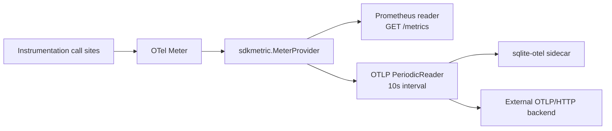

# Telemetry & Observability

Forge's metrics and traces are OpenTelemetry instruments first, and everything else — Prometheus scraping included — is just a reader attached to the same OTel SDK pipeline. There is no parallel metrics system to keep in sync.

## OTel-first, Prometheus as one reader

Every Forge metric is created from an OTel `metric.Meter` — `Int64Counter`, `Float64Gauge`, `Float64Histogram` — and recorded through a small facade (`RecordAPIRequest`, `SetQueueDepth`, `ObserveSchedulerPlacementDuration`, and friends). Internally, `newMeterProviderWithOptions` builds a single `sdkmetric.MeterProvider` and attaches an `otelprom` Prometheus reader (`WithoutTargetInfo`, `WithoutScopeInfo`) to a dedicated `prometheus.NewRegistry()`. When OTLP export is enabled, a `PeriodicReader` is registered on the *same* provider. `otel.SetMeterProvider` makes it the process-global provider, so instrumentation anywhere in forge-go — API middleware, the control-plane listener, supervisors, the worker client — writes into one pipeline.



!!! note "Why this matters"
    Because Prometheus is just a reader over the SDK provider, the `/metrics` output is unaffected by whether OTLP export is on or off. Enabling `--otel-enabled` adds a second consumer of the same instruments — it does not change what gets recorded.

This design landed in a dedicated rework ("Make telemetry OTel-first") that replaced raw Prometheus collectors with OTel metric-API instruments across the package, so `forge_api_requests` and friends are exported to Prometheus with the standard `_total` counter suffix while remaining native OTel instruments underneath.

Even before `telemetry.Start` runs, metrics are safe to record: package `init()` installs a bootstrap `metricState`, and if provider construction ever fails, Forge falls back to a `metricnoop.MeterProvider` plus `promhttp.Handler()` rather than panicking.

## The forge_ metric catalog

Roughly 25 metrics span the API, the control queues, node/agent resource usage, the scheduler, and supervisor/agent lifecycle. All are prefixed `forge_`.

| Metric | Type | Area |
|---|---|---|
| `forge_api_requests` (`_total` on scrape) | Counter | API |
| `forge_api_request_duration_seconds` | Histogram | API |
| `forge_api_inflight_requests` | Gauge | API |
| `forge_queue_depth` | Gauge | Queues |
| `forge_queue_publish` | Counter | Queues |
| `forge_queue_consume` | Counter | Queues |
| `forge_queue_processing_errors` | Counter | Queues |
| `forge_message_lead_time_seconds` | Histogram | Queues |
| `forge_nodes_registered_total` | Counter | Nodes |
| `forge_node_heartbeat_latency_seconds` | Histogram | Nodes |
| `forge_agents_running_total` | Counter | Agents |
| `forge_scheduler_placement_duration_seconds` | Histogram | Scheduler |
| `forge_scheduler_placement_errors` | Counter | Scheduler |
| `forge_agent_evictions` | Counter | Scheduler |
| `forge_available_agent_slots` | Gauge | Scheduler |
| `forge_node_cpu_utilization` | Gauge | Nodes |
| `forge_node_ram_bytes` | Gauge | Nodes |
| `forge_node_disk_free_bytes` | Gauge | Nodes |
| `forge_agent_cpu_cores` | Gauge | Agents |
| `forge_agent_memory_bytes` | Gauge | Agents |
| `forge_supervisor_boot_duration_seconds` | Histogram | Supervisor |
| `forge_supervisor_dependency_pull_errors` | Counter | Supervisor |
| `forge_agent_exit_codes` | Counter | Supervisor |

Plus one meta-metric, `forge.telemetry.startups`, labeled by `forge.telemetry.mode`, so you can see which export mode a given Forge process started in.

Histogram bucket boundaries are tuned per signal via SDK Views: API duration, message lead time, and heartbeat latency use `prometheus.DefBuckets`; scheduler placement uses fine sub-second buckets (`0.001`–`1`); supervisor boot uses coarse buckets (`0.1`–`60`) because dependency resolution plus a Python interpreter start is inherently slow.

Identity flows through as attributes, not separate metrics — `guild_id`, `agent_id`, and `node_id` are recorded as labels on the relevant instruments, so a single `forge_agent_memory_bytes` series can be sliced per agent or per node in your dashboards.

## Two export modes

`telemetry.Start(ctx, telemetry.Config)` turns on trace and metric export. `Config.Mode` selects one of two modes:

| Mode | Value | Destination | Requires |
|---|---|---|---|
| Desktop sqlite | `desktop_sqlite` | Bundled `sqlite-otel` sidecar process, over local OTLP/HTTP | `SQLiteBinaryPath` |
| External OTLP | `external_otlp` | User-supplied OTLP/HTTP collector | `EndpointURL` |

Both modes ship traces to `/v1/traces` and metrics to `/v1/metrics` on the target endpoint. Config validation is strict: `external_otlp` without an endpoint, or `desktop_sqlite` without a binary path, fails fast with an explicit error (`"requires an OTLP endpoint URL"` / `"requires a sqlite-otel binary path"`). Endpoint URLs must parse with an `http`/`https` scheme and a host.

### External OTLP

```bash
forge server --otel-enabled \
  --otel-mode external_otlp \
  --otel-endpoint http://otel-collector:4318 \
  --otel-service-name forge-server
```

Point `--otel-endpoint` at any OTLP/HTTP-compatible collector — a local Collector, a vendor ingest endpoint, whatever your stack already runs. Traces use a `BatchSpanProcessor` (5s batch timeout) and `AlwaysSample()`; metrics use a `PeriodicReader` on a 10s interval.

### Desktop sqlite sidecar

```bash
forge server --otel-enabled \
  --otel-mode desktop_sqlite \
  --otel-sqlite-binary /usr/local/bin/sqlite-otel \
  --otel-sqlite-port 4318
# spans and metrics land in <forge-home>/telemetry/sqlite-otel.db
```

`desktop_sqlite` is the local, zero-infrastructure option: Forge execs the `sqlite-otel` binary with `-port` and `-db-path`, streams its stdout/stderr, and waits up to 5 seconds for the port to accept connections before proceeding. The default DB path is `<forge-home>/telemetry/sqlite-otel.db`; the default port is `4318`. On shutdown, Forge sends `os.Interrupt` and escalates to `SIGKILL` after 3 seconds if the sidecar hasn't exited.

!!! tip "When to use which"
    Use `desktop_sqlite` for local development and the Rustic tracing UI — it needs no external collector and is what the observability-compat API reads from. Use `external_otlp` in any environment where you already run (or want to run) a real observability backend.

If OTLP export isn't configured at all, traces fall back to a pretty-printed `stdouttrace` exporter — useful for quick local debugging without standing up anything.

### Flag reference

| Flag | Default | Purpose |
|---|---|---|
| `--otel-enabled` | `false` | Turn on OTel export from the Forge server |
| `--otel-mode` | `desktop_sqlite` | `desktop_sqlite` or `external_otlp` |
| `--otel-endpoint` | `""` | OTLP/HTTP endpoint URL (`external_otlp`) |
| `--otel-service-name` | `forge-server` | OTel `service.name` |
| `--otel-sqlite-binary` | `""` | Path to the `sqlite-otel` binary (`desktop_sqlite`) |
| `--otel-sqlite-db-path` | `""` | SQLite DB file path (defaults under forge-home) |
| `--otel-sqlite-port` | `4318` | OTLP/HTTP port for the sqlite-otel sidecar |

These map directly onto `telemetry.Config` as wired by `agent.StartServer`:

```go
telemetryRuntime, err := telemetry.Start(serverCtx, telemetry.Config{
    Enabled:          cfg.TelemetryEnabled,
    Mode:             cfg.TelemetryMode,      // "desktop_sqlite" | "external_otlp"
    EndpointURL:      cfg.TelemetryEndpoint,
    ServiceName:      cfg.TelemetryServiceName,
    ServiceVersion:   version.Version,
    SQLiteBinaryPath: cfg.TelemetrySQLiteBinary,
    SQLiteDBPath:     cfg.TelemetrySQLiteDBPath,
    SQLitePort:       cfg.TelemetrySQLitePort,
})
```

`Shutdown` resets the global tracer and meter providers back to no-ops and reinstalls the composite propagator, so `Start`/`Shutdown` is safe to call repeatedly.

## Trace propagation across the HTTP and WS boundary

The global propagator is a composite of **W3C TraceContext** and **Baggage**. Incoming `traceparent` headers are honored on every HTTP entry point via `otelhttp.NewHandler`, and the same context is threaded through the WebSocket boundary into guild execution — so a single trace can span an inbound API request, the queue hop, and the agent processing that eventually runs inside a guild.

```go
// WithLogging middleware
telemetry.RecordAPIRequest(r.Method, r.URL.Path, statusCode, duration)

// WithTelemetry middleware
otelHandler := otelhttp.NewHandler(next, operation) // W3C traceparent extraction
telemetry.AddAPIInflight(r.Method, r.URL.Path, 1)
defer telemetry.AddAPIInflight(r.Method, r.URL.Path, -1)
```

The `TracerProvider` behind this is built with `AlwaysSample()`, a `BatchSpanProcessor`, and a resource carrying `service.name`/`service.version` (semconv v1.24.0). A separate, legacy `InitTracerProvider(ctx, serviceName, otlpEndpoint)` entrypoint still exists for standalone use — it wires an OTLP gRPC exporter (`otlptracegrpc`, insecure) or stdout fallback — but the OTel-first path described above uses OTLP over HTTP instead.

## Client metrics server

Every worker client runs its own metrics HTTP server, independent of the main API server's `/metrics` (served on its `--listen` address, default `:9090`). Bind it with `--client-metrics-addr` (default `:9091`):

```bash
forge server --listen :3001 --with-client \
  --client-node-id local-single-node \
  --client-metrics-addr 127.0.0.1:19091

curl http://127.0.0.1:19091/metrics   # Prometheus text
curl http://127.0.0.1:19091/healthz   # {"status":"ok"}
curl http://127.0.0.1:19091/readyz    # {"status":"ready"}
```

The client mux serves three routes:

| Route | Purpose |
|---|---|
| `GET /metrics` | Prometheus text exposition for this client process |
| `GET /healthz` | Liveness check, returns `{"status":"ok"}` |
| `GET /readyz` | Readiness check, returns `{"status":"ready"}` |

The client samples host CPU, RAM, and disk on a ticker (via `gopsutil`) and records them into `forge_node_cpu_utilization`, `forge_node_ram_bytes`, and `forge_node_disk_free_bytes` — these are per-node resource gauges, distinct from the per-agent `forge_agent_cpu_cores` / `forge_agent_memory_bytes` pair.

!!! warning "Node identity in supervisor metrics"
    Local supervisors (Docker, process, bubblewrap) currently hard-code node identifiers such as `local-node`, `local-docker`, and `local-node-bwrap` as attributes on boot-duration and exit-code metrics, rather than the real node ID. Keep this in mind when building per-node dashboards from `forge_supervisor_boot_duration_seconds` or `forge_agent_exit_codes`.

## Observability-compat API for the Rustic tracing UI

When telemetry runs in `desktop_sqlite` mode, Forge exposes a Rustic-compatible query endpoint that reads spans straight out of `sqlite-otel.db`:

```
GET /rustic/observe/guilds/:guild_id/messages/:msg_id/spans
```

Query parameters `durationInMs` and `rootThreadId` let the Rustic tracing UI scope its lookup; the response shape matches Rustic's existing Zipkin-like span format, so the UI needs no changes to consume Forge-generated traces.

This endpoint only works with the local sqlite-otel store — if telemetry is running in `external_otlp` mode, there is no local span database to query, and the endpoint returns:

```
501 Not Implemented
"observability spans query is only available with desktop sqlite telemetry"
```

External OTLP users should query their own backend (Tempo, Jaeger, a vendor UI, etc.) directly instead.

## Related

- [Quickstart](../getting-started/quickstart/)
- [Scheduler](distributed-scheduling/)
- [Supervisors](supervision-recovery/)
