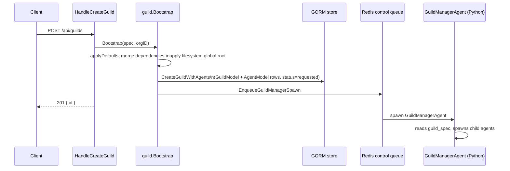

# Your First Guild

A guild is the unit of deployment in Forge: a named, persisted multi-agent system that you submit once and Forge keeps running. This page takes you from a running server to a launched guild with a single echoing agent, and shows you where to watch it come to life.

!!! note "Before you start"
    You need a running Forge server. If you don't have one yet, follow the [Quickstart](quickstart/) to start `forge server --with-client` locally.

## Create the guild

A guild is created with a single HTTP call: `POST /api/guilds`. The request body is a `CreateGuildRequest` — an `organization_id` plus a `spec` (`protocol.GuildSpec`). The minimal spec you need is an ID, a name, a description, and at least one agent.

Here's a guild spec with one `EchoAgent`:

```bash
curl -X POST http://localhost:9090/api/guilds \
  -H 'Content-Type: application/json' \
  -d '{
    "organization_id": "acme",
    "spec": {
      "id": "my-guild-01",
      "name": "My Guild",
      "description": "demo",
      "agents": [
        {
          "name": "Echo",
          "description": "echoes",
          "class_name": "rustic_ai.agents.EchoAgent"
        }
      ]
    }
  }'
```

A successful call returns `201 Created` with the guild's `id`:

```json
{ "id": "my-guild-01" }
```

!!! warning "201 means accepted, not running"
    The HTTP response only confirms that Forge accepted and persisted your spec. It does **not** mean the guild is up. Launch is asynchronous — see [Watch it launch](#watch-it-launch-the-syscomms-event-stream) below.

## The minimal guild shape

Whether you write it as JSON (as above) or YAML, a guild spec needs four things at minimum:

```yaml
id: my-guild-01
name: My Guild
description: demo
agents:
  - name: Echo
    description: echoes
    class_name: rustic_ai.agents.EchoAgent
```

- **`id`** — the guild's unique identifier. Omit it and Forge generates a short UUID (unless `FORGE_STATIC_GUILD_ID` is set).
- **`name`** — 1-64 characters; validated on submission.
- **`description`** — must be non-empty.
- **`agents[].class_name`** — the Python dotted path to the agent implementation. This is the only required field per agent; `EchoAgent` here is `rustic_ai.agents.EchoAgent`.

Larger guild definitions can split agents into separate files using the `!include` and `!code` YAML tags, and can be authored fluently in Go with `guild.NewGuildBuilder()`. See [Guild Authoring](../guides/authoring-guild-specs/) for both.

## What happens when you POST

`HandleCreateGuild` hands your spec straight to `guild.Bootstrap`, which does the real work of turning a declarative spec into a running system:



Concretely, `Bootstrap` (`guild/bootstrap.go`):

1. **Applies defaults** — execution engine and messaging backend if unset (runtime defaults to `rustic_ai.forge.execution_engine.ForgeExecutionEngine` and Redis messaging).
2. **Merges dependencies** — spec-level dependency entries win, then forge-home's `agent-dependencies.yaml`, then the `--dependency-config` path; the merge only fills in missing keys.
3. **Rewrites filesystem dependency roots** if `FORGE_FILESYSTEM_GLOBAL_ROOT` is set.
4. **Persists the guild** — builds a `GuildModel` and one `AgentModel` per agent and writes them via `db.CreateGuildWithAgents`. The guild status is set to `requested`; each agent's status is `not_launched`.
5. **Normalizes IDs** — agent IDs without an explicit value are rewritten to `<guildID>#<agentID>`.
6. **Enqueues the GuildManagerAgent (GMA)** — `EnqueueGuildManagerSpawn` pushes a `SpawnRequest` for the system agent `rustic_ai.forge.agents.system.guild_manager_agent.GuildManagerAgent` (ID `<guildID>#manager_agent`), listening on `system_topic`, `heartbeat_topic`, and `guild_status_topic`.

From there, the control plane's `queueListener.OnSpawn` picks up the spawn request, reconstructs the canonical spec via `store.ToGuildSpec`, and hands it to the Python runtime through `FORGE_GUILD_JSON`. The Python GuildManagerAgent takes it from there, using `ForgeExecutionEngine` to request your `EchoAgent`'s launch — rather than forking a child directly, it dispatches a `spawn` command over the control queue (Redis or NATS) and waits for a response, and the Go supervisor is what actually execs the agent as its own process.

!!! tip "The persisted spec is canonical"
    Every downstream spawn re-reads the guild from the store rather than trusting the original request payload. Normalization and defaulting happen once, in `Bootstrap`, before the first write.

## Watch it launch: the syscomms event stream

Because launch is asynchronous, the way to see real progress — or a real failure — is the `syscomms` WebSocket, not the HTTP response. Connect to:

```
GET /ws/guilds/{id}/syscomms/{user_id}
```

This socket subscribes to `guild_status_topic` and `infra_events_topic`, among others. The moment it connects, Forge publishes a `HealthCheckRequest` to prompt the guild manager to report in, and infrastructure lifecycle events (agent process starts, failures, retries) stream in as `InfraEvent` payloads:

```json
{
  "schema_version": 1,
  "event_id": "abc123",
  "kind": "agent.process.failed",
  "severity": "error",
  "timestamp": "2026-03-25T23:31:55.000Z",
  "guild_id": "my-guild-01",
  "agent_id": "echo-agent",
  "attempt": 1,
  "message": "agent process failed after retry exhaustion",
  "detail": { "error": "Read-only file system" }
}
```

Demux incoming messages by `format` and `topic_published_to` — health reports, status updates, and infra events all arrive interleaved on the same socket. Full wire details are in the [WebSocket Gateway](../features/gateway-websockets/) page.

## Inspect the guild

Once you've created a guild, fetch its current state at any time:

```bash
curl http://localhost:9090/api/guilds/my-guild-01
```

The response reflects what's persisted in the store — guild status (`requested`, `starting`, `running`, `stopped`, `stopping`, `warning`, `backlogged`, `error`, or `unknown`), its agents, and their individual statuses (`not_launched`, `starting`, `running`, `stopped`, `error`, `deleted`).

## Relaunch a guild

If the guild manager isn't running — say, after a crash or a node restart — re-enqueue it without resubmitting the spec:

```bash
curl -X POST http://localhost:9090/api/guilds/my-guild-01/relaunch
```

`HandleRelaunchGuild` checks the manager's live status first: if the GMA isn't already running, it re-enqueues the spawn and records the attempt in the `guilds_relaunch` table. If the guild's status is `stopped` or `stopping`, relaunch is refused — stop implies an intentional shutdown, not a crash to recover from.

## Talk to your guild

Creating and launching a guild only gets an `EchoAgent` running — to actually exchange messages with it, open a `usercomms` WebSocket:

```
GET /ws/guilds/{id}/usercomms/{user_id}/{user_name}
```

This is the conversational channel, separate from `syscomms`. Continue to the [WebSocket Gateway](../features/gateway-websockets/) page for the full picture of both socket kinds, message envelopes, and tracing.

## Next steps

- [Guild Authoring](../guides/authoring-guild-specs/) — YAML includes, fluent Go builders, routing, and dependency resolution.
- [WebSocket Gateway](../features/gateway-websockets/) — usercomms vs. syscomms, canonical vs. proxy-compat wire shapes, and message lineage.
- [Quickstart](quickstart/) — get a server running locally if you haven't already.
