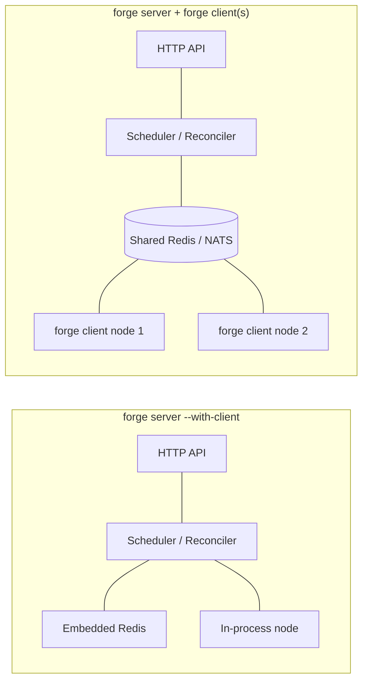

# Getting Started Overview

Forge runs guilds — multi-agent systems — by splitting the work between a Go control plane and a Python execution bridge. This page tells you what you need installed, how the two run modes differ, where Forge keeps its state, and what order to read the rest of this section in.

## Prerequisites

Forge is two deliverables working together: `forge-go` (the `forge` binary — process spawning, scheduling, storage, distributed node support) and `forge-python` (the execution bridge and system agents, notably `GuildManagerAgent`). Install for both before you run anything.

| Requirement | Why |
|---|---|
| Go 1.25+ | Builds the `forge` binary (`go.mod` pins `go 1.25.0`) |
| Python 3.13 | Runtime for `forge-python` agent processes |
| `uv` + `uvx` on PATH | Spawns and installs the Python agent runtime from `forge-python` |
| Docker | Required for some integration/e2e scenarios and the `docker` process supervisor |
| `jq`, `curl` | Used throughout the [runbook](quickstart/) to inspect API responses |

Verify each one before you start:

```bash
go version        # go1.25.0 or newer
uvx --version      # uv/uvx must resolve on PATH
docker info        # only required for Docker-backed scenarios
```

!!! note
    `uv` and `uvx` are non-negotiable even for single-process mode: every run that spawns an agent shells out through `uvx` to install and launch `forge-python`.

## The forge binary and forge-python

The `forge` binary (built from `forge-go/main.go`, module `github.com/rustic-ai/forge/forge-go`) is a single Cobra CLI with three subcommands: `server`, `client`, and `version`. It never runs agent code itself — it schedules, monitors, and supervises agent *processes*, which are Python processes provided by `forge-python`.

That means **`FORGE_PYTHON_PKG` must point at your local `forge-python` checkout for any run that spawns agents** — the quick start, a distributed client, or an e2e test:

```bash
export FORGE_PYTHON_PKG="/absolute/path/to/forge-python"
```

Without it, the supervisor has nothing to hand `uvx` when it tries to install and start an agent, and spawn requests will fail.

## Single-process vs distributed

Forge runs the same control-plane and worker logic in two shapes.



**Single-process** (`forge server --with-client`) starts the HTTP API, an embedded miniredis broker (default `127.0.0.1:6379`), a SQLite metastore, and an in-process compute node — all in one OS process. Choose this for local development, demos, and debugging: one command, one log stream, nothing else to keep in sync.

**Distributed** (`forge server` plus one or more `forge client --server http://host:port --redis host:6379` processes) splits the control plane from worker nodes. The server places agents onto clients by capacity (CPU/memory/GPU) via the Node Registry and Global Scheduler; clients pull spawn requests off a per-node Redis queue (`forge:control:node:<node_id>`) and run them under a Process Supervisor. Choose this when you need more compute than one machine offers, want workers on separate hosts, or are testing failure/recovery behavior (the Reconciler evicts dead nodes and re-queues their agents every 15s).

| | Single-process | Distributed |
|---|---|---|
| Processes | 1 | 1 server + N clients |
| Broker | Embedded miniredis (auto) | Shared Redis or NATS, explicit `--redis`/`--nats` |
| Metastore | SQLite, same process | SQLite (or other DSN), server process |
| Use for | Local dev, demos, quick tests | Multi-host capacity, resilience testing, production topology |
| Key flag | `--with-client` | `--server`, shared `--redis`/`--nats` |

Server and client(s) **must share the same messaging backend** in distributed mode — if the server uses `--backend nats --nats <addr>`, every client needs the matching `--nats` flag, not `--redis`.

```bash
# Single-process
FORGE_PYTHON_PKG="$FORGE_REPO_DIR/forge-python" \
"$FORGE_REPO_DIR/forge-go/bin/forge" server \
  --listen :3001 \
  --db sqlite:////tmp/forge-local.db \
  --with-client \
  --client-node-id local-single-node \
  --client-metrics-addr 127.0.0.1:19091
```

```bash
# Distributed: control plane + a separate worker node
"$FORGE_REPO_DIR/forge-go/bin/forge" server --listen :3001 --db sqlite:////tmp/forge-server.db

FORGE_PYTHON_PKG="$FORGE_REPO_DIR/forge-python" \
"$FORGE_REPO_DIR/forge-go/bin/forge" client --server http://127.0.0.1:3001 --redis 127.0.0.1:6379
```

The compiled defaults are `--listen :9090` and `--db sqlite://<forge-home>/data/forge.db` — the `:3001` / `/tmp/forge-local.db` values above are explicit overrides used by the runbook, not the built-in defaults.

## Where data lives

Every path Forge writes to derives from a single root: **`FORGE_HOME`**, resolved with this precedence:

1. `--forge-home` flag
2. `FORGE_HOME` environment variable
3. `~/.forge` (falling back to a temp directory if unavailable)

Under that root:

```
$FORGE_HOME/
├── data/
│   ├── forge.db        # SQLite metastore (default DSN: sqlite://<forge-home>/data/forge.db)
│   └── workspaces/      # file store for guild/agent working data
└── conf/                 # dependency map, local model catalog, OAuth provider config
```

The **metastore** (SQLite by default, configurable via `--db`) holds control-plane state — nodes, placements, guild/agent records. The **data directory** (`--data-dir`, default under `$FORGE_HOME/data`) is where per-workspace files live for guilds and agents. You can point `--db` at a different DSN if you need a non-default metastore location, but the data directory and `FORGE_HOME` layout follow the same resolution rule everywhere in the codebase.

## Reading path

Work through this section in order:

1. **[Installation](installation/)** — get the `forge` binary built (or installed) and `forge-python` in place.
2. **[Quickstart](quickstart/)** — run `forge server --with-client`, hit `/healthz`, and confirm the single-process stack works end to end.
3. **[Your First Guild](first-guild/)** — register a blueprint and run an actual multi-agent guild against your running server.

!!! tip
    If you only remember one thing from this page: single-process for iterating locally, distributed for anything that needs more than one machine or needs to survive a worker dying.
