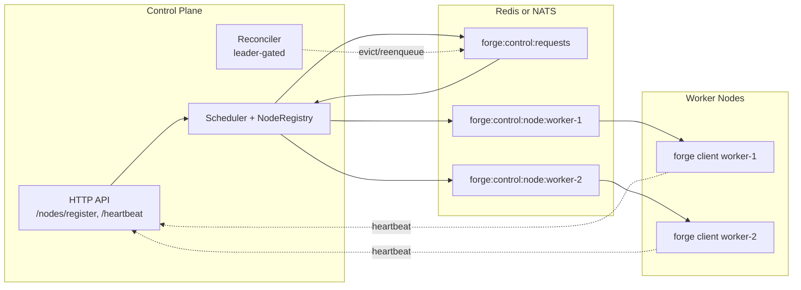

# Distributed Deployment

A single `forge server --with-client` process is fine for a laptop. A real cluster is a control-plane `server` and one or more `client` worker nodes sharing one message broker — this page covers how to stand that up, size it, and keep it available.

## Topology

Forge's distributed mode splits the binary's two roles across processes:

- **`forge server`** runs the control plane: HTTP API, metastore, `NodeRegistry`, `Scheduler`, `PlacementMap`, and the leader-gated `Reconciler`.
- **`forge client`** runs a worker node daemon: it registers its capacity with the server, listens on its own dispatch queue, and launches agent processes through a supervisor.

Both sides talk to each other only through the broker (Redis lists or NATS JetStream) and the node-registration HTTP endpoints — there is no direct RPC for placement.



## Start the server and worker nodes

Run the control plane on one host, and one `client` per worker host, all pointed at the same broker.

```bash
# Control plane
./bin/forge server --listen :3001 --db sqlite:////tmp/forge-server.db

# Worker node 1 (separate host/process)
FORGE_PYTHON_PKG=/opt/forge/forge-python \
./bin/forge client \
  --server http://control-plane.internal:3001 \
  --redis redis.internal:6379 \
  --node-id worker-1 \
  --cpus 8 --memory 16384 --gpus 0

# Worker node 2
FORGE_PYTHON_PKG=/opt/forge/forge-python \
./bin/forge client \
  --server http://control-plane.internal:3001 \
  --redis redis.internal:6379 \
  --node-id worker-2 \
  --cpus 16 --memory 32768 --gpus 1
```

`--node-id` defaults to the machine hostname if omitted. `FORGE_PYTHON_PKG` must point at `forge-python` on every worker host — it's how the client resolves and launches the agent runtime via `uvx`.

Under the hood, a client node:

1. Registers itself with `POST /nodes/register` (`NodeRegistrationRequest{node_id, capacity{cpus, memory, gpus}}`), returning `201 Created`.
2. Sends `POST /nodes/{node_id}/heartbeat` on an interval to keep `NodeState.LastHeartbeat` fresh.
3. Listens for spawn/stop commands on its own queue, `forge:control:node:<node_id>`.

!!! note "404 triggers re-registration"
    If a heartbeat gets a `404`, the registry has evicted the node (see [dead-node eviction](#operational-thresholds) below) and the client re-registers from scratch rather than retrying the stale heartbeat.

## Declaring node capacity

Capacity flags tell the scheduler what a node can hold, and the scheduler will never place more work on a node than its declared capacity allows:

| Flag | Meaning | Consumed as |
|---|---|---|
| `--cpus` | Node's total CPU count | `ResourceCapacity.CPUs` |
| `--memory` | Node's total memory, in MB | `ResourceCapacity.Memory` |
| `--gpus` | Node's total GPU count | `ResourceCapacity.GPUs` |

(The single-process `server --with-client` variants of the same flags are `--client-cpus`, `--client-memory`, `--client-gpus`.)

Placement is driven entirely by these numbers. `Scheduler.Schedule` reads the requested resources off the `AgentSpec` (`ResourceSpec.NumCPUs` / `NumGPUs`, plus `CustomResources["memory"]`), filters to healthy nodes with enough *remaining* capacity, and picks the node with the highest score:

```go
score := remMem + (remCPUs * 1024)
```

That's a **most-free / worst-fit** bias, not bin-packing: Forge spreads load onto the emptiest node rather than tightly filling one node first. If no node has enough headroom you get `no node with sufficient capacity [...]`; if the fleet is empty (or every node is unhealthy) you get `no healthy nodes available in the cluster`. On a successful match, capacity is immediately debited via `AllocateCapacity` and released again when the placement clears.

!!! tip "Size for burst, not steady state"
    Because scoring favors the most-idle node, a fleet of similarly-sized nodes will fan work out evenly. If you mix small and large nodes, expect the large ones to absorb a disproportionate share until they're the tightest fit too.

## Choosing a broker: Redis vs NATS

Both messaging, the control plane, and the agent status store share one transport, selected with `--backend`:

```bash
# Redis (default) — either flag works, --redis just overrides the address
./bin/forge server --backend redis --redis redis.internal:6379

# NATS
./bin/forge server --backend nats --nats nats://nats.internal:4222
```

| | Redis | NATS |
|---|---|---|
| Data plane | Redis Lists (`BRPOP`/`LPUSH`) | JetStream work-queue streams (`CTRL_<key>`, `AckSync`, 5m MaxAge) |
| Messaging history | Per-topic ZSET + direct-lookup string cache | JetStream stream + per-namespace KV bucket |
| Live delivery | `PUBLISH`/`PubSub` | Core NATS pub/sub |
| Selector | `--backend redis` (default) | `--backend nats`, `--nats nats://...` |
| Embedded fallback | miniredis on `--embedded-redis-addr` (default `127.0.0.1:6379`) if `--redis` omitted | embedded JetStream NATS on `--embedded-nats-addr` if `--nats` omitted |

The switch that actually matters in `agent/server.go` is whether a NATS URL is present: `natsURL != ""` selects the whole NATS stack — messaging, control-plane queues, and the agent status store all move to NATS together. There's no way to run messaging on NATS while control stays on Redis.

`--redis` is **not** made redundant by `--backend nats`. Even with `--backend nats`, you can (and for HA, should) still pass `--redis` — it's used for **leader election** (`RedisElector`'s `SET NX` lock on `forge:control:leader`), which does not have a NATS-native implementation in Forge. If you run NATS messaging with multiple server replicas and no Redis, you fall back to Raft or single-node election instead.

Every `forge client` must be started with the same `--backend`/`--redis`/`--nats` coordinates as the server — a worker pointed at the wrong broker will register and heartbeat, but never see its dispatch queue.

## High availability

### Leader election

The Reconciler is single-writer: only the elected leader runs `reconcileDeadNodes`, `reconcileAccepted`, `reconcileStaleDispatches`, `reconcileStaleAcks`, and `cleanupFailedPlacements`. Every other server replica ticks its own reconcile loop but skips it (`if !elector.IsLeader() { continue }`), which is what prevents two replicas from double-scheduling the same orphaned agent.

Forge picks the election mode automatically: **raft** if `LeaderElectionMode=="raft"`, else **Redis** if a Redis client exists, else **single-node**.

| Mode | Mechanism | Use when |
|---|---|---|
| `raft` | HashiCorp Raft for consensus + memberlist gossip for discovery; dummy FSM (leadership only, no replicated state); self-bootstraps as seed if no join peers | Multiple server replicas, no shared Redis, or you want consensus-based failover independent of the data broker |
| `redis` (default when Redis is configured) | `SET NX` lock on `forge:control:leader`, 5s TTL, Lua compare-and-extend renewal at `ttl/3`, re-acquire attempts at `ttl/2` | Multiple server replicas already sharing Redis |
| single-node | Immediately leader, no coordination | One server process (including `--with-client` single-process mode) |

Run multiple control-plane replicas with Raft like this:

```bash
# Server replica 1 (seed)
./bin/forge server --listen :3001 \
  --raft-bind 10.0.0.1:7300 \
  --gossip-bind 10.0.0.1:7301

# Server replica 2 (joins the gossip ring)
./bin/forge server --listen :3001 \
  --raft-bind 10.0.0.2:7300 \
  --gossip-bind 10.0.0.2:7301 \
  --gossip-join 10.0.0.1:7301
```

!!! warning "Raft has no durable state of its own"
    `RaftElector` uses an in-memory log/stable store and a no-op FSM — it decides leadership only. Durable cluster facts (spawn payloads, agent status) live in Redis/NATS, not in Raft. A full restart of every server replica loses Raft history but not cluster state.

### Reconciliation is what makes this HA

Because `PlacementMap` is in-memory per control-plane process, HA depends on the reconciler and the distributed `AgentStatusStore`, not on replicating placement state:

- A dead worker's orphaned agents are detected, deregistered, and **re-enqueued onto the global queue** (`forge:control:requests`) — recovery looks identical to a brand-new spawn.
- Stale dispatches/acks are cross-checked against `AgentStatusStore.GetStatus` (`"starting"`/`"running"`) before being retried, so a message that was actually delivered isn't redundantly resent.
- A control-plane restart loses in-memory placement tracking, but the idempotency gates (server-side `IsActivelyTracked`, worker-side cross-node status check) prevent duplicate launches once reconciliation resumes.

See [Reconciliation & Failure Recovery](../concepts/placement-reconciliation/) (or the scheduler internals) for the full phase-by-phase behavior.

## Supervisors and agent transports

Each worker node chooses how it launches agent processes and how those processes reach the Go message bus:

```bash
./bin/forge client \
  --server http://control-plane.internal:3001 \
  --redis redis.internal:6379 \
  --default-supervisor docker \
  --default-agent-transport supervisor-zmq \
  --zmq-bridge-mode ipc
```

| Flag | Options | What it controls |
|---|---|---|
| `--default-supervisor` | `docker`, `bwrap` | How the agent process is sandboxed/launched on the node |
| `--default-agent-transport` | `direct`, `supervisor-zmq` | How the agent process talks to the Go `messaging.Backend` |
| `--zmq-bridge-mode` | `ipc`, `tcp` | Transport for the `supervisor-zmq` bridge socket |

With `supervisor-zmq`, the Go side runs an `AgentMessagingBridge` over a ZeroMQ PAIR socket (Unix `ipc://` by default, keyed off a sha1 digest of `workDir|guildID|agentID`, or `tcp://` if you need cross-container/cross-host bridging). The Python agent process talks to this bridge instead of hitting Redis/NATS directly — useful when supervisors like `docker` isolate the agent's network namespace and you don't want to punch a broker connection through it. `direct` skips the bridge entirely and is the simpler default when the agent process can reach the broker itself.

The server's own in-process client (`--with-client`) exposes the same choices as `--client-default-supervisor` / `--client-default-agent-transport` / `--client-zmq-bridge-mode`.

## Operational thresholds

Three timers govern how quickly the cluster notices and reacts to a failing node. They are intentionally staggered:

| Threshold | Value | Where enforced | Effect |
|---|---|---|---|
| Heartbeat interval | 5s | client → `POST /nodes/{node_id}/heartbeat` | Keeps `NodeState.LastHeartbeat` current |
| Unhealthy | 10s of heartbeat silence | `NodeRegistry.IsHealthy` / `ListHealthy` | Node stops receiving new placements (invisible to `Scheduler.Schedule`) but is not yet evicted |
| Dead-node eviction | 15s of heartbeat silence | `Reconciler.reconcileDeadNodes` (`DeadNodeTimeout`) | Node is `Deregister`ed, its agents are pulled via `AgentsOnNode`, and each orphan is re-enqueued onto `forge:control:requests` |

!!! note "The 10s–15s gap is by design, not a bug"
    Between 10s and 15s of silence a node is unschedulable but not yet reclaimed — this gives a node that's merely slow (GC pause, brief network blip) a chance to recover its heartbeat before the reconciler tears down and redistributes its agents.

Full `ReconcilerConfig` defaults, for reference:

```go
ReconcilerConfig{
    ReconcileInterval: 15 * time.Second,
    AckTimeout:        30 * time.Second,
    LaunchTimeout:     120 * time.Second,
    MaxAttempts:       5,
    DeadNodeTimeout:   15 * time.Second,
    FailedCleanupAge:  5 * time.Minute,
}
```

## Verifying the cluster

```bash
# Confirm the server is up
curl -sS http://control-plane.internal:3001/healthz   # -> {"status":"ok"}

# List currently healthy nodes
curl -sS http://control-plane.internal:3001/nodes
```

`GET /nodes` returns the JSON array of healthy `NodeState` entries — a quick way to confirm every `forge client` you started registered and is still within the 10s heartbeat window.

## Related

- [Quickstart](../getting-started/quickstart/) for the single-process (`--with-client`) equivalent of this same topology.
- [Reconciliation & Failure Recovery](../concepts/placement-reconciliation/) for the full dead-node/stale-dispatch/stale-ack recovery flow.
- [Messaging Backends](../internals/messaging-backends/) for Redis/NATS configuration details beyond the broker choice covered here.
