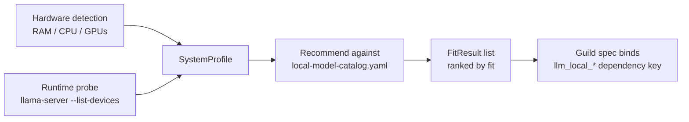

# Model Fit for Local LLMs

Forge can tell you which local LLMs will actually run well on the machine you're on — not just which ones are downloaded. The model-fit subsystem profiles your hardware, probes the local llama.cpp runtime, and scores every model in Forge's curated catalog against that specific machine, so a guild's `llm` dependency can be bound to a model that fits instead of one that guesses.

This guide walks through pointing Forge at your llama.cpp server, reading the two fit-recommendation endpoints, and binding a specific local model in a guild spec.

## How it works



Two things get merged into a `SystemProfile`: static hardware detection (RAM, CPU cores, GPU inventory) and a live probe of your `llama-server` binary. The distinction matters — a machine can have an NVIDIA GPU installed and still be reported as CPU-only if the llama.cpp build on disk wasn't compiled with CUDA support. Forge scores catalog models against whichever memory pool the runtime can actually use, not against the GPU's spec sheet.

!!! note "Scope"
    This is a deliberately small subset of the broader `llmfit` project: no model downloads, no cloud-provider fit scoring, and no Ollama/LM Studio/vLLM support in v1. It answers exactly one question — which curated local models fit this machine — using the llama.cpp server Forge already runs.

## Point Forge at your llama.cpp server

Runtime capability detection works by shelling out to your `llama-server` binary with `--list-devices` and parsing what it reports. Forge needs to find that binary:

```bash
export FORGE_MODELFIT_LLAMA_BINARY=/usr/local/bin/llama-server
```

If the variable isn't set, Forge falls back to `exec.LookPath("llama-server")` — i.e., whatever's on `PATH`. If no binary is found or the probe fails, Forge doesn't error; it degrades gracefully to a CPU-only profile and records a reason code (`runtime_binary_missing`, `runtime_probe_failed`) so you can see why acceleration wasn't detected.

**The probe is cached.** Probing a binary means launching a process and waiting up to 3 seconds, so Forge caches the result to disk (default `cache/modelfit-runtime-probe.json`, overridable via `FORGE_MODELFIT_RUNTIME_CACHE`). The cache key is `GOOS`, `GOARCH`, the binary path, its file size, and its mtime — so replacing the binary (a version bump, a rebuild with a different backend) automatically invalidates the cache on the next call. You don't need to clear it manually.

!!! tip "Confidence tells you whether the probe actually ran"
    `SystemProfile.Confidence` is one of `unknown < heuristic < strong < probe`. Only `probe` means the runtime was genuinely queried this session (or from a still-valid cache). `heuristic` means Forge fell back to CPU assumptions — usually because the binary wasn't found.

## Query capabilities: what does this machine look like?

```bash
curl 'http://localhost:PORT/rustic/modelfit/capabilities'
```

This returns the full `SystemProfile` as JSON: total/available RAM, CPU core count and name, GPU inventory (`HasGPU`, `GPUCount`, `TotalVRAMBytes`), the selected `Backend`, `UnifiedMemory`, `SelectedAcceleratorID`, `RuntimeUsableAcceleration`, `Confidence`, and `ReasonCodes` — plus the embedded `HardwareProfile` and `RuntimeCapabilityProfile` with per-device detail.

**Reason codes are the diagnostic layer.** Every non-obvious detection outcome gets a stable, machine-readable code plus a human-readable explanation. The ones you'll see most:

| Reason code | Meaning |
|---|---|
| `runtime_binary_missing` | `llama-server` wasn't found on `PATH` or at `FORGE_MODELFIT_LLAMA_BINARY` |
| `runtime_probe_failed` | The binary exists but `--list-devices` failed or timed out |
| `no_runtime_devices` | The probe ran but reported zero usable devices |
| `nvidia_present_but_runtime_cpu_only` | An NVIDIA GPU exists, but this llama.cpp build can't offload to it |
| `amd_detected_but_rocm_unavailable` | An AMD GPU exists, but ROCm isn't available to the runtime |
| `intel_integrated_shared_memory_only` | Intel integrated graphics detected; treated as shared-memory only |
| `hybrid_gpu_present_offload_not_usable` | Laptop with both discrete and integrated GPUs; the discrete GPU isn't usable for offload |
| `runtime_device_detected` | The runtime confirmed a usable accelerator |

Each code maps to a full sentence in `FitResult.Explanations`, so the UI (or you, reading the JSON) never has to memorize the table above.

## Query recommendations: which models fit?

```bash
curl 'http://localhost:PORT/rustic/modelfit/local-models?use_case=coding&runnable_only=true&limit=3'
```

Query parameters:

| Param | Behavior |
|---|---|
| `use_case` | Filters to models whose `use_case_tags` include this value (e.g. `chat`, `coding`) |
| `limit` | Caps the number of results; a non-integer value returns `400 invalid limit` |
| `runnable_only` | Drops models whose `fit_level` is `too_tight`. Accepts `1`, `true`, `yes`, `y`, `on` |

The response is a JSON array of `FitResult`, one entry per catalog model, already ranked best-first:

```json
[
  {
    "dependency_key": "llm_local_qwen3_5_0_8b",
    "display_name": "Qwen 3.5 0.8B Starter",
    "model_name": "openai/rustic/qwen3.5-0.8b-starter",
    "fit_level": "perfect",
    "runnable": true,
    "score": 471.5,
    "estimated_memory_bytes": 1288490189,
    "available_memory_bytes": 8589934592,
    "utilization_pct": 15.0,
    "estimated_tokens_per_second": 59.5,
    "selected_backend": "cuda",
    "selected_accelerator_id": "gpu0",
    "runtime_usable_acceleration": true,
    "confidence": "probe",
    "use_case_tags": ["chat", "coding"],
    "reason_codes": ["runtime_device_detected"],
    "explanations": ["A usable CUDA accelerator was detected by the runtime probe."]
  }
]
```

**Reading the fields that decide "should I bind this model":**

- `fit_level` — one of `perfect`, `good`, `marginal`, `too_tight`, from memory utilization: `<=70%` perfect, `<=85%` good, `<=100%` marginal, otherwise (or no available memory) too tight.
- `runnable` — `true` for anything except `too_tight`.
- `utilization_pct` / `available_memory_bytes` — what fraction of the selected memory pool the model needs and how big that pool is.
- `estimated_tokens_per_second` — optional, coarse. If the catalog entry has a `token_speed_hint`, it's scaled by backend class (discrete accelerator ×1.0, unified/integrated accelerator ×0.7, CPU ×0.2); otherwise it falls back to a flat base rate divided by parameter count. Treat it as a tie-breaker signal, not a benchmark.
- `score` — the ranking value: fit-level base (perfect 400 / good 300 / marginal 200 / too-tight 100) plus a quality term, plus token/s (capped at 100), minus utilization (capped at 150).
- `explanations` — ordered, human-readable sentences derived from `reason_codes`; show these directly in a UI rather than the raw codes.

Results are ordered by `compareResults`: runnable models first, then higher fit level, then higher score, then smaller `estimated_memory_bytes`, then `dependency_key` alphabetically. That last tie-breaker exists purely for determinism — given the same system and catalog, you get the same ordering every time.

## Memory-pool selection: unified vs. discrete

The single most important nuance in fit evaluation is *which* memory pool a model's requirement gets compared against, and that depends on what kind of accelerator the runtime probe confirmed usable:

- **Runtime-usable unified or integrated accelerator** (Apple Silicon, most laptop iGPUs) — the model's required memory is compared against **system available RAM**, because unified memory is shared with the OS.
- **Runtime-usable discrete accelerator** (a dedicated NVIDIA/AMD card the probe confirmed) — the comparison is against **that accelerator's `TotalMemoryBytes`**, i.e. actual VRAM, not system RAM.
- **`preferred_discrete_gpu` model, GPU physically present, but runtime can't use it** — evaluation falls back to comparing against system RAM, and the result carries an explanation noting that acceleration isn't usable (e.g. `nvidia_present_but_runtime_cpu_only`). The model may still be runnable on CPU, just scored accordingly.

Required memory itself is `max(the applicable min/preferred field, estimated_memory_bytes)` — the catalog's `estimated_memory_bytes` is authoritative and validated to be non-zero at load time, so it always sets a floor.

!!! warning "Hybrid GPU laptops"
    A laptop with both a discrete NVIDIA GPU and Intel integrated graphics gets the discrete device flagged `hybrid_gpu_present_offload_not_usable` when the runtime can't reliably offload to it in that configuration. Don't assume "has an NVIDIA GPU" implies discrete-memory scoring — check `runtime_usable_acceleration` and `selected_accelerator_id` on the result.

## Bind a specific local model in a guild spec

By default, a blueprint that needs an `llm` dependency binds the generic `llm` key, which resolves according to whatever the environment's default is. Once you've queried `/rustic/modelfit/local-models` and picked a runnable, well-scoring model, bind its `dependency_key` directly instead:

```bash
curl 'http://localhost:PORT/rustic/modelfit/local-models?use_case=coding&runnable_only=true&limit=1'
# -> top result: dependency_key = "llm_local_qwen3_5_0_8b"
```

Use that key in place of the generic `llm` dependency when constructing the guild/agent spec, so the agent binds to that specific local model's resolver instead of the fallback. This is exactly the flow the Rustic launch UI uses: when a blueprint declares an `llm` dependency, it calls this endpoint, takes the best runnable candidate, and preselects `llm_local_qwen3_5_0_8b` (or whichever key ranked first) in the launch modal.

!!! note "Model fit informs, it never rewrites"
    The model-fit subsystem only *reports* recommendations — it never modifies an `AgentSpec` on its own. Binding the recommended dependency key into the guild spec is a deliberate step taken by the caller (UI or operator), not a side effect of querying the endpoint.

## Customize the catalog and dependency map

Every curated local model is defined in two files, joined by `dependency_key`:

**`conf/local-model-catalog.yaml`** carries fit metadata — the numbers used for scoring:

```yaml
models:
  - id: qwen3_5_0_8b_starter
    display_name: Qwen 3.5 0.8B Starter
    dependency_key: llm_local_qwen3_5_0_8b
    model_name: openai/rustic/qwen3.5-0.8b-starter
    parameter_count_b: 0.8
    quantization: q4_k_m
    context_length: 32768
    min_ram_bytes: 2147483648
    preferred_vram_bytes: 1610612736
    estimated_memory_bytes: 1288490189
    embedding_only: false
    use_case_tags: [chat, coding]
    quality_rank: 5
    token_speed_hint: 70
    preferred_discrete_gpu: true
```

**`conf/agent-dependencies.yaml`** carries resolver wiring for that same key:

```yaml
llm_local_qwen3_5_0_8b:
  class_name: rustic_ai.litellm.agent_ext.llm.LiteLLMResolver
  provided_type: rustic_ai.core.llm.LLM
  properties:
    model: openai/rustic/qwen3.5-0.8b-starter
    base_url: http://localhost:55262/v1
```

All curated local models in the default catalog point at the same OpenAI-compatible llama.cpp server (`http://localhost:55262/v1`) — only the `model` name differs.

Override either file's path with environment variables:

```bash
export FORGE_LOCAL_MODEL_CATALOG=/etc/forge/local-model-catalog.yaml
export FORGE_DEPENDENCY_CONFIG=/etc/forge/agent-dependencies.yaml
```

`LoadProfiles` validates the join strictly at startup and fails fast on:

- a catalog entry with no `dependency_key`, or a duplicate key
- a `dependency_key` with no matching entry in the dependency map
- a missing `class_name` on the dependency side
- a catalog `model_name` that doesn't match the dependency entry's `properties.model`
- missing identity or fit-metadata fields (including a zero `estimated_memory_bytes`)

!!! warning "Keep model names in sync"
    If you edit `model_name` in the catalog, update `properties.model` in the dependency map in the same change. A mismatch is a hard load error, not a warning — Forge won't start the model-fit service with an inconsistent catalog.

Cloud LLM dependency keys (`llm_openai`, `llm_anthropic_sonnet`, `llm_anthropic_opus`, `llm_gemini`, `llm_vertexai`, `llm_bedrock`, `llm_azure`, `llm_cohere`, `llm_groq`) can coexist in `agent-dependencies.yaml` but are intentionally excluded from fit scoring — only entries present in the local-model catalog are evaluated and returned by `/rustic/modelfit/local-models`.

## Related

- [Quickstart](../getting-started/quickstart/) for getting a Forge instance running before you probe it.
