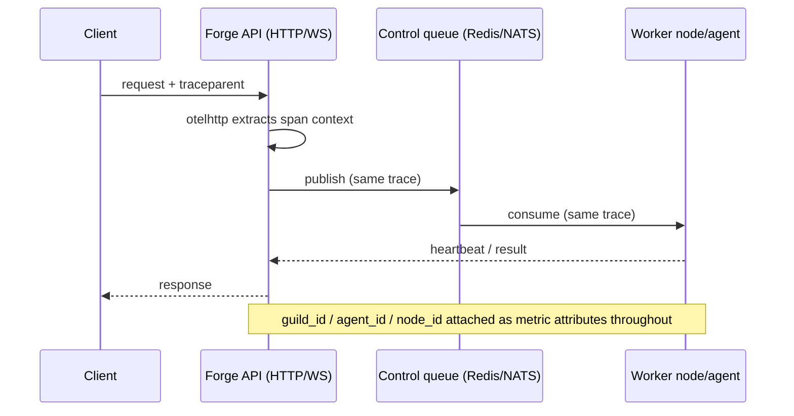

# Observability

Forge runs on OpenTelemetry: one meter provider backs every `forge_` metric and one tracer provider carries W3C context across HTTP and WebSocket calls. Turn it on, decide where the data goes, and you get metrics, traces, and (in desktop mode) queryable spans without touching application code.

## Enable telemetry

Telemetry is off by default. Turn it on with `--otel-enabled` and pick a mode with `--otel-mode`.

| Mode | Value | Where data goes | Required flags |
|---|---|---|---|
| Desktop sidecar | `desktop_sqlite` (default) | Bundled `sqlite-otel` process, local SQLite file | `--otel-sqlite-binary` |
| External collector | `external_otlp` | Any OTLP/HTTP endpoint (Collector, Grafana Alloy, vendor gateway) | `--otel-endpoint` |

Config validation is strict: `external_otlp` without `--otel-endpoint` fails with `requires an OTLP endpoint URL`, and `desktop_sqlite` without `--otel-sqlite-binary` fails with `requires a sqlite-otel binary path`. Endpoint URLs must parse with an `http`/`https` scheme and a host.

**desktop_sqlite** — everything stays on the box running `forge server`. Use it for local development and single-node debugging where you want to inspect spans without standing up a collector.

```bash
forge server --otel-enabled \
  --otel-mode desktop_sqlite \
  --otel-sqlite-binary /usr/local/bin/sqlite-otel \
  --otel-sqlite-port 4318
# spans land in <forge-home>/telemetry/sqlite-otel.db
```

`startSQLiteOTel` execs the binary with `-port` and `-db-path`, streams its stdout/stderr into the server logs, and waits up to 5 seconds for the port to accept connections before continuing. On shutdown Forge sends `SIGINT` and escalates to `SIGKILL` after 3 seconds if the sidecar hasn't exited. Default DB path is `<forge-home>/telemetry/sqlite-otel.db`; default port is `4318`.

**external_otlp** — export straight to a fleet-wide backend. Use it for staging/production and any multi-node deployment.

```bash
forge server --otel-enabled \
  --otel-mode external_otlp \
  --otel-endpoint http://otel-collector:4318 \
  --otel-service-name forge-server
```

Traces post to `<endpoint>/v1/traces`, metrics to `<endpoint>/v1/metrics` on a 10-second `PeriodicReader` interval. `--otel-service-name` (default `forge-server`) sets the OTel `service.name` resource attribute; the server also stamps `service.version` from the running Forge build.

!!! note "Prometheus scraping works regardless of mode"
    `/metrics` is served by reading the same OTel SDK `MeterProvider` through an `otelprom` reader — it isn't gated on `--otel-enabled`. You can scrape Prometheus metrics with telemetry export off; you only lose traces and OTLP metric shipping.

!!! tip
    If you enable telemetry with no endpoint reachable, trace export falls back to a pretty-printed stdout exporter — useful for a quick sanity check that spans are being created before wiring a real backend.

## Scrape /metrics

Two independent `/metrics` endpoints exist:

- **API server** — `GET /metrics` on the main listen address (default `:9090`), served by `api Server.GetMetrics` → `telemetry.PrometheusHandler()`.
- **Client metrics server** — `GET /metrics` on `--client-metrics-addr` (default `:9091`), bound by the in-process worker client (`agent.ServerConfig.ClientMetricsAddr` → `ClientConfig.MetricsAddr`). It also serves `/healthz` and `/readyz`, each returning `{"status": "ok"}` / `{"status": "ready"}`.

```bash
# API server metrics
curl http://localhost:9090/metrics

# client (worker) metrics, health, readiness
curl http://127.0.0.1:19091/metrics
curl http://127.0.0.1:19091/healthz
curl http://127.0.0.1:19091/readyz
```

Single-process example from the README, running server and client together:

```bash
forge server --listen :3001 --with-client \
  --client-node-id local-single-node \
  --client-metrics-addr 127.0.0.1:19091
```

**Key `forge_` metrics to watch:**

| Metric | What it tells you |
|---|---|
| `forge_api_requests_total`, `forge_api_request_duration_seconds` | API traffic volume and latency, by method/path/status |
| `forge_api_inflight_requests` | Concurrent requests currently being served |
| `forge_queue_depth`, `forge_queue_publish`, `forge_queue_consume`, `forge_queue_processing_errors` | Redis/NATS control-queue health |
| `forge_message_lead_time_seconds` | Time from message publish to consume |
| `forge_nodes_registered_total`, `forge_node_heartbeat_latency_seconds` | Node fleet size and heartbeat responsiveness |
| `forge_agents_running_total`, `forge_available_agent_slots` | Agent scheduling capacity |
| `forge_scheduler_placement_duration_seconds`, `forge_scheduler_placement_errors` | Placement decision speed and failures |
| `forge_agent_evictions`, `forge_agent_exit_codes` | Agent lifecycle churn |
| `forge_node_cpu_utilization`, `forge_node_ram_bytes`, `forge_node_disk_free_bytes` | Node resource pressure |
| `forge_agent_cpu_cores`, `forge_agent_memory_bytes` | Per-agent resource footprint |
| `forge_supervisor_boot_duration_seconds`, `forge_supervisor_dependency_pull_errors` | Supervisor cold-start cost and dependency resolution failures |

`forge_api_requests` is recorded as an OTel `Int64Counter` named `forge_api_requests` and surfaces on the Prometheus scrape as `forge_api_requests_total` — the `_total` suffix is automatic, not a separate metric. There's also `forge.telemetry.startups`, labeled by `forge.telemetry.mode`, so you can confirm which mode a given process actually started in.

Guild, agent, and node identity flow into these metrics as attributes — `guild_id`, `agent_id`, `node_id` — so you can slice queue depth, lead time, or resource metrics per guild or per node directly in PromQL, without a separate join.

!!! note
    Supervisor implementations (`docker.go`, `process.go`, `bubblewrap.go`) hard-code node identifiers like `local-node`, `local-docker`, and `local-node-bwrap` as attributes on boot-duration and exit-code metrics in single-node/local setups — don't expect a real cluster node ID there in those code paths.

## Trace propagation across HTTP and WS

The global propagator is a composite of W3C `TraceContext` + `Baggage`. Incoming `traceparent` headers are honored end to end, so a trace started by a client call carries through the API layer and into downstream control-plane operations.

On the HTTP side, `WithTelemetry` middleware wraps handlers in `otelhttp.NewHandler`, which extracts the incoming trace context and starts a span per request; `WithLogging` middleware then calls `telemetry.RecordAPIRequest(method, path, statusCode, duration)` for the metrics side of the same request:

```go
// WithLogging
telemetry.RecordAPIRequest(r.Method, r.URL.Path, statusCode, duration)

// WithTelemetry
otelHandler := otelhttp.NewHandler(next, operation) // W3C traceparent extraction
telemetry.AddAPIInflight(r.Method, r.URL.Path, 1)
defer telemetry.AddAPIInflight(r.Method, r.URL.Path, -1)
```

Spans are sampled with `AlwaysSample()` and shipped via a `BatchSpanProcessor` on a 5-second batch timeout, carrying a resource with `service.name` / `service.version` (semconv v1.24.0).



## Query spans via the observability-compat API

When telemetry runs in `desktop_sqlite` mode, spans written to the sqlite-otel sidecar are queryable through a Rustic-compatible endpoint:

```
GET /rustic/observe/guilds/:guild_id/messages/:msg_id/spans
```

Query parameters `durationInMs` and `rootThreadId` scope the lookback window and root span. The response mirrors Rustic's Zipkin-like span format, so existing Rustic tracing tooling can point at Forge directly.

```bash
curl "http://localhost:9090/rustic/observe/guilds/g-42/messages/m-101/spans?durationInMs=60000"
```

!!! warning "external_otlp returns 501"
    This route only works with `desktop_sqlite` — it reads the local SQLite span store the sidecar writes. In `external_otlp` mode it returns `501 Not Implemented` with `observability spans query is only available with desktop sqlite telemetry`. Query your OTLP backend's own trace UI (Grafana Tempo, Jaeger, vendor console) instead.

## Interpret histogram buckets

Histogram boundaries are configured per-instrument via SDK Views, and they're deliberately shaped for the operation they measure:

| Instrument group | Bucket shape | Why |
|---|---|---|
| API request duration, message lead time, node heartbeat latency | Prometheus default buckets (`prometheus.DefBuckets`) | General-purpose web-latency shape; these are fast, request-scoped operations |
| Scheduler placement duration | Fine-grained sub-second buckets, `{0.001 .. 1}` | Placement decisions should complete in milliseconds; you need resolution near zero to catch regressions |
| Supervisor boot duration | Coarse buckets, `{0.1 .. 60}` | Booting an agent supervisor involves dependency resolution and interpreter startup — seconds, not milliseconds, are normal |

When you graph `forge_scheduler_placement_duration_seconds` and see mass piling into the top bucket, that's the scheduler struggling — investigate node capacity or placement errors (`forge_scheduler_placement_errors`) before anything else. When `forge_supervisor_boot_duration_seconds` trends toward the 60s ceiling, check `forge_supervisor_dependency_pull_errors` first; slow boots are usually dependency resolution, not the agent process itself.

## Wire Prometheus/Grafana or an external collector

For a single node or local dev box, point Prometheus straight at the two `/metrics` endpoints:

```yaml
scrape_configs:
  - job_name: forge-api
    static_configs:
      - targets: ["forge-host:9090"]
  - job_name: forge-client
    static_configs:
      - targets: ["forge-host:9091"]
```

For a distributed fleet, run each Forge server with `--otel-enabled --otel-mode external_otlp --otel-endpoint <collector>` pointed at an OpenTelemetry Collector, and let the Collector fan out to your backends (Prometheus remote-write, Tempo/Jaeger for traces, or a vendor OTLP receiver). This is the same wiring as the `external_otlp` example above — a Collector is just an OTLP/HTTP endpoint like any other. Because guild/agent/node identity is already attached as metric attributes, Grafana dashboards can filter and group by `guild_id`, `agent_id`, or `node_id` without extra relabeling.

!!! tip
    Keep `--otel-service-name` distinct per deployment (for example `forge-server-us-east`) if you're running multiple Forge clusters into the same collector — it's the resource attribute you'll filter on in Grafana to separate fleets.

## Related pages

- [Quickstart](../getting-started/quickstart/)
- [Configuration reference](../reference/configuration/)
- [Running a distributed fleet](distributed-deployment/)
