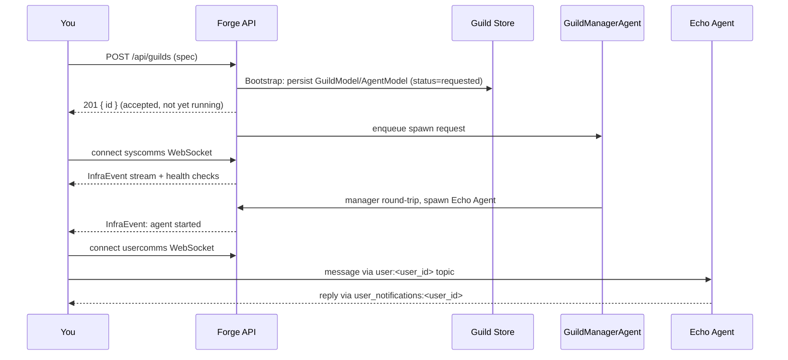

# Running a Guild

This guide takes you from a cold server to a guild you can talk to over WebSockets, on a single machine. You'll boot Forge, create a guild, watch it launch, converse with it, and learn how to inspect and relaunch it when something goes wrong.

## Prerequisites

You need a built `forge` binary and a local checkout of `forge-python` (agents run as Python processes launched via `uvx`).

```bash
cd forge-go
make build   # -> bin/forge
```

You'll also need `uv`/`uvx` on `PATH`, and three free local ports: the API listener, the embedded Redis address, and the client metrics port.

## Step 1: Start a single-process server

The fastest path to a running system is `forge server --with-client`, which starts the HTTP API, an embedded miniredis instance, a SQLite metastore, and an in-process compute node in one process.

```bash
mkdir -p /tmp/forge-uv-cache /tmp/forge-xdg-cache /tmp/forge-xdg-data

FORGE_PYTHON_PKG=./forge-python \
FORGE_UV_CACHE_DIR=/tmp/forge-uv-cache \
UV_CACHE_DIR=/tmp/forge-uv-cache \
XDG_CACHE_HOME=/tmp/forge-xdg-cache \
XDG_DATA_HOME=/tmp/forge-xdg-data \
./bin/forge server \
  --listen :3001 \
  --db sqlite:////tmp/forge-local.db \
  --with-client \
  --client-node-id local-single-node \
  --client-metrics-addr 127.0.0.1:19091
```

`FORGE_PYTHON_PKG` must point at your local `forge-python` package — it's how the spawned agent runtime gets installed from source rather than from a registry. Note the SQLite DSN's four slashes (`sqlite:////...`) for an absolute path.

Confirm the server is up and ready:

```bash
curl -sS http://127.0.0.1:3001/healthz   # -> {"status":"ok"}
curl -sS http://127.0.0.1:3001/readyz    # -> {"status":"ready"}
```

`/healthz` reports the process is alive; `/readyz` reports the API is ready to accept traffic. If `--with-client` is running, its independent metrics server also exposes `/healthz`, `/readyz`, and `/metrics` on `--client-metrics-addr` (here `127.0.0.1:19091`).

!!! tip
    For a distributed layout — one `forge server` and one or more separate `forge client` nodes sharing the same Redis or NATS backend — see the [Installation](../getting-started/installation/) guide. This page stays on a single process throughout.

## Step 2: Create a guild

Guilds are created with `POST /api/guilds`. The body is a `CreateGuildRequest`: an `organization_id` plus a `spec` (a `protocol.GuildSpec`). Here's a minimal echo guild:

```bash
curl -X POST http://127.0.0.1:3001/api/guilds \
  -H 'Content-Type: application/json' \
  -d '{
    "organization_id": "acme",
    "spec": {
      "id": "echo-guild-01",
      "name": "Echo Guild",
      "description": "single-agent echo demo",
      "agents": [
        {
          "name": "Echo",
          "description": "echoes what it hears",
          "class_name": "rustic_ai.agents.EchoAgent"
        }
      ]
    }
  }'
```

A successful response is **`201 Created` with the guild `id`** — and that's all it means. Creation is asynchronous:

1. `Bootstrap` normalizes and validates the spec, persists it as a `GuildModel` plus `AgentModel` rows with status `requested` and agent status `not_launched`, then enqueues a spawn request for the system `GuildManagerAgent` (GMA).
2. The GMA is a real Python agent process. It has to actually start, read the persisted spec back via the manager API, and spawn each child agent through the same control-plane path.
3. Only once the GMA and its agents are up does the guild reach `running`.

None of that is visible in the `201` response. **The HTTP call tells you the request was accepted, not that the guild is alive.** To see real launch progress, you watch two streams.

!!! note
    Because the persisted spec is canonical, every downstream spawn re-reads it from the store rather than trusting what you submitted. If you configured dependencies or execution engine, don't expect the exact JSON you posted to be echoed byte-for-byte — normalization and defaulting happen first.

## Step 3: Watch launch progress

Open two WebSockets against the guild you just created: `syscomms` for system/lifecycle traffic, and `usercomms` for conversation.

### syscomms: InfraEvent stream and guild-manager health

```
GET /ws/guilds/{id}/syscomms/{user_id}
```

For the guild above:

```
ws://127.0.0.1:3001/ws/guilds/echo-guild-01/syscomms/dev-user
```

The moment this socket connects, the server publishes a `HealthCheckRequest` to `guild_status_topic` to prompt the guild manager to report in. From then on the socket is subscribed to three topic families at once, so you demux by `format` (and sometimes `topic_published_to`):

- **`infra_events_topic`** — process-lifecycle telemetry (`InfraEvent`, format `rustic_ai.forge.runtime.InfraEvent`) emitted by the Go supervisor as the GMA and agents spawn, retry, or fail. This is where you see *launch progress and failure*, since the `201` response can't tell you that.
- **`guild_status_topic`** — guild-manager health, delivered as `AgentsHealthReport` in response to the `HealthCheckRequest` kicked off on connect.
- **`user_system_notification:<user_id>`** — replies to anything you send on this socket.

An example `InfraEvent` payload you'll see while an agent is starting (or failing):

```json
{
  "schema_version": 1,
  "event_id": "abc123",
  "kind": "agent.process.failed",
  "severity": "error",
  "timestamp": "2026-03-25T23:31:55.000Z",
  "guild_id": "echo-guild-01",
  "agent_id": "echo-agent",
  "attempt": 1,
  "message": "agent process failed after retry exhaustion",
  "detail": { "error": "Read-only file system" }
}
```

A guild that reaches `running` with no `agent.process.failed` (or similar `error`-severity) events on this stream launched cleanly. If you only see `starting`/`requested` and no progress, check the [gotchas](#common-local-gotchas) below before assuming the guild is stuck.

!!! warning
    `syscomms` inbound messages missing either `format` or a non-null `payload` are silently dropped. If you're publishing to this socket yourself and getting no response, that's the first thing to check.

## Step 4: Converse with the guild

### usercomms: send a message, observe the response

```
GET /ws/guilds/{id}/usercomms/{user_id}/{user_name}
```

```
ws://127.0.0.1:3001/ws/guilds/echo-guild-01/usercomms/dev-user/Dev
```

On connect, the server publishes a `UserAgentCreationRequest` to `system_topic` to register your user proxy agent in the guild — you don't need to do anything for this, but it explains why a fresh connection has a brief settle time before an agent will address you by name.

Send a plain JSON envelope (the canonical wire shape, `protocol.Message`-flavored):

```json
{
  "format": "rustic_ai.core.messaging.core.message.Message",
  "payload": { "content": "hello, echo" }
}
```

The server stamps the sender as `user_socket:dev-user` (you cannot spoof this), wraps your payload into a canonical `Message`, and publishes it to `user:dev-user`. The `EchoAgent` picks it up through the guild's messaging backend and replies; you'll see the reply arrive on the same socket, sourced from `user_notifications:dev-user`.

A few behaviors worth knowing before you build a client against this:

- **Message IDs are optional.** If you omit `id`, or supply one more than 1000ms in the future, the server mints a fresh `GemstoneID` for you.
- **`thread` semantics differ by socket.** `usercomms` appends your message's ID onto the incoming thread; `syscomms` resets `thread` to just `[current_message_id]`.
- **Malformed `message_history` drops the whole message** on `usercomms` (strict typing, to match the Python side) — not just the bad entry.
- **There's no durable replay on reconnect.** These are live subscriptions; if you drop the socket you miss what was published while you were gone.

!!! tip
    Everything here is the *canonical* wire shape (`/ws/...` routes). If you're driving the local Rustic UI instead, it talks the proxy-compatible `/rustic/ws/...` shape, which renames fields (`payload`→`data`, `topics`→`topic`, etc.) and rewrites file URLs — same backend topics underneath, different envelope.

## Step 5: Inspect and relaunch

### Check guild and agent status

```
GET /api/guilds/{id}
```

This returns the persisted `GuildModel` (and its agents), including the guild's current status and each agent's status. The status vocabularies to know:

| Guild status | Meaning |
|---|---|
| `requested` | Bootstrap persisted the spec and enqueued the GMA spawn; nothing has started yet |
| `starting` | GMA and/or agents are coming up |
| `running` | Guild manager and agents are live |
| `warning` / `backlogged` | Running but degraded (from health reports) |
| `error` | A failure occurred during launch or operation |
| `stopping` / `stopped` | Shutdown in progress or complete |
| `not_launched` / `unknown` | No active launch attempt, or status not yet determined |

| Agent status | Meaning |
|---|---|
| `not_launched` | Persisted but not yet spawned |
| `starting` | Spawn requested, process coming up |
| `running` | Process is live |
| `error` | Process failed |
| `stopped` / `deleted` | Terminated, or removed from the guild |

Cross-reference these against the `InfraEvent` stream from Step 3: the status snapshot tells you *where things stand*, the event stream tells you *what happened*.

### Relaunch

```
POST /api/guilds/{id}/relaunch
```

This re-enqueues the GMA spawn — but only if the manager agent isn't already reported as running. It records the attempt in the `guilds_relaunch` table. If the guild's status is `stopped` or `stopping`, relaunch is refused; stop before you try again isn't a supported transition here.

Use relaunch after fixing a launch-time failure you saw on the `InfraEvent` stream (a bad dependency path, a permissions issue, a missing package) — you don't need to recreate the guild, just relaunch it once the underlying cause is fixed.

## End-to-end flow



## Common local gotchas

**uv cache and permissions.** Agent spawn shells out to `uvx`. If `FORGE_UV_CACHE_DIR`, `UV_CACHE_DIR`, `XDG_CACHE_HOME`, or `XDG_DATA_HOME` point at a location your user can't write (or don't exist), spawn fails silently from the API's point of view — you'll only see it as an `agent.process.failed` `InfraEvent` with a permissions-flavored error. Point all four at writable temp directories, as in Step 1.

**`FORGE_PYTHON_PKG` unset or wrong.** Any run that spawns agents — including this one — needs `FORGE_PYTHON_PKG` pointing at your local `forge-python` checkout. Without it, the Python runtime can't be installed from source and the GMA (or any agent) fails to start.

**Ports already in use.** The single-process quick start needs the API listener port, the embedded Redis address (`--embedded-redis-addr`, default `127.0.0.1:6379`), and the client metrics port (`--client-metrics-addr`, default `:9091`) all free. A silently-refusing-to-start server is often just a bind conflict on one of these — check with `lsof` or equivalent before assuming something in your guild spec is wrong.

**Confusing `201` with "running".** Covered above, but worth repeating: guild creation and relaunch are both fire-and-forget from the HTTP caller's perspective. Always confirm real state via the `syscomms` `InfraEvent`/health stream or a follow-up `GET /api/guilds/{id}`, not the response code alone.

## Related

- [Installation](../getting-started/installation/) — distributed server/client layout, backend choices
- [Quickstart](../getting-started/quickstart/) — shortest path to a first running guild
