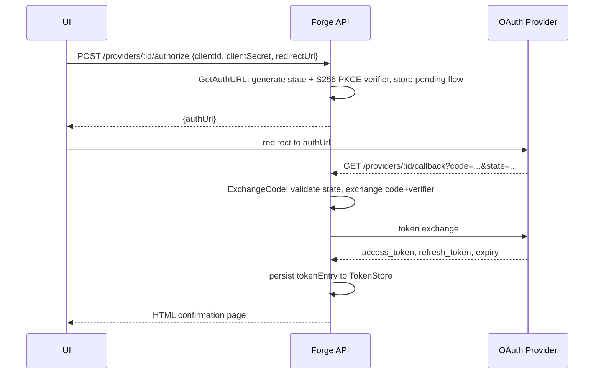

# Securing Secrets & OAuth

Agents need credentials — API keys, delegated OAuth tokens — but they should never have to know where those credentials come from. Forge resolves them centrally, through a configurable secret chain and an OAuth manager, and injects the result into the agent process as plain environment variables.

This guide covers how to configure the secret chain, declare what an agent needs, wire up an OAuth provider, run the Authorization Code + PKCE flow, and the security tradeoffs of the current model.

## The secret resolution chain

Every secret and OAuth token lookup in Forge goes through a `secrets.SecretProvider`:

```go
type SecretProvider interface {
    Resolve(ctx context.Context, key string) (string, error)
}
```

`secrets.DefaultProvider()` builds a `ChainSecretProvider` from the `FORGE_SECRET_PROVIDERS` environment variable — a comma-separated list of backend names tried in order. The first backend to resolve a key wins; if none do, the chain returns `secrets.ErrSecretNotFound`.

```bash
# default chain if FORGE_SECRET_PROVIDERS is unset
export FORGE_SECRET_PROVIDERS="env,dotenv,file"

# add the OS keychain to the chain
export FORGE_SECRET_PROVIDERS="env,dotenv,file,keychain"
```

| Backend | Name | Where it looks |
|---|---|---|
| Environment variables | `env` | `os.LookupEnv(key)` |
| Dotenv file | `dotenv` | `~/.forge/secrets/.env` (supports `export`, quoted values, `#` comments) |
| Secret-per-file directory | `file` | `~/.forge/secrets/<key>` (trimmed whitespace; `filepath.Base` blocks path traversal) |
| OS keychain | `keychain` | OS credential store, service name from `FORGE_KEYCHAIN_SERVICE` (default `forge`) |

The default paths respect `FORGE_HOME` — if you set it, `~/.forge/secrets/` moves to `$FORGE_HOME/secrets/`.

!!! note "The keychain backend must be imported, not just named"
    Listing `keychain` in `FORGE_SECRET_PROVIDERS` isn't enough on its own. The keychain package registers itself with `secrets.RegisterProvider("keychain", ...)` in an `init()`, so your binary must import the `keychain` package (a side-effect import) for the name to resolve. Any process that builds an `api.Server` with `WithOAuth` already does this. Unknown or unregistered provider names are logged to stderr and skipped — never treated as fatal.

Placing a secret is backend-specific:

```bash
# env backend
export GITHUB_TOKEN=ghp_...

# dotenv backend
mkdir -p ~/.forge/secrets
cat >> ~/.forge/secrets/.env <<'EOF'
export STRIPE_API_KEY="sk_live_..."
EOF

# file backend
echo -n "sk_live_..." > ~/.forge/secrets/STRIPE_API_KEY
```

## Declaring what an agent needs

Agents don't reach into the secret chain themselves — they declare their requirements in the registry, and Forge resolves and injects them at launch. Two need types exist:

```go
// protocol package
type SecretNeed struct {
    Key      string
    Label    string
    Optional *bool
}

type OAuthNeed struct {
    Provider string
    Label    string
    Scopes   []string
    Optional *bool
}
```

- **`SecretNeed.Key`** is the lookup key passed to the secret chain (`secretProvider.Resolve(ctx, key)`).
- **`OAuthNeed.Provider`** is the OAuth provider ID (must match an entry in `oauth-providers.yaml`).
- **`Label`** on either need is the environment variable name the agent actually sees.

At launch, `helper/envvars.BuildAgentEnv` walks the agent's `Resources.Secrets` (plain `[]string` of keys) plus the registry entry's `Secrets` and `OAuth` needs, resolves each one, and writes the result into the child process's environment keyed by `Label`:

```go
for _, o := range regEntry.OAuth {
    secretKey := oauth.StoreKey(orgID, o.Provider)
    val, err := secretProvider.Resolve(ctx, secretKey)
    if err != nil {
        if err == secrets.ErrSecretNotFound && (o.Optional == nil || *o.Optional) {
            continue
        }
        return fmt.Errorf("failed to resolve OAuth token for provider '%s'...: %w", o.Provider, err)
    }
    envMap[o.Label] = val // injected into agent process env
}
```

A non-optional need that fails to resolve fails agent env construction outright — the agent will not launch. An optional need that isn't found is silently skipped, and the label simply won't appear in the agent's environment.

## Wiring OAuth

### 1. Declare providers in `oauth-providers.yaml`

Providers live in `conf/oauth-providers.yaml` (path overridable via `FORGE_OAUTH_PROVIDERS_CONFIG`):

```yaml
providers:
  github:
    display_name: GitHub
    description: Connect your GitHub account
    # auth_url/token_url are optional if the provider is a known endpoint
    auth_url: ${GITHUB_AUTH_URL}   # ${ENV} is interpolated
    token_url: https://github.com/login/oauth/access_token
    scopes: [repo, read:user]
    redirect_url: ""
    use_pkce: true   # default true; set false to disable PKCE
```

`auth_url`, `token_url`, and `redirect_url` support `${ENV}` interpolation. If you omit `auth_url`/`token_url` entirely, Forge falls back to hardcoded known endpoints for `github`, `google`, `google-drive`, `slack`, `microsoft`, and `notion`. Client credentials (`clientId`/`clientSecret`) are deliberately **not** part of this file — they're supplied per-request by the caller (typically the UI) at authorize time.

### 2. Choose a token store

```go
s := api.NewServer(...).WithOAuth(kind)
```

`kind` (or `FORGE_OAUTH_TOKEN_STORE` if empty) selects the `oauth.TokenStore` backend:

| Kind | Behavior |
|---|---|
| `memory` (default) | `InMemoryTokenStore` — fast, but tokens are lost on process restart |
| `keychain` | `KeychainTokenStore` — persists a JSON `storedEntry` (access token, refresh token, expiry, client ID/secret, endpoints, scopes) to the OS keychain under `FORGE_KEYCHAIN_SERVICE` |

`WithOAuth` loads the config, builds the store, constructs the `oauth.Manager`, and — critically — calls `keychain.SetOAuthManager(s.oauthManager)`. That last call is what lets the keychain secret backend bridge `oauth:`-prefixed keys to live, refreshed tokens (see below). If `oauth-providers.yaml` has zero providers, `WithOAuth` is a no-op. If an unknown store kind is passed, it warns and falls back to `memory`.

```go
func (s *Server) WithOAuth(kind string) *Server {
    if kind == "" { kind = os.Getenv("FORGE_OAUTH_TOKEN_STORE") }
    cfg, _ := oauth.LoadProvidersConfig(forgepath.OAuthProvidersConfigPath())
    if len(cfg.Providers) == 0 { return s }
    store, err := oauth.NewTokenStore(kind) // "memory" | "keychain"
    if err != nil { store, _ = oauth.NewTokenStore("memory") }
    s.oauthManager = oauth.NewManagerWithStore(cfg, store)
    keychain.SetOAuthManager(s.oauthManager)
    return s
}
```

### 3. Activate the provider via registry validation

A provider defined in `oauth-providers.yaml` is not usable until something activates it. That happens during registry loading: `registry.Load`/`ValidateOAuth` calls `oauth.Manager.CheckAndUpdateProvider` for every `OAuthNeed` an agent declares, which adds the provider to the manager's `activeProviders` set and merges requested scopes. Every OAuth HTTP route — `GetAuthURL`, `ExchangeCode`, status, disconnect — rejects providers that aren't active. If an agent references an unknown, non-optional OAuth provider, registry validation drops that agent rather than starting it in a broken state.

!!! tip
    If you add a new provider to `oauth-providers.yaml` and the authorize call still 404s or errors, check that some agent's registry entry actually declares an `OAuthNeed` for it — presence in the YAML alone doesn't activate it.

## Running the Authorization Code + PKCE flow

The OAuth Manager exposes its flow through five HTTP routes:

```go
router.GET(prefix+"/oauth/organizations/:org_id/providers", ...)
router.POST(prefix+"/oauth/organizations/:org_id/providers/:provider_id/authorize", ...)
router.GET(prefix+"/oauth/organizations/:org_id/providers/:provider_id/callback", ...)
router.GET(prefix+"/oauth/organizations/:org_id/providers/:provider_id/status", ...)
router.DELETE(prefix+"/oauth/organizations/:org_id/providers/:provider_id", ...)
```



**Start the flow** — `POST /oauth/organizations/:org_id/providers/:provider_id/authorize`:

```bash
curl -X POST \
  http://localhost:8080/oauth/organizations/acme/providers/github/authorize \
  -H 'Content-Type: application/json' \
  -d '{
    "clientId": "Iv1.abc123",
    "clientSecret": "supersecret",
    "redirectUrl": "https://app.example.com/oauth/callback"
  }'
# => {"authUrl": "https://github.com/login/oauth/authorize?client_id=...&code_challenge=...&state=..."}
```

`GetAuthURL` generates 32 random bytes of state (base64-url encoded) and, since `use_pkce` defaults to `true`, a PKCE code verifier with an S256 challenge. The pending flow is held in memory and expires after 10 minutes; `cleanExpiredFlows` runs on every call to `GetAuthURL`.

Redirect the user to `authUrl`. The provider redirects back to the callback route, which `ExchangeCode` handles: it validates the returned `state` against the pending flow, exchanges the authorization code (plus PKCE verifier) for tokens, and persists the resulting `tokenEntry` — including the `clientId`/`clientSecret` you supplied — so future refreshes work without the caller re-supplying credentials.

**Check connection status**:

```bash
curl http://localhost:8080/oauth/organizations/acme/providers/github/status
# => {"isConnected": true}
```

**Disconnect**:

```bash
curl -X DELETE http://localhost:8080/oauth/organizations/acme/providers/github
# => {"providerId": "github", "disconnected": true}
```

### Token refresh

`GetAccessToken(ctx, orgID, providerID)` returns the cached token, refreshing automatically if it's invalid or expires within 60 seconds, using an `oauth2.TokenSource`. The refreshed token is written back to the configured `TokenStore` immediately. There is no single-flight/concurrency guard around refresh in the current `Manager` — concurrent callers can trigger redundant refreshes.

## The keychain bridge: `oauth:org|provider` as a live secret key

The whole system converges on one key format, `oauth.StoreKey`:

```go
const prefix = "oauth:"
func StoreKey(orgID, providerID string) string {
    return prefix + orgID + "|" + providerID
}
```

When the secret chain includes `keychain` and an OAuth manager has been registered via `keychain.SetOAuthManager`, resolving a key like `oauth:acme|github` doesn't just read a stored blob — it calls `mgr.GetAccessToken`, which transparently refreshes an expiring token before returning it:

```go
if orgID, providerID, ok := oauth.ParseOAuthKey(key); ok {
    if mgr := oauthMgr.Load(); mgr != nil {
        token, err := mgr.GetAccessToken(ctx, orgID, providerID) // handles refresh
        if errors.Is(err, oauth.ErrNotConnected) { return "", secrets.ErrSecretNotFound }
        return token, err
    }
    return p.oauthTokenFromKeychain(key) // fallback: extract access_token from stored JSON
}
```

This is exactly the path an `OAuthNeed` takes: `OAuthNeed.Provider` → `oauth.StoreKey(orgID, provider)` → secret chain → keychain provider → `Manager.GetAccessToken` → fresh token → agent env var named by `Label`. If no OAuth manager was ever registered (e.g. the keychain provider is used standalone, without `WithOAuth`), the bridge falls back to reading the raw keychain entry and extracting its `access_token` field directly — no refresh happens in that path.

Non-`oauth:`-prefixed keys are returned raw from the keychain, unrelated to the OAuth Manager entirely.

`validateOrgID` rejects an empty `org_id` and any `org_id` containing `|` or control characters, which prevents an attacker-controlled org identifier from injecting a fake provider segment into the store key.

## Security caveats

The current implementation is intentionally simple: the Go server owns the OAuth flow end-to-end and injects **full, live access tokens** directly into the agent's process environment, keyed by the need's `Label`. That's the same raw-env-injection pattern the repository's `DESKTOP_SECRETS_OAUTH_DESIGN.md` explicitly flags as insufficient.

That design document (status: **Proposed**, largely unimplemented) describes a different target architecture:

- Short-lived **leases** issued to agents instead of raw tokens.
- A **broker** that mediates access so refresh tokens never reach the agent process at all.
- Electron main (or an equivalent trust anchor) owning the keychain, rather than the agent's own environment.

None of that exists in the current code — no lease broker, no `secret://` reference scheme, no separation between the process that requests a token and the process that holds it. Every agent that declares an `OAuthNeed` or `SecretNeed` receives the plaintext value in its own environment variables.

!!! warning "`SeedToken` is for development only"
    `oauth.Manager.SeedToken` stores a 24-hour, non-expiring access token and completely bypasses the OAuth flow. It exists to make local testing and development fast — never call it from a production code path, and never expose it over an unauthenticated route.

Other things worth knowing when you reason about the blast radius of a leaked agent process:

- `ErrSecretNotFound` is treated as "skip" for optional needs and for chain fallthrough — but a non-optional need that can't be resolved fails the whole agent launch, so misconfiguration fails loud, not silent.
- `FileSecretProvider` uses `filepath.Base` on the key and rejects `.`/`/`, closing the obvious path-traversal angle, but it's still reading a plaintext file from disk into an agent's environment.
- The repository's root `SECURITY.md` is the unedited GitHub template placeholder — it has no real disclosure policy content. Don't rely on it.

## Related pages

- [Quickstart](../getting-started/quickstart/)
- [Agent Registry](../concepts/distributed-control-plane/)
