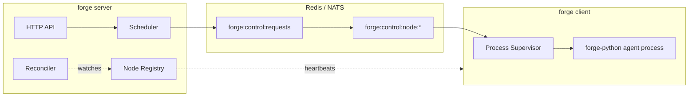

# Forge

Forge is the runtime stack that runs Rustic AI guilds — multi-agent systems that need real process lifecycles, not just function calls. It places agent workloads on worker nodes, watches them, and brings them back when they die.

<div class="quick-links" markdown>
[Install](getting-started/installation/){ .quick-link }
[Quickstart](getting-started/quickstart/){ .quick-link }
[Your First Guild](getting-started/first-guild/){ .quick-link }
[Architecture](concepts/architecture/){ .quick-link }
[GitHub](https://github.com/rustic-ai/forge){ .quick-link }
</div>

## What Forge is

Forge splits into two deliverables that ship together:

- **`forge-go`** — a cross-platform Go control plane and runtime. It owns process spawning, health monitoring, scheduling, storage, and distributed node coordination.
- **`forge-python`** — a Python execution bridge plus the system agents that make a guild work, notably `GuildManagerAgent`.

Everything you invoke from a shell is one binary: `forge`, built from `forge-go/main.go` (module `github.com/rustic-ai/forge/forge-go`). It's a single Cobra CLI with three subcommands:

| Subcommand | Role |
|---|---|
| `forge server` | Starts the control plane — HTTP API, metastore, scheduler, node registry, reconciler. |
| `forge client` | Starts a worker node — detects local hardware, registers with a server, runs agent processes under a supervisor. |
| `forge version` | Prints Forge version, Git commit, build date, Go version, and OS/Arch. |

Forge runs in one of two shapes:

- **Single-process** — `forge server --with-client` starts the control plane, an embedded Redis (miniredis), a SQLite metastore, and an in-process compute node, all in one OS process. This is the fastest way to get a guild running on a laptop.
- **Distributed** — a central `forge server` schedules agent workloads onto one or more separate `forge client` worker nodes over a shared Redis (or NATS) message broker. Server and clients never talk placement over direct RPC — everything goes through the broker's control queues.

The problem Forge solves, in one sentence: **place, monitor, and recover stateful and stateless agent workloads across a fleet of worker nodes.**

## Who it's for

You're in the right place if you're:

- Running Rustic AI guilds locally and want a single command that gets HTTP API, storage, and a compute node up together.
- Operating a fleet of worker nodes and need scheduling, health tracking, and crash recovery for agent processes.
- Building or embedding forge-python system agents and need to understand the Go side that spawns and supervises them.

## Quick start

Single process, everything embedded:

```bash
FORGE_PYTHON_PKG="$FORGE_REPO_DIR/forge-python" \
"$FORGE_REPO_DIR/forge-go/bin/forge" server \
  --listen :3001 \
  --db sqlite:////tmp/forge-local.db \
  --with-client \
  --client-node-id local-single-node \
  --client-metrics-addr 127.0.0.1:19091
```

Confirm it's alive:

```bash
curl -sS http://127.0.0.1:3001/healthz
# {"status":"ok"}
```

!!! note "Compiled defaults vs. this example"
    Out of the box, `--listen` defaults to `:9090` and `--db` defaults to `sqlite://<forge-home>/data/forge.db`. The example above overrides both, matching the pattern used in the project's own local-debug runbook.

## At a glance



| Layer | What it is |
|---|---|
| HTTP API | Node registration, heartbeats, health/readiness, plus `/rustic/*` compatibility and `/manager/*` internal routes. |
| Message broker | Redis (default, embedded miniredis) or NATS, selected via `--backend`. Async, persistent queueing over Redis Lists. |
| Scheduler + reconciler | Places agents by CPU/memory/GPU capacity; the reconciler runs every 15s, evicts dead nodes, and resubmits orphaned agents. |
| Process supervisors | Own OS-level agent lifecycle — spawn via `exec.CommandContext`, stop via POSIX signals, isolate via `docker` or `bwrap`. |
| Observability | OpenTelemetry-first, with a desktop SQLite exporter or an external OTLP endpoint. |
| License | Apache 2.0. |

## Where to go next

<div class="grid cards" markdown>

- **[Why Forge](why-forge/)**
  The problem Forge exists to solve and why the server/client split matters.

- **[Getting Started](getting-started/overview/)**
  Prerequisites, build steps, and your first single-process run.

- **[Features](features/)**
  Scheduling, supervisors, crash recovery, storage, and telemetry in depth.

- **[Reference](reference/cli/)**
  CLI flags, HTTP routes, environment variables, and message formats.

</div>
