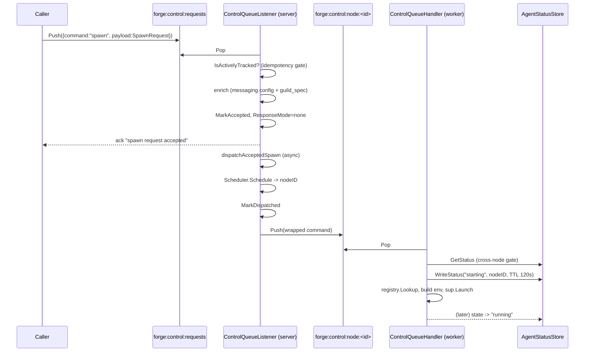

# Control Plane Internals

A spawn request travels from a single global queue to a specific process on a specific worker node through two independent idempotency gates, a distributed ACK, and an accept-then-dispatch handoff that never blocks the caller on scheduling. This page traces that path end to end.

!!! note "Scope"
    This page covers the control-message pipeline: ingest, scheduling handoff, and worker-side launch. For placement algorithms, the reconciler, and node health, see [Scheduler & Placement](scheduler-placement/).

## The two hops

Every spawn crosses exactly two queues:

1. **Global control queue** — `forge:control:requests`. Every spawn/stop request, from any source (API, GuildManager, reconciler re-enqueue), lands here first.
2. **Per-node queue** — `forge:control:node:<node_id>`. Once the server has picked a node, it re-pushes the command here, and only that node's `ControlQueueHandler` consumes it.



The server never talks to a worker directly. Placement, dispatch, and launch are all queue-mediated, which is what lets the [reconciler](scheduler-placement/) recover from a dead node by simply re-pushing the same payload onto the global queue.

## ControlQueueListener.OnSpawn

`OnSpawn` runs on the server, consuming `forge:control:requests`. It does **not** place the agent synchronously — placement is deferred to a background dispatch step so that a slow or momentarily unhealthy scheduler never blocks the caller.

**Idempotency gate.** Before anything else, `OnSpawn` checks `PlacementMap.IsActivelyTracked(guildID, agentID)`. If the agent is already `accepted`, `dispatched`, `acknowledged`, or `running`, the request is a duplicate (redelivery, retry, or race) and is dropped without a second placement.

**Request enrichment.** The listener attaches two things to the request's `ClientProperties` before it goes anywhere near a worker:

- The guild's **messaging config** (`protocol.MessagingConfig{BackendModule, BackendClass, BackendConfig}`), so the spawned agent's Python runtime constructs the matching backend without querying anything itself.
- The **full `guild_spec`**, so a worker node with no direct database access can fully hydrate the guild it's launching into. This is what makes worker nodes safely DB-less — every fact a node needs to run an agent is embedded in the control message itself, not fetched.

**ResponseMode=none.** The listener forces `ResponseMode = none` on the request before dispatch. The synchronous caller was already acked at accept time ("spawn request accepted"); if the eventual worker `SpawnResponse` were also delivered on the response transport, the caller would see a duplicate reply.

**Accept-then-dispatch.** The sequence is:

1. `MarkAccepted` with the serialized payload (this is the byte-for-byte copy the reconciler re-enqueues on node death).
2. Ack the caller immediately.
3. Launch `dispatchAcceptedSpawn` in a goroutine.

The caller's round trip ends at step 2 — scheduling latency, node selection, and queue pushes all happen after the response has already gone out.

## dispatchAcceptedSpawn

This is the async half of the handoff, and it's a three-step chain with a single failure path:

```go
nodeID, err := scheduler.GlobalScheduler.Schedule(agentSpec)
if err != nil {
    // revert: back to accepted, Attempts++, reconciler retries later
}
placementMap.MarkDispatched(guildID, agentID, nodeID)
if err := transport.Push(ctx, nodeQueueKey(nodeID), wrapped); err != nil {
    // revert: back to accepted, Attempts++, reconciler retries later
}
```

- **Schedule** picks a node via best-fit-most-free placement (see [Scheduler & Placement](scheduler-placement/)).
- **MarkDispatched** transitions the placement `accepted -> dispatched`, stamps `DispatchedAt`, and increments `Attempts`.
- **Push** wraps the payload as a `ControlMessageWrapper` and pushes it onto `forge:control:node:<nodeID>`.

If either `Schedule` or `Push` fails, the placement is **not** marked failed outright — it reverts to `accepted` (bumping `Attempts`), which puts it back in the pool the reconciler's `reconcileAccepted` phase will retry on its next 15s tick. Only after `MaxAttempts` (5) does a placement become terminally `failed`. This defers all retry logic to one place — the reconciler — rather than duplicating backoff logic at the dispatch site.

!!! tip "Why revert instead of fail"
    A push failure is very often transient (queue backend hiccup, momentary node registry inconsistency). Reverting to `accepted` costs one reconciler tick; failing outright would require a second recovery path just for dispatch-time errors.

## Worker ControlQueueHandler: handleSpawn / handleStop

Each worker node runs a `ControlQueueHandler` that blocks on its own queue, `forge:control:node:<node_id>`, and never sees a message intended for another node.

### handleSpawn

```go
existing, err := h.statusStore.GetStatus(ctx, req.GuildID, req.AgentSpec.ID)
if err == nil && existing != nil &&
    (existing.State == "running" || existing.State == "starting") &&
    existing.NodeID != "" && existing.NodeID != h.nodeID {
    // agent already active on another node -> skip launch
    return
}
_ = h.statusStore.WriteStatus(ctx, req.GuildID, req.AgentSpec.ID,
    &supervisor.AgentStatusJSON{State: "starting", NodeID: h.nodeID, Timestamp: time.Now()},
    120*time.Second)
```

Step by step:

1. **Emit an infra event** so the spawn attempt is observable.
2. **Cross-node idempotency gate.** The handler checks `StatusStore.GetStatus` for this `(guildID, agentID)`. If another node already reports `running` or `starting`, this handler bails without launching — this is the second of Forge's three idempotency layers (server `IsActivelyTracked`, this cross-node gate, and `MarkDispatched` attempt counting).
3. **Distributed ACK.** The handler writes `state: "starting", node_id: h.nodeID` to the `AgentStatusStore` with a **120s TTL**. This write is the reconciler's signal that delivery succeeded even before the process is fully up — `reconcileStaleDispatches` promotes a stalled-looking `dispatched` placement to `Acknowledged` the moment it sees `state: "starting"` here, without re-sending anything.
4. **Class lookup.** The agent's `ClassName` is resolved via the `registry.Registry` (loaded from `FORGE_AGENT_REGISTRY` / `conf/forge-agent-registry.yaml`), yielding `RuntimeType`, package/image/executable, dependencies, secrets, network egress, and filesystem mounts.
5. **Env build.** Environment variables are assembled from the (re-hydrated) guild spec, messaging config, and org context.
6. **Supervisor launch.** A per-org supervisor is selected via `SupervisorFactory`, and `sup.Launch` execs the agent (for `ProcessSupervisor`, typically the Python `rustic_ai.forge.agent_runner` via `uvx`). On success, the handler polls up to 5×100ms for a real PID and returns `SpawnResponse{NodeID, PID}`.

### handleStop

`handleStop` resolves the org for the target agent and calls `sup.Stop`, which — per the supervisor's graceful-shutdown contract — signals the process group rather than killing it outright (see [Graceful shutdown](#graceful-shutdown-via-signal-cancelled-contexts) below).

## How the persisted guild spec is re-hydrated on every spawn

Worker nodes are intentionally DB-less: they never query a metastore to find out what a guild looks like. Instead, the **entire `guild_spec` is embedded in the control message** by the server's enrichment step in `OnSpawn`, riding inside `ClientProperties` alongside the messaging config. When `handleSpawn` builds the agent's environment, it reads the spec straight out of the message it just received.

This has a direct consequence for recovery: when the reconciler detects a dead node and re-enqueues an orphaned agent, it does so with the **exact original serialized `Payload`** stored in the `AgentPlacement` — the same bytes, guild spec and all. The new node that eventually receives it re-hydrates from that same embedded spec, with no round trip back to any store. Rescheduling is therefore indistinguishable from a first-time spawn, and node failure does not depend on any node retaining local state about a guild it never persisted in the first place.

## Control message envelope and queue keys

Every message on either queue — global or per-node — is wrapped identically:

```json
{
  "command": "spawn",
  "payload": { "...": "underlying SpawnRequest or StopRequest" }
}
```

| Key | Direction | Purpose |
|---|---|---|
| `forge:control:requests` | any producer → server | Global ingest queue for all spawn/stop requests, including reconciler re-enqueues |
| `forge:control:node:<node_id>` | server → one worker | Per-node dispatch queue; only that node's handler pops it |
| `forge:control:response:<request_id>` (Redis) | worker → caller | Response list, one per request, used when `ResponseMode != none` |
| `ctrl.response.<request_id>` (NATS) | worker → caller | NATS subject on the `CTRL_RESPONSES` JetStream stream (60s MaxAge) |

### Response transport: Redis vs NATS

The command envelope is identical on both backends, but the response path differs structurally:

- **Redis** — responses are pushed onto a per-request Redis list keyed `forge:control:response:<request_id>`; the caller `BRPOP`s that key.
- **NATS** — responses are published to a per-request subject `ctrl.response.<request_id>`, carried on a shared `CTRL_RESPONSES` work-queue stream with a 60s `MaxAge`. Control queues themselves (`forge:control:requests`, `forge:control:node:<node_id>`) map onto NATS as `WorkQueuePolicy` streams named `CTRL_<sanitized-key>` with a 5-minute `MaxAge` and `AckSync` per message.

Since `OnSpawn` forces `ResponseMode=none` before dispatch, the response-transport distinction is largely invisible for spawns — the accept-time ack is what the caller actually sees, and the worker's eventual `SpawnResponse` is suppressed rather than delivered. It matters for other request types that don't go through the accept-then-dispatch pattern.

Both backends are selected from a single `--backend redis|nats` flag; see [Messaging](messaging-backends/) for the full Backend interface these queues share transport plumbing with.

## Graceful shutdown via signal-cancelled contexts

Both `forge server` and `forge client` wire lifetime to a `signal.NotifyContext` covering `SIGINT`/`SIGTERM`:

```go
ctx, cancel := signal.NotifyContext(context.Background(), syscall.SIGINT, syscall.SIGTERM)
defer cancel()
if err := agent.StartServer(ctx, cfg); err != nil { os.Exit(1) }
```

Cancellation propagates into every long-running loop hung off that context: the `ControlQueueListener`'s consume loop on the server, the `ControlQueueHandler`'s consume loop on each worker, and the reconciler's ticker. On signal, each loop's blocking pop (`BRPOP`/JetStream pull) unblocks on context cancellation rather than waiting out its timeout, so shutdown is prompt rather than tied to queue polling intervals.

!!! warning "In-memory placement state does not survive restart"
    `GlobalPlacementMap` is in-memory only. A server restart — graceful or not — loses all `accepted`/`dispatched`/`acknowledged` tracking. Recovery after restart leans entirely on the `AgentStatusStore` (Redis/NATS, TTL'd) and the idempotency gates described above, not on replaying placement state.

## Related

- [Scheduler & Placement](scheduler-placement/) — `NodeRegistry`, `Scheduler.Schedule`, `PlacementMap` state machine, and the `Reconciler`'s five-phase tick.
- [Messaging](messaging-backends/) — the `Backend` interface and Redis/NATS transports shared by the data plane, control plane, and status store.
