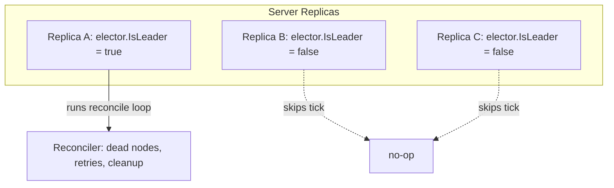
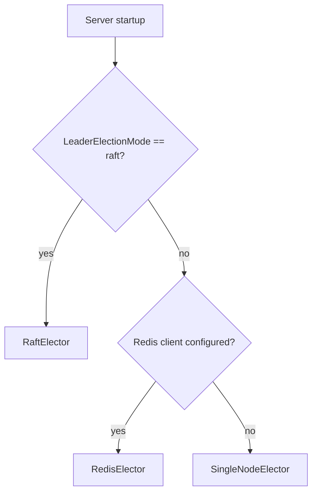

# Leader Election Internals

Forge's control plane is single-writer: only one server replica may reconcile cluster state at a time. Leader election is what makes that guarantee hold across Redis, Raft, and single-process deployments without the reconciler needing to know which one is in play.

## Why leadership is the only thing that matters

The `Reconciler` doesn't care who the leader is, how it got elected, or how long it's held the role — it only asks one question on every tick: "am I the leader right now?" This is deliberate. Reconciliation (dead-node eviction, orphan re-enqueue, stale-dispatch/ack recovery) is idempotent and safe to hand off mid-stream to a different replica, so there's no need for the elector to expose term numbers, peer lists, or election history to its callers. The entire contract collapses to four methods:

```go
type LeaderElector interface {
    Acquire(ctx context.Context) error
    IsLeader() bool
    Resign(ctx context.Context) error
    Watch(ctx context.Context) <-chan bool
}
```

- **Acquire** — attempt to become leader (blocking or best-effort, depending on implementation).
- **IsLeader** — a cheap, synchronous check consulted on every reconciler tick.
- **Resign** — voluntarily give up leadership (clean shutdown).
- **Watch** — a channel of leadership transitions, for callers that want to react to gain/loss rather than poll.

Everything downstream of election — scheduling, placement, dead-node cleanup — is written against `IsLeader()` alone. That narrow surface is what lets Forge swap Redis, Raft, or a no-op single-node elector underneath without touching a single line of reconciliation logic.



## The three implementations

| Implementation | Consensus mechanism | Discovery | Persistence | Use case |
|---|---|---|---|---|
| `RedisElector` | Distributed lock (SET NX + TTL) | Shared Redis instance | None (lock expires) | Redis-backed control plane, multi-replica |
| `RaftElector` | HashiCorp Raft log consensus | memberlist gossip | In-memory (per-process) | No shared Redis; peer-to-peer server cluster |
| `SingleNodeElector` | None | None | None | Embedded / single-process mode |

### RedisElector

`RedisElector` implements leadership as a distributed lock on a single well-known key, `forge:control:leader`, using the classic `SET NX EX` pattern with a 5-second TTL.

**Acquisition.** `Acquire` attempts `SET forge:control:leader <owner-id> NX EX 5`. If the key is absent, the caller wins the lock and becomes leader immediately. If another replica already holds it, `Acquire` doesn't busy-loop — it backs off and retries at `ttl/2` (2.5s), which bounds worst-case failover latency: a dead leader's lock expires after 5s, and a waiting replica should notice and acquire within another ~2.5s.

**Renewal.** Once leader, the elector must keep the lock alive without ever mistakenly extending someone else's lock (which would happen if this process's TTL expired and another replica raced in before its own renewal ran). That's why renewal isn't a blind `EXPIRE` — it's a compare-and-extend Lua script that checks the stored owner ID matches before bumping the TTL:

```lua
-- conceptual shape of the renewal script
if redis.call("GET", KEYS[1]) == ARGV[1] then
    return redis.call("EXPIRE", KEYS[1], ARGV[2])
else
    return 0
end
```

The renewal loop fires at `ttl/3` (roughly every 1.7s against the 5s TTL) — comfortably inside the TTL window so a single missed tick (GC pause, network blip) doesn't cost leadership. If the compare-and-extend fails (lock expired and someone else grabbed it, or the key vanished), the elector immediately flips its local state via `setLeader(false)` rather than waiting for the next tick to discover the loss.

!!! note "Renewal cadence vs. retry cadence"
    Notice the asymmetry: the *leader* renews at `ttl/3` (fast, to tolerate jitter) while a *challenger* retries acquisition at `ttl/2` (slower, since it's polling for someone else's failure). This spacing is what keeps the 5s TTL from producing thrashing between replicas that are both narrowly missing the lock.

### RaftElector

`RaftElector` is for deployments with no shared Redis — a cluster of Forge server replicas that only know about each other via gossip. It combines two HashiCorp libraries:

- **raft** for leader consensus and term tracking.
- **memberlist** for gossip-based peer discovery, so replicas can find each other without a central registry.

Since Forge only needs to know *who is leader*, not replicate any log-backed state machine, `RaftElector` runs raft against a dummy FSM — `Apply` is effectively a no-op. The log store and stable store are in-memory (no disk persistence), which is fine because the only durable facts about the cluster (placements, node capacity, agent status) already live in Redis/NATS, not in raft.

**Bootstrap and membership.** A `RaftElector` node either joins an existing gossip cluster or self-bootstraps as the seed if no join peers are configured. As memberlist observes peers joining and leaving, the elector dynamically adds/removes raft voters to match — there's no static voter list to maintain by hand.

**Bind flags.** Raft mode is enabled by CLI flag and wired to two independent listeners — one for the raft transport, one for gossip:

```bash
forge server \
  --raft-bind 0.0.0.0:7000 \
  --gossip-bind 0.0.0.0:7946 \
  --gossip-join 10.0.1.11:7946,10.0.1.12:7946
```

- `--raft-bind` — address raft uses for its own RPC transport (AppendEntries, RequestVote).
- `--gossip-bind` — address memberlist binds for gossip traffic.
- `--gossip-join` — seed peers to contact on startup; omit it on the first node in a fresh cluster and it self-bootstraps.

!!! warning "Restart wipes raft history, not cluster state"
    Because the log/stable stores are in-memory, restarting every node in the raft cluster simultaneously loses all raft term/log history — a fresh election just happens. This is safe by design: raft here carries no durable cluster facts, only the leadership decision itself.

### SingleNodeElector

For embedded or single-process deployments there's no election to run — `SingleNodeElector` reports leadership immediately and unconditionally. `Acquire` succeeds trivially, `IsLeader` always returns true, and `Resign`/`Watch` are effectively inert. This is the right default whenever there's exactly one server process and no coordination is needed.

## Selection order

The server picks exactly one elector at startup, in this priority order:

1. **Raft**, if `LeaderElectionMode == "raft"` — an explicit opt-in, since it requires `--raft-bind`/`--gossip-bind` to be meaningful.
2. **Redis**, if a Redis client is configured — the common case for multi-replica deployments already using Redis as the control transport.
3. **SingleNodeElector**, otherwise — the fallback for embedded/single-process mode.



Raft takes precedence over Redis even if both are configured, since choosing raft is an explicit operator decision; Redis is the sensible default when a Redis client exists but raft wasn't requested.

## Split-brain prevention in the reconciler

Every reconciliation tick checks leadership before doing anything else. This is the single point where election outcomes actually change cluster behavior:

```go
case <-ticker.C:
    if r.elector != nil && !r.elector.IsLeader() {
        continue
    }
    r.reconcile(ctx)
```

Non-leader replicas still run their ticker, they just skip the body every time — `IsLeader()` gates the whole five-phase pass (`reconcileDeadNodes`, `reconcileAccepted`, `reconcileStaleDispatches`, `reconcileStaleAcks`, `cleanupFailedPlacements`). This is what prevents two replicas from concurrently deregistering the same dead node, double re-enqueuing an orphaned agent, or racing on `MarkFailed`/`Remove` for the same placement.

Because the check is per-tick rather than held for the process lifetime, a leadership handoff is cheap and safe: the moment `RedisElector`'s renewal fails (lock lost to a partition) or `RaftElector` loses its term, `IsLeader()` flips to false on the next tick and the (former) leader simply stops reconciling — no explicit handoff protocol needed, since the new leader's own tick will pick up the exact same in-memory bookkeeping (`NodeRegistry`, `PlacementMap`) it already had access to.

!!! tip "Leadership loss is silent by design"
    There's no "step down" event the reconciler reacts to — losing leadership just means the next `if !elector.IsLeader() { continue }` check returns early. Don't build additional coordination on top of election transitions; the existing gate is sufficient and is exactly what keeps the scheduler single-writer.

## Related

- [Scheduler internals](scheduler-placement/) for how the reconciler's five phases interact with the `NodeRegistry` and `PlacementMap`.
- [Deployment topologies](../getting-started/quickstart/) for choosing between embedded, Redis-backed, and raft-clustered server modes.
