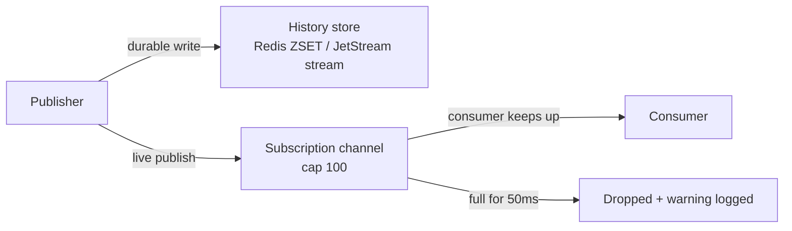

# Messaging Backends Internals

Forge's data plane runs on one interface and two very different storage engines. Understanding where Redis and NATS diverge — durability, delivery guarantees, failure modes — is the difference between debugging a dropped message in five minutes and losing an afternoon to it.

## The `Backend` interface

Everything in this page is an implementation of a single interface, defined in `messaging/backend.go`:

```go
type Backend interface {
	PublishMessage(ctx context.Context, namespace, topic string, msg *protocol.Message) error
	GetMessagesForTopic(ctx context.Context, namespace, topic string) ([]protocol.Message, error)
	GetMessagesSince(ctx context.Context, namespace, topic string, sinceID uint64) ([]protocol.Message, error)
	GetMessagesByID(ctx context.Context, namespace string, msgIDs []uint64) ([]protocol.Message, error)
	Subscribe(ctx context.Context, namespace string, topics ...string) (Subscription, error)
	Close() error
}

type Subscription interface {
	Channel() <-chan SubMessage
	ErrChannel() <-chan error
	Close() error
}
```

`RedisBackend` (`messaging/client.go`, `messaging/query.go`) and `NATSBackend` (`messaging/nats_backend.go`) both satisfy this interface, enforced at compile time with `var _ Backend = (*RedisBackend)(nil)`-style assertions. Which one is live is a runtime decision — the `--backend` flag (`redis` or `nats`, default `redis`) in `command/server.go` — and the choice is shared by three subsystems built side by side: messaging, the control plane (`control.NewRedisControlTransport` / `NewNATSControlTransport`), and the agent status store (`supervisor.NewRedisAgentStatusStore` / `NewNATSAgentStatusStore`). In `agent/server.go`, `natsURL != ""` is the actual switch: if it's set, the whole stack — messaging, control, status — runs on NATS instead of Redis.

Every topic is namespaced by guild ID before it ever touches a backend: `namespace + ":" + topic`. This mirrors the Python `MessagingInterface`, which internally prepends `{guild_id}:` to all topics. `PublishMessage` stores the namespaced form but sets `msg.TopicPublishedTo` to the bare topic.

!!! note "Wire compatibility is deliberate"
    Topic naming, TTL env vars, and every JetStream subject/stream/KV bucket name in this page mirror the Python Rustic AI runtime exactly. This isn't incidental — it's what lets a Go supervisor and Python agents share one bus.

## Redis: pipelined cache + ZSET + PubSub

`RedisBackend.PublishMessage` is a three-step write, with the first two pipelined into a single round trip:

```go
cacheKey := fmt.Sprintf("msg:%s:%d", namespace, msg.ID)
pipe := r.rdb.Pipeline()
pipe.Set(ctx, cacheKey, strJSON, r.config.MessageTTL)                                  // direct lookup
pipe.ZAdd(ctx, nsTopic, redis.Z{Score: float64(gemstone.Timestamp), Member: strJSON})  // history
_, _ = pipe.Exec(ctx)
r.rdb.Publish(ctx, nsTopic, strJSON)                                                   // live subscribers
```

1. **`SET msg:{namespace}:{id}`** — a TTL'd string cache keyed by message ID, giving O(1) direct lookup for `GetMessagesByID`.
2. **`ZADD {namespace}:{topic}`** — the JSON-encoded message added to a per-topic sorted set, scored by the message's embedded GemstoneID timestamp. This ZSET is the durable, chronologically ordered history for the topic.
3. **`PUBLISH {namespace}:{topic}`** — fire-and-forget delivery to whatever is subscribed right now.

Steps 1 and 2 share a pipeline for latency; step 3 is a separate call because PubSub and the keyspace are different Redis subsystems.

`RedisBackend.Close()` is a no-op. The Redis connection is assumed to be externally managed — Forge doesn't own its lifecycle and won't tear it down on `Close()`.

!!! warning "Redis backend never closes its connection"
    If you're diagnosing a connection leak, look at whoever constructed the `*redis.Client` passed into `NewRedisBackend`. `Backend.Close()` will not help you here.

## NATS: three-tier publish over JetStream

`NATSBackend.PublishMessage` fans a single message out across three independent NATS mechanisms:

```go
// 1. JetStream for ordered, durable topic storage.
if _, err := b.js.Publish(jsSubject(nsTopic), msgBytes); err != nil { /* ... */ }
// 2. KV for O(1) ID lookup.
if _, err := kv.Put(strconv.FormatUint(msg.ID, 10), msgBytes); err != nil { /* ... */ }
// 3. Core NATS pub/sub for live listeners (tier-1, matching Python).
if err := b.nc.Publish(nsTopic, msgBytes); err != nil { /* ... */ }
```

| Tier | Mechanism | Role |
|---|---|---|
| Durable history | JetStream stream | Ordered, replayable per-topic storage |
| By-ID lookup | JetStream KV bucket (per namespace) | O(1) `GetMessagesByID` |
| Live delivery | Core NATS pub/sub | Best-effort, at-most-once, tier-1 |

Streams and KV buckets are **lazily created and cached in-memory** (`streams` map, `kvBuckets` map, both mutex-guarded). Creation is resilient to restarts: if `AddStream` fails, the backend falls back to a `StreamInfo` lookup on an already-existing stream; if `CreateKeyValue` fails, it falls back to binding the existing bucket. These in-memory caches are rebuilt lazily after every process restart — there's no persisted registry of what's been created.

Unlike Redis, `NATSBackend` owns its connection: `Close()` calls `Drain()` on the underlying `nats.Conn`, flushing in-flight publishes before disconnecting.

### Naming conventions

`messaging/naming.go` reproduces the Python backend's naming scheme exactly, character for character:

```go
func sanitize(name string) string {
	r := strings.NewReplacer(":", "_", ".", "_", "$", "_")
	return r.Replace(name)
}
func jsSubject(topic string) string  { return "persist." + sanitize(topic) } // JetStream subject
func streamName(topic string) string { return "MSGS_" + sanitize(topic) }   // JetStream stream
func kvBucketName(ns string) string  { return "msg-cache-" + sanitize(ns) }  // KV bucket per namespace
```

`sanitize` exists because namespaced topics already contain `:` (from the `namespace:topic` join), and NATS subjects, stream names, and KV bucket names each have their own reserved characters (`:`, `.`, `$`). Every JetStream resource name in Forge is derived by sanitizing first, then prefixing.

| Resource | Pattern | Example |
|---|---|---|
| JetStream subject | `persist.<sanitized-topic>` | `persist.guild1_default_topic` |
| JetStream stream | `MSGS_<sanitized-topic>` | `MSGS_guild1_default_topic` |
| KV bucket | `msg-cache-<sanitized-namespace>` | `msg-cache-guild1` |

## Query paths

Both backends serve the same three read paths, but they get there very differently, and — this matters for on-call triage — they **do not fail the same way**.

**`GetMessagesForTopic`** — full topic history.

- *Redis*: `ZRANGE` over the topic's ZSET, then `parseAndSortMessages`.
- *NATS*: creates an **ephemeral pull consumer** with `DeliverAll`, fetches exactly `info.State.Msgs` messages (10s `MaxWait`), acks each one, and returns `nil` early if the stream is empty. The consumer has a 5s `InactiveThreshold` so it self-cleans without leaving orphaned consumers on the stream.

**`GetMessagesSince(sinceID)`** — messages strictly after a given ID.

- *Redis*: `ZRANGEBYSCORE` starting from the sinceID's embedded timestamp, filtered to `ID > sinceID`.
- *NATS*: uses the sinceID's GemstoneID timestamp as a **`nats.StartTime` hint** on the consumer, then fetches in 256-message batches (200ms `MaxWait`) and filters `msg.ID > sinceID` **in memory**.

!!! tip "StartTime is a coarse filter, not the source of truth"
    The NATS `StartTime` hint only narrows which messages JetStream returns — it is not exact, because GemstoneID timestamps aren't guaranteed strictly monotonic across machines/sequences at millisecond granularity. Correctness comes entirely from the in-memory `msg.ID > sinceID` filter that runs after the fetch. Never assume `StartTime` alone gives you exact semantics.

**`GetMessagesByID(ids...)`** — direct lookup.

- *Redis*: pipelines `GET msg:{namespace}:{id}` for every ID, tolerating `redis.Nil` (missing keys are silently skipped).
- *NATS*: loops `KV.Get(id)`, skipping `nats.ErrKeyNotFound`.

Both backends sort results via `protocol.Compare` on parsed GemstoneIDs — chronological order is never left to storage-engine iteration order.

### Fail-loud vs. fail-soft: an intentional asymmetry

`parseAndSortMessages` (`query.go`) is shared by both backends, and it behaves differently depending on caller:

- **History path (`GetMessagesForTopic`)** — a corrupted JSON entry is a **hard error**. Fail-loud: if the durable history is corrupted, callers need to know, because history is the source of truth.
- **By-ID and since paths** — a message that fails to unmarshal is **silently skipped**. Fail-soft: a partial result for a targeted lookup is better than blocking the caller on one bad record.

This is not an oversight. Treat any change that unifies these two behaviors as a regression unless it's an explicit, reviewed decision.

## Subscription and live delivery

`Backend.Subscribe(ctx, namespace, topics...)` returns a `Subscription` — `Channel() <-chan SubMessage`, `ErrChannel() <-chan error`, `Close()` — where `SubMessage` wraps `{Topic string, Message *protocol.Message}`.

- `redisSubscription` (`subscribe.go`) wraps a single `redis.PubSub`.
- `natsSubscription` (`nats_subscribe.go`) wraps **one core `nats.Subscription` per topic** and fans them all into a single Go channel.

Both implementations share the same back-pressure contract: **a buffered channel of capacity 100**, and a delivery attempt that **times out after 50ms** and drops the message (logging a warning) if the consumer isn't draining fast enough.



This makes live delivery **at-most-once and lossy under back-pressure** by design. Durable history — the Redis ZSET or the JetStream stream — is the actual source of truth for replay; live pub/sub is a best-effort tier-1 convenience layer on top of it. Any consumer that needs guaranteed delivery must reconcile against `GetMessagesSince` using the last ID it saw, not rely on the live channel alone.

!!! warning "A busy consumer silently loses messages"
    If a subscriber's channel is full for 50ms, the message is dropped — not queued, not retried. This is the single most common cause of "why didn't my agent see that message" reports. Check for a warning log at drop time, then check `GetMessagesSince` against the consumer's last known ID to confirm nothing was actually lost from history — only from the live tier.

## TTLs and retention

Both backends default to a **3600-second (1 hour)** message TTL, each configurable via its own environment variable (integer seconds):

| Backend | Env var | Default |
|---|---|---|
| Redis | `RUSTIC_AI_REDIS_MSG_TTL` | 3600 |
| NATS | `RUSTIC_AI_NATS_MSG_TTL` | 3600 |

NATS layers one more rule on top. Certain namespaced topics get a much longer JetStream `MaxAge` — **60 days** — regardless of the configured default:

```go
const longRetentionTTL = 60 * 24 * time.Hour // 60 days
var longRetentionTopics = []string{"user_notifications:", "user_message_broadcast"}

func (b *NATSBackend) ttlForTopic(nsTopic string) time.Duration {
	for _, pattern := range longRetentionTopics {
		if strings.Contains(nsTopic, pattern) {
			return longRetentionTTL
		}
	}
	return b.config.MessageTTL // default 3600s (RUSTIC_AI_NATS_MSG_TTL)
}
```

The match is a substring `Contains` check against the *namespaced* topic, so any topic containing `user_notifications:` (e.g. per-user `user_notifications:{id}`) or `user_message_broadcast` gets the 60-day stream retention — notification history and broadcast history are expected to outlive an ordinary hour-long message TTL. Redis has no equivalent per-topic override; every key in Redis shares the single configured TTL.

## Embedded servers and isolation

Forge can run with zero external infrastructure via the `embed` package:

- **`embed/redis.go`** wraps `github.com/alicebob/miniredis/v2`. `StartEmbeddedRedis` / `StartEmbeddedRedisAt(addr)` return an `*EmbeddedRedis` with `Host`/`Port`/`Addr`/`Client` accessors.
- **`embed/nats.go`** runs an in-process `nats-server` with JetStream enabled:

```go
opts := &natsserver.Options{JetStream: true, StoreDir: storeDir, Port: -1}
s, _ := natsserver.NewServer(opts)
go s.Start()
if !s.ReadyForConnections(15 * time.Second) { s.Shutdown() /* fail */ }
```

`StartEmbeddedNATS` / `StartEmbeddedNATSAt(addr)` return an `*EmbeddedNATS`. Each instance gets an **isolated JetStream `StoreDir`** — a `MkdirTemp` directory under `forgepath.Resolve("nats")`, with a writability probe that falls back to `os.MkdirTemp("")` if that root isn't writable. `Close()` removes the store directory, so embedded JetStream state never leaks between test runs or process restarts.

The CLI flags controlling all of this, from `command/server.go`:

```bash
forge server \
  --backend redis \                        # or "nats"
  --redis redis://localhost:6379 \         # external Redis URL (optional)
  --nats nats://localhost:4222 \           # external NATS URL (optional)
  --embedded-redis-addr 127.0.0.1:6379 \   # default when embedding Redis
  --embedded-nats-addr ""                   # default is ephemeral port
```

!!! note "Redis and NATS aren't mutually exclusive on the CLI"
    With `--backend redis` you can still pass `--nats` for an external NATS instance, and with `--backend nats` you can still pass `--redis` — used for leader election. The `--backend` flag picks the *messaging* transport; `natsURL != ""` is what actually flips messaging, control plane, and status store over to NATS together in `agent/server.go`.

## Reference: worked examples

**Redis pipelined publish** — the exact sequence a message takes on the wire:

```go
cacheKey := fmt.Sprintf("msg:%s:%d", namespace, msg.ID)
pipe := r.rdb.Pipeline()
pipe.Set(ctx, cacheKey, strJSON, r.config.MessageTTL)
pipe.ZAdd(ctx, nsTopic, redis.Z{Score: float64(gemstone.Timestamp), Member: strJSON})
_, _ = pipe.Exec(ctx)
r.rdb.Publish(ctx, nsTopic, strJSON)
```

**NATS three-tier publish** — durable, indexed, and live in one call:

```go
b.js.Publish(jsSubject(nsTopic), msgBytes)
kv.Put(strconv.FormatUint(msg.ID, 10), msgBytes)
b.nc.Publish(nsTopic, msgBytes)
```

**Long-retention TTL logic** — how a topic earns 60 days instead of 1 hour:

```go
if strings.Contains(nsTopic, "user_notifications:") ||
	strings.Contains(nsTopic, "user_message_broadcast") {
	return longRetentionTTL // 60 days
}
return b.config.MessageTTL // RUSTIC_AI_NATS_MSG_TTL, default 3600s
```

## Related

- [Quickstart](../getting-started/quickstart/) for booting Forge with embedded backends.
- [Control Plane Internals](control-plane/) for how the same Redis/NATS transport carries control traffic.
- [Supervisors](supervisors/) for the ZMQ bridge that exposes this bus to Python agent processes.
