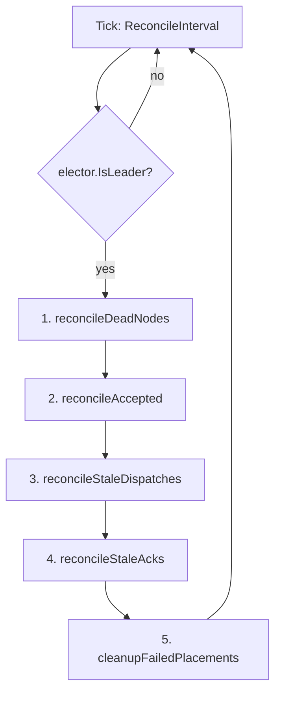

# Reconciler & Recovery Internals

The Reconciler is Forge's self-healing loop: it is the only component allowed to evict dead nodes, retry stuck dispatches, and re-place orphaned agents, and it only runs on whichever server instance currently holds cluster leadership.

## Leader-gated tick

`NewReconciler(registry, placementMap, transport, elector, statusStore, config)` starts a ticker at `ReconcileInterval` (default 15s). On every tick it checks `elector.IsLeader()` before doing anything:

```go
case <-ticker.C:
    if r.elector != nil && !r.elector.IsLeader() {
        continue
    }
    r.reconcile(ctx)
```

Non-leader replicas tick the same clock but do no work — they simply wait to be promoted. This is what makes reconciliation safe to run on every server process: at most one of them ever mutates `NodeRegistry` or `PlacementMap` state at a time. See [Leader Election](leader-election/) for how `RedisElector`, `RaftElector`, and `SingleNodeElector` decide who that is.

!!! note "Why leader-gating matters here specifically"
    The Reconciler deregisters nodes, removes placements, and re-pushes spawn requests onto the global queue. If two servers ran this concurrently against a split view of `NodeRegistry`, you'd get duplicate re-enqueues and double-scheduled agents. Gating the entire `reconcile()` call behind `IsLeader()` — not just individual mutations — removes that class of bug entirely.

## The five ordered phases

Each leader tick runs exactly five phases, always in this order:

```go
r.reconcileDeadNodes(ctx)
r.reconcileAccepted(ctx)
r.reconcileStaleDispatches(ctx)
r.reconcileStaleAcks(ctx)
r.cleanupFailedPlacements()
```



The order is deliberate. Dead-node eviction runs first so that orphaned placements are freed and re-enqueued before the later phases evaluate timeouts against them — an agent that was on a node that just died should be re-queued as a fresh spawn, not aged through the stale-dispatch/stale-ack machinery. `reconcileAccepted` retries placements that never made it past `MarkAccepted` (the server reverts here on scheduling/push failure). `reconcileStaleDispatches` and `reconcileStaleAcks` then handle the two points where a spawn can silently stall in flight. `cleanupFailedPlacements` runs last because it only removes placements the earlier phases have already marked terminal.

| Phase | Looks at | Triggers on |
|---|---|---|
| `reconcileDeadNodes` | `NodeRegistry` heartbeats | `time.Since(LastHeartbeat) > DeadNodeTimeout` |
| `reconcileAccepted` | Placements stuck in `accepted` | Retry of failed schedule/push |
| `reconcileStaleDispatches` | Placements in `dispatched` | Older than `AckTimeout`, cross-checked against `AgentStatusStore` |
| `reconcileStaleAcks` | Placements in `acknowledged` | Older than `LaunchTimeout`, never reached `running` |
| `cleanupFailedPlacements` | Placements in `failed` | Older than `FailedCleanupAge` |

## Dead-node reconciliation

A node is declared dead — and evicted — the moment its heartbeat silence exceeds `DeadNodeTimeout` (15s):

```go
for nodeID, state := range r.registry.nodes {
    if now.Sub(state.LastHeartbeat) > r.config.DeadNodeTimeout { // 15s
        deadNodes = append(deadNodes, nodeID)
    }
}
// ...
orphans := r.placementMap.AgentsOnNode(nodeID)
r.registry.Deregister(nodeID)
for _, o := range orphans {
    r.placementMap.Remove(o.GuildID, o.AgentID)
    r.reenqueue(ctx, o) // Push {command:spawn,payload} to forge:control:requests
}
```

For each dead node the Reconciler logs `Detected dead node, reconciling orphaned agents`, then:

1. **Gather orphans** — `AgentsOnNode(nodeID)` returns every `AgentPlacement` currently bound to that node.
2. **Deregister** — removing the node from `NodeRegistry` immediately stops the `Scheduler` from placing anything new on it, and its `UsedCapacity` disappears with it (no manual capacity accounting needed).
3. **Remove + re-enqueue** — each orphan's placement is deleted from `PlacementMap`, then handed to `reenqueue`.

!!! warning "Two different unhealthy thresholds"
    The `NodeRegistry`'s `IsHealthy`/`ListHealthy` (consulted by the `Scheduler`) treat a node unhealthy after **10s** of heartbeat silence. The Reconciler doesn't evict until **15s** (`DeadNodeTimeout`). In that 5-second window a node is invisible to new placements but not yet reclaimed — its existing agents are still tracked, just not receiving new work. This gap is intentional slack against transient heartbeat delays, but it means "unhealthy" and "dead" are not the same predicate; don't conflate them when reasoning about failover latency.

### reenqueue mechanics

`reenqueue` is what turns cluster-failure recovery into "just another spawn":

```go
// reenqueue(ctx, placement):
//  1. unmarshal placement.Payload back into the original SpawnRequest bytes
//  2. re-wrap as a ControlMessageWrapper: {"command":"spawn","payload":<payload>}
//  3. Push(ctx, control.ControlQueueRequestKey, wrapped) // forge:control:requests
```

Because `AgentPlacement.Payload` stores the byte-for-byte original `SpawnRequest`, re-enqueuing never has to reconstruct agent specs, guild config, or resource requests from partial state — it replays exactly what the client originally sent. The message lands back on the **global** queue (`forge:control:requests`), so it re-enters the normal `ControlQueueListener.OnSpawn` path: fresh idempotency gate, fresh `Scheduler.Schedule` (which will naturally skip the now-deregistered dead node), fresh `MarkAccepted`/`MarkDispatched`. Recovery is indistinguishable from a brand-new spawn request.

## Stale-dispatch and stale-ack recovery

Two more failure modes don't involve a dead node at all: the dispatch message was delivered, but the worker never confirmed progress. The Reconciler resolves both by cross-checking the distributed `AgentStatusStore` rather than assuming failure.

```go
stale := r.placementMap.GetStaleDispatches(r.config.AckTimeout) // 30s
for _, p := range stale {
    status, err := r.statusStore.GetStatus(ctx, p.GuildID, p.AgentID)
    if err == nil && status != nil {
        if status.State == "starting" { r.placementMap.MarkAcknowledged(p.GuildID, p.AgentID); continue }
        if status.State == "running"  { r.placementMap.MarkRunning(p.GuildID, p.AgentID); continue }
    }
    if p.Attempts >= r.config.MaxAttempts { r.placementMap.MarkFailed(p.GuildID, p.AgentID); continue }
    r.placementMap.Remove(p.GuildID, p.AgentID)
    r.reenqueue(ctx, p)
}
```

**`reconcileStaleDispatches`** — placements stuck in `dispatched` for longer than `AckTimeout` (30s). The worker's `ControlQueueHandler.handleSpawn` writes `state="starting"` to the `AgentStatusStore` (TTL 120s) as soon as it accepts the launch, and `state="running"` once the process is confirmed alive. So before assuming loss, the Reconciler asks the store:

- Store says `"starting"` → promote the placement to `Acknowledged` in place. No re-send; the worker is just slow to report back through the placement map (the store is the faster, cross-node-visible signal).
- Store says `"running"` → promote straight to `Running`.
- Store has nothing (or an error) → the dispatch genuinely never landed. Fall through to attempt accounting.

**`reconcileStaleAcks`** — the same shape, one stage later: placements in `acknowledged` for longer than `LaunchTimeout` (120s) that never transitioned to `running`. This covers the gap where a worker accepted the spawn and wrote `"starting"`, but crashed or hung before the process actually came up — delivery succeeded, launch didn't.

## Attempt counting and terminal failure

Both stale-recovery phases fall back to the same attempt-counting logic when the status store can't vouch for progress:

- **`Attempts >= MaxAttempts` (5)** → `MarkFailed`. The placement moves to the terminal `failed` state and is no longer retried.
- **Otherwise** → `Remove` + `reenqueue`. The orphaned spawn goes back through the global queue exactly as in dead-node recovery, and `MarkDispatched` increments `Attempts` on the next placement attempt (resetting to 1 only if the prior state was `failed`).

This means every re-enqueue — whether from a dead node, a stale dispatch, or a stale ack — is bounded: an agent that can't successfully launch after 5 attempts stops consuming cluster resources and surfaces as a durable `failed` placement instead of looping forever.

## FailedCleanupAge lingering

`cleanupFailedPlacements` is deliberately the last phase and the least urgent one. It calls `GetFailedOlderThan(FailedCleanupAge)` (default 5m) and only then deletes the placement from `PlacementMap`.

!!! tip "Failed placements are observability, not just garbage"
    A `failed` placement is left in place for `FailedCleanupAge` before removal specifically so operators and telemetry have a window to see it — via metrics, logs, or direct inspection — before it disappears. If you tune `FailedCleanupAge` down to near-zero, you lose that visibility window entirely; if you tune it very high, expect `PlacementMap` (in-memory, unbounded) to accumulate dead entries under sustained failure.

## ReconcilerConfig defaults

```go
ReconcilerConfig{
    ReconcileInterval: 15 * time.Second,
    AckTimeout:        30 * time.Second,
    LaunchTimeout:     120 * time.Second,
    MaxAttempts:       5,
    DeadNodeTimeout:   15 * time.Second,
    FailedCleanupAge:  5 * time.Minute,
}
```

| Field | Default | Governs |
|---|---|---|
| `ReconcileInterval` | 15s | How often the leader evaluates all five phases. |
| `AckTimeout` | 30s | Max time a placement may sit `dispatched` before being treated as stale. |
| `LaunchTimeout` | 120s | Max time a placement may sit `acknowledged` before being treated as stale. |
| `MaxAttempts` | 5 | Re-enqueue attempts allowed before a placement is marked terminally `failed`. |
| `DeadNodeTimeout` | 15s | Heartbeat silence after which a node is evicted and its agents orphaned. |
| `FailedCleanupAge` | 5m | How long a `failed` placement lingers before removal. |

### Reasoning about tuning

- **`ReconcileInterval` vs. the timeouts it evaluates** — there's no point setting `ReconcileInterval` below a few seconds; every timeout (`AckTimeout`, `LaunchTimeout`, `DeadNodeTimeout`) is only checked once per tick, so the interval is your recovery-detection granularity, not a rate limiter on retries.
- **`DeadNodeTimeout` vs. the registry's 10s health threshold** — lowering `DeadNodeTimeout` closer to 10s shrinks the "invisible but not reclaimed" window (see the warning above) at the cost of evicting nodes more aggressively on transient network blips. Raising it widens that window and increases mean-time-to-recovery for a genuinely dead node.
- **`AckTimeout` / `LaunchTimeout` against real launch latency** — these should comfortably exceed your slowest expected `sup.Launch` path (image pulls, `uvx` package resolution, cold starts). Setting them too tight causes the Reconciler to re-enqueue spawns that were simply slow, which under load can compound into duplicate scheduling pressure even though the cross-node idempotency gate in `handleSpawn` prevents duplicate execution.
- **`MaxAttempts`** — this is your circuit breaker against unschedulable or permanently broken agent specs (bad `ClassName`, missing secrets, unsatisfiable resource requests). Raising it delays surfacing a real configuration problem as `failed`; lowering it risks marking an agent failed during a transient cluster-wide event (e.g., a rolling restart of worker nodes).
- **`FailedCleanupAge`** — purely an observability/memory tradeoff, since `PlacementMap` is in-memory only (see below). Tune it to match your alerting/scrape interval for failed-placement metrics, not any correctness concern.

!!! warning "PlacementMap is not persisted"
    `GlobalPlacementMap` lives only in the leader server's memory. A control-plane restart or leadership handover loses all `accepted`/`dispatched`/`acknowledged` tracking — there is no replay log. Recovery after such an event leans entirely on the `AgentStatusStore` (Redis/NATS, TTL'd) and the worker-side idempotency gate in `handleSpawn`, not on replaying the placement map. Keep this in mind when reasoning about worst-case recovery time after a leader crash: it's bounded by status-store TTLs and client-driven retries, not by Reconciler config.

## Related pages

- [Leader Election](leader-election/) — how `IsLeader()` is determined across Redis, Raft, and single-node modes.
- [Scheduling & Placement](scheduler-placement/) — `NodeRegistry`, `Scheduler.Schedule`, and the `SpawnState` machine that the Reconciler operates on.
- [Control Plane Transports](control-plane/) — Redis list and NATS JetStream queue mechanics behind `Push`/`Pop`.
