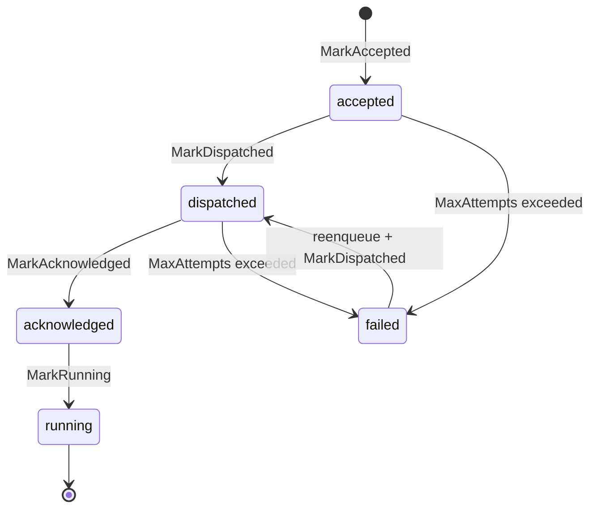

# Scheduler & Placement Internals

Every agent spawn in Forge has to answer one question fast and correctly: which node runs this. This page is the SRE-level trace through the three data structures that answer it — `NodeRegistry`, `Scheduler`, `PlacementMap` — and the failure modes their in-memory nature creates.

## NodeRegistry: capacity and health

`scheduler.GlobalNodeRegistry` is a `map[string]*NodeState` behind a single `RWMutex`. It is the cluster's live view of worker capacity, and nothing about it is persisted — it is rebuilt entirely from node registrations and heartbeats.

Each `NodeState` holds:

```go
type NodeState struct {
    NodeID        string
    TotalCapacity ResourceCapacity // {CPUs, Memory, GPUs int}
    UsedCapacity  ResourceCapacity
    LastHeartbeat time.Time
}
```

**Mutating operations:**

- `Register` sets or updates a node's `TotalCapacity` and stamps `LastHeartbeat`. Re-registering an already-known node is safe and idempotent — it's how a node recovers after being evicted.
- `Heartbeat` refreshes `LastHeartbeat` for a known node and returns `false` if the node isn't in the map. That `false` is the signal the HTTP layer turns into a 404, which in turn tells the node client to re-register.
- `Deregister` deletes the node's entry outright.
- `AllocateCapacity` / `DeallocateCapacity` adjust `UsedCapacity` as agents are placed and removed. Both are **clamped at zero** — a deallocation can never drive `UsedCapacity` negative, which protects the registry from arithmetic drift if dealloc events arrive out of order or are double-processed.

!!! note "Every mutation emits metrics"
    `Register`, `Heartbeat`, `Deregister`, `AllocateCapacity`, and `DeallocateCapacity` all call `recordMetricsLocked` before releasing the lock. This keeps the nodes-registered count and available-slots gauges consistent with the mutex-protected state — there's no separate metrics pass that could observe a torn read.

## Scheduler: most-free placement

`scheduler.GlobalScheduler` wraps the registry and exposes one entry point:

```go
func (s *Scheduler) Schedule(agentSpec protocol.AgentSpec) (string, error)
```

**Reading the request.** CPU and GPU requirements come from `agentSpec.Resources.NumCPUs` / `NumGPUs` (`*float64`, so a nil pointer means "no requirement"). Memory is pulled from `Resources.CustomResources["memory"]` as a `float64` — there's no dedicated `Memory` field on `ResourceSpec`, it rides in the custom-resources map.

**Filtering.** `Schedule` calls `ListHealthy()` to get only nodes whose `LastHeartbeat` is within the health window (see below), then filters that set to nodes whose remaining CPUs, memory, and GPUs are all `>=` the request.

**Scoring.** Among the survivors, the node with the *highest* score wins:

```go
for _, n := range nodes {
    remCPUs := n.TotalCapacity.CPUs - n.UsedCapacity.CPUs
    remMem := n.TotalCapacity.Memory - n.UsedCapacity.Memory
    remGPUs := n.TotalCapacity.GPUs - n.UsedCapacity.GPUs
    if remCPUs >= reqCPUs && remMem >= reqMem && remGPUs >= reqGPUs {
        score := remMem + (remCPUs * 1024)
        if bestNode == "" || score > bestFitScore {
            bestFitScore = score
            bestNode = n.NodeID
        }
    }
}
```

!!! warning "This is most-free, not best-fit"
    The name `Schedule` and the docstring vocabulary say "best-fit," but the formula `remMem + remCPUs*1024` rewards nodes with the *most* remaining capacity, not the *tightest* fit. It's a worst-fit / load-spreading strategy: CPUs are weighted into the same scale as memory (raw MB) by multiplying by 1024, so a node with more free CPU cores dominates the score even if its free memory is comparable to a busier node's. The practical effect is that load spreads evenly across the fleet instead of packing tightly onto a few nodes.

**Allocation is immediate.** As soon as a node is chosen, `Schedule` calls `AllocateCapacity` on it before returning. There's no separate confirm step — the capacity is reserved synchronously in the same call that picks the winner, which is what makes concurrent `Schedule` calls safe against double-booking the same slot.

**Failure modes** are two distinct errors, both worth alerting on separately:

| Error | Cause |
|---|---|
| `no healthy nodes available in the cluster` | `ListHealthy()` returned an empty set — the whole fleet is down or unregistered |
| `no node with sufficient capacity [...]` | Healthy nodes exist, but none has enough free CPUs/memory/GPUs |

The whole call is wrapped in a placement-duration telemetry timer, and any error increments a placement-error counter — dashboard on both if you're tracking scheduler health.

### Best-fit selection in practice

```go
agentSpec := protocol.AgentSpec{
    Resources: protocol.ResourceSpec{
        NumCPUs: ptrFloat64(2),
        CustomResources: map[string]float64{"memory": 4096},
    },
}
nodeID, err := scheduler.GlobalScheduler.Schedule(agentSpec)
if err != nil {
    // "no healthy nodes available" or "no node with sufficient capacity"
}
```

## Two health thresholds, one visibility gap

The registry and the reconciler each define their own notion of "node is gone," and they don't agree:

| Check | Threshold | Effect |
|---|---|---|
| `NodeRegistry.IsHealthy` / `ListHealthy` | `time.Since(LastHeartbeat) < 10s` | Node stops being selectable by `Schedule` |
| `Reconciler.reconcileDeadNodes` | `time.Since(LastHeartbeat) > 15s` (`DeadNodeTimeout`) | Node is `Deregister`ed and its agents are orphaned + re-enqueued |

!!! warning "The 10s–15s window is a blind spot"
    Between 10 and 15 seconds of heartbeat silence, a node is invisible to the scheduler (no new agents will land on it) but its existing placements are still considered live — nothing has reclaimed its capacity or rescued its agents yet. If the node comes back within that window, it just resumes heartbeating and nothing else happens. If it doesn't, the reconciler's 15s sweep (on its 15s `ReconcileInterval` tick) is what actually declares it dead. In the worst case, detection of a truly dead node can take up to `DeadNodeTimeout + ReconcileInterval` (~30s) from last heartbeat to re-enqueue.

## PlacementMap: the spawn state machine

`scheduler.GlobalPlacementMap` is an in-memory `map["guildID:agentID"]AgentPlacement` behind its own `RWMutex`. Each `AgentPlacement` carries `GuildID`, `AgentID`, `NodeID`, a `SpawnState`, timestamps for each transition (`AcceptedAt`/`DispatchedAt`/`AckedAt`/`PlacedAt`), an `Attempts` counter, and the original `Payload []byte` — the byte-for-byte `SpawnRequest` used to replay the spawn if it needs rescheduling.



`MarkDispatched` increments `Attempts`, and resets it to 1 if the placement was previously `failed` — so a retried spawn doesn't inherit a stale attempt count from an earlier failure cycle.

### Query helpers that feed the reconciler

The `Reconciler` never scans the map ad hoc; it goes through a fixed set of query helpers, each backing one reconciliation phase:

- **`GetAccepted`** — placements stuck in `accepted` (queued but never dispatched), driving `reconcileAccepted`.
- **`GetStaleDispatches(timeout)`** — `dispatched` placements older than `AckTimeout` (30s) that never got acknowledged, driving `reconcileStaleDispatches`.
- **`GetStaleAcks(timeout)`** — `acknowledged` placements older than `LaunchTimeout` (120s) that never reached `running`, driving `reconcileStaleAcks`.
- **`AgentsOnNode(nodeID)`** — every placement bound to a given node, used by `reconcileDeadNodes` to enumerate orphans when a node is declared dead.
- **`IsActivelyTracked`** — true for `accepted|dispatched|acknowledged|running`; this is the idempotency gate the server's `OnSpawn` checks before accepting a duplicate spawn request.

Two more helpers round out cleanup: `GetFailedOlderThan(age)` for `cleanupFailedPlacements` (failed placements linger for `FailedCleanupAge`, 5 minutes, before being purged — so they're observable before they vanish), and `Find`/`Put`/`Remove` as the raw accessors everything else is built on.

## Why placement state is in-memory only

`GlobalPlacementMap` has no persistence layer. A restart of the control-plane process — or a leader failover — wipes every `accepted`/`dispatched`/`acknowledged` record it held.

This is a deliberate tradeoff, not an oversight, and it has two consequences you should design your operational runbook around:

1. **Recovery leans on the `AgentStatusStore`, not the `PlacementMap`.** The distributed status store (Redis or NATS KV, keyed `forge:agent:status:<guildID>:<agentID>`, TTL'd) is what actually survives a control-plane restart. Workers write `state: "starting"` and `state: "running"` there independently of what the control plane thinks. When the reconciler comes back up with an empty `PlacementMap`, in-flight agents that are actually running are not orphaned in a way that causes duplicate spawns — the worker-side idempotency gate in `handleSpawn` checks the status store directly and refuses to relaunch an agent it can see is already `running`/`starting` elsewhere.
2. **A control-plane restart during the accepted→dispatched window can lose track of a spawn.** If a spawn was `MarkAccepted` but the process died before `dispatchAcceptedSpawn` ran (or before the reconciler's `reconcileAccepted` retried it), that record is simply gone on restart — nothing re-derives it from the status store, because the status store is only written once the worker starts handling the spawn. The caller already received an accept-ack at request time, so from the caller's perspective the spawn silently never happens. This is the sharp edge of the two-phase accept/dispatch design: fast synchronous acking is bought at the cost of a narrow but real loss window on control-plane crash.

!!! tip "What this means operationally"
    Treat control-plane restarts as an event that can silently drop just-accepted spawns. If you run health checks or SLOs against agent spawn success, alert on spawn requests that never reach a `running` status within `LaunchTimeout`-scale windows, rather than trusting the accept-ack alone as confirmation.

Raft-based leader election shares the same philosophy: `RaftElector` uses an in-memory log/stable store and a no-op FSM — it exists purely to arbitrate leadership, not to replicate cluster state. All nodes restarting loses raft history, which is fine because the facts that matter (node capacity, agent status) live in Redis/NATS, not in raft.

## Node control HTTP handlers

Four routes drive the registry from outside the process:

| Route | Handler | Success | Failure |
|---|---|---|---|
| `POST /nodes/register` | `RegisterNodeHandler` | `201 Created` | Empty/absent `node_id` → `422` |
| `POST /nodes/{node_id}/heartbeat` | `NodeHeartbeatHandler` | refreshes `LastHeartbeat` | Unknown node → `404` |
| `DELETE /nodes/{node_id}` | `NodeDeregisterHandler` | `204 No Content` | — |
| `GET /nodes` | `ListNodesHandler` | JSON array of healthy `NodeState` | — |

The register body is a `NodeRegistrationRequest{node_id, capacity{cpus, memory, gpus}}`. The `404` on heartbeat is load-bearing: it's the signal a node client uses to detect that the registry has forgotten it (for example, after a control-plane restart, or after `reconcileDeadNodes` evicted it) and re-register from scratch.

### Register and heartbeat in practice

```go
// Register a node with the control plane.
resp, err := client.Post(serverURL+"/nodes/register", "application/json", bytes.NewReader(body))
// 201 Created on success, 422 if node_id is missing.

// Heartbeat every few seconds; a 404 means the registry evicted us.
hbURL := fmt.Sprintf("%s/nodes/%s/heartbeat", serverURL, nodeID)
r, err := client.Do(req)
if err == nil && r.StatusCode == http.StatusNotFound {
    _ = registerNode(ctx, serverURL, body) // re-register from scratch
}
```

`ListNodesHandler` only ever returns nodes that pass the registry's own 10s health check — it's the same `ListHealthy()` the scheduler uses, so `GET /nodes` is an accurate proxy for "what the scheduler can currently place onto," not a raw dump of every node that ever registered.

## Related

- [Reconciler & Leader Election](reconciler-recovery/) for the five-phase reconciliation loop that consumes these query helpers.
- [Control Plane Transports](control-plane/) for the Redis/NATS queue mechanics behind dispatch and re-enqueue.
- [Quickstart](../getting-started/quickstart/) for standing up a node and watching registration/heartbeat end to end.
