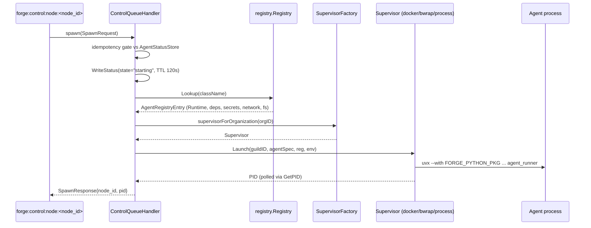

# Process Supervisors Internals

A worker node's job is deceptively simple — run the process a scheduler told it to run, and notice when it dies. Everything else in this page is what "notice when it dies" actually requires: PID acquisition, distributed ACKs, backoff-governed restarts, and a clean process-group teardown.

## Where the supervisor sits

The control-plane server never launches a process. It places an agent onto a node and pushes a `spawn` command onto that node's queue (`forge:control:node:<node_id>`). The worker's `ControlQueueHandler` (`control/handler.go`) consumes that queue and is the actual point where a `SupervisorFactory`-selected supervisor turns a `protocol.SpawnRequest` into a running OS process.



## Supervisor kinds and selection

A worker node does not use a single hardwired launcher. Three supervisor kinds exist, wired together behind a `DispatchingSupervisor`:

| Kind | Isolation mechanism | Typical use |
|---|---|---|
| `docker` | Container (namespaces + cgroups via the Docker daemon) | Multi-tenant nodes where filesystem/network isolation matters |
| `bwrap` | `bubblewrap` unprivileged sandbox | Lightweight isolation without a container runtime dependency |
| `process` | Bare `exec.CommandContext` + process group | Trusted, single-tenant, or single-process deployments |

The default kind is chosen at node startup via `--default-supervisor` (client) or `--client-default-supervisor` (server `--with-client`), accepting `docker` or `bwrap`. `DispatchingSupervisor.selectSupervisor` applies that node default first; if no node default is set, it falls back to the agent's registry `Runtime` (a `docker`-runtime entry gets the Docker supervisor when available), and otherwise to the bare `process` supervisor. `control.SupervisorFactory` (`func(orgID string) supervisor.AgentSupervisor`) is the seam that gives each organization its own cached `DispatchingSupervisor` — which keeps per-org working directories and managed-agent maps separate — but every org's dispatcher is constructed with the same node default, so the concrete kind is not driven by org policy.

!!! note "Registry entries drive the runtime, not just the supervisor kind"
    Each `AgentRegistryEntry` also declares a `RuntimeType` (`uvx`, `docker`, or `binary`), a `Network` egress allowlist, and `Filesystem` bind mounts. The supervisor kind decides *how* isolation is enforced; the registry entry decides *what* is allowed inside it.

## Launch path

`handleSpawn` in `control/handler.go` runs a fixed sequence before a single process line is executed:

1. **Cross-node idempotency gate.** Check the distributed `AgentStatusStore` for this `(guildID, agentID)`. If another node already reports `running` or `starting`, skip the launch entirely — this guards against a redelivered spawn racing a reconciler-driven reenqueue.
2. **Distributed ACK write.** Write `state="starting", node_id=<this node>` with a **120s TTL**. This is the signal the leader's reconciler cross-checks during `reconcileStaleDispatches`/`reconcileStaleAcks` to tell "message delivered, launch pending" apart from "node died before it got here."
3. **Class resolution via the agent registry.** Look up `req.AgentSpec.ClassName` in `registry.Registry` (loaded from `FORGE_AGENT_REGISTRY`, default `conf/forge-agent-registry.yaml`). This returns the `AgentRegistryEntry` — package, `RuntimeType`, dependencies, secrets, network policy, filesystem mounts.
4. **Guild spec + org resolution.** Resolve the guild spec and owning org from the enriched `SpawnRequest` (the server attaches guild messaging config and the full guild spec so DB-less workers can self-configure).
5. **Env build.** Construct the process environment: messaging backend config, `FORGE_PYTHON_PKG`, dependency/network/filesystem directives, and any secrets the registry entry requires.
6. **Supervisor selection.** Call `supervisorForOrganization(orgID)`, which lazily builds and caches the org's supervisor via the `SupervisorFactory`, yielding a `DispatchingSupervisor` over docker/bwrap/process.
7. **`Launch`.** The handler calls `sup.Launch(ctx, guildID, agentSpec, reg, env)`. The supervisor itself calls `registry.ResolveCommand(entry, agentSpec.ForgeExtraDeps)` internally to build the OS exec argv, then runs it.

Between steps 4 and 5 the handler also restores `AgentSpec.ForgeExtraDeps` from the guild spec it just loaded, when the incoming payload has none. `forge_extra_deps` is a Forge extension that rustic-ai core's `AgentSpec` does not model; core ignores unknown keys, so the field is dropped when the Python guild manager re-serializes a spec to build a spawn request. Since every agent but the guild manager is spawned that way, the store — not the payload — is the authoritative copy.

For a `uvx`-runtime entry, `ResolveCommand` produces (with additional `--with` flags appended for `WithDependencies`, `FORGE_EXTRA_DEPS`, the spec's `forge_extra_deps`, and any `package` field):

```bash
uvx --with "$FORGE_PYTHON_PKG" python -m rustic_ai.forge.agent_runner
```

`--with` injects the Forge Python package (`$FORGE_PYTHON_PKG`, default `rusticai-forge`) as an extra dependency into the ephemeral `uvx` environment, so the interpreter that runs `agent_runner` has both the pinned `uv`-managed toolchain and the `rustic_ai.forge` package available without a persistent virtualenv.

### PID acquisition and the ACK write

Only when the resolved supervisor is a `*supervisor.ProcessSupervisor` does the handler report a PID, and only after `Status(...)` reads back `running`. It then reads the PID, retrying up to 5 times 100ms apart to guard against a transient zero:

```go
// only for *ProcessSupervisor, and only once Status == "running"
for retries := 0; retries < 5; retries++ {
    if actualPid, err := pSup.GetPID(ctx, req.GuildID, req.AgentSpec.ID); err == nil && actualPid > 0 {
        msg.PID = actualPid
        break
    }
    time.Sleep(100 * time.Millisecond)
}
```

The response `NodeID` is the host's `os.Hostname()` (falling back to `localhost`). Docker- and bwrap-backed launches return a success `SpawnResponse` without this PID round-trip. Independently of the response, the distributed status entry (`state="starting"`, 120s TTL) written back in step 2 is what lets the leader's reconciler promote the placement to `Acknowledged` without waiting on the response.

!!! warning "The 120s starting TTL is a dead-man's switch, not just a cache"
    Once the process is up, the supervisor overwrites the entry with `state="running"` on a **30s TTL**, refreshed every 10s by the monitor loop. The `starting` entry's 120s TTL only bounds the pre-`running` window: if the node dies before it ever writes `running`, the entry simply expires. The reconciler's `reconcileStaleAcks` phase (`LaunchTimeout` 120s) is tuned to match — after 120s with no `running` status, the placement is treated as never having launched and is re-enqueued.

## Direct vs supervisor-zmq agent transport

Nodes support two ways an agent process talks to the Go messaging bus:

- **`direct`** (default, `--default-agent-transport` / `--client-default-agent-transport`) — the Python side constructs its own backend connection using the messaging config in the `SpawnRequest` (`RUSTIC_AI_MESSAGING_MODULE`/`RUSTIC_AI_MESSAGING_CLASS` env vars), talking to Redis/NATS directly.
- **`supervisor-zmq`** — the agent process never touches Redis/NATS itself. Instead it talks to the Go supervisor over a local ZeroMQ **PAIR** socket, and the Go side proxies every call onto the real `messaging.Backend`.

The bridge (`supervisor/messaging_bridge.go`, `AgentMessagingBridge`) is the Go-side half of `supervisor-zmq`. It listens on a PAIR socket and translates JSON request envelopes into `Backend` calls:

```json
{"kind": "request", "op": "publish", "namespace": "guild-42", "topic": "default_topic", "message": { "...": "..." }}
```

The `docker` and `bwrap` supervisors honor `--zmq-bridge-mode` (`ipc` default, or `tcp`) — the flag is scoped to those non-process supervisors. The bare `process` supervisor always uses IPC (unix socket).

Supported `op` values: `ping`, `publish`, `subscribe`, `unsubscribe`, `get_messages`, `get_since`, `get_next`, `get_by_id`, `cleanup`. Live subscription events stream back asynchronously as `event`/`deliver` envelopes on the same socket — the bridge fans a Go `Subscription.Channel()` into ZMQ frames rather than requiring the Python side to poll.

The IPC socket path is not a fixed name — it is a **sha1 digest of `workDir|guildID|agentID`**, keeping the path under unix domain socket length limits while staying unique per agent instance. The directory it lives under is controlled by `FORGE_ZMQ_DIR` (default `/tmp/forge-zmq`).

!!! tip "Why this exists"
    `supervisor-zmq` lets a `docker`- or `bwrap`-isolated agent be denied direct network egress to Redis/NATS (tightening the `Network` allowlist in its registry entry) while still reaching the message bus, because the only thing it can reach is the local PAIR socket the supervisor exposes into its sandbox.

## Local crash recovery

Once a process is running, the supervisor on that node — not the leader, not the reconciler — owns restart decisions for ordinary crashes. This is deliberately local: the reconciler only steps in when the *node itself* is unresponsive (`DeadNodeTimeout`, 15s) or when a dispatch/ack never resolves (`AckTimeout` 30s / `LaunchTimeout` 120s).

**Exponential backoff parameters:**

| Parameter | Value |
|---|---|
| Base delay | 1s |
| Max delay | 30s |
| Jitter | ±25% |
| Max retries | 10 |
| `StableTime` reset window | 60s |

The backoff doubles from the 1s base up to the 30s cap, with ±25% jitter applied on each computed delay to avoid thundering-herd restarts across many agents on one node. `StableTime` is the guard against penalizing a healthy long-running agent for one old crash: if the process has been running for at least 60s since its last restart, the attempt counter resets to zero — so a process that crashes once, runs cleanly for an hour, then crashes again is treated as a fresh first failure, not attempt #2. Exhausting all 10 retries without reaching a stable 60s window is a hard failure: `ComputeBackoff` returns `0`, the local `ManagedAgent` moves to the `failed` terminal state, and the node writes a `failed` status to the `AgentStatusStore` on a 300s TTL. Separately, the leader-side `cleanupFailedPlacements`/`GetFailedOlderThan` machinery reaps failed entries from the reconciler's `PlacementMap`.

### Graceful stop: SIGTERM-then-SIGKILL to the process group

Both a deliberate `stop` command and a restart-driven teardown use the same shutdown sequence, applied to the **process group**, not just the leaf PID — this matters because `uvx` and sandboxed launches (`bwrap`) commonly fork children that would otherwise survive their parent's death:

```go
// 1. Ask nicely.
syscall.Kill(-pgid, syscall.SIGTERM)

// 2. Poll for exit — kill(pid, 0) returns ESRCH once the leader is gone.
for i := 0; i < 50; i++ { // ~50 x 100ms ≈ 5s
    if syscall.Kill(pid, 0) != nil {
        return // exited cleanly
    }
    time.Sleep(100 * time.Millisecond)
}

// 3. No mercy — SIGKILL the group (or the bare pid if it has no group).
syscall.Kill(-pgid, syscall.SIGKILL)
```

The negative PID (`-pgid`) is what directs the signal at the whole process group rather than a single PID; launching under a supervisor implies a `setpgid` at start time specifically so this works. `handleStop` in `control/handler.go` resolves the owning org and delegates to that org's `Supervisor.Stop`, so a `docker`-backed org tears down via the container runtime's own stop path while a `process`-backed org goes through the signal sequence above directly.

## uvx bootstrap resolution order

Before any `uvx --with ...` command can run, the node needs a `uvx` binary. `registry/uv.go` provides two functions that share a fixed precedence order:

1. A `uvx` binary bundled alongside the `forge` executable itself.
2. `uvx` found on `PATH`.
3. `~/.forge/bin/uvx`.
4. The path in `FORGE_UVX_PATH`, if set.
5. Otherwise, download `astral-sh/uv` (which bundles `uvx`) into `~/.forge/bin`.

`EnsureUV` runs the full chain including step 5's network fetch as a one-time bootstrap. `ResolveUVXCommand`, which `ResolveCommand` calls at launch time, applies steps 1–4 and otherwise falls back to a bare `uvx` (resolved via `PATH`) — it never downloads. The order favors a binary the operator explicitly shipped or already has on `PATH` over a network fetch, and only reaches out to GitHub as a last resort — relevant for air-gapped or locked-down worker nodes where step 5 must never be reached in practice.

## Related pages

- [Scheduler & Reconciliation Internals](scheduler-placement/) for how a spawn reaches a node in the first place and how dead nodes trigger re-launch.
- [Messaging Internals](messaging-backends/) for the `Backend` interface the ZMQ bridge proxies and the Redis/NATS transports underneath it.
- [Quickstart](../getting-started/quickstart/) for the CLI flags that select supervisor kind and agent transport at node startup.
