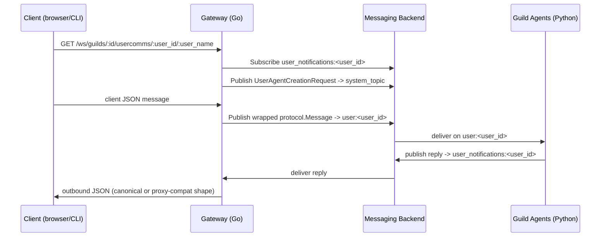

# HTTP API Reference

Every control-plane operation in Forge — creating a guild, registering a node, uploading a file, connecting a WebSocket, checking readiness — goes through the Go API server. This page is the endpoint-by-endpoint reference: request/response shapes, status codes, and the queue/topic keys that tie the HTTP surface to the Redis/NATS control plane underneath.

!!! note "Scope"
    This reference covers the HTTP and WebSocket surface only. For the domain model behind guild creation see [Guild Concepts](../concepts/guild-model/); for placement and reconciliation behavior behind the node routes see [Scheduler](../concepts/placement-reconciliation/).

## Guild routes

Guild routes persist a `protocol.GuildSpec`, bootstrap the store rows, and enqueue the system `GuildManagerAgent` (GMA) that drives the rest of launch. The **persisted** spec — not the one you submitted — is canonical from this point on; every downstream spawn re-reads it via `store.ToGuildSpec`.

| Method | Path | Handler | Success | Notes |
|---|---|---|---|---|
| POST | `/api/guilds` | `HandleCreateGuild` | 201 | Body: `CreateGuildRequest{spec, org_id}` |
| GET | `/api/guilds/{id}` | `HandleGetGuild` | 200 / 404 | Returns the persisted guild spec plus `status` |
| POST | `/api/guilds/{id}/relaunch` | `HandleRelaunchGuild` | 200 / 400 / 404 | Re-enqueues the GMA if the manager agent isn't already running; replies `{"is_relaunching": <bool>}` |
| POST | `/manager/guilds/ensure` | `HandleManagerEnsureGuild` | 200 | One of several `/manager/*` metastore round-trips from the Python `GuildManagerAgent` |

### POST /api/guilds

Creates and bootstraps a guild. Internally this calls `guild.Bootstrap`, which applies defaults, merges dependency maps (spec-level, then forge-home `agent-dependencies.yaml`, then the conf path), rewrites filesystem dependency roots via `ApplyFilesystemGlobalRoot`, persists `GuildModel` + `AgentModel` rows with status `requested`, and pushes a `SpawnRequest` for the `GuildManagerAgent` onto the control queue.

```bash
curl -X POST http://localhost:PORT/api/guilds \
  -H 'Content-Type: application/json' \
  -d '{
    "org_id": "acme",
    "spec": {
      "id": "my-guild-01",
      "name": "My Guild",
      "description": "demo",
      "agents": [
        {"name": "Echo", "description": "echoes",
         "class_name": "rustic_ai.agents.EchoAgent"}
      ]
    }
  }'
```

Response, `201 Created`:

```json
{ "id": "my-guild-01" }
```

Guild creation is asynchronous by design: a `201` means the request was **accepted**, not that the guild is running. Track real launch progress through the `syscomms` WebSocket — `InfraEvent`s on `infra_events_topic` and `AgentsHealthReport`/`HealthCheckRequest` on `guild_status_topic`. See [WebSocket routes](#websocket-routes) below.

### GET /api/guilds/{id}

Returns the persisted guild (agents, routes, dependency map, status). `404` if the ID doesn't exist in the store (`store.ErrNotFound`).

### POST /api/guilds/{id}/relaunch

Records a row in `guilds_relaunch` and re-enqueues the `GuildManagerAgent` spawn for a guild whose manager agent isn't currently running. Refuses when guild status is `stopped` or `stopping`. The response body is `{"is_relaunching": <bool>}` — `false` means the manager was already running so nothing was re-enqueued.

| Status | Guild status | Meaning |
|---|---|---|
| `200` | any except stopped/stopping | `{"is_relaunching": true}` if the GMA was re-enqueued, `{"is_relaunching": false}` if it was already running |
| `400` | `stopped` / `stopping` | relaunch refused |
| `404` | not found | no such guild |

### Manager metastore routes

`/manager/*` is the internal channel the Python `GuildManagerAgent` uses to read and write guild/agent metadata during its own bootstrap. It is a family of round-trips, not a single call:

| Method | Path | Handler | Purpose |
|---|---|---|---|
| POST | `/manager/guilds/ensure` | `HandleManagerEnsureGuild` | Ensure guild exists; body `EnsureGuildRequest{guild_spec, organization_id}` |
| GET | `/manager/guilds/{guild_id}/spec` | `HandleManagerGetGuildSpec` | Read the persisted spec + status |
| PATCH | `/manager/guilds/{guild_id}/status` | `HandleManagerUpdateGuildStatus` | Set guild status |
| POST | `/manager/guilds/{guild_id}/agents/ensure` | `HandleManagerEnsureAgent` | Ensure an agent row (201 created / 200 existing) |
| PATCH | `/manager/guilds/{guild_id}/agents/{agent_id}/status` | `HandleManagerUpdateAgentStatus` | Set agent status |
| POST | `/manager/guilds/{guild_id}/routes` | `HandleManagerAddRoutingRule` | Add a routing rule; returns `{rule_hashid}` |
| DELETE | `/manager/guilds/{guild_id}/routes/{rule_hashid}` | `HandleManagerRemoveRoutingRule` | Soft-delete a routing rule |
| POST | `/manager/guilds/{guild_id}/lifecycle/heartbeat` | `HandleManagerProcessHeartbeat` | Reconcile agent/guild status from a heartbeat |

`POST /manager/guilds/ensure` confirms the guild exists in the Go store before spawning child agents. If the guild already exists it flips status to `starting`; on the guild-missing branch it normalizes manager-supplied spec IDs (`normalizeManagerSpecIDs`), applies the filesystem global root, and writes the guild via `store.FromGuildSpec` — this is a secondary spec-writer alongside `guild.Bootstrap`. It replies with `EnsureGuildResponse{guild_spec, was_created, status}`.

!!! warning "Optional manager token"
    When `FORGE_MANAGER_API_TOKEN` is set, every `/manager/*` handler requires it — as the `X-Forge-Manager-Token` header or a `Bearer` token — and returns `401` otherwise. If the variable is unset, the routes are unauthenticated.

!!! tip "Lifecycle statuses"
    `GuildStatus` values: `requested`, `starting`, `running`, `stopped`, `stopping`, `unknown`, `warning`, `backlogged`, `error`, `not_launched`. `AgentStatus` values: `not_launched`, `starting`, `running`, `stopped`, `error`, `deleted`.

## Node control routes

These routes back the `NodeRegistry` (`scheduler.GlobalNodeRegistry`) that the placement `Scheduler` reads for capacity and health. A node is healthy only while `time.Since(LastHeartbeat) < 10s`; the reconciler declares it **dead** and evicts it at 15s.

| Method | Path | Handler | Success | Failure |
|---|---|---|---|---|
| POST | `/nodes/register` | `RegisterNodeHandler` | 201 | 422 on empty/absent `node_id` |
| POST | `/nodes/{node_id}/heartbeat` | `NodeHeartbeatHandler` | 200 | 404 if unknown node |
| DELETE | `/nodes/{node_id}` | `NodeDeregisterHandler` | 204 | — |
| GET | `/nodes` | `ListNodesHandler` | 200 | returns only healthy nodes |

### POST /nodes/register

Registers or updates a worker node's capacity in the `NodeRegistry`.

```bash
curl -X POST http://localhost:PORT/nodes/register \
  -H 'Content-Type: application/json' \
  -d '{
    "node_id": "worker-1",
    "capacity": { "cpus": 8, "memory": 16384, "gpus": 0 }
  }'
```

`201 Created` on success. An empty or absent `node_id` returns `422`.

### POST /nodes/{node_id}/heartbeat

Refreshes `LastHeartbeat` for a registered node. If the node isn't known to the registry — for example, it was evicted by the reconciler as dead — the server returns `404`, and the node client is expected to call `/nodes/register` again in response.

```go
if r.StatusCode == http.StatusNotFound {
    // registry evicted us; re-register the node
    _ = registerNode(ctx, config.ServerURL, body)
}
```

### DELETE /nodes/{node_id}

Explicitly deregisters a node (`204 No Content`). This is distinct from the reconciler's automatic dead-node eviction — either path removes the node from the registry and orphans its placements for re-enqueue.

### GET /nodes

Returns the JSON array of currently healthy `NodeState` entries — the same set `Scheduler.Schedule` filters over for best-fit placement.

!!! note "Placement is in-memory"
    Both the `NodeRegistry` and `PlacementMap` live in server memory. A control-plane restart loses tracked spawn state; recovery leans on the distributed `AgentStatusStore` (Redis/NATS, TTL'd) rather than these HTTP routes. See [Scheduler](../concepts/placement-reconciliation/) for the full reconciliation story.

## File routes

File routes wrap `filesystem.LocalFileStore`, a `gocloud.dev/blob`-backed store keyed by `(orgID, guildID, agentID)`. Guild-scoped routes use the sentinel agent segment `GUILD_GLOBAL`; agent-scoped routes resolve to that agent's own slice of the workspace. Both native routes and `/rustic`-prefixed proxy-compat routes exist for the legacy local Rustic UI.

| Method | Path (native) | Path (proxy-compat) | Purpose |
|---|---|---|---|
| GET | `/api/guilds/{id}/files/` | `/rustic/api/guilds/{id}/files/` | list guild-global files |
| POST | `/api/guilds/{id}/files/` | `/rustic/api/guilds/{id}/files/` | upload (multipart field `file`, optional `file_meta` JSON) |
| GET | `/api/guilds/{id}/files/{filename}` | `/rustic/api/guilds/{id}/files/{filename}` | download (`?download=true` forces attachment) |
| DELETE | `/api/guilds/{id}/files/{filename}` | `/rustic/api/guilds/{id}/files/{filename}` | delete file + its `.meta` sidecar |
| GET/POST | `/api/guilds/{id}/agents/{agent_id}/files/` | `/rustic/api/guilds/{id}/agents/{agent_id}/files/` | agent-scoped list/upload |
| GET/DELETE | `/api/guilds/{id}/agents/{agent_id}/files/{filename}` | `/rustic/api/guilds/{id}/agents/{agent_id}/files/{filename}` | agent-scoped download/delete |

Uploading is **create-only**: if the object already exists, the store returns `ErrFileAlreadyExists`, surfaced as `409 Conflict`. Filenames are sanitized (`SanitizeFilename`) to reject `/`, `\`, and `..` — no path traversal, no writing outside the resolved scope.

```bash
curl -X POST http://localhost:PORT/api/guilds/my-guild-01/files/ \
  -F 'file=@report.pdf' \
  -F 'file_meta={"content_type":"application/pdf"}'
```

Each stored file gets a JSON sidecar object (`.{filename}.meta`) holding `content_length`, `content_type`, and `uploaded_at`. `List` hides dotfiles, sidecars, and nested paths; `Delete` removes both the file and its sidecar and errors if the sidecar is missing.

The guild's `DependencyMap['filesystem']` entry (`path_base`, `protocol`, `storage_options`) determines whether files land on local disk, S3, or GCS — the HTTP surface is identical regardless of backend.

## Catalog, registry, and other contract routes

Guild, file, and node routes are part of a larger contract-first surface generated from the OpenAPI document (`api/contract/gen.go`) and dispatched through `api/contract_server.go`. Beyond the routes detailed above, the same surface exposes:

| Prefix | Purpose |
|---|---|
| `/catalog/agents`, `/catalog/agents/{class_name}` | agent catalog registration and lookup |
| `/catalog/blueprints/`, `/catalog/blueprints/{id}` (+ `/icons`, `/reviews`, `/share`, `/organizations/shared`) | blueprint CRUD, launch (`POST /catalog/blueprints/{id}/guilds`), icons, reviews, and sharing |
| `/catalog/categories/`, `/catalog/tags/` | category and tag browsing |
| `/catalog/organizations/{id}/…`, `/catalog/users/{id}/…`, `/catalog/guilds/{id}/…` | blueprint/guild listings scoped by org, user, or guild |
| `/api/registry/agents/`, `/api/registry/message_schema/` | live agent-class registry and message-schema lookup |
| `/api/guilds/{id}/{user_id}/messages` | historical user + broadcast messages (`HandleGetHistoricalMessages`) |
| `/addons/boards/`, `/addons/boards/{board_id}/messages` | message-board add-on |
| `/dependencies`, `/dependencies/provided-type/{type}`, `/catalog/agents/{class_name}/dependencies`, `/catalog/blueprints/{id}/dependencies` | dependency catalog lookups |

!!! note "The `/rustic` re-mount"
    When the UI API is enabled, this **entire** contract surface is registered a second time under a `/rustic` base URL (e.g. `/rustic/api/guilds`, `/rustic/catalog/blueprints/`). Guild file listing/upload and historical-message routes additionally rewrite response URLs into `/rustic`-prefixed, origin-qualified links for the local UI. In local identity/quota mode the public surface also serves stub routes under `/api/users`, `/api/organizations`, `/api/roles`, and `/api/quotas`.

## Model-fit routes

The model-fit service profiles host hardware and probes the local `llama-server` runtime to rank Forge's curated local model catalog for a given machine, so the Rustic launch UI can preselect an `llm` dependency binding.

| Method | Path | Purpose |
|---|---|---|
| GET | `/rustic/modelfit/local-models` | ranked `FitResult` list |
| GET | `/rustic/modelfit/capabilities` | full `SystemProfile` (hardware + runtime detection) |

`GET /rustic/modelfit/local-models` accepts:

- `use_case` — filter by a catalog `use_case_tag` (e.g. `chat`, `coding`)
- `limit` — integer cap on results; a non-integer value returns `400 invalid limit`
- `runnable_only` — truthy values `1`/`true`/`yes`/`y`/`on` restrict to models whose `fit_level != too_tight`

```bash
curl 'http://localhost:PORT/rustic/modelfit/local-models?use_case=coding&runnable_only=true&limit=3'
```

Each `FitResult` includes `dependency_key`, `display_name`, `model_name`, `fit_level` (`perfect`/`good`/`marginal`/`too_tight`), `runnable`, `score`, `utilization_pct`, `available_memory_bytes`, `estimated_tokens_per_second`, `use_case_tags`, and ordered `explanations` strings.

`GET /rustic/modelfit/capabilities` returns the merged `SystemProfile`: total/available RAM, CPU info, GPU devices, `SelectedBackend`, `RuntimeUsableAcceleration`, `Confidence` (`unknown` < `heuristic` < `strong` < `probe`), and machine-readable `ReasonCodes` such as `nvidia_present_but_runtime_cpu_only` or `runtime_binary_missing`.

Model-fit only **informs** — it never mutates an `AgentSpec`. Nothing here writes to the guild store.

## OAuth routes

OAuth routes drive the Authorization Code + PKCE flow the `oauth.Manager` runs on behalf of an organization, and back the `oauth:orgID|providerID` keys that `helper/envvars.BuildAgentEnv` resolves into agent env vars at launch. They mount under the `/rustic` prefix, and only when the UI API is enabled and at least one provider is configured.

| Method | Path | Purpose |
|---|---|---|
| GET | `/rustic/oauth/organizations/:org_id/providers` | list configured providers with connection status |
| POST | `/rustic/oauth/organizations/:org_id/providers/:provider_id/authorize` | body `{clientId, clientSecret, redirectUrl}` → returns `{authUrl}` |
| GET | `/rustic/oauth/organizations/:org_id/providers/:provider_id/callback` | OAuth redirect target; exchanges code+state, returns an HTML page |
| GET | `/rustic/oauth/organizations/:org_id/providers/:provider_id/status` | returns `{isConnected}` |
| DELETE | `/rustic/oauth/organizations/:org_id/providers/:provider_id` | disconnect; returns `{providerId, disconnected}` |

An unknown `provider_id` returns `404`; missing `clientId`/`clientSecret` on authorize returns `422`; an invalid `org_id` returns `400`.

```bash
curl -X POST http://localhost:PORT/rustic/oauth/organizations/acme/providers/github/authorize \
  -H 'Content-Type: application/json' \
  -d '{"clientId":"...","clientSecret":"...","redirectUrl":"http://localhost:PORT/rustic/oauth/organizations/acme/providers/github/callback"}'
```

A few things to know before wiring a provider:

- Providers are declared in `conf/oauth-providers.yaml` (`display_name`, `description`, `auth_url`, `token_url`, `scopes`, `redirect_url`, `use_pkce` defaulting to `true`). `${ENV}` interpolation applies to the URL fields.
- Client ID/secret are **not** stored in config — they're supplied per-request by the caller and persisted into the token store only after a successful exchange.
- A provider must be explicitly activated via `oauth.Manager.CheckAndUpdateProvider` (driven by an agent's `OAuthNeed` during registry validation) before `authorize`/`status`/`disconnect` will accept it.
- Token storage is chosen with `FORGE_OAUTH_TOKEN_STORE` (`memory`, the default, or `keychain`); `GetAccessToken` transparently refreshes within 60 seconds of expiry.

!!! warning "org_id validation"
    `org_id` must be non-empty and must not contain `|` or control characters — that delimiter is reserved for the `oauth:orgID|providerID` store key.

## WebSocket routes

WebSockets are Forge's real-time client edge, split into two socket kinds per guild: `usercomms` (conversational traffic) and `syscomms` (system/health/infra-event traffic). Canonical routes speak raw `protocol.Message` JSON; `/rustic`-prefixed routes speak a UI-oriented proxy-compat shape over the same backend topics.

| Kind | Canonical route | Proxy-compat route |
|---|---|---|
| usercomms | `GET /ws/guilds/:id/usercomms/:user_id/:user_name` | `GET /rustic/ws/:ws_id/usercomms` |
| syscomms | `GET /ws/guilds/:id/syscomms/:user_id` | `GET /rustic/ws/:ws_id/syscomms` |

The proxy-compat routes require a bootstrap session: `GET /rustic/guilds/:guild_id/ws?user=<name>` returns `{"wsId": "..."}`, a short-lived (30-minute) mapping from `ws_id` to `guildID`/`userID`/`user`. The `usercomms`/`syscomms` proxy routes then dereference that `ws_id`.

```bash
# canonical, direct guild+user addressing
wscat -c ws://localhost:PORT/ws/guilds/my-guild-01/usercomms/u1/alice
wscat -c ws://localhost:PORT/ws/guilds/my-guild-01/syscomms/u1

# proxy-compat, via bootstrap session
curl 'http://localhost:PORT/rustic/guilds/my-guild-01/ws?user=alice'
# -> {"wsId": "..."}
wscat -c ws://localhost:PORT/rustic/ws/<wsId>/usercomms
```

Both routes validate guild existence up front (`store.GetGuild`, `404` on `store.ErrNotFound`) before upgrading the connection. `syscomms` immediately publishes a `HealthCheckRequest` to `guild_status_topic` on connect; `usercomms` publishes a `UserAgentCreationRequest` to `system_topic` to register the user proxy agent.

Outbound subscriptions differ by kind:

- **usercomms** — subscribed only to `user_notifications:<user_id>`.
- **syscomms** — subscribed to three families on one socket: `user_system_notification:<user_id>`, `guild_status_topic`, `infra_events_topic`. Clients demux by the `format` field (and sometimes `topic_published_to`).

```json
{
  "schema_version": 1,
  "event_id": "abc123",
  "kind": "agent.process.failed",
  "severity": "error",
  "timestamp": "2026-03-25T23:31:55.000Z",
  "guild_id": "test-guild",
  "agent_id": "echo-agent",
  "attempt": 1,
  "message": "agent process failed after retry exhaustion",
  "detail": { "error": "Read-only file system" }
}
```

!!! note "No origin check at this layer"
    The WebSocket upgrader's `CheckOrigin` always returns `true`. Access control must live upstream of the gateway (network boundary, auth proxy, etc.).



## Health, readiness, and observability routes

| Method | Path | Purpose |
|---|---|---|
| GET | `/metrics` | Prometheus text exposition on the main API server (the client metrics server exposes its own separately) |
| GET | `/healthz` | main API server liveness — `{"status":"ok"}` |
| GET | `/readyz` | main API server readiness — `{"status":"ready"}` |
| GET | `/ping` | main API server liveness alias — `{"status":"ok"}` |
| GET | `/__health` | contract health check — `{"message":"All is well"}` |
| GET | `/openapi.json`, `/openapi.sha256` | served OpenAPI document and its checksum |
| GET | `/rustic/observe/guilds/:guild_id/messages/:msg_id/spans` | Rustic-compatible span query against the local sqlite-otel store |

The observe route accepts `durationInMs` and `rootThreadId` query params and returns Zipkin-like spans. It returns `501 Not Implemented` with the message `observability spans query is only available with desktop sqlite telemetry` unless the server is running with `--otel-mode desktop_sqlite` — external OTLP users query their own backend instead.

```bash
forge server --otel-enabled \
  --otel-mode desktop_sqlite \
  --otel-sqlite-binary /usr/local/bin/sqlite-otel \
  --otel-sqlite-port 4318

curl 'http://localhost:PORT/rustic/observe/guilds/my-guild-01/messages/123456/spans?durationInMs=5000'
```

The client's own metrics server binds separately, defaulting to `:9091` (`--client-metrics-addr`), and samples host CPU/RAM/disk on a ticker for the `forge_node_*` gauges.

## Queue and topic key reference

The HTTP surface is the front door; these are the underlying Redis/NATS keys and topics the routes above ultimately read and write. Useful when tracing a spawn or a message end to end, or when standing up telemetry dashboards.

**Control-plane queues (scheduler/control):**

| Key | Purpose |
|---|---|
| `forge:control:requests` | global control ingest queue — spawn/stop requests land here first |
| `forge:control:node:<node_id>` | per-node dispatch queue after the scheduler places an agent |
| `forge:control:response:<request_id>` | response list (Redis transport) / NATS subject `ctrl.response.<request_id>` on the `CTRL_RESPONSES` stream |
| `forge:control:leader` | Redis leader-election lock (5s TTL) |
| `forge:agent:status:<guild_id>:<agent_id>` | distributed `AgentStatusStore` entry (`starting`/`running`, TTL'd) |

**Messaging/gateway topics:**

| Topic | Carries |
|---|---|
| `user:<user_id>` | inbound usercomms messages |
| `user_notifications:<user_id>` | outbound usercomms replies |
| `user_system:<user_id>` | inbound syscomms messages |
| `user_system_notification:<user_id>` | outbound syscomms notifications |
| `system_topic` | `UserAgentCreationRequest` and other system-level control messages |
| `guild_status_topic` | `HealthCheckRequest` / `AgentsHealthReport` |
| `infra_events_topic` | `InfraEvent` lifecycle stream (guild/agent launch progress, failures) |
| `user_message_broadcast` | broadcast history used by `gateway.RetrieveHistory` |

**Control message envelope**, shared by both queue families:

```json
{ "command": "spawn", "payload": { "...": "SpawnRequest fields" } }
```

## Related pages

- [Guild Concepts](../concepts/guild-model/) — the domain model behind `POST /api/guilds`
- [Scheduler](../concepts/placement-reconciliation/) — placement, reconciliation, and the node lifecycle behind `/nodes/*`
- [Telemetry](../features/telemetry/) — metrics names, OTel export modes, and the sqlite-otel sidecar behind `/metrics` and `/rustic/observe/*`
- [Security & OAuth](../features/secrets-oauth/) — secret providers, the OAuth manager, and keychain-backed token storage
