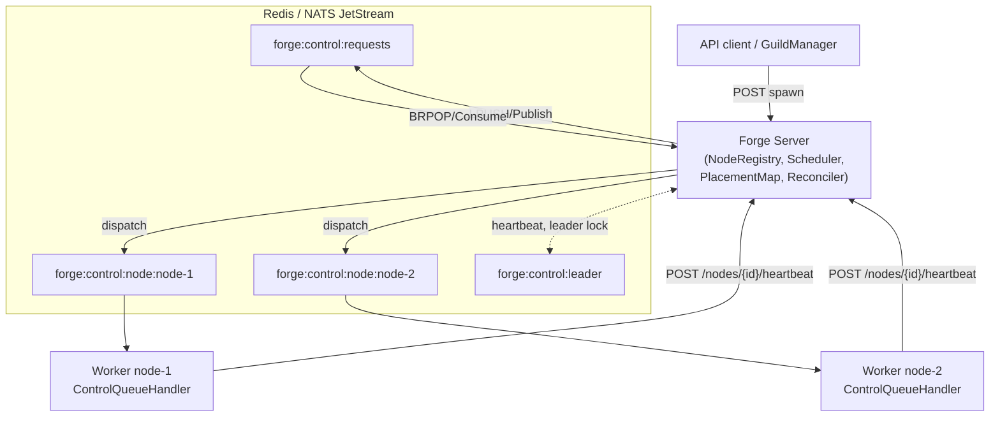

# Distributed Cluster

Forge scales from a laptop process to a fleet of worker nodes without changing a single agent spec. One control-plane server, any number of clients, one shared broker — and the cluster keeps placing, tracking, and repairing agent workloads on its own.

## Architecture

A distributed Forge deployment has three moving parts: a control-plane **server**, a set of **worker nodes**, and a shared **broker** (Redis or NATS JetStream) that carries both control traffic and the message bus.



The server never talks to a worker directly. Every message — spawn requests, dispatch commands, heartbeats — flows through queue keys on the broker, which means the server and every worker can restart, reconnect, or fail independently.

## Bringing up the fleet

Start the control-plane server pointed at a shared Redis instance:

```bash
forge server --listen :3001 --redis redis://redis.internal:6379
```

Then bring up worker nodes as separate client processes, each with its own identity and declared capacity:

```bash
# node-1: a beefier box
forge server --with-client \
  --client-node-id node-1 \
  --client-cpus 16 --client-memory 32768 --client-gpus 1 \
  --server http://forge-control:3001 \
  --redis redis://redis.internal:6379 \
  --client-metrics-addr 0.0.0.0:9091

# node-2: a smaller box
forge server --with-client \
  --client-node-id node-2 \
  --client-cpus 4 --client-memory 8192 \
  --server http://forge-control:3001 \
  --redis redis://redis.internal:6379 \
  --client-metrics-addr 0.0.0.0:9091
```

Each client registers itself with the server (`POST /nodes/register`, body `NodeRegistrationRequest{node_id, capacity{cpus, memory, gpus}}`), then heartbeats every few seconds. If a node's heartbeat isn't recognized — for example, it registered against a server that has since evicted it — the client sees a `404` on `POST /nodes/{node_id}/heartbeat` and transparently re-registers.

!!! note "Node IDs are stable identities, not ephemeral tokens"
    `--client-node-id` is how the scheduler, the placement map, and the reconciler all refer to a machine. Pick something durable (hostname, instance ID) — reusing an ID across restarts is fine, reusing it across two live machines is not.

## Capacity-aware best-fit placement

Every worker publishes `TotalCapacity` (CPUs, memory, GPUs) when it registers, and the server tracks `UsedCapacity` as agents land on it. When a spawn request arrives, `Scheduler.Schedule` reads the requested resources off `protocol.AgentSpec.Resources` — `NumCPUs`/`NumGPUs` from `ResourceSpec`, memory from `CustomResources["memory"]` — filters the healthy fleet down to nodes with enough headroom, and picks a winner.

The scoring function is deliberately a **spread**, not a **pack**:

```go
for _, n := range nodes {
    remCPUs := n.TotalCapacity.CPUs - n.UsedCapacity.CPUs
    remMem := n.TotalCapacity.Memory - n.UsedCapacity.Memory
    remGPUs := n.TotalCapacity.GPUs - n.UsedCapacity.GPUs
    if remCPUs >= reqCPUs && remMem >= reqMem && remGPUs >= reqGPUs {
        score := remMem + (remCPUs * 1024)
        if bestNode == "" || score > bestFitScore {
            bestFitScore = score
            bestNode = n.NodeID
        }
    }
}
```

The node with the most free memory and CPU (weighted by 1024 to keep CPU headroom meaningfully comparable to memory in MB) wins. In practice this means new agents flow to the emptiest node in the fleet rather than bin-packing onto whichever node happens to already be busy — a deliberate choice that keeps any single node from becoming a hot spot as load grows. `Schedule` fails loudly with `no healthy nodes available in the cluster` if the fleet is empty, or `no node with sufficient capacity [...]` if every healthy node is full.

Placement is asynchronous by design. The server's `ControlQueueListener.OnSpawn` doesn't schedule inline — it idempotency-gates the request, `MarkAccepted`s it in the `PlacementMap`, and acks the caller immediately with "spawn request accepted." Scheduling happens moments later in a background goroutine (`dispatchAcceptedSpawn`), which calls `Scheduler.Schedule`, `MarkDispatched`s the placement, and pushes the wrapped command onto `forge:control:node:<nodeID>`. If scheduling fails, the placement reverts to `accepted` (bumping `Attempts`) rather than failing the caller — the [Reconciler](#self-healing) retries it on the next tick.

Each `AgentPlacement` moves through a small state machine as the worker picks it up:

```
accepted → dispatched → acknowledged → running
                                     ↘ failed
```

## Self-healing

Nodes die. Processes get killed mid-launch. Messages get delivered to a node that crashes before it can finish spawning. Forge's `Reconciler` is a leader-gated background loop, ticking every `ReconcileInterval` (15s by default), that runs five repair phases in strict order on every tick:

```go
r.reconcileDeadNodes(ctx)
r.reconcileAccepted(ctx)
r.reconcileStaleDispatches(ctx)
r.reconcileStaleAcks(ctx)
r.cleanupFailedPlacements()
```

### Dead-node eviction and orphan re-enqueue

A node is declared dead once its heartbeat has been silent for `DeadNodeTimeout` (15s). When that happens:

```go
orphans := r.placementMap.AgentsOnNode(nodeID)
r.registry.Deregister(nodeID)
for _, o := range orphans {
    r.placementMap.Remove(o.GuildID, o.AgentID)
    r.reenqueue(ctx, o) // Push {command:spawn,payload} to forge:control:requests
}
```

`reenqueue` doesn't reconstruct anything — it replays the agent's original, byte-for-byte `Payload` (the same `SpawnRequest` bytes captured at accept time), wraps it in a `ControlMessageWrapper` `{"command":"spawn","payload":...}`, and pushes it back onto the **global** queue, `forge:control:requests`. Recovery is therefore indistinguishable from a brand-new spawn: it re-enters the same accepted → dispatched pipeline and lands on the best-fit node in the *current* fleet — which by definition excludes the node that just died, since `Deregister` already removed it and its capacity.

### Stale dispatch and stale ack recovery

Not every failure is a dead node. A message can be delivered to a live node whose process then crashes before writing its "starting" ack, or a launch can hang indefinitely. The reconciler cross-checks the distributed `AgentStatusStore` to disambiguate:

```go
stale := r.placementMap.GetStaleDispatches(r.config.AckTimeout) // 30s
for _, p := range stale {
    status, err := r.statusStore.GetStatus(ctx, p.GuildID, p.AgentID)
    if err == nil && status != nil {
        if status.State == "starting" { r.placementMap.MarkAcknowledged(p.GuildID, p.AgentID); continue }
        if status.State == "running"  { r.placementMap.MarkRunning(p.GuildID, p.AgentID); continue }
    }
    if p.Attempts >= r.config.MaxAttempts { r.placementMap.MarkFailed(p.GuildID, p.AgentID); continue }
    r.placementMap.Remove(p.GuildID, p.AgentID)
    r.reenqueue(ctx, p)
}
```

`reconcileStaleAcks` runs the same logic for placements that acknowledged but never reached `running` within `LaunchTimeout` (120s). Placements only become terminally `failed` after `MaxAttempts` (5) retries, and even then they aren't deleted immediately — `cleanupFailedPlacements` leaves them visible for `FailedCleanupAge` (5m) so operators and telemetry can observe the failure before it's swept away.

| Config field | Default | Purpose |
|---|---|---|
| `ReconcileInterval` | 15s | Tick frequency of the reconcile loop |
| `AckTimeout` | 30s | How long a `dispatched` placement waits before being treated as stale |
| `LaunchTimeout` | 120s | How long an `acknowledged` placement waits before being treated as stale |
| `MaxAttempts` | 5 | Retries before a placement is marked `failed` |
| `DeadNodeTimeout` | 15s | Heartbeat silence before a node is evicted |
| `FailedCleanupAge` | 5m | How long `failed` placements linger before cleanup |

!!! warning "Two health thresholds, on purpose"
    The `NodeRegistry` treats a node unhealthy (invisible to the scheduler) after **10s** of heartbeat silence, while the reconciler declares it dead and evicts it after **15s**. In that 5-second window a node can't receive new placements but hasn't been reclaimed yet — this is intentional slack to avoid evicting a node over a single missed heartbeat.

### Cross-node idempotency

Because re-enqueue and retries both exist, a spawn command can in principle be delivered more than once. Forge guards against double-launch at three layers: the server's `IsActivelyTracked` gate on accept, `MarkDispatched` attempt counting, and — most importantly for a multi-node fleet — a cross-node check in the worker's `ControlQueueHandler`:

```go
existing, err := h.statusStore.GetStatus(ctx, req.GuildID, req.AgentSpec.ID)
if err == nil && existing != nil &&
    (existing.State == "running" || existing.State == "starting") &&
    existing.NodeID != "" && existing.NodeID != h.nodeID {
    // agent already active on another node -> skip launch
    return
}
```

If the `AgentStatusStore` (Redis or NATS KV, TTL 120s) shows the agent already `running` or `starting` on a *different* node, the second worker refuses to launch it. This is what makes it safe for the reconciler to be aggressive about re-enqueueing on ambiguous failures.

## HA control plane

The server itself can run as multiple replicas for availability, but reconciliation must have exactly one writer — otherwise two replicas could both notice a dead node and double-schedule its agents. Every reconcile tick starts with a leadership check:

```go
case <-ticker.C:
    if r.elector != nil && !r.elector.IsLeader() {
        continue
    }
    r.reconcile(ctx)
```

Three `LeaderElector` implementations back this, chosen automatically by the server: `raft` if `LeaderElectionMode=="raft"`, else a Redis lock if a Redis client is configured, else single-node.

- **`RedisElector`** — a `SET NX` lock with a 5s TTL on `forge:control:leader`, renewed at `ttl/3` via a compare-and-extend Lua script, with acquisition retried at `ttl/2`. Losing renewal (e.g. a network partition) drops leadership cleanly.
- **`RaftElector`** — HashiCorp Raft for consensus plus memberlist gossip for discovery, with an in-memory log/stable store and a no-op FSM (it exists purely to elect a leader, not to replicate state — durable cluster facts already live in Redis/NATS). Voters are added/removed automatically as gossip members join or leave, and the first node self-bootstraps as the seed if no `--gossip-join` peers are given.
- **`SingleNodeElector`** — always leader; used for embedded/single-process mode.

```bash
# Raft-backed HA control plane, three server replicas
forge server --listen :3001 --redis redis://redis.internal:6379 \
  --leader-election-mode raft \
  --raft-bind 10.0.0.1:7000 --gossip-bind 10.0.0.1:7946 --gossip-join 10.0.0.2:7946,10.0.0.3:7946
```

Whichever replica holds the lock runs `reconcileDeadNodes` through `cleanupFailedPlacements`; the others keep serving `/nodes` and control-queue traffic but skip reconciliation entirely. Note that the `PlacementMap` itself is in-memory only, per-replica — a control-plane restart or leadership handoff loses in-flight `accepted`/`dispatched` bookkeeping, but not correctness: the `AgentStatusStore` and the idempotency gates described above are what actually protect against double-launch, and any truly orphaned agent gets picked back up the next time its node's heartbeat lapses or its ack times out.

## Fleet observability

Every server and worker in the cluster emits OpenTelemetry metrics and spans through the shared `telemetry` package, and each worker additionally exposes its own metrics endpoint so you can see per-node resource pressure without going through the control plane.

Point the whole fleet at an external OTLP collector:

```bash
forge server --listen :3001 --redis redis://redis.internal:6379 \
  --otel-enabled \
  --otel-mode external_otlp \
  --otel-endpoint http://otel-collector:4318 \
  --otel-service-name forge-server
```

Each worker client serves its own Prometheus text endpoint (and health checks) on `--client-metrics-addr`:

```bash
curl http://node-1:9091/metrics    # forge_node_cpu_utilization, forge_node_ram_bytes, ...
curl http://node-1:9091/healthz    # {"status":"ok"}
curl http://node-1:9091/readyz     # {"status":"ready"}
```

Cluster-relevant metrics to dashboard:

| Metric | What it tells you |
|---|---|
| `forge_nodes_registered_total` | Fleet size over time |
| `forge_available_agent_slots` | Remaining placement headroom across the fleet |
| `forge_scheduler_placement_duration_seconds` | Placement latency (fine-grained sub-second buckets) |
| `forge_scheduler_placement_errors` | Failed-to-place spawns (capacity exhaustion, empty fleet) |
| `forge_agent_evictions` | Orphans produced by dead-node reconciliation |
| `forge_node_cpu_utilization`, `forge_node_ram_bytes`, `forge_node_disk_free_bytes` | Per-node resource pressure, sampled by each worker |
| `forge_queue_depth` | Backlog on `forge:control:requests` / per-node queues |

The main API server also serves `/metrics` on its own listen address for control-plane-side metrics (queue depth, API request rates, scheduler timings), independent of the per-node client endpoints.

!!! tip "Desktop sqlite-otel for local debugging"
    For a single-box trial of the cluster wiring, `--otel-mode desktop_sqlite` (the default when `--otel-enabled` is set) launches a bundled sqlite-otel sidecar and queries it back through `/rustic/observe/guilds/:guild_id/messages/:msg_id/spans` — no external collector required. Switch to `external_otlp` once you're running real worker nodes so all of them ship into one place.

## Related pages

- [Quickstart](../getting-started/quickstart/) — bring up a single-process Forge server before scaling out.
- [Messaging Backends](../concepts/messaging-protocol/) — Redis vs. NATS JetStream as the shared broker.
- [Telemetry & Metrics](../features/telemetry/) — full metric reference and OTLP configuration.
