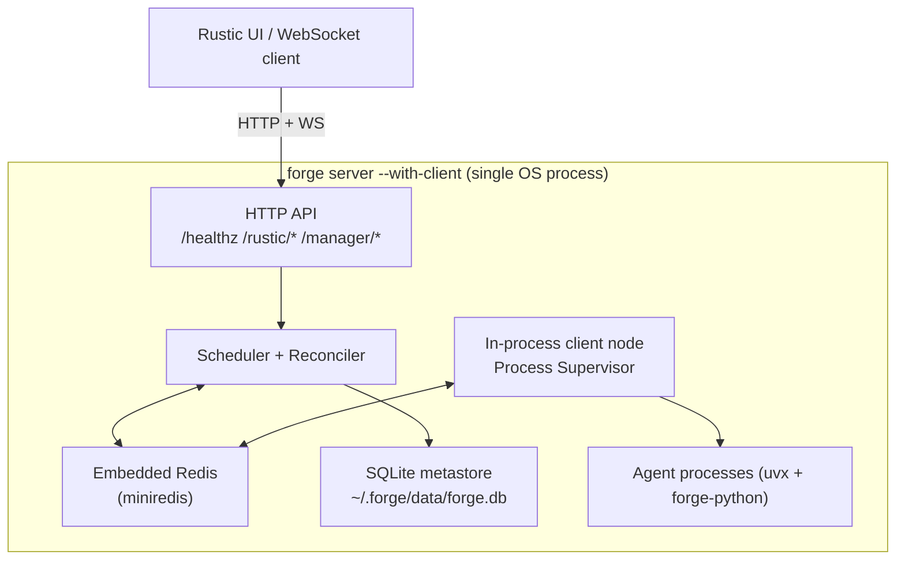

# Local Desktop Runtime

Forge runs a full guild runtime on a laptop with zero external services. One binary, one process, no Docker Compose file, no managed Redis, no Postgres — just `forge server --with-client` and a workspace directory on disk.

This page covers the single-process mode, how Forge picks a local LLM that actually fits your hardware, and how secrets, telemetry, and workspace files stay entirely on-device.

## Why single-process mode exists

Distributed mode (`forge server` plus separate `forge client` nodes sharing Redis or NATS) is built for fleets. Local development doesn't need a fleet — it needs a fast, disposable loop: write a guild spec, launch it, talk to the agents, look at what happened, iterate.

`forge server --with-client` collapses the whole control plane into one OS process:

- **HTTP API** — the same Gin router used in distributed mode, including `/healthz`, `/readyz`, and the `/rustic/*` and `/manager/*` surfaces.
- **Embedded message broker** — an in-process miniredis instance (default `127.0.0.1:6379`) stands in for a real Redis when `--redis` is omitted, so `forge:control:requests` and the per-node `forge:control:node:<node_id>` queues work exactly as they would against a real broker.
- **SQLite metastore** — the control plane's database DSN defaults to `sqlite://<forge-home>/data/forge.db`; the quick-start example below overrides it to an explicit path.
- **In-process compute node** — `--with-client` starts a Forge client (the same Process Supervisor that runs in distributed mode) inside the server's own process tree, so agent processes are children of `forge server` itself.



!!! note "This is not a toy mode"
    Single-process mode uses the same scheduler, reconciler, and Process Supervisor code paths as a distributed cluster. The only thing that changes is where the broker and the client node live — everything else in the control plane behaves identically.

## Quick start

```bash
FORGE_PYTHON_PKG="$FORGE_REPO_DIR/forge-python" \
"$FORGE_REPO_DIR/forge-go/bin/forge" server \
  --listen :3001 \
  --db sqlite:////tmp/forge-local.db \
  --with-client \
  --client-node-id local-single-node \
  --client-metrics-addr 127.0.0.1:19091

curl -sS http://127.0.0.1:3001/healthz   # -> {"status":"ok"}
curl -sS http://127.0.0.1:3001/readyz    # -> {"status":"ready"}
```

`FORGE_PYTHON_PKG` must point at a local checkout of `forge-python` — agent processes are spawned via `uvx`, and the runtime installs `forge-python` from that path rather than from a registry. `uv`/`uvx` must be on `PATH`.

!!! tip "Compiled defaults vs. this example"
    The binary's compiled defaults are `--listen :9090` and client metrics `:9091`. The quick start above deliberately overrides both (`:3001` / `127.0.0.1:19091`) to match the local dev runbook — don't assume 3001 unless you pass it.

Persistent flags apply here too: `--log-level` (default `info`), `--log-format` (`text`|`json`), and `--forge-home` (defaults to `FORGE_HOME` env or `~/.forge`).

## Local model fit: pick an LLM your machine can actually run

A guild that declares an `llm` dependency needs a binding. On a laptop, that binding should be a model that fits in the RAM and VRAM you actually have — not a generic cloud key. The `modelfit` subsystem (`github.com/rustic-ai/forge/forge-go/modelfit`) answers that question directly, and the Rustic launch UI uses it to preselect a runnable local model before the guild even starts.

**Detection, not guessing.** `modelfit.DetectSystemProfile()` builds a `SystemProfile` from two layers:

- A **hardware profile** (RAM, CPU, GPU vendor/memory) collected via OS-native tools — `nvidia-smi`/`rocm-smi`/`lspci` on Linux, `system_profiler` on macOS (Apple Silicon is flagged as unified memory), `Get-CimInstance Win32_VideoController` on Windows.
- A **runtime capability probe** of the local `llama-server` binary (`llama-server --list-devices`, 3s timeout, cached to disk keyed on GOOS/GOARCH/binary path/size/mtime). This is what separates "a GPU exists" from "the runtime can actually offload to it" — a machine with an NVIDIA card but a CPU-only llama.cpp build reports `RuntimeUsableAcceleration=false` with reason code `nvidia_present_but_runtime_cpu_only`.

**Fit scoring is deterministic.** `modelfit.LoadProfiles(catalogPath, dependencyConfigPath)` loads the curated catalog (`conf/local-model-catalog.yaml`) and joins each entry to its resolver wiring in `conf/agent-dependencies.yaml` by `dependency_key`. `modelfit.Recommend(profiles, system, opts)` then scores every candidate model against the detected `SystemProfile` and returns a ranked `[]FitResult` — `fit_level` (`perfect` <=70% memory utilization, `good` <=85%, `marginal` <=100%, `too_tight` beyond), `runnable`, `score`, and human-readable `explanations`.

Two HTTP routes expose this to tooling:

```bash
curl 'http://127.0.0.1:3001/rustic/modelfit/local-models?use_case=coding&runnable_only=true&limit=3'
curl 'http://127.0.0.1:3001/rustic/modelfit/capabilities'
```

`local-models` returns the ranked `FitResult` array; `capabilities` returns the full `SystemProfile` for diagnostics. The v1 catalog covers Qwen 3.5 (0.8B/2B/4B), Qwen 3 4B, Gemma 3 4B instruct, and a Nomic embedding model, all wired to the same local OpenAI-compatible `llama.cpp` server (`http://localhost:55262/v1`).

```json
[
  {
    "dependency_key": "llm_local_qwen3_5_0_8b",
    "display_name": "Qwen 3.5 0.8B Starter",
    "fit_level": "perfect",
    "runnable": true,
    "utilization_pct": 42.3,
    "estimated_tokens_per_second": 84.0,
    "use_case_tags": ["chat", "coding"]
  }
]
```

Bind the winning `dependency_key` (e.g. `llm_local_qwen3_5_0_8b`) as your agent's `llm` dependency instead of a generic cloud key, and the guild runs entirely against the local `llama.cpp` server — no API key, no network egress.

Override paths with `FORGE_LOCAL_MODEL_CATALOG`, `FORGE_DEPENDENCY_CONFIG`, `FORGE_MODELFIT_LLAMA_BINARY` (path to `llama-server` if it isn't on `PATH`), and `FORGE_MODELFIT_RUNTIME_CACHE` (probe cache location).

!!! warning "Local models only"
    Cloud dependency keys (`llm_openai`, `llm_anthropic_sonnet`, `llm_gemini`, `llm_bedrock`, and others) exist in `agent-dependencies.yaml` but are intentionally excluded from fit scoring. `modelfit` only ranks the curated on-device catalog — it never recommends a cloud provider.

## Local trust and observability

Desktop mode still needs a story for secrets and traces, without standing up a vault or an OTLP collector.

**Secrets and OAuth in the OS keychain.** The server's `--oauth-token-store` flag accepts `memory` or `keychain`; on a desktop, `keychain` backs OAuth tokens with the native OS credential store rather than a plaintext file or an in-memory map that disappears on restart. `FORGE_KEYCHAIN_SERVICE` and `FORGE_OAUTH_PROVIDERS_CONFIG` control the service name and provider config used against it, and `FORGE_SECRET_PROVIDERS` governs which secret providers the runtime will consult.

**Telemetry without a collector.** `--otel-mode desktop_sqlite` runs Forge's OpenTelemetry pipeline against a local `sqlite-otel` binary instead of an external OTLP endpoint — spans land in a SQLite file you can query directly, no collector or backend to run. Relevant flags:

| Flag | Purpose |
|---|---|
| `--otel-enabled` | turn on telemetry |
| `--otel-mode` | `desktop_sqlite` (local file) or `external_otlp` (ship to a collector) |
| `--otel-sqlite-binary` | path to the `sqlite-otel` binary |
| `--otel-sqlite-db-path` | where spans are written |
| `--otel-sqlite-port` | local ingest port (default `4318`) |
| `--otel-service-name` | service name tag (default `forge-server`) |
| `--otel-endpoint` | OTLP endpoint, used only in `external_otlp` mode |

Together, `keychain` + `desktop_sqlite` mean a desktop install never has to phone home for either credentials or traces — both live under your Forge home directory.

## Where files live: `~/.forge`

`forgepath` resolves the Forge home directory with a fixed precedence: `--forge-home` flag > `FORGE_HOME` env var > `~/.forge` (falling back to a temp dir if none of those are writable). Every default path in single-process mode derives from it:

- **Metastore**: `sqlite://<forge-home>/data/forge.db`
- **Workspaces**: agent working directories and per-guild state live under `<forge-home>/data/workspaces`
- **Config**: `conf/local-model-catalog.yaml`, `conf/agent-dependencies.yaml`, `conf/oauth-providers.yaml` (or their `FORGE_LOCAL_MODEL_CATALOG` / `FORGE_DEPENDENCY_CONFIG` overrides)
- **Runtime caches**: the model-fit runtime probe cache (`cache/modelfit-runtime-probe.json` by default) and the OTel SQLite database

Because everything resolves under one directory, wiping `~/.forge` (or pointing `FORGE_HOME` at a fresh path) gives you a clean-room Forge install with no leftover state — useful when you want to reproduce a bug from an empty metastore.

## Typical dev loop

1. **Author a guild spec.** Write the guild/agent spec you want to run — the same spec format used in distributed mode.
2. **Launch single-process mode.** Run `forge server --with-client` as shown above. It brings up the API, embedded broker, SQLite metastore, and in-process node in one call.
3. **Preselect a local model.** Query `/rustic/modelfit/local-models` for your use case and bind the top runnable `dependency_key` as your `llm` dependency.
4. **Converse over WebSockets.** Connect a client to the server's WebSocket surface and exchange messages with the guild's agents interactively, the same way the Rustic UI does.
5. **Inspect spans.** With `--otel-mode desktop_sqlite`, query the local SQLite telemetry database directly to see the span-level trace of what each agent did, without needing a collector.

This loop never leaves the machine: no shared Redis, no remote database, no cloud LLM call, no external telemetry backend. It's the same runtime you'd deploy distributed — just folded into one process for the length of the edit-run-inspect cycle.

## See also

- [Quickstart](../getting-started/quickstart/) for the minimal first run.
- [Distributed Runtime](distributed-cluster/) for scaling the same control plane across worker nodes.
- [Observability](../guides/observability/) for the full OTel configuration surface.
