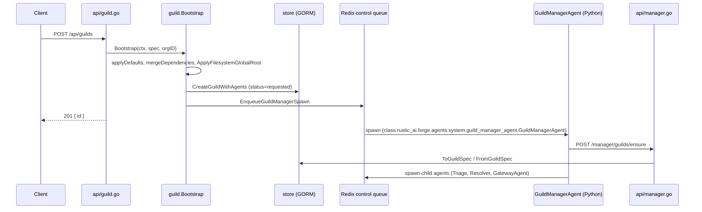

# Multi-Agent Guilds

A single agent rarely covers a full workflow. A guild lets you compose several agents behind one routing table and one gateway, so a browser or CLI client can hold a conversation while a set of specialized agents pass work between each other underneath it.

This page shows how to author a multi-agent guild spec with routes and a gateway, how launch is orchestrated by the `GuildManagerAgent`, and how clients connect over `usercomms`/`syscomms` to converse with the guild and observe it running.

## Why compose a guild instead of one agent

A [`GuildSpec`](../guides/authoring-guild-specs/) is more than a list of agents — it is one persisted unit that carries:

- **Multiple agent specs**, each with its own `class_name`, topics, and behavior.
- **Routing rules** (`RoutingSlip` / `RoutingRule`) that move a message from one agent's output to another agent's input, keyed on agent, agent type, or message format.
- **A gateway configuration** that exposes the guild to WebSocket clients without any agent needing to know about HTTP or sockets.
- **Per-agent dependencies, secrets, and resource requests**, merged and normalized once at bootstrap time.
- **A shared guild-scoped messaging namespace and file workspace** every agent in the set can reach.

Forge persists this as one `GuildModel` plus `AgentModel` rows, and every downstream spawn — including agents launched later by the guild manager — re-hydrates from that same persisted spec via `store.ToGuildSpec`. There is exactly one canonical definition of the guild, not one per agent.

## Anatomy of a guild spec

```yaml
id: support-guild-01
name: Support Guild
description: Routes incoming tickets between a triage agent and a resolver agent

agents:
  - name: Triage
    description: Classifies incoming requests and decides who handles them
    class_name: rustic_ai.agents.TriageAgent
    resources:
      num_cpus: 0.5

  - name: Resolver
    description: Handles classified requests and drafts a response
    class_name: rustic_ai.agents.ResolverAgent
    dependency_map:
      llm:
        class_name: rustic_ai.forge.dependencies.llm.LLMResolver
        properties:
          model: gpt-4o
          api_key: !code secrets/openai_key.txt
    resources:
      num_cpus: 1
      num_gpus: 0

routes:
  - agent:
      name: Triage
    method_name: on_classification
    destination:
      topics: resolver_topic

  - agent:
      name: Resolver
    method_name: on_resolution
    destination:
      topics: user_notifications

gateway:
  enabled: true
  input_formats:
    - rustic_ai.core.messaging.core.message.Message
  output_formats:
    - rustic_ai.core.messaging.core.message.Message
```

A few things worth noting about this shape:

- Each `AgentSpec` (`protocol/spec.go:670`) carries its **own** `DependencyMap`, `AdditionalDependencies`, and `Resources` (`NumCPUs`/`NumGPUs`/`CustomResources`) — dependency and secret wiring lives next to the agent that needs it, not in a separate deployment file.
- The `code` YAML tag (resolved by `guild.ParseFile`) inlines a file's raw text, which is the pattern used above to keep a secret out of the spec body while still shipping it as part of one guild definition. The `include` tag works the same way for splicing another YAML file's agent/route definitions into this one.
- `routes` is a `RoutingSlip` of `RoutingRule` steps (`spec.go:586`). Each rule matches on `Agent` or `AgentType`, optional `MethodName`/`OriginFilter`/`MessageFormat`, and pushes matching output to a `Destination` (topics and/or explicit recipients). This is the mechanism that passes work from Triage to Resolver without either agent hardcoding the other's identity.
- `gateway.enabled: true` is the only thing required to make this guild reachable over WebSockets. `GuildBuilder.applyDefaults` will auto-append a `GatewayAgent` (`rustic_ai.core.guild.g2g.gateway_agent.GatewayAgent`) if one isn't already present in `agents`.

!!! note "Dependency merge order"
    Dependencies resolve with spec-level entries winning first, then the forge-home `agent-dependencies.yaml`, then the `conf/agent-dependencies.yaml` path passed to `Bootstrap`. The merge only fills in missing keys — it never overwrites a dependency the spec already defines. This lets an operator supply guild-wide defaults (a shared LLM key, a shared filesystem root) while individual agents override what they need.

## Building the spec in Go

The same guild can be authored with the fluent builders instead of YAML — useful when the topology is generated programmatically:

```go
spec, err := guild.NewGuildBuilder().
    SetName("Support Guild").
    SetDescription("Routes incoming tickets between a triage agent and a resolver agent").
    SetExecutionEngine("rustic_ai.forge.execution_engine.ForgeExecutionEngine").
    AddAgentSpec(protocol.AgentSpec{
        Name: "Triage", Description: "Classifies incoming requests",
        ClassName: "rustic_ai.agents.TriageAgent",
    }).
    AddAgentSpec(protocol.AgentSpec{
        Name: "Resolver", Description: "Handles classified requests",
        ClassName: "rustic_ai.agents.ResolverAgent",
        DependencyMap: map[string]protocol.DependencySpec{
            "llm": {
                ClassName: "rustic_ai.forge.dependencies.llm.LLMResolver",
                Properties: map[string]any{"model": "gpt-4o"},
            },
        },
    }).
    BuildSpec()
```

`BuildSpec()` runs `applyDefaults`, merges the dependency map (forge-home then conf), resolves mustache templating over `Configuration`, and finally calls `Validate()`. Route construction follows the same pattern with `guild.NewRouteBuilder`, which builds a `RoutingRule` from either an `AgentTag`/`AgentSpec` source or a plain `agent_type` string.

## Submitting and launching the guild

```bash
curl -X POST http://localhost:PORT/api/guilds \
  -H 'Content-Type: application/json' \
  -d '{
    "organization_id": "acme",
    "spec": { "...": "the guild spec above" }
  }'
```

`Server.HandleCreateGuild` calls `guild.Bootstrap`, which runs the full pipeline in order:



The HTTP response is only an acknowledgment — the guild is `requested`, not yet `running`. Launch progress and failures surface asynchronously on the `syscomms` socket as `InfraEvent`s (see below), and overall guild health arrives separately as a `HealthCheckRequest`/`AgentsHealthReport` exchange on `guild_status_topic`.

### The GuildManagerAgent round-trip

The `GuildManagerAgent` (constant `guild.GuildManagerClassName`) is the system agent that actually drives child-agent launch. `Bootstrap` spawns it directly with a fixed identity:

```go
spawnReq := protocol.SpawnRequest{
    RequestID: "bootstrap-" + spec.ID,
    GuildID:   spec.ID,
    AgentSpec: protocol.AgentSpec{
        ID:        spec.ID + "#manager_agent",
        Name:      spec.Name + " Manager",
        ClassName: GuildManagerClassName,
        AdditionalTopics: []string{"system_topic", "heartbeat_topic", "guild_status_topic"},
        ListenToDefaultTopic: boolPtr(false),
    },
    ClientType: "forge",
}
```

Once running, the GMA does not receive the guild spec out-of-band — it calls back into Go via `POST /manager/guilds/ensure` (`api/manager.go HandleManagerEnsureGuild`), which re-derives the canonical spec through `store.ToGuildSpec`/`FromGuildSpec`. Using that spec and the `ForgeExecutionEngine`, the GMA spawns each remaining `AgentSpec` (Triage, Resolver, and the auto-appended `GatewayAgent` if the gateway is enabled) through the same `OnSpawn -> handleSpawn -> BuildAgentEnv` path Bootstrap used for itself. This is why every agent in the guild — manager included — resolves the same dependency map, routing table, and resource limits: they all trace back to one persisted spec.

!!! tip "Relaunch is safe to retry"
    `POST /api/guilds/{id}/relaunch` re-enqueues the GMA only if the manager isn't already running (checked against the status store), and refuses outright if the guild is `stopped` or `stopping`. Each attempt is recorded in the `guilds_relaunch` table.

## Enabling the gateway

Setting `gateway.enabled: true` in the spec is the entire authoring step. At runtime this exposes two canonical WebSocket routes per guild:

| Route | Purpose | Registered by |
|---|---|---|
| `GET /ws/guilds/:id/usercomms/:user_id/:user_name` | Conversational traffic between a client and the guild | `gateway.UserCommsHandler` |
| `GET /ws/guilds/:id/syscomms/:user_id` | System/health/infra-lifecycle traffic | `gateway.SysCommsHandler` |

Both handlers take the same three dependencies — `(messaging.Backend, store.Store, *protocol.GemstoneGenerator)` — and both validate the guild exists (`store.GetGuild`, 404 on `store.ErrNotFound`) before upgrading the connection. A local-UI proxy-compat variant (`/rustic/ws/...`) exists for the legacy Rustic UI, reshaping the same backend topics into a different JSON envelope — it is not needed for a standard browser or CLI client talking canonical JSON.

### Connecting usercomms

```
ws://localhost:PORT/ws/guilds/support-guild-01/usercomms/u-42/Jane
```

On connect the gateway publishes a `UserAgentCreationRequest` to `system_topic` so the guild's user-proxy agent is registered, then subscribes the socket to `user_notifications:<user_id>` for outbound delivery. Inbound client JSON is normalized, stamped with a fresh `GemstoneID` (client-supplied IDs are only honored if they parse and aren't more than 1000ms in the future), given sender identity `user_socket:<user_id>`, wrapped in a canonical `protocol.Message` with format `rustic_ai.core.messaging.core.message.Message`, and published to `user:<user_id>` for the guild's agents to consume — which is exactly the input the routing rules above act on.

```json
{
  "format": "rustic_ai.core.messaging.core.message.Message",
  "payload": { "content": "My invoice looks wrong" },
  "id": "0"
}
```

### Connecting syscomms

```
ws://localhost:PORT/ws/guilds/support-guild-01/syscomms/u-42
```

This socket subscribes to **three** topic families at once — `user_system_notification:<user_id>`, `guild_status_topic`, and `infra_events_topic` — so clients must demux by `format` (and sometimes `topic_published_to`). On connect the gateway immediately publishes a `HealthCheckRequest` to `guild_status_topic` to prompt the guild manager to report health:

```json
{
  "schema_version": 1,
  "kind": "agent.process.failed",
  "severity": "error",
  "guild_id": "support-guild-01",
  "agent_id": "Resolver",
  "message": "agent process failed after retry exhaustion"
}
```

That `InfraEvent` shape is how launch progress and failures become visible to a client: since guild creation only returns `201 requested`, `syscomms` is the channel that tells you when Triage and Resolver actually came up (or didn't).

!!! warning "No origin check at this layer"
    The WebSocket upgrader's `CheckOrigin` always returns `true`. Origin and auth restrictions for gateway connections must be enforced upstream of Forge, not assumed from this layer.

## Shared guild-scoped state

Every agent spawned into a guild — Triage, Resolver, the GatewayAgent, the GuildManagerAgent itself — shares two things scoped to the guild ID rather than to any one agent:

- **Messaging namespace.** `Subscribe`/`PublishMessage` on the `messaging.Backend` take `(namespace=guildID, topic)`. Routing rules move messages between agents purely by publishing to topics inside that namespace; no agent needs a direct reference to another agent's process.
- **File workspace.** The HTTP file routes (`/api/guilds/{id}/files/...` and `/api/guilds/{id}/agents/{agent_id}/files/...`) and the filesystem dependency resolver both live under the same guild-scoped root. `ApplyFilesystemGlobalRoot` (driven by `FORGE_FILESYSTEM_GLOBAL_ROOT`) rewrites each agent's filesystem dependency `path_base` into that root, with path-traversal protection and bucket/scheme enforcement for `file`, `s3`, and `gs`/`gcs` backends.

This is what makes the composition a "guild" rather than a set of independently deployed agents talking over a shared bus you have to wire up yourself: routing, dependency resolution, messaging, and file storage are all keyed to the one guild ID from `Bootstrap` onward.

## Reference: key types and endpoints

| Concept | Where |
|---|---|
| `GuildSpec` | `protocol/spec.go:816` |
| `AgentSpec` | `protocol/spec.go:670` |
| `RoutingSlip` / `RoutingRule` | `protocol/spec.go:586` |
| `GatewayConfig` | `protocol/spec.go:762` |
| `guild.Bootstrap` | `guild/bootstrap.go` |
| `guild.GuildManagerClassName` | `guild` package constant |
| `gateway.UserCommsHandler` / `gateway.SysCommsHandler` | `gateway` package |
| `POST /api/guilds` | create and launch a guild |
| `POST /api/guilds/{id}/relaunch` | re-enqueue the GMA if not running |
| `POST /manager/guilds/ensure` | GMA -> Go manager round-trip |
| `GET /ws/guilds/:id/usercomms/:user_id/:user_name` | conversational WebSocket |
| `GET /ws/guilds/:id/syscomms/:user_id` | system/health/infra WebSocket |

## Related pages

- [Guild Spec](../guides/authoring-guild-specs/)
- [Gateway](../features/gateway-websockets/)
- [Quickstart](../getting-started/quickstart/)
