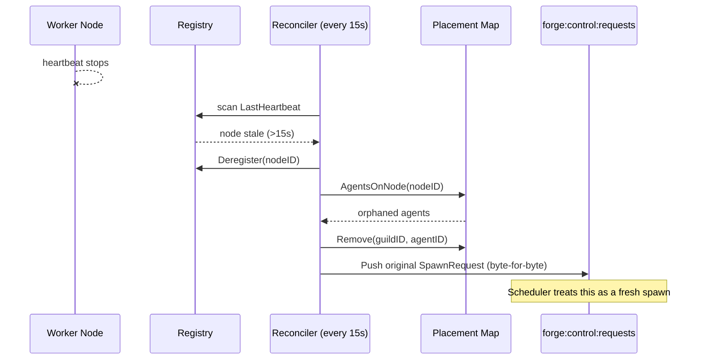

# Why Forge

Running a single agent is easy. Running a guild — a multi-agent system with agents spread across processes, machines, and failure domains — is a distributed systems problem: something has to place each agent, watch whether it's still alive, and recover it when it isn't. Forge is that control loop, packaged as one binary.

## The problem: orchestration is not optional

The moment a guild has more than one agent, or needs to survive a crashed process, you are building an orchestrator whether you meant to or not. You need to decide:

- **Where does each agent run?** Which node has spare CPU, memory, or GPU capacity.
- **How do you know it's still running?** Heartbeats, health thresholds, and a way to tell "slow" from "dead."
- **What happens when a node disappears?** Agents on it need to be detected as orphaned and relaunched elsewhere, without duplicating work or losing state.
- **What happens when a single process crashes?** Local restart with backoff, not a hot crash loop.
- **How do the authoring-time spec and the runtime spec stay in sync** when the control plane is Go and the agents execute in Python?

Hand-rolling this means building a scheduler, a node registry, a leader election scheme, a reconciliation loop, and a supervisor — before writing a single agent. Forge owns all of it, so guild authors write `AgentSpec` and `GuildSpec` values, not placement code.

## One binary, two modes

Forge ships as a single Go binary, `forge`, with three subcommands: `server`, `client`, and `version`. The same binary is both the control plane and the worker — which one it acts as is a flag, not a different build.

**Single-process mode** runs the entire stack — HTTP API, metastore, scheduler, reconciler, and a worker node — inside one OS process, with zero external infrastructure: Redis is embedded (miniredis) and storage is SQLite. This is the laptop and CI mode.

**Distributed mode** splits the same components across a central `server` and one or more `client` worker nodes that share a real Redis (or NATS) broker. Nothing about the guild spec, the agent code, or the control-plane logic changes between the two — only the flags.

Same guild, single-process launch:

```bash
FORGE_PYTHON_PKG="$FORGE_REPO_DIR/forge-python" \
"$FORGE_REPO_DIR/forge-go/bin/forge" server \
  --listen :3001 \
  --db sqlite:////tmp/forge-local.db \
  --with-client \
  --client-node-id local-single-node \
  --client-metrics-addr 127.0.0.1:19091

curl -sS http://127.0.0.1:3001/healthz
```

Same guild, distributed launch — a control-plane server and a separate worker node sharing Redis:

```bash
# Control plane
"$FORGE_REPO_DIR/forge-go/bin/forge" server --listen :3001 --db sqlite:////tmp/forge-server.db

# Separate worker node
FORGE_PYTHON_PKG="$FORGE_REPO_DIR/forge-python" \
"$FORGE_REPO_DIR/forge-go/bin/forge" client --server http://127.0.0.1:3001 --redis 127.0.0.1:6379
```

Nothing in the guild spec you submit to `/api/guilds` changes between these two invocations. You move from a demo to a cluster by adding worker processes and pointing them at the same broker — not by rewriting agent code or re-architecting the guild.

!!! tip "Why this matters"
    You can develop and test a guild entirely on a laptop with `server --with-client`, then deploy the identical spec onto a fleet with `server` + `client` nodes. There is no "dev mode" spec and "prod mode" spec to keep in sync.

## Self-healing by design, not by afterthought

Forge's control plane runs a background **reconciler** every 15 seconds. It is leader-gated — only the elected leader runs it, which rules out split-brain double-scheduling when you run multiple server replicas — and it works through five ordered phases:

1. `reconcileDeadNodes` — evict nodes whose heartbeat is stale.
2. `reconcileAccepted` — retry placements that never made it past accept.
3. `reconcileStaleDispatches` — recover dispatches that were sent but never acknowledged.
4. `reconcileStaleAcks` — recover acknowledgments that never reached "running".
5. `cleanupFailedPlacements` — age out terminal failures.

A node is declared dead once its heartbeat is silent for longer than `DeadNodeTimeout` (15s). When that happens, the reconciler deregisters the node, gathers every agent it was running, and re-enqueues each one — **byte-for-byte** — onto the same global control queue (`forge:control:requests`) that a brand-new spawn would use:

```go
for nodeID, state := range r.registry.nodes {
    if now.Sub(state.LastHeartbeat) > r.config.DeadNodeTimeout { // 15s
        deadNodes = append(deadNodes, nodeID)
    }
}
// ...
orphans := r.placementMap.AgentsOnNode(nodeID)
r.registry.Deregister(nodeID)
for _, o := range orphans {
    r.placementMap.Remove(o.GuildID, o.AgentID)
    r.reenqueue(ctx, o) // Push {command:spawn,payload} to forge:control:requests
}
```

Because the reconciler replays the original serialized `SpawnRequest` payload rather than reconstructing it, recovery is indistinguishable from an initial spawn: the scheduler places it on a fresh healthy node using the same best-fit logic, capacity is re-accounted automatically as the dead node's usage disappears with deregistration, and cross-node idempotency gates on the worker side prevent a duplicate if the original process is somehow still alive.

Local process crashes are handled independently of cluster-level reconciliation. A crashed agent process restarts with exponential backoff — base 1s, cap 30s, ±25% jitter, up to 10 retries — and a stability timer resets the attempt counter after 60s of clean running, so a flaky agent doesn't get penalized forever for one bad restart.

!!! note "Two failure domains, two mechanisms"
    Node death is a cluster-level event handled by the reconciler (re-enqueue elsewhere). Process crash is a local event handled by the supervisor (restart in place with backoff). Forge runs both, so you don't have to choose one and build the other yourself.



## One spec, two runtimes, no drift

A guild is authored once as a `protocol.GuildSpec` — agents, dependency map, routing, messaging, gateway — and that spec is the single artifact that crosses the Go/Python boundary. `guild.Bootstrap` persists it as `GuildModel`/`AgentModel` rows; every downstream spawn re-hydrates the **persisted** spec via `store.ToGuildSpec`, not the one originally submitted, so normalization happens exactly once, before persistence.

That canonical spec is what gets serialized into `FORGE_GUILD_JSON` for the Python `agent_runner`, and it's also what the Python `GuildManagerAgent` round-trips back to Go through `POST /manager/guilds/ensure` when it spawns child agents. Because both the Go control plane and the Python execution bridge read the same persisted spec, there is no separate "runtime config" that can drift from what was authored — the guild spec you wrote in YAML or built with `guild.NewGuildBuilder()` is the same object the scheduler places, the same object the worker launches, and the same object the manager agent inspects.

```yaml
id: my-guild-01
name: My Guild
description: demo
agents:
  - !include agents/echo_agent.yaml
  - name: Coder
    description: writes code
    class_name: rustic_ai.agents.CoderAgent
    properties:
      system_prompt: !code prompts/system.txt
```

Modular authoring (`include` and `code` YAML tags) is purely an authoring-time convenience — by the time `guild.Bootstrap` runs, it has already been flattened into one `GuildSpec`. There's no templating or environment-specific branching left to resolve at runtime that could cause the control plane and the Python side to see different things.

See [Guild Concepts](concepts/guild-model/) for the full spec shape, and the [Quickstart](getting-started/quickstart/) for an end-to-end example.

## Pluggable transports, one control plane

Messaging, control-plane commands, and the distributed status store all run over the same transport abstraction, and that transport is a choice, not a fork:

| Concern | Redis | NATS |
|---|---|---|
| Control queues | Lists, `LPUSH`/`BRPOP` | JetStream work-queue streams (`CTRL_<key>`, 5m MaxAge) |
| Leader election | `SET NX` + TTL lock, Lua-script renewal | — (Redis or Raft or single-node) |
| Agent status store | `SET`/`GET`/`EXPIRE`/`DEL` | NATS KV |
| Selected via | `--redis`, default backend | `--backend nats`, `--nats` |

Whichever backend you choose, it's shared by the message broker, the control plane's spawn/stop commands, and the `AgentStatusStore` the reconciler consults to disambiguate "message delivered" from "agent actually running." You don't configure three separate systems — you configure one transport and every subsystem that needs cross-node state uses it.

Telemetry is **OTel-first**: `--otel-enabled` with `--otel-mode desktop_sqlite` gives you a zero-config local trace store (bundled sqlite-otel binary), or `--otel-mode external_otlp` with `--otel-endpoint` ships spans to your existing observability stack. Trace context propagates through `SpawnRequest.TraceContext`, so a request that crosses the Go/Python boundary and multiple nodes stays one trace.

Secrets and OAuth tokens use the same pattern of "sensible local default, pluggable production backend": `--oauth-token-store memory|keychain` lets you develop with an in-memory store and switch to the OS keychain without changing how agents declare the secrets and OAuth scopes they need in the agent registry.

## What Forge is not

Forge deliberately draws a boundary around what it owns:

- **Not a general job scheduler.** Placement is resource-aware (CPU/memory/GPU best-fit across healthy nodes) for agent workloads specifically, not a Kubernetes-style scheduler with taints, affinities, or arbitrary batch workloads.
- **Not a durable event log.** The placement map is in-memory; durable cluster facts (leadership, status, queued work) live in Redis/NATS with TTLs, and a control-plane restart relies on those, not on replaying placement history.
- **Not a Python framework replacement.** Agent logic and the system agents (like `GuildManagerAgent`) live in `forge-python`; Forge's Go side is the control plane and process supervisor, not an agent authoring framework.
- **Not a container platform.** Process supervision supports `docker` and `bwrap` as backends, but Forge is not trying to be a general container orchestrator — it launches and monitors agent processes, nothing broader.
- **Not multi-writer for reconciliation.** Only the elected leader reconciles; this trades away active-active reconciliation for the simplicity and correctness of single-writer state changes.

Knowing these boundaries is as useful as knowing the capabilities: if you need arbitrary batch scheduling or a durable replicated log, put those next to Forge, not in place of it.

## Where to go next

- [Quickstart](getting-started/quickstart/) — get a guild running in single-process mode in minutes.
- [Guild Concepts](concepts/guild-model/) — the full `GuildSpec`/`AgentSpec` shape and builder API.
- [Distributed Architecture](concepts/distributed-control-plane/) — the scheduler, reconciler, and leader election in depth.
